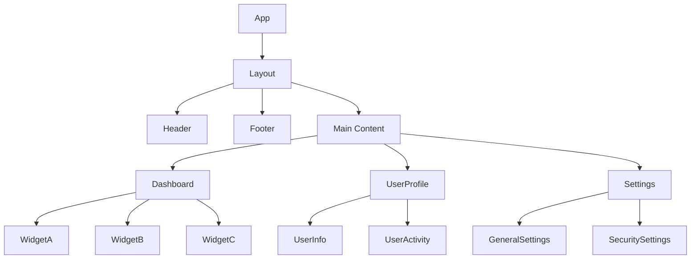
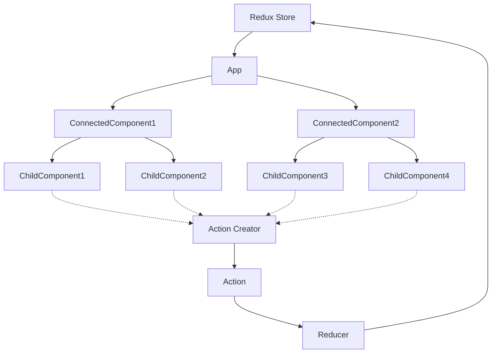

设计大型 React 应用架构确实是一个复杂而重要的话题。让我们深入探讨如何构建一个可扩展、可维护的大型 React 应用，涵盖组件拆分、数据流设计、错误边界等关键方面。

1. 组件拆分

组件拆分是 React 应用架构的基础。好的组件拆分可以提高代码的可重用性和可维护性。

原则：
- 单一职责：每个组件应该只做一件事。
- 可重用性：设计通用组件，以便在多处使用。
- 组合优于继承：使用组合来构建复杂的UI。


示例架构：




2. 数据流设计

在大型应用中，管理数据流是关键。我们可以使用 Redux 或 MobX 等状态管理库，或者使用 React 的 Context API。

原则：
- 单一数据源：保持一个全局状态树。
- 状态不可变性：不直接修改状态，而是返回新的状态对象。
- 单向数据流：**数据从顶层组件向下流动，事件从底层组件向上传递。**

示例数据流设计：




3. 错误边界

错误边界是 React 组件，可以捕获子组件树中的 JavaScript 错误，记录错误并显示回退 UI。

示例错误边界组件：


```jsx
import React from 'react';

class ErrorBoundary extends React.Component {
  constructor(props) {
    super(props);
    this.state = { hasError: false };
  }

  static getDerivedStateFromError(error) {
    return { hasError: true };
  }

  componentDidCatch(error, errorInfo) {
    console.log('Error:', error, errorInfo);
    // 你可以在这里记录错误到错误报告服务
  }

  render() {
    if (this.state.hasError) {
      return <h1>Something went wrong.</h1>;
    }

    return this.props.children;
  }
}

// 使用方法
function App() {
  return (
    <ErrorBoundary>
      <MyComponent />
    </ErrorBoundary>
  );
}

```

4. 文件结构

组织良好的文件结构对于大型应用至关重要。这里是一个建议的文件结构：

```
src/
├── components/
│   ├── common/
│   │   ├── Button.js
│   │   └── Input.js
│   ├── layout/
│   │   ├── Header.js
│   │   └── Footer.js
│   └── features/
│       ├── Dashboard/
│       │   ├── Dashboard.js
│       │   ├── WidgetA.js
│       │   └── WidgetB.js
│       └── UserProfile/
│           ├── UserProfile.js
│           └── UserActivity.js
├── pages/
│   ├── Home.js
│   ├── About.js
│   └── Contact.js
├── hooks/
│   ├── useForm.js
│   └── useApi.js
├── context/
│   └── ThemeContext.js
├── services/
│   ├── api.js
│   └── auth.js
├── utils/
│   ├── helpers.js
│   └── constants.js
├── styles/
│   ├── global.css
│   └── variables.css
└── App.js
```

5. 性能优化

对于大型应用，性能优化至关重要：

- 使用 React.memo() 进行组件记忆化
- 使用 useMemo() 和 useCallback() 避免不必要的重新渲染
- 实现代码分割和懒加载
- 使用虚拟化技术处理长列表

6. 测试策略

为大型应用制定全面的测试策略：

- 单元测试：使用 Jest 测试单个函数和组件
- 集成测试：测试多个组件之间的交互
- 端到端测试：使用 Cypress 或 Selenium 进行全面的用户流程测试

7. 状态管理

对于复杂的状态管理，考虑使用：

- Redux：适合大型、复杂的应用
- MobX：更简单、更灵活的状态管理
- Recoil：专为 React 设计的状态管理库

8. 代码质量和一致性

维护代码质量和一致性：

- 使用 ESLint 进行代码检查
- 使用 Prettier 保持代码格式一致
- 实施 Git hooks 在提交前运行测试和检查

9. 文档

为大型项目维护良好的文档：

- 使用 JSDoc 或 TypeScript 添加类型注释
- 创建 README 文件解释项目结构和设置过程
- 使用 Storybook 创建组件库文档

10. 持续集成/持续部署 (CI/CD)

实施 CI/CD 流程以自动化测试、构建和部署过程。

设计大型 React 应用架构是一个复杂的过程，需要考虑许多因素。这个概述涵盖了主要的方面，但每个项目可能有其特定的需求和挑战。如果您想深入了解任何特定领域，或者需要更具体的代码示例，请随时告诉我。

## [[三天项目实战]]
在3天内实现如此大型的React项目确实是一个挑战，但我们可以通过合理的规划来实现一个基础版本。让我们将这个过程分解为可管理的步骤，每天专注于特定的任务。

第1天：项目设置和基础架构

1. 项目初始化：
   - 使用Create React App或Next.js创建新项目
   - 设置Git仓库

2. 文件结构设置：
   - 创建基本的文件夹结构（components, pages, hooks, services等）

3. 安装核心依赖：
   - React Router用于路由
   - Redux或MobX用于状态管理
   - Axios用于API请求

4. 设置基本路由：
   - 创建主要页面组件（Home, Dashboard, UserProfile, Settings）
   - 设置React Router

5. 创建基础布局组件：
   - Header
   - Footer
   - Layout（包含Header和Footer）

让我们为第1天的工作创建一个基本的项目结构：


```plaintext
my-react-app/
├── src/
│   ├── components/
│   │   ├── common/
│   │   │   └── Button.js
│   │   └── layout/
│   │       ├── Header.js
│   │       ├── Footer.js
│   │       └── Layout.js
│   ├── pages/
│   │   ├── Home.js
│   │   ├── Dashboard.js
│   │   ├── UserProfile.js
│   │   └── Settings.js
│   ├── hooks/
│   ├── services/
│   │   └── api.js
│   ├── store/
│   │   ├── index.js
│   │   └── rootReducer.js
│   ├── App.js
│   └── index.js
├── package.json
└── README.md
```

```js
// src/App.js
import React from 'react';
import { BrowserRouter as Router, Route, Switch } from 'react-router-dom';
import Layout from './components/layout/Layout';
import Home from './pages/Home';
import Dashboard from './pages/Dashboard';
import UserProfile from './pages/UserProfile';
import Settings from './pages/Settings';

function App() {
  return (
    <Router>
      <Layout>
        <Switch>
          <Route exact path="/" component={Home} />
          <Route path="/dashboard" component={Dashboard} />
          <Route path="/profile" component={UserProfile} />
          <Route path="/settings" component={Settings} />
        </Switch>
      </Layout>
    </Router>
  );
}

export default App;

// src/components/layout/Layout.js
import React from 'react';
import Header from './Header';
import Footer from './Footer';

function Layout({ children }) {
  return (
    <div>
      <Header />
      <main>{children}</main>
      <Footer />
    </div>
  );
}

export default Layout;

```

第2天：核心功能实现

1. 实现状态管理：
   - 设置Redux store或MobX stores
   - 创建必要的actions和reducers

2. 开发主要页面组件：
   - 完成Home页面
   - 实现Dashboard的基本布局和widget占位符
   - 创建UserProfile页面的基本结构
   - 设置Settings页面的框架

3. 创建和集成API服务：
   - 使用Axios设置基本的API请求函数
   - 与后端API集成（如果有的话，否则使用模拟数据）

4. 实现基本的错误处理：
   - 创建ErrorBoundary组件
   - 在App组件中使用ErrorBoundary

5. 开始实现一些通用组件：
   - Button组件
   - Input组件
   - Card组件（用于Dashboard widgets）

让我们为第2天的工作创建一些核心组件和状态管理的示例：


```jsx
// src/store/index.js
import { createStore, applyMiddleware } from 'redux';
import thunk from 'redux-thunk';
import rootReducer from './rootReducer';

const store = createStore(rootReducer, applyMiddleware(thunk));

export default store;

// src/store/rootReducer.js
import { combineReducers } from 'redux';
import userReducer from './userReducer';
import dashboardReducer from './dashboardReducer';

const rootReducer = combineReducers({
  user: userReducer,
  dashboard: dashboardReducer,
});

export default rootReducer;

// src/components/common/Button.js
import React from 'react';

function Button({ children, onClick, type = 'button', className = '' }) {
  return (
    <button
      type={type}
      onClick={onClick}
      className={`px-4 py-2 bg-blue-500 text-white rounded ${className}`}
    >
      {children}
    </button>
  );
}

export default Button;

// src/pages/Dashboard.js
import React from 'react';
import { useSelector } from 'react-redux';

function Dashboard() {
  const dashboardData = useSelector(state => state.dashboard);

  return (
    <div>
      <h1>Dashboard</h1>
      {/* 在这里添加dashboard widgets */}
    </div>
  );
}

export default Dashboard;

// src/services/api.js
import axios from 'axios';

const API_BASE_URL = 'https://api.example.com';

export const fetchUserData = async (userId) => {
  try {
    const response = await axios.get(`${API_BASE_URL}/users/${userId}`);
    return response.data;
  } catch (error) {
    console.error('Error fetching user data:', error);
    throw error;
  }
};

// 添加更多API函数...


```

第3天：完善功能、样式和优化

1. 完成剩余的页面组件：
   - 完善Dashboard widgets
   - 完成UserProfile页面的详细信息
   - 实现Settings页面的功能

2. 实现更多的通用组件：
   - 表单组件
   - 模态框组件
   - 加载指示器

3. 添加样式：
   - 使用CSS-in-JS解决方案（如styled-components）或CSS模块
   - 实现响应式设计

4. 错误处理和加载状态：
   - 在API请求期间显示加载状态
   - 实现全局错误处理

5. 性能优化：
   - 使用React.memo()优化组件
   - 实现代码分割和懒加载

6. 添加基本的单元测试：
   - 为关键组件编写测试
   - 测试Redux actions和reducers

7. 文档和清理：
   - 添加注释和JSDoc
   - 创建/更新README.md
   - 代码清理和最后的优化

让我们为第3天的工作创建一些示例代码：


```jsx
// src/components/DashboardWidget.js
import React from 'react';
import styled from 'styled-components';

const WidgetContainer = styled.div`
  background-color: #ffffff;
  border-radius: 8px;
  box-shadow: 0 2px 4px rgba(0, 0, 0, 0.1);
  padding: 16px;
  margin-bottom: 16px;
`;

const WidgetTitle = styled.h2`
  font-size: 18px;
  margin-bottom: 8px;
`;

const DashboardWidget = React.memo(({ title, children }) => (
  <WidgetContainer>
    <WidgetTitle>{title}</WidgetTitle>
    {children}
  </WidgetContainer>
));

export default DashboardWidget;

// src/pages/Dashboard.js (更新)
import React, { Suspense, lazy } from 'react';
import { useSelector } from 'react-redux';
import styled from 'styled-components';

const WidgetA = lazy(() => import('../components/WidgetA'));
const WidgetB = lazy(() => import('../components/WidgetB'));

const DashboardContainer = styled.div`
  display: grid;
  grid-template-columns: repeat(auto-fit, minmax(300px, 1fr));
  gap: 16px;
  padding: 16px;
`;

function Dashboard() {
  const dashboardData = useSelector(state => state.dashboard);

  return (
    <DashboardContainer>
      <Suspense fallback={<div>Loading...</div>}>
        <WidgetA data={dashboardData.widgetA} />
        <WidgetB data={dashboardData.widgetB} />
      </Suspense>
    </DashboardContainer>
  );
}

export default Dashboard;

// src/components/ErrorBoundary.js
import React from 'react';

class ErrorBoundary extends React.Component {
  constructor(props) {
    super(props);
    this.state = { hasError: false };
  }

  static getDerivedStateFromError(error) {
    return { hasError: true };
  }

  componentDidCatch(error, errorInfo) {
    console.error('ErrorBoundary caught an error:', error, errorInfo);
  }

  render() {
    if (this.state.hasError) {
      return <h1>Something went wrong.</h1>;
    }

    return this.props.children;
  }
}

export default ErrorBoundary;

// src/App.js (更新)
import React from 'react';
import { BrowserRouter as Router, Route, Switch } from 'react-router-dom';
import ErrorBoundary from './components/ErrorBoundary';
import Layout from './components/layout/Layout';
// ... 其他导入

function App() {
  return (
    <ErrorBoundary>
      <Router>
        <Layout>
          <Switch>
            {/* ... 路由 */}
          </Switch>
        </Layout>
      </Router>
    </ErrorBoundary>
  );
}

export default App;

```

这个3天的计划提供了一个快速实现大型React应用的框架。但是，请注意以下几点：

1. 这个时间表非常紧凑，可能需要更长时间来完全实现所有功能。

2. 质量和测试覆盖率可能会受到时间限制的影响。在实际项目中，你可能需要更多时间来确保代码质量和全面的测试。

3. 这个计划假设你已经有了后端API或者使用模拟数据。如果需要构建后端，那将需要更多时间。

4. 一些更高级的功能（如全面的错误处理、复杂的状态管理、高级性能优化等）可能需要在这个初始版本之后继续开发。

5. 文档和代码注释可能不会很全面，你可能需要在之后继续完善。

记住，软件开发是一个迭代的过程。这个3天的计划会给你一个功能性的应用程序框架，但你可能需要在之后继续改进和扩展这个应用。

如果你需要更详细的指导或者对特定部分有疑问，请随时告诉我。