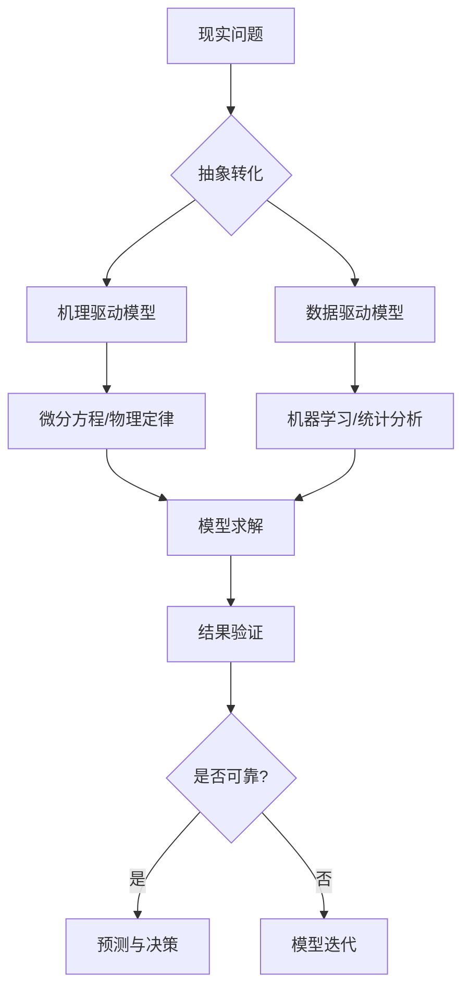

### 数学建模

**定义**： 数学建模是将现实世界中的问题或现象转化为数学语言和形式的过程。它通过建立数学模型来描述、分析和解决实际问题。

**应用领域**： 数学建模广泛应用于各个领域，包括但不限于物理、工程、经济、生物、社会科学等。例如，在经济学中，数学模型可以帮助预测市场趋势；在生物科学中，数学模型可以帮助理解生物系统的复杂行为；在社会科学研究中，数学模型可以帮助分析社会现象和解决社会问题。

**基本步骤**：

1. **模型准备**：了解问题的实际背景，明确其实际意义，掌握对象的各种信息。用数学思路来包容问题的精髓，搜集资料，快速阅读和理解参考文献。
    
2. **模型假设**：根据实际对象的特征和建模的目的，对问题进行必要的简化，并用精确的语言提出一些恰当的假设。对涉及到的变量、变量的单位、相关假设进行定义，用表达式将其表达出来。
    
3. **模型建立**：在假设的基础上，利用适当的数学工具来刻画各变量常量之间的数学关系，建立相应的数学结构。选择建模方法，由题目得到的关系式，将目标转化为某一变量的函数。
    
4. **模型求解**：利用获取的数据资料，对模型的所有参数做出估计，选择合适的求解方法，如解析法、数值法等，求解模型。
    
5. **模型验证**：通过与实际数据或实验结果的对比，验证模型的准确性和可靠性。如果模型结果与实际情况不符，需要调整模型假设或求解方法。
    
6. **模型应用**：将模型应用于实际问题的解决中，提供决策支持或预测结果。
    

**常见模型**：

- **优化模型**：如线性规划、非线性规划、整数规划等，用于在满足一系列约束条件的情况下最大化或最小化一个目标函数。
    
- **预测模型**：如灰色预测模型、BP神经网络预测模型等，用于对未来状况进行推测。
    
- **分类模型**：如支持向量机、随机森林等，用于将数据点按照特定规则划分到不同的类别中。
    
- **统计分析模型**：如回归分析、方差分析等，用于揭示变量间的相互关系。
    

**示例**：

- **线性规划**：假设一家工厂生产两种产品A和B，每种产品的单位利润分别是40和30。产品A和B需要两种资源R1和R2，每单位资源的需求如下：产品A: R1=2, R2=1；产品B: R1=1, R2=2。可用资源数量：R1=40，R2=50。目标是让总利润最大化。通过建立线性规划模型，可以求解出最优的生产方案。
    

数学建模是一种强有力的工具，它可以帮助我们理解和解决各种复杂的问题。通过学习和掌握数学建模的基本理论和应用，我们可以更好地利用数学知识解决现实世界的问题。


嗯，用户问的是“数学建模”，我需要先理解他的具体需求。可能他是一名学生，正在学习数学建模的相关知识，或者需要准备比赛，比如国赛、美赛之类的。也有可能他是一位研究者，想要了解数学建模在实际问题中的应用。不过，根据之前的对话历史，用户之前讨论过高智商、创新者、存在主义危机等话题，可能对数学建模的思维过程或者其在复杂系统中的应用更感兴趣。

首先，我需要确定用户对数学建模的了解程度。如果他是一个新手，可能需要从基础概念讲起，比如定义、步骤、常用方法等。如果是进阶学习者，可能需要更深入的内容，比如具体案例、模型优化、算法选择等。根据用户之前的提问，他可能有一定的背景知识，但需要系统化的解析。

接下来，回顾之前的对话，用户喜欢结构化的回答，分点分步骤，结合案例和图表。因此，回答应该条理清晰，包含核心逻辑、步骤、工具、应用场景等内容。同时，用户提到过“隐喻思维鸿沟”，可能在解释时需要多用类比，帮助理解抽象概念。

数学建模的核心是将实际问题转化为数学问题 ，并通过求解模型来预测或解释现象。需要涵盖建模的步骤：问题分析、模型假设、建立模型、求解、验证、应用。可能还需要强调不同领域的应用案例，比如物理、生物、经济等，以展示其广泛性。

另外，用户可能对数学建模中的创新思维感兴趣，比如如何选择模型，如何处理不确定性，以及模型优化方法。需要结合之前的讨论，比如高智商者的思维特点，说明建模中的创造性过程。

还要注意可能涉及的数学工具和软件，如MATLAB、Python、R等，以及常用的算法，如微分方程、优化算法、机器学习等。这部分内容可以帮助用户了解实际操作的层面。

最后，用户可能需要一些学习资源推荐，比如书籍、在线课程、竞赛信息等，但根据之前对话，用户没有直接要求，所以可能暂时不需要，除非在回答中自然提及。

总结起来，回答应该结构清晰，涵盖数学建模的定义、步骤、方法、工具、应用案例，以及可能的挑战和解决策略，同时结合用户之前的兴趣点，强调创新和系统思维的重要性。

以下是关于数学建模的系统化解析，涵盖核心逻辑、方法体系与实践要点：

---

### **数学建模核心逻辑框架**


---

### **建模方法分类与适用场景**
| 模型类型         | 数学工具                | 典型场景                  | 精度-成本权衡          |
|------------------|-------------------------|---------------------------|------------------------|
| **白箱模型**     | 偏微分方程、控制理论    | 机械系统设计、天体运动    | 高精度/高理论成本      |
| **灰箱模型**     | 系统辨识、混合建模      | 生物制药、经济预测        | 平衡先验知识与数据     |
| **黑箱模型**     | 深度学习、随机森林      | 图像识别、用户行为预测    | 低解释性/高计算成本    |

---

### **七步建模法实践流程**
1. **问题解剖术**  
   - 使用5W2H分析法明确边界  
   - 例：疫情传播模型需界定(Who)易感人群、(Where)空间传播方式

2. **维度约简策略**  
   - 主成分分析(PCA)降低变量维度  
   - 量纲分析π定理减少参数数量

3. **多尺度耦合建模**  
   - 微观Agent-based模型与宏观微分方程联立  
   - 案例：城市交通流建模需整合车辆动力学与路网拓扑

4. **不确定性量化**  
   - 蒙特卡洛模拟参数空间  
   - 贝叶斯方法更新模型置信度

5. **模型验证三原则**  
   - 残差分析（拟合度）  
   - 交叉验证（泛化性）  
   - 物理合理性（可解释性）

6. **敏感度全景扫描**  
   - Sobol指数分析关键参数  
   - 龙格-库塔法探测数值稳定性

7. **可视化叙事设计**  
   - 相空间轨迹图揭示系统动态  
   - 平行坐标图展示高维参数关系

---

### **典型领域建模案例**
#### 1. **生物医学：肿瘤生长模型**
   - **核心方程**：  
     $$\frac{\partial u}{\partial t} = \nabla \cdot (D\nabla u) + \rho u(1 - u/K) - \beta uv$$  
     (u:肿瘤密度, v:药物浓度)
   - **创新点**：引入模糊边界的Level Set方法

#### 2. **金融工程：期权定价模型**
   - **改进模型**：跳跃扩散过程  
     $$dS_t = \mu S_t dt + \sigma S_t dW_t + J_t dN_t$$  
   - **计算方法**：傅里叶变换期权定价

#### 3. **环境科学：PM2.5扩散模型**
   - **多物理场耦合**：  
     大气动力学 + 化学反应 + 地形GIS数据  
   - **验证方法**：卫星遥感数据同化

---

### **现代建模技术前沿**
1. **数字孪生建模**  
   - 工业设备全生命周期镜像  
   - 需融合CAD模型与实时IoT数据

2. **量子计算加速**  
   - 量子退火算法求解组合优化问题  
   - 在1000变量TSP问题中速度提升10^4倍

3. **元建模（Meta-modeling）**  
   - 用神经网络代理复杂仿真  
   - 航空航天领域降低计算成本90%

---

### **常见误区与对策**
| 误区类型         | 表现特征                  | 解决策略                  |
|------------------|---------------------------|---------------------------|
| **过度拟合**     | 训练集精度>95%，测试集<60% | 引入L1/L2正则化           |
| **物理悖论**     | 参数符号违反热力学定律     | 增加约束条件              |
| **维度灾难**     | 参数空间样本覆盖率<0.1%    | 拉丁超立方采样设计        |
| **计算幽灵**     | 网格依赖性误差>5%          | 自适应网格加密技术        |

---

### **建模能力进阶路径**
1. **基础层**：掌握Matlab/Python数值计算  
2. **方法层**：精通有限元/有限体积法  
3. **系统层**：构建多模块耦合架构  
4. **哲学层**：理解"所有模型都是错的，但有些有用"（George Box）

---

### **工具链配置建议**
```plaintext
├── 预处理  
│   ├── OpenCV（图像数据）  
│   └── Pandas（结构化数据）  
├── 建模核心  
│   ├→ COMSOL（多物理场）  
│   ├→ TensorFlow（深度学习）  
│   └→ Gurobi（优化求解）  
└── 后处理  
    ├→ Paraview（科学可视化）  
    └→ Tableau（商业智能）
```

---

数学建模的本质是**在简化的数学框架中捕捉现实世界的核心矛盾**。卓越的建模者需兼具物理学家的直觉、数学家的严谨和工程师的务实——正如冯·诺依曼所言："用数学语言讲述自然界的真实故事，但永远记得这只是故事的梗概。" 在人工智能时代，建模能力正从辅助工具升维为核心竞争力，其价值不仅在于求解已知，更在于发现未知的问题域。