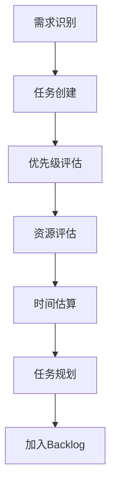
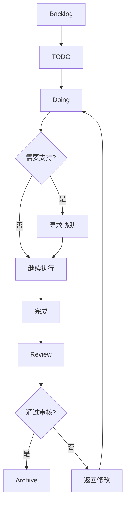

# PARA子目录CLAUDE.md文件创建实施计划

> **For Claude:** REQUIRED SUB-SKILL: Use superpowers:executing-plans to implement this plan task-by-task.

**Goal:** 为Obsidian知识库中所有PARA子目录创建高度定制化的CLAUDE.md文件，实现精确的上下文理解和专业化的工作流程指导。

**Architecture:** 基于各子目录的内容特征、工作流程需求和管理重点，创建继承主CLAUDE.md核心原则但高度定制化的指导文件。

**Tech Stack:** Obsidian、Markdown、YAML frontmatter、Zoottelkeeper插件、Dataview查询、任务管理插件。

---

## 实施准备

### Task 1: 目录特征映射
**Files:**
- Create: `docs/plans/2025-01-22-subdirectory-characteristics-map.md`

**Step 1: 创建目录特征映射文档**
```markdown
# 子目录特征映射表

## Projects目录特征
- AI知识IP打造: OKR驱动、内容工厂、量化指标
- 技术能力晋升: 职业路径、技术栈、ROI优化

## Topics目录特征  
- 认知系统: 高密度、强连接、行为科学
- 语言与移民: 标准化考试、进度跟踪
- 技术栈: 编程实践、框架学习
- 其他领域: 专业深度、实践应用

## Resources目录特征
- Prompt工程: 工程化、版本控制、迭代优化
- 学习挑战: 微习惯、即时反馈、完成导向
- 其他资源: 分类管理、快速检索

## Atlas目录特征
- BASE: 系统治理、元数据、基础架构
- Index: 查询中心、自动化索引
- Cards: 可视化、多模态表达
- kanban: 敏捷流程、状态跟踪
```

**Step 2: 保存特征映射**
```bash
git add docs/plans/2025-01-22-subdirectory-characteristics-map.md
git commit -m "docs: add subdirectory characteristics mapping"
```

---

## Phase 1: Projects目录CLAUDE.md创建

### Task 2: AI知识IP打造项目CLAUDE.md
**Files:**
- Create: `1.Projects/AI知识IP打造/CLAUDE.md`

**Step 1: 分析现有内容和标签模式**
```bash
# 检查现有文件结构
find "1.Projects/AI知识IP打造" -name "*.md" -type f | head -5
grep -r "#okr-strategy\|#video-content-metrics" "1.Projects/AI知识IP打造" | head -3
```

**Step 2: 创建AI知识IP打造专属CLAUDE.md**
```markdown
---
tags:
  - knowledge-base-structure
  - ai-knowledge-ip
  - content-factory
  - okr-management
---

# CLAUDE.md - AI知识IP打造项目

## 项目概述
这是AI知识IP打造项目的专属指导文件。本项目专注于通过系统化方法构建个人知识品牌，实现知识变现。

## 项目目标与OKR
- **战略目标**: 建立可持续的内容生产系统
- **关键成果**: 粉丝增长、内容转化率、知识付费收入
- **时间框架**: 季度性OKR回顾与调整

## 核心工作流程

### 1. 内容工厂SOP
- **选题策略**: 基于市场需求和正反举对抗式设计
- **生产流程**: 创意→研究→制作→发布→分析
- **质量控制**: 数据驱动的内容优化迭代

### 2. 指标跟踪系统
- **视频指标**: 完播率、互动率、转化率
- **内容效果**: 传播深度、用户留存、付费转化
- **市场反馈**: 评论分析、竞品对比、趋势识别

## 项目特定标签系统
```
#Domain/AIKnowledgeIP
#Status/Idea #Status/Production #Status/Published #Status/Analyzing
#Type/Strategy #Type/Content #Type/Metrics #Type/Review
```

## 内容组织原则
- **量化决策**: 所有策略基于可测量数据
- **快速迭代**: 小步快跑，A/B测试驱动
- **系统化思维**: 建立可复用的方法论框架
- **市场敏感**: 紧跟AI行业趋势和用户需求

## 常用模板
- 使用 `AI知识IP项目模板.md` 进行项目规划
- 采用 `内容工厂SOP模板.md` 标准化生产流程
- 应用 `数据复盘模板.md` 进行效果分析

## 关键资源连接
- 相关内容: `[[2.Topics/03.内容创作]]`, `[[3.Resources/Prompt工程]]`
- 方法论支持: `[[2.Topics/02.认知系统/思维模型]]`
- 工具库: `[[3.Resources/工具]]`

## 项目状态管理
使用任务插件跟踪:
```tasks
path includes 1.Projects/AI知识IP打造
not done
sort by priority
group by status
```

## 质量控制标准
1. **内容质量**: 必须包含数据支撑和可执行建议
2. **生产效率**: 遵循SOP确保稳定输出
3. **市场验证**: 发布后48小时内进行效果分析
4. **持续优化**: 基于反馈数据迭代改进

## 风险管理
- **内容同质化**: 定期分析竞品，保持差异化优势
- **算法变化**: 多平台分发，降低单一平台风险
- **创意枯竭**: 建立系统化选题机制和灵感库
```

**Step 3: 验证文件创建和格式**
```bash
ls -la "1.Projects/AI知识IP打造/CLAUDE.md"
head -10 "1.Projects/AI知识IP打造/CLAUDE.md"
```

**Step 4: 提交AI知识IP项目CLAUDE.md**
```bash
git add "1.Projects/AI知识IP打造/CLAUDE.md"
git commit -m "feat: add customized CLAUDE.md for AI Knowledge IP project"
```

### Task 3: 技术能力晋升项目CLAUDE.md
**Files:**
- Create: `1.Projects/技术能力晋升/CLAUDE.md`

**Step 1: 分析技术能力晋升项目特征**
```bash
find "1.Projects/技术能力晋升" -name "*.md" -type f | head -5
grep -r "#career-growth-path\|#technical-leadership" "1.Projects/技术能力晋升" | head -3
```

**Step 2: 创建技术能力晋升专属CLAUDE.md**
```markdown
---
tags:
  - knowledge-base-structure
  - technical-career-growth
  - skill-development
  - roi-optimization
---

# CLAUDE.md - 技术能力晋升项目

## 项目概述
这是技术能力晋升项目的专属指导文件。本项目专注于程序员的职业发展路径规划，通过ROI优化实现技术影响力的最大化。

## 项目框架
- **IC职级演进**: 从初级到资深的技术专家路径
- **技术栈成长**: 深度技术与广度能力的平衡发展
- **影响力建设**: 从个人贡献到团队领导的转型

## 核心工作流程

### 1. 职业规划路径
- **现状评估**: 技术能力、业务理解、沟通表达三维评估
- **目标设定**: 短期(1年)、中期(3年)、长期(5年)职业目标
- **差距分析**: 当前能力与目标职级的差距识别
- **学习计划**: 基于ROI的学习资源和实践项目选择

### 2. 技术栈优化策略
- **深度技能**: 选择1-2个核心技术领域做到专家级别
- **广度能力**: 掌握相关技术栈，提升系统思维
- **技术选型**: 基于市场需求和个人兴趣的平衡
- **实践验证**: 通过项目实践验证技术能力提升

## 项目特定标签系统
```
#Domain/TechnicalCareer
#Status/Planning #Status/Learning #Status/Practicing #Status/Achieved
#Type/SkillPlan #Type/LevelGuide #Type/ResourceReview #Type/ProjectPractice
```

## 职业发展阶段特征

### 初级工程师 (P2-P3)
- **重点**: 编程基础、代码质量、工具使用
- **目标**: 独立完成分配的开发任务
- **评估指标**: 代码质量、任务完成率、学习能力

### 中级工程师 (P4-P5)
- **重点**: 系统设计、问题解决、团队协作
- **目标**: 主导中小型项目，指导初级工程师
- **评估指标**: 设计能力、影响力、团队贡献

### 高级工程师 (P6-P7)
- **重点**: 架构设计、技术决策、业务理解
- **目标**: 负责复杂系统，影响技术方向
- **评估指标**: 架构能力、业务价值、技术影响力

## 学习ROI计算模型
- **市场需求度**: 招聘需求量、薪资水平、发展前景
- **学习成本**: 时间投入、难度系数、资源可得性
- **应用频率**: 实际工作中的使用频率和重要性
- **复用价值**: 跨项目、跨公司的通用性

## 内容组织原则
- **实战导向**: 优先学习能立即应用到工作的技能
- **循序渐进**: 建立系统性学习路径，避免碎片化
- **成果导向**: 每个学习阶段都有可验证的成果
- **持续迭代**: 根据市场变化调整学习重点

## 关键资源连接
- 技术学习: `[[2.Topics/01.技术栈]]`, `[[3.Resources/学习挑战]]`
- 认知提升: `[[2.Topics/02.认知系统]]`, `[[2.Topics/02.认知系统/学习系统]]`
- 实践项目: `[[3.Resources/示例库]]`, `[[3.Resources/Quizz]]`

## 跨公司对标系统
- **职级对应**: 不同公司P序列的对应关系
- **能力要求**: 各职级的核心能力要求对比
- **薪资水平**: 市场薪资调研和谈判策略
- **发展路径**: 技术专家 vs 管理路径的选择

## 项目状态管理
使用任务插件跟踪技能进展:
```tasks
path includes 1.Projects/技术能力晋升
not done
sort by due
group by skill-category
```

## 质量控制标准
1. **可量化进展**: 每个技能提升都有明确的评估标准
2. **市场验证**: 技能选择基于真实的市场需求
3. **实践验证**: 通过实际项目验证技能掌握程度
4. **持续调整**: 根据行业发展和个人情况调整计划

## 风险管理
- **技术过时**: 选择基础性、原理性的技术知识
- **学习倦怠**: 设定合理的学习节奏和奖励机制
- **方向错误**: 定期回顾和调整职业发展路径
- **平台绑定**: 培养可迁移的核心技术能力
```

**Step 3: 验证文件内容**
```bash
wc -l "1.Projects/技术能力晋升/CLAUDE.md"
tail -10 "1.Projects/技术能力晋升/CLAUDE.md"
```

**Step 4: 提交技术能力晋升CLAUDE.md**
```bash
git add "1.Projects/技术能力晋升/CLAUDE.md"
git commit -m "feat: add customized CLAUDE.md for Technical Career Growth project"
```

---

## Phase 2: Topics目录CLAUDE.md创建

### Task 4: 认知系统领域CLAUDE.md
**Files:**
- Create: `2.Topics/02.认知系统/CLAUDE.md`

**Step 1: 分析认知系统领域特征**
```bash
find "2.Topics/02.认知系统" -name "*.md" -type f | wc -l
ls "2.Topics/02.认知系统" | grep -v "^_"
```

**Step 2: 创建认知系统专属CLAUDE.md**
```markdown
---
tags:
  - knowledge-base-structure
  - cognitive-science
  - mental-models
  - productivity-systems
  - behavioral-psychology
---

# CLAUDE.md - 认知系统领域

## 领域概述
这是认知系统领域的专属指导文件。本领域专注于思维模型、个人效能、学习系统和行动协议的研究与应用，是知识库的核心知识密集区。

## 知识架构
- **思维模型**: 决策框架、认知工具、分析模式
- **个人效能**: 时间管理、生产力系统、职业发展
- **学习系统**: 技能习得、知识管理、记忆优化
- **行动协议**: 行为原则、沟通系统、执行机制

## 领域特征

### 高密度知识连接
- **交叉引用密度**: 平均每笔记 >5 个双向链接
- **知识融合**: 心理学、行为科学、系统理论的整合
- **实用导向**: 理论模型转化为可操作的行动指南

### 持续迭代更新
- **高频更新**: 每周新增内容，每月回顾优化
- **版本管理**: 重要概念有历史版本追踪
- **实验验证**: 理论经过个人实践验证

## 核心工作流程

### 1. 知识获取与处理
- **信息源筛选**: 高质量信源的识别和订阅
- **深度阅读**: 主动阅读与批判性思考
- **概念提取**: 核心概念的识别和抽象化
- **模型构建**: 从具体案例到通用模型的归纳

### 2. 知识内化与连接
- **类比思考**: 新概念与已知知识的连接
- **实际应用**: 理论在实际场景中的验证
- **教授他人**: 通过教学巩固理解
- **系统整合**: 不同模型的融合应用

## 领域特定标签系统
```
#Domain/CognitiveSystem
#Status/Learning #Status/Practicing #Status/Mastered #Status/Teaching
#Type/MentalModel #Type/ProductivityHack #Type/LearningMethod #Type/ActionProtocol
#SubDomain/DecisionMaking #SubDomain/TimeManagement #SubDomain/SkillAcquisition
```

## 子领域专业指导

### 思维模型管理
- **模型收集**: 从书籍、文章、实践中提炼思维模型
- **分类体系**: 按应用场景(决策、学习、创新等)分类
- **使用原则**: 何时使用哪个模型的判断标准
- **组合应用**: 多个模型的协同使用方法

### 个人效能系统
- **能量管理**: 精力、时间、注意力的优化配置
- **习惯系统**: 好习惯养成与坏习惯消除的方法论
- **环境设计**: 优化物理和数字环境支持目标达成
- **工具系统**: 选择合适的工具提升效率而非制造负担

### 学习系统优化
- **学习科学**: 基于认知科学的高效学习方法
- **记忆机制**: 短期记忆到长期记忆的转化策略
- **技能习得**: 从理论到实践，从知道到做到的路径
- **知识管理**: 建立个人知识体系和检索系统

### 行动协议制定
- **原则系统**: 个人和职业生活的核心原则
- **决策流程**: 重要决策的标准化流程
- **沟通框架**: 有效沟通的模板和协议
- **执行机制**: 将意图转化为行动的系统保障

## 内容质量标准

### 知识准确性
- **信源可靠**: 引用权威研究和经过验证的理论
- **逻辑严密**: 概念定义清晰，推理过程合理
- **边界明确**: 模型适用条件和限制的说明

### 实用性验证
- **个人实践**: 理论经过个人实践验证有效性
- **可操作性**: 提供具体的实施步骤和检查清单
- **效果评估**: 建立评估指标跟踪使用效果

### 知识连接性
- **双向链接**: 每个概念至少3个相关连接
- **层次结构**: 明确的概念层次和从属关系
- **网络效应**: 通过连接创造新的洞察和组合

## 常用思维模板

### 1. 第一性原理分析模板
```
问题定义:
↓
假设识别:
↓ 
基础要素分解:
↓
从基础重新构建:
↓
验证和应用:
```

### 2. 系统思考模板
```
系统边界定义:
↓
关键要素识别:
↓
连接关系绘制:
↓
反馈循环分析:
↓
杠杆点识别:
```

## 关键资源连接
- 心理学基础: `[[2.Topics/02.认知系统/行为心理学]]`
- 实践应用: `[[1.Projects]]` 中的具体项目应用
- 工具支持: `[[3.Resources/工具]]` 中的认知工具
- 系统管理: `[[Atlas/Index]]` 中的索引和查询系统

## 知识发现机制
```tasks
path includes 2.Topics/02.认知系统
tag includes #Type/MentalModel
sort by created
limit 20
```

## 领域维护策略

### 定期回顾机制
- **周回顾**: 新学习内容的整理和连接
- **月回顾**: 知识体系的梳理和优化
- **季回顾**: 核心模型的验证和更新

### 知识 freshness 管理
- **标记系统**: 使用Status标签标记知识新鲜度
- **更新触发**: 新发现证据时的内容更新
- **版本控制**: 重要概念变更的历史记录

### 协作学习
- **知识分享**: 通过教授他人巩固理解
- **同行讨论**: 与同好讨论深化认识
- **实践社群**: 加入相关实践社群持续学习

## 创新与探索
- **模型融合**: 不同领域思维模型的创新组合
- **边界探索**: 认知科学前沿的跟踪和实验
- **个性化适配**: 通用模型的个人化调整
```

**Step 3: 验证认知系统CLAUDE.md**
```bash
grep -n "##" "2.Topics/02.认知系统/CLAUDE.md" | head -10
```

**Step 4: 提交认知系统CLAUDE.md**
```bash
git add "2.Topics/02.认知系统/CLAUDE.md"
git commit -m "feat: add specialized CLAUDE.md for Cognitive Systems domain"
```

### Task 5: 语言与移民领域CLAUDE.md
**Files:**
- Create: `2.Topics/06.语言与移民/CLAUDE.md`

**Step 1: 分析语言与移民领域结构**
```bash
find "2.Topics/06.语言与移民" -type d
ls "2.Topics/06.语言与移民/英语" | head -5
```

**Step 2: 创建语言与移民专属CLAUDE.md**
```markdown
---
tags:
  - knowledge-base-structure
  - language-learning
  - immigration
  - test-preparation
  - progress-tracking
---

# CLAUDE.md - 语言与移民领域

## 领域概述
这是语言与移民领域的专属指导文件。本领域专注于英语学习、技术移民准备和标准化考试应对，强调可量化的成果跟踪和系统化的准备流程。

## 领域结构
- **技术移民**: 移民策略、国家选择、市场需求分析
- **英语学习**: IELTS备考、写作技巧、口语提升
- **资质认证**: 职业资格认证、学历认证、技能评估
- **文化适应**: 跨文化沟通、职场文化、社会融入

## 核心特征

### 标准化考试导向
- **IELTS系统**: 听说读写的系统化备考
- **量化评分**: 明确的评分标准和进步指标
- **模拟测试**: 定期全真模拟和分数预测
- **考试策略**: 时间管理、答题技巧、心理调节

### 进度跟踪机制
- **里程碑管理**: 阶段性目标和完成度跟踪
- **数据驱动**: 基于测试数据的弱项识别和改进
- **可视化进度**: 图表化展示学习进展
- **定期复盘**: 月度学习效果评估和策略调整

## 领域特定标签系统
```
#Domain/LanguageImmigration
#Status/GoalSetting #Status/Learning #Status/Practicing #Status/TestReady #Status/Achieved
#Type/StudyPlan #Type/TestStrategy #Type/ProgressReview #Type/ResourceRecommendation
#SubDomain/IELTS #SubDomain/TechnicalWriting #SubDomain/ImmigrationStrategy
```

## 子领域专业指导

### IELTS备考系统
- **目标设定**: 基于目标分数的时间规划
- **能力评估**: 四项技能的初始水平测试
- **学习路径**: 个性化学习计划和资源推荐
- **模拟考试**: 定期全真模拟和错题分析

#### 听力专项
- **题型分析**: 各题型特点和解题策略
- **精听训练**: 逐句精听和关键词抓取
- **语速适应**: 不同口音和语速的适应训练
- **笔记技巧**: 高效笔记和信息记录方法

#### 阅读专项  
- **题型掌握**: 判断题、匹配题、填空题等解题技巧
- **阅读策略**: 略读、扫读、精读的灵活运用
- **词汇提升**: 学术词汇和主题词汇的系统学习
- **时间管理**: 60分钟内完成40题的时间分配

#### 写作专项
- **Task 1**: 图表描述的结构和语言模板
- **Task 2**: 议论文的论证结构和观点表达
- **语法提升**: 复杂句式和准确性的训练
- **词汇丰富度**: 同义词替换和表达多样化

#### 口语专项
- **Part 1**: 日常话题的流利回答
- **Part 2**: 个人陈述的结构和内容组织
- **Part 3**: 深度讨论的批判性思维
- **发音训练**: 音标、语调、流利度的综合提升

### 技术移民策略
- **国家比较**: 各技术移民国家的政策对比
- **职业评估**: 技能评估机构和要求分析
- **打分系统**: 各国打分项目和优化策略
- **时间规划**: 移民准备的时间线和关键节点

#### 关键因素分析
- **年龄因素**: 最佳申请年龄和年龄分数
- **学历要求**: 学历认证和分数加成
- **工作经验**: 相关工作经验的认定和评分
- **语言能力**: 语言考试成绩在移民中的权重

### 职业英语写作
- **技术文档**: API文档、技术规范的写作规范
- **商务邮件**: 专业邮件的结构和表达技巧
- **简历优化**: 符合海外标准的简历写作
- **面试准备**: 技术面试的英语表达和沟通

## 进度管理系统

### 学习数据收集
- **每日记录**: 学习时间、内容、效果记录
- **每周总结**: 学习进展、困难点、改进措施
- **每月评估**: 阶段性目标达成情况和调整
- **里程碑跟踪**: 关键节点的完成状态和质量

### 成果可视化
```dataview
TABLE 
  file.name as "学习内容",
  score as "当前分数",
  target as "目标分数",
  date as "测试日期"
FROM #Type/ProgressReview AND #SubDomain/IELTS
SORT date DESC
```

### 弱项识别与改进
- **错题分析**: 系统分析错误类型和原因
- **专项训练**: 针对弱项的重点突破训练
- **方法调整**: 学习策略和方法的优化
- **效果验证**: 改进措施的效果跟踪

## 资源管理系统

### 学习资源分类
- **官方资源**: 官方指南、样题、评分标准
- **培训机构**: 优质培训机构的课程和资料
- **在线平台**: 学习APP、网站、YouTube频道
- **社群资源**: 学习小组、论坛、经验分享

### 资源质量评估
- **权威性**: 来源的权威性和可靠性
- **时效性**: 内容的更新频率和最新性
- **适用性**: 与个人目标的匹配度
- **效果性**: 实际使用效果和性价比

## 常用模板

### IELTS学习计划模板
```markdown
## 学习目标
- 目标分数: 
- 目标时间:
- 当前水平:

## 学习计划
- 每日学习时间: 
- 主要学习内容:
- 重点突破项目:

## 进度跟踪
- 每周模拟测试:
- 分数变化记录:
- 弱项改进措施:
```

### 移民准备清单模板
```markdown
## 移民目标国家
- 首选:
- 备选:

## 评估项目完成度
- [ ] 学历认证
- [ ] 技能评估  
- [ ] 语言考试
- [ ] 工作经验证明
- [ ] 资金准备

## 时间节点
- 开始准备时间:
- 计划申请时间:
- 预期完成时间:
```

## 关键资源连接
- 考试资源: `[[3.Resources/Quizz]]` 中的练习题库
- 学习方法: `[[2.Topics/02.认知系统/学习系统]]` 中的高效学习方法
- 工具支持: `[[3.Resources/工具]]` 中的语言学习工具
- 进度管理: `[[Atlas/kanban]]` 中的学习进度看板

## 任务管理系统
```tasks
path includes 2.Topics/06.语言与移民
not done
sort by due
group by goal-type
```

## 质量控制标准

### 学习质量
1. **目标明确**: 每个学习阶段都有明确、可衡量的目标
2. **方法科学**: 基于认知科学的高效学习方法
3. **反馈及时**: 定期测试和即时反馈机制
4. **调整灵活**: 基于效果数据的策略调整

### 移民准备质量
1. **信息准确**: 移民政策的准确理解和及时更新
2. **材料完整**: 申请材料的完整性和规范性
3. **时间合理**: 充足的准备时间和合理的安排
4. **风险控制**: 备选方案和风险评估

## 持续改进机制

### 定期回顾
- **周回顾**: 学习进度和困难总结
- **月回顾**: 目标达成情况和策略调整  
- **季回顾**: 整体进展和方向确认
- **年回顾**: 年度目标达成和新目标设定

### 学习方法优化
- **效率评估**: 学习效率和效果的量化分析
- **方法迭代**: 学习方法的持续优化和创新
- **工具升级**: 学习工具的评估和升级
- **社群学习**: 与学习伙伴的经验交流和互相促进
```

**Step 3: 验证语言与移民CLAUDE.md**
```bash
wc -l "2.Topics/06.语言与移民/CLAUDE.md"
grep -c "##" "2.Topics/06.语言与移民/CLAUDE.md"
```

**Step 4: 提交语言与移民CLAUDE.md**
```bash
git add "2.Topics/06.语言与移民/CLAUDE.md"
git commit -m "feat: add specialized CLAUDE.md for Language & Immigration domain"
```

---

## Phase 3: Resources目录CLAUDE.md创建

### Task 6: Prompt工程资源CLAUDE.md
**Files:**
- Create: `3.Resources/Prompt工程/CLAUDE.md`

**Step 1: 分析Prompt工程资源特征**
```bash
find "3.Resources/Prompt工程" -name "*.md" -type f | wc -l
ls "3.Resources/Prompt工程" | head -5
grep -r "autonomous-agent-systems\|agent-architecture" "3.Resources/Prompt工程" | head -3
```

**Step 2: 创建Prompt工程专属CLAUDE.md**
```markdown
---
tags:
  - knowledge-base-structure
  - prompt-engineering
  - ai-automation
  - agent-architecture
  - version-control
---

# CLAUDE.md - Prompt工程资源

## 资源概述
这是Prompt工程资源的专属指导文件。本资源库包含40+个高度结构化的AI Prompt模板，专注AI工程化和自动化系统，是知识库的核心技术资产。

## 资源特征

### 高度工程化
- **结构化设计**: 每个Prompt都有清晰的结构和组件
- **可复用性**: 模块化设计，易于组合和扩展
- **版本控制**: 重要Prompt有版本历史和迭代记录
- **性能优化**: 基于实际使用效果的持续优化

### 应用导向
- **任务分类**: 按功能领域分类（写作、分析、编程等）
- **角色定位**: 明确AI助手的专业角色和能力边界
- **输出标准化**: 统一的输出格式和质量标准
- **工作流集成**: 与实际工作流程的深度集成

## 核心分类体系

### 1. System级Prompt
- **元Prompt**: 控制AI行为和思维方式的顶层设计
- **角色定义**: 专业AI助手的角色设定和能力描述
- **工作流程**: 标准化的任务执行流程和规范
- **质量控制**: 输出质量的评估和改进机制

### 2. 工作流Prompt
- **任务分解**: 复杂任务的系统化分解方法
- **步骤指导**: 逐步执行的详细指导Prompt
- **质量控制**: 每个步骤的质量检查和验证
- **结果整合**: 多步骤结果的整合和优化

### 3. 专项功能Prompt
- **内容创作**: 写作、编辑、优化等创作相关Prompt
- **分析决策**: 数据分析、决策支持等分析类Prompt
- **技术编程**: 代码生成、调试、优化等技术类Prompt
- **学习教学**: 知识讲解、技能培训等教学类Prompt

## 资源特定标签系统
```
#Domain/PromptEngineering
#Status/Draft #Status/Testing #Status/Production #Status/Deprecated
#Type/SystemPrompt #Type/WorkflowPrompt #Type/TaskPrompt #Type/QualityControl
#Category/ContentCreation #Category/Analysis #Category/Programming #Category/Learning
```

## Prompt设计原则

### 1. 清晰性原则
- **目标明确**: 清晰定义任务目标和期望输出
- **边界设定**: 明确任务范围和能力边界
- **指令具体**: 避免模糊和歧义的表达
- **示例提供**: 提供高质量的输入输出示例

### 2. 结构化原则
- **组件分离**: 将复杂Prompt分解为独立组件
- **层次清晰**: 使用标题、列表等提高可读性
- **逻辑一致**: 确保各部分之间的逻辑一致性
- **模板化**: 建立可复用的Prompt模板结构

### 3. 可优化原则
- **反馈机制**: 建立效果反馈和改进机制
- **A/B测试**: 对比不同版本Prompt的效果
- **数据驱动**: 基于使用数据进行优化决策
- **持续迭代**: 建立持续改进的工作流程

## 质量评估标准

### 效果评估
- **任务完成度**: 是否完整准确地完成任务
- **输出质量**: 输出内容的专业性和可用性
- **一致性**: 多次执行结果的稳定性
- **效率性**: 完成任务的时间和资源消耗

### 可用性评估
- **易用性**: Prompt的理解和使用难度
- **通用性**: 适用于不同场景的能力
- **可维护性**: Prompt的维护和更新复杂度
- **可扩展性**: 功能扩展和组合的灵活性

## 版本管理策略

### 版本控制规则
- **语义版本**: 采用主版本.次版本.修订版的版本号
- **变更记录**: 详细记录每个版本的变更内容
- **兼容性**: 保持向后兼容性和迁移指南
- **标签管理**: 使用Git标签标记重要版本

### 发布流程
1. **开发阶段**: 新Prompt的设计和内部测试
2. **测试阶段**: 在实际场景中测试Prompt效果
3. **候选版本**: 准备发布的稳定版本
4. **正式发布**: 发布到生产环境并开始使用
5. **维护更新**: 基于反馈的持续优化和更新

## 常用Prompt模板

### 1. 任务分解模板
```markdown
## 任务目标
[明确描述要完成的具体任务]

## 任务分解
请将上述任务分解为以下步骤：
1. [步骤1的具体要求和输出]
2. [步骤2的具体要求和输出]
3. [步骤3的具体要求和输出]

## 质量标准
- [标准1的具体要求]
- [标准2的具体要求]

## 输出格式
[期望的输出格式要求]
```

### 2. 角色扮演模板
```markdown
## 角色定义
你是一个[专业领域]的专家，具有[具体经验年限]的经验。

## 核心能力
- [能力1的详细描述]
- [能力2的详细描述]
- [能力3的详细描述]

## 任务要求
基于你的专业能力，请完成以下任务：[具体任务描述]

## 输出要求
- 使用专业的[领域术语]
- 提供可执行的[建议/方案]
- 包含具体的[案例/示例]
```

## 性能优化策略

### Prompt优化
- **指令精炼**: 去除冗余信息，提高指令效率
- **结构优化**: 改进Prompt的逻辑结构和组织方式
- **示例选择**: 选择最具代表性的输入输出示例
- **参数调整**: 调整temperature、max tokens等参数

### 使用优化
- **场景匹配**: 为不同场景选择最合适的Prompt
- **组合使用**: 多个Prompt的组合使用策略
- **缓存机制**: 常用Prompt的结果缓存和复用
- **批量处理**: 批量任务的Prompt优化

## 资源发现机制
```tasks
path includes 3.Resources/Prompt工程
tag includes #Type/SystemPrompt
sort by modified
limit 10
```

## 资源更新机制

### 定期回顾
- **月度回顾**: 评估所有Prompt的使用效果
- **季度优化**: 基于使用数据进行Prompt优化
- **年度升级**: 重大功能升级和架构改进

### 新增流程
1. **需求分析**: 识别新的Prompt需求和场景
2. **设计开发**: 设计和开发新的Prompt模板
3. **测试验证**: 在实际场景中测试新Prompt
4. **文档编写**: 编写使用说明和最佳实践
5. **发布集成**: 将新Prompt集成到资源库

## 关键资源连接
- 理论基础: `[[2.Topics/01.技术栈]]` 中的AI技术知识
- 应用场景: `[[1.Projects]]` 中的具体应用项目
- 工具支持: `[[3.Resources/工具]]` 中的AI工具
- 系统管理: `[[Atlas/BASE]]` 中的管理系统

## 安全与伦理

### 使用安全
- **数据安全**: 避免在Prompt中包含敏感信息
- **权限控制**: 根据使用权限控制Prompt访问
- **审计日志**: 记录Prompt的使用情况和效果
- **风险防控**: 识别和防范Prompt使用风险

### 伦理考虑
- **AI伦理**: 遵循AI使用的伦理准则
- **偏见控制**: 避免Prompt中的偏见和歧视
- **透明度**: 明确AI的能力限制和适用范围
- **责任归属**: 明确AI输出结果的责任归属

## 协作与共享

### 贡献机制
- **模板贡献**: 用户贡献优秀Prompt模板的机制
- **反馈收集**: 收集用户反馈和改进建议
- **社区协作**: 与Prompt工程社区的协作交流
- **开源共享**: 优质Prompt的开源共享策略

### 知识管理
- **最佳实践**: Prompt工程的最佳实践总结
- **案例研究**: 典型应用场景的案例研究
- **培训资源**: Prompt工程的培训和学习资源
- **行业标准**: 参与制定Prompt工程的行业标准
```

**Step 3: 验证Prompt工程CLAUDE.md**
```bash
head -20 "3.Resources/Prompt工程/CLAUDE.md"
grep -n "##" "3.Resources/Prompt工程/CLAUDE.md" | wc -l
```

**Step 4: 提交Prompt工程CLAUDE.md**
```bash
git add "3.Resources/Prompt工程/CLAUDE.md"
git commit -m "feat: add specialized CLAUDE.md for Prompt Engineering resources"
```

---

## Phase 4: Atlas目录CLAUDE.md创建

### Task 7: Atlas系统目录CLAUDE.md
**Files:**
- Create: `Atlas/BASE/CLAUDE.md`
- Create: `Atlas/Index/CLAUDE.md`  
- Create: `Atlas/Cards/CLAUDE.md`
- Create: `Atlas/kanban/CLAUDE.md`

**Step 1: 分析Atlas各子目录特征**
```bash
ls -la Atlas/BASE/
ls -la Atlas/Index/
ls -la Atlas/Cards/
ls -la Atlas/kanban/
```

**Step 2: 创建BASE目录CLAUDE.md**
```markdown
---
tags:
  - knowledge-base-structure
  - system-governance
  - metadata-management
  - base-configuration
---

# CLAUDE.md - Atlas BASE系统

## 系统概述
这是Atlas BASE系统的专属指导文件。BASE是整个知识库的基础架构和治理中心，负责系统级配置、元数据管理和基础规则定义。

## 系统职责
- **元数据管理**: 定义和管理知识库的核心元数据
- **标签系统**: 维护整个知识库的标签分类体系
- **基础配置**: 系统级配置和插件设置管理
- **治理规则**: 知识库维护和更新的核心规则

## 核心组件

### 1. 标签管理系统
- **分类体系**: Domain/Status/Type三层标签结构
- **命名规范**: 标签的命名约定和使用规范
- **压缩规则**: 标签的压缩和优化规则
- **版本控制**: 标签系统的版本管理策略

### 2. 配置管理系统
- **插件配置**: Obsidian插件的配置管理
- **模板配置**: 系统级模板的维护和更新
- **索引配置**: Zoottelkeeper等自动化工具的配置
- **安全配置**: 数据备份和访问权限配置

### 3. 基础架构文档
- **系统设计**: 知识库的整体架构设计文档
- **数据模型**: 知识组织和存储的数据模型
- **接口规范**: 各模块间的接口和交互规范
- **扩展机制**: 系统功能扩展的机制和规范

## 系统特定标签系统
```
#Domain/SystemGovernance
#Status/Stable #Status/Testing #Status/Maintenance #Status/Deprecated
#Type/Configuration #Type/Metadata #Type/Governance #Type/BaseRule
```

## 配置管理原则

### 1. 稳定性优先
- **变更控制**: 严格控制系统配置的变更
- **向后兼容**: 保持配置的向后兼容性
- **测试验证**: 配置变更前必须经过充分测试
- **回滚机制**: 建立快速回滚和恢复机制

### 2. 可维护性
- **文档完整**: 所有配置都有完整清晰的文档
- **模块化**: 配置按功能模块化组织管理
- **标准化**: 统一的配置格式和管理规范
- **自动化**: 尽可能实现配置的自动化管理

### 3. 安全性
- **权限控制**: 配置修改的权限控制机制
- **备份恢复**: 配置的定期备份和恢复机制
- **审计日志**: 配置变更的审计日志记录
- **敏感信息**: 敏感配置信息的安全保护

## 元数据标准

### 文件元数据
```yaml
---
tags: [必须的三层标签]
created: [创建时间]
modified: [修改时间]
related: [相关笔记]
update: [更新频率]
rating: [质量评分]
view-count: [查看次数]
---
```

### 目录元数据
- **索引文件**: 每个目录的_Index_of_*.md文件
- **导航结构**: 目录间的层级和关联关系
- **统计信息**: 文件数量、更新频率等统计数据
- **质量指标**: 内容质量和完整性的评估指标

## 系统监控机制

### 配置监控
- **变更检测**: 自动检测系统配置的变更
- **异常报警**: 配置异常或错误的及时报警
- **性能监控**: 系统性能和响应时间监控
- **容量管理**: 存储空间和资源使用监控

### 质量监控
- **链接检查**: 定期检查内部链接的有效性
- **标签一致性**: 检查标签使用的一致性
- **格式规范**: 检查文档格式是否符合规范
- **内容质量**: 评估内容质量和完整性

## 维护工作流程

### 日常维护
- **日志检查**: 检查系统运行日志和错误记录
- **备份验证**: 验证备份的完整性和可恢复性
- **性能检查**: 检查系统性能和响应情况
- **安全扫描**: 定期进行安全漏洞扫描

### 定期维护
- **配置优化**: 基于使用情况优化系统配置
- **清理清理**: 清理过期的配置和无用文件
- **版本升级**: 系统组件和插件的版本升级
- **文档更新**: 更新系统文档和使用说明

## 灾难恢复

### 备份策略
- **全量备份**: 定期的完整系统备份
- **增量备份**: 频繁的增量数据备份
- **异地备份**: 备份数据的异地存储
- **加密存储**: 备份数据的加密保护

### 恢复流程
1. **故障评估**: 评估故障影响和恢复优先级
2. **方案选择**: 选择合适的恢复方案和策略
3. **数据恢复**: 从备份中恢复数据和配置
4. **验证测试**: 验证恢复后的系统功能和数据

## 关键资源连接
- 索引系统: `[[Atlas/Index]]` 中的索引和查询功能
- 可视化: `[[Atlas/Cards]]` 中的可视化表达
- 工作流: `[[Atlas/kanban]]` 中的任务管理
- 主配置: `../CLAUDE.md` 中的全局配置

## 系统扩展机制

### 插件管理
- **插件评估**: 新插件的评估和测试流程
- **集成开发**: 插件集成开发和定制化
- **性能优化**: 插件性能的监控和优化
- **兼容性**: 插件兼容性的测试和管理

### 功能扩展
- **需求收集**: 系统功能需求的收集和分析
- **设计开发**: 新功能的设计和开发流程
- **测试验证**: 新功能的测试和验证
- **发布部署**: 新功能的发布和部署流程
```

**Step 3: 创建Index目录CLAUDE.md**
```markdown
---
tags:
  - knowledge-base-structure
  - index-system
  - query-management
  - data-view
---

# CLAUDE.md - Atlas Index系统

## 系统概述
这是Atlas Index系统的专属指导文件。Index是知识库的查询中心和导航枢纽，负责全库索引、查询管理和数据可视化。

## 系统职责
- **索引管理**: 维护和更新全库的索引文件
- **查询服务**: 提供强大的数据查询和检索功能
- **导航服务**: 为知识库提供结构化的导航功能
- **统计分析**: 提供知识库的统计分析和报告功能

## 核心组件

### 1. Zoottelkeeper索引系统
- **自动索引**: 自动生成目录的_Index_of_*.md文件
- **索引模板**: 统一的索引文件格式和模板
- **更新机制**: 索引的自动更新和同步机制
- **配置管理**: Zoottelkeeper插件的配置和优化

### 2. Dataview查询系统
- **查询语法**: Dataview查询语法的使用和优化
- **查询模板**: 常用查询的模板和示例
- **性能优化**: 查询性能的监控和优化
- **结果展示**: 查询结果的可视化展示

### 3. 任务管理中心
- **任务跟踪**: 全库任务的集中跟踪和管理
- **状态管理**: 任务状态的更新和同步
- **优先级管理**: 任务优先级的动态调整
- **报表生成**: 任务完成情况的统计报表

## 系统特定标签系统
```
#Domain/IndexSystem
#Status/Active #Status/Updating #Status/Error
#Type/AutoIndex #Type/DataviewQuery #Type/TaskManagement #Type/Navigation
```

## 索引管理策略

### 1. 自动化索引
- **触发机制**: 文件变更时的索引自动更新
- **频率控制**: 避免过度频繁的索引更新
- **错误处理**: 索引生成失败的处理机制
- **性能监控**: 索引生成的性能监控

### 2. 索引质量
- **完整性检查**: 确保所有文件都被正确索引
- **链接验证**: 验证索引中链接的有效性
- **格式规范**: 索引文件格式的规范性检查
- **内容质量**: 索引内容的准确性和及时性

### 3. 索引定制
- **模板定制**: 针对不同目录的索引模板定制
- **字段选择**: 索引字段的选择和排序
- **过滤规则**: 文件包含和排除的过滤规则
- **展示格式**: 索引展示的格式和样式

## Dataview查询优化

### 查询性能
- **索引利用**: 充分利用索引提升查询性能
- **查询简化**: 简化复杂查询的逻辑结构
- **缓存机制**: 常用查询结果的缓存策略
- **批量查询**: 批量查询的优化和并行处理

### 查询模板
```dataview
TABLE 
  file.name as "文件名",
  file.mtime as "修改时间",
  rating as "评分",
  view-count as "查看次数"
FROM #Type/Note AND !#Status/Archived
SORT file.mtime DESC
LIMIT 50
```

### 高级查询
- **多表关联**: 复杂的多表关联查询
- **条件组合**: 复杂条件的组合查询
- **聚合统计**: 数据的聚合和统计查询
- **时间序列**: 基于时间的数据分析查询

## 任务管理系统

### 任务分类
- **按项目**: 基于项目分类的任务管理
- **按状态**: 基于状态分类的任务跟踪
- **按优先级**: 基于优先级的任务排序
- **按时限**: 基于时间的任务管理

### 任务查询模板
```tasks
path includes 1.Projects
not done
sort by priority
sort by due
limit 20
```

### 任务工作流
- **创建**: 任务的创建和初始设置
- **分配**: 任务的分配和责任明确
- **执行**: 任务的执行和进度跟踪
- **完成**: 任务的完成和质量验收

## 导航系统设计

### 层次导航
- **目录结构**: 基于PARA的目录层次导航
- **面包屑**: 面包屑导航的显示和更新
- **上下级关系**: 目录间上下级关系的维护
- **快速跳转**: 常用目录的快速跳转功能

### 关系导航
- **标签导航**: 基于标签的关联内容导航
- **链接导航**: 基于双向链接的关系导航
- **相似内容**: 相似内容的推荐和导航
- **历史记录**: 浏览历史和返回导航

## 数据统计与分析

### 基础统计
- **文件统计**: 各类型文件的数量统计
- **标签统计**: 标签使用频率和分布统计
- **链接统计**: 内部链接的数量和质量统计
- **访问统计**: 文件访问频率的统计分析

### 趋势分析
- **增长趋势**: 知识库规模的增长趋势分析
- **活跃度分析**: 内容更新和访问的活跃度分析
- **质量趋势**: 内容质量的变化趋势分析
- **使用模式**: 用户使用行为的模式分析

## 系统监控机制

### 性能监控
- **查询性能**: Dataview查询的响应时间监控
- **索引性能**: 索引生成和更新的性能监控
- **系统负载**: 系统资源使用的监控
- **错误监控**: 系统错误和异常的监控

### 质量监控
- **数据一致性**: 索引和实际文件的一致性检查
- **链接质量**: 内部链接的有效性和质量检查
- **格式规范**: 文件格式规范的合规性检查
- **内容质量**: 内容质量和完整性的评估

## 常用索引模板

### 目录索引模板
```markdown
# _Index_of_[DirectoryName]

> 自动生成时间: {{date}}
> 包含文件数: {{count}}

## 📁 目录结构
[自动生成的目录树]

## 📄 文件列表
[按类型分类的文件列表]

## 🔗 相关连接
- 上级目录: [[../_Index_of_[ParentDir].md]]
- 相关目录: [相关目录链接]
```

## 关键资源连接
- 基础配置: `[[Atlas/BASE]]` 中的系统配置
- 可视化: `[[Atlas/Cards]]` 中的可视化表达
- 任务管理: `[[Atlas/kanban]]` 中的任务看板
- 主索引: `[[Atlas/MOCs.md]]` 中的主索引文件

## 维护工作流程

### 日常维护
- **索引更新**: 检查和更新自动索引
- **查询优化**: 监控和优化查询性能
- **数据验证**: 验证索引和查询的准确性
- **性能监控**: 监控系统性能和响应时间

### 定期维护
- **索引重建**: 定期重建和优化索引结构
- **查询清理**: 清理无效和低效的查询
- **模板更新**: 更新索引和查询模板
- **统计分析**: 生成和维护统计报告
```

**Step 4: 创建Cards目录CLAUDE.md**
```markdown
---
tags:
  - knowledge-base-structure
  - visual-expression
  - multimedia-content
  - knowledge-cards
---

# CLAUDE.md - Atlas Cards系统

## 系统概述
这是Atlas Cards系统的专属指导文件。Cards是知识库的可视化表达中心，负责思维导图、流程图、演示文稿等多模态知识表达。

## 系统职责
- **视觉化表达**: 将抽象概念通过可视化方式表达
- **多模态内容**: 整合图像、文字、音频等多模态内容
- **知识卡片**: 创建和维护知识卡片和概念图
- **演示支持**: 为演讲和教学提供可视化支持

## 核心组件

### 1. Canvas思维导图
- **概念映射**: 复杂概念的可视化映射
- **关系网络**: 知识点间关系网络的展示
- **层次结构**: 知识体系层次结构的可视化
- **创意激发**: 通过视觉方式激发创意思维

### 2. Excalidraw图表
- **流程图**: 业务流程和工作流程的可视化
- **系统图**: 系统架构和组件关系图
- **手绘风格**: 保持手绘风格的自然感
- **协作编辑**: 支持多人实时协作编辑

### 3. PPT演示文稿
- **演讲支持**: 为演讲和教学提供演示支持
- **内容整合**: 多个知识点的整合展示
- **动画效果**: 适度的动画增强表现力
- **模板管理**: 演示文稿模板的管理和维护

## 系统特定标签系统
```
#Domain/VisualExpression
#Status/Draft #Status/Review #Status/Published #Status/Archived
#Type/MindMap #Type/FlowChart #Type/Presentation #Type/Diagram
#SubDomain/Canvas #SubDomain/Excalidraw #SubDomain/PowerPoint
```

## 可视化设计原则

### 1. 信息层次
- **视觉层次**: 通过大小、颜色建立视觉层次
- **信息分组**: 相关信息的逻辑分组
- **重点突出**: 关键信息的视觉突出
- **简化复杂**: 复杂信息的可视化简化

### 2. 美观与实用
- **配色协调**: 统一和谐的配色方案
- **字体选择**: 清晰易读的字体选择
- **布局合理**: 合理的空间布局和留白
- **交互友好**: 用户友好的交互设计

### 3. 一致性原则
- **风格统一**: 整个知识库的视觉风格统一
- **符号规范**: 统一的符号和图标规范
- **命名规范**: 文件和元素的命名规范
- **格式标准**: 统一的文件格式和标准

## 内容创作流程

### 1. 需求分析
- **目标确定**: 明确可视化的目标和受众
- **内容规划**: 规划要表达的核心内容
- **形式选择**: 选择合适的可视化形式
- **资源准备**: 准备必要的素材和资源

### 2. 设计创作
- **草图设计**: 初步的草图设计和布局
- **内容填充**: 填充具体的文字和图像内容
- **视觉效果**: 添加视觉效果和动画
- **优化调整**: 根据反馈进行优化调整

### 3. 质量控制
- **内容审核**: 内容准确性和完整性审核
- **视觉效果**: 视觉效果的检查和优化
- **交互测试**: 交互功能的测试和验证
- **兼容性**: 不同设备和平台的兼容性测试

## 工具使用指南

### Canvas使用
- **节点创建**: 节点的创建和编辑方法
- **连接线**: 节点间连接线的建立和编辑
- **样式设置**: 节点和连接线的样式设置
- **布局调整**: 整体布局的调整和优化

### Excalidraw使用
- **绘图工具**: 各种绘图工具的使用方法
- **图层管理**: 图层的创建和管理
- **文本编辑**: 文本的添加和编辑
- **导出功能**: 图表的导出和分享功能

### PowerPoint使用
- **模板应用**: 模板的应用和定制
- **动画效果**: 动画效果的添加和设置
- **演讲者备注**: 演讲者备注的添加和管理
- **输出格式**: 各种输出格式的设置和导出

## 质量评估标准

### 内容质量
- **准确性**: 信息的准确性和权威性
- **完整性**: 信息的完整性和覆盖面
- **时效性**: 信息的时效性和更新频率
- **价值性**: 信息的实用价值和指导意义

### 视觉质量
- **清晰度**: 视觉效果的清晰度和可读性
- **美观性**: 视觉设计的美观性和专业性
- **一致性**: 视觉风格的一致性和统一性
- **创新性**: 视觉表达的创新性和独特性

### 技术质量
- **性能**: 文件的加载和运行性能
- **兼容性**: 不同设备和平台的兼容性
- **稳定性**: 文件的稳定性和可靠性
- **可维护性**: 文件的可维护性和可更新性

## 常用模板库

### 思维导图模板
```markdown
## 中心主题
[核心概念或主题]

## 主要分支
- 分支1: [具体内容]
- 分支2: [具体内容]
- 分支3: [具体内容]

## 子分支
- 子分支1.1: [详细内容]
- 子分支1.2: [详细内容]
```

### 流程图模板
```markdown
开始 → [步骤1] → [步骤2] → [步骤3] → 结束

决策点: [条件判断] → 是 → [分支A]
                           ↓ 否
                           [分支B]
```

## 协作与分享

### 协作机制
- **实时编辑**: 多人实时协作编辑
- **版本控制**: 文件版本的控制和管理
- **评论反馈**: 评论和反馈机制
- **权限管理**: 编辑权限的分级管理

### 分享策略
- **内部分享**: 知识库内部的分享机制
- **外部分享**: 对外分享的格式和权限
- **嵌入支持**: 在其他文档中的嵌入支持
- **打印输出**: 高质量的打印输出支持

## 关键资源连接
- 理论支持: `[[2.Topics]]` 中的相关理论知识
- 实践案例: `[[1.Projects]]` 中的应用案例
- 工具支持: `[[3.Resources/工具]]` 中的相关工具
- 系统管理: `[[Atlas/BASE]]` 中的管理系统

## 存储管理策略

### 文件组织
- **目录结构**: 按类型和用途组织文件
- **命名规范**: 统一的文件命名规范
- **版本管理**: 文件版本的管理和控制
- **备份策略**: 文件的备份和恢复策略

### 资源优化
- **文件压缩**: 图像和媒体文件的压缩
- **格式优化**: 选择最优的文件格式
- **缓存机制**: 常用文件的缓存机制
- **清理策略**: 过期文件的清理和归档
```

**Step 5: 创建kanban目录CLAUDE.md**
```markdown
---
tags:
  - knowledge-base-structure
  - project-management
  - task-tracking
  - agile-workflow
---

# CLAUDE.md - Atlas Kanban系统

## 系统概述
这是Atlas Kanban系统的专属指导文件。Kanban是知识库的项目管理和任务跟踪中心，采用敏捷开发方法进行工作流程管理。

## 系统职责
- **项目管理**: 基于看板的项目管理
- **任务跟踪**: 实时的任务状态跟踪
- **工作流管理**: 标准化的工作流程管理
- **团队协作**: 支持多人协作的任务管理

## 系统架构

### 1. 看板结构
- **Roadmap**: 长期规划和路线图
- **Backlog**: 待办任务列表
- **TODO**: 计划执行的任务
- **Doing**: 正在进行的任务
- **Review**: 完成待审核的任务
- **Archive**: 已完成的归档任务

### 2. 任务分类
- **按项目**: 不同项目的任务分类
- **按优先级**: 高中低优先级的任务管理
- **按类型**: 开发、学习、创作等任务类型
- **按负责人**: 不同负责人的任务分配

## 系统特定标签系统
```
#Domain/ProjectManagement
#Status/Roadmap #Status/Backlog #Status/Active #Status/Review #Status/Completed
#Type/Task #Type/Milestone #Type/Epic #Type/SubTask
#Priority/Critical #Priority/High #Priority/Medium #Priority/Low
```

## 工作流程设计

### 1. 任务创建流程


### 2. 任务执行流程


### 3. 敏捷迭代流程
- **Sprint规划**: 周期性的Sprint规划和目标设定
- **每日站会**: 进度同步和问题识别
- **Sprint回顾**: 周期性的回顾和改进
- **持续改进**: 基于反馈的流程持续改进

## 任务管理策略

### 优先级管理
- **紧急重要矩阵**: 基于紧急性和重要性的优先级评估
- **价值评估**: 基于业务价值的优先级排序
- **依赖关系**: 考虑任务间依赖关系的优先级调整
- **资源约束**: 考虑资源约束的优先级管理

### 时间管理
- **时间估算**: 任务完成时间的准确估算
- **里程碑设置**: 关键里程碑的设置和跟踪
- **缓冲时间**: 意外情况的缓冲时间设置
- **进度监控**: 实时的进度监控和预警

### 质量管理
- **验收标准**: 明确的任务完成标准
- **质量检查**: 任务完成质量的多级检查
- **缺陷管理**: 缺陷的发现、记录和修复
- **持续改进**: 基于质量问题的持续改进

## 看板配置指南

### 看板设置
- **泳道设置**: 按项目或类别设置泳道
- **列设置**: 工作流状态的列设置
- **标签系统**: 统一的标签分类和颜色
- **自动化规则**: 任务状态变更的自动化规则

### 卡片设计
- **卡片模板**: 统一的卡片信息模板
- **字段设置**: 必要字段的设置和验证
- **关联管理**: 卡片间关联关系的管理
- **附件支持**: 文件和链接的附件支持

## 常用看板模板

### 项目看板模板
```markdown
## 项目: [项目名称]
### 项目目标: [具体目标]
### 项目周期: [开始日期] - [结束日期]

#### Roadmap
- [里程碑1]: [完成时间]
- [里程碑2]: [完成时间]

#### Backlog
- [任务1]: [优先级] - [预估工时]
- [任务2]: [优先级] - [预估工时]

#### 当前Sprint
- **目标**: [Sprint目标]
- **周期**: [Sprint周期]
- **任务列表**: [具体任务]
```

### 学习看板模板
```markdown
## 学习主题: [主题名称]
### 学习目标: [具体目标]

#### 学习阶段
- [阶段1]: [内容] - [时间]
- [阶段2]: [内容] - [时间]

#### 任务列表
- [学习任务1]: [状态] - [进度]
- [练习任务1]: [状态] - [进度]

#### 复习计划
- [复习时间1]: [内容]
- [复习时间2]: [内容]
```

## 团队协作机制

### 角色分工
- **产品负责人**: 需求管理和优先级决策
- **项目经理**: 进度管理和资源协调
- **开发成员**: 任务执行和质量保证
- **测试成员**: 质量测试和验收确认

### 沟通机制
- **定期会议**: 周例会、月回顾等定期会议
- **即时沟通**: 重要问题的即时沟通机制
- **文档同步**: 项目文档的实时同步更新
- **决策记录**: 重要决策的记录和共享

### 协作工具
- **看板工具**: Obsidian Kanban插件
- **沟通工具**: 即时通讯工具的集成
- **文档工具**: 共享文档和协作文档
- **日程工具**: 共享日程和会议安排

## 性能监控与分析

### 项目指标
- **完成率**: 任务按时完成率
- **周期时间**: 任务平均完成周期
- **在制品数量**: 同时进行的任务数量
- **流量效率**: 任务在工作流中的流动效率

### 团队指标
- **个人贡献**: 团队成员的任务贡献
- **协作效率**: 团队协作的效率指标
- **质量指标**: 交付质量和缺陷率
- **满意度**: 团队成员的工作满意度

## 常用查询示例

### 项目状态查询
```tasks
path includes Atlas/kanban
tag includes #Status/Active
group by project
sort by priority
```

### 逾期任务查询
```tasks
path includes Atlas/kanban
due before today
not done
sort by due
```

### 个人任务查询
```tasks
path includes Atlas/kanban
assigned to [用户名]
not done
sort by priority
```

## 质量保证机制

### 任务质量
- **明确性**: 任务描述的明确性和可执行性
- **完整性**: 任务信息的完整性和准确性
- **可追踪性**: 任务执行过程的可追踪性
- **可验证性**: 任务完成结果的可验证性

### 流程质量
- **标准化**: 流程的标准化和规范化
- **可视化**: 流程的可视化和透明化
- **适应性**: 流程对变化的适应性
- **持续改进**: 基于反馈的持续改进

## 风险管理

### 风险识别
- **技术风险**: 技术实现相关的风险
- **资源风险**: 人力资源和时间资源风险
- **质量风险**: 交付质量相关的风险
- **进度风险**: 项目进度延期的风险

### 风险应对
- **预防措施**: 风险的预防和缓解措施
- **应急计划**: 风险发生时的应急计划
- **监控预警**: 风险的监控和预警机制
- **经验总结**: 风险处理经验的总结分享

## 关键资源连接
- 项目来源: `[[1.Projects]]` 中的具体项目
- 理论支持: `[[2.Topics]]` 中的管理理论
- 资源支持: `[[3.Resources]]` 中的工具和方法
- 系统管理: `[[Atlas/BASE]]` 中的系统配置

## 集成与自动化

### 工具集成
- **日历集成**: 与日历工具的集成
- **邮件集成**: 与邮件系统的集成
- **通知系统**: 任务状态变更的通知
- **报表系统**: 自动化的报表生成

### 自动化规则
- **状态自动更新**: 基于条件的自动状态更新
- **通知自动发送**: 关键事件的自动通知
- **报表自动生成**: 定期报表的自动生成
- **数据自动备份**: 重要数据的自动备份
```

**Step 6: 验证所有Atlas目录CLAUDE.md文件**
```bash
ls -la Atlas/*/CLAUDE.md
wc -l Atlas/*/CLAUDE.md
```

**Step 7: 提交Atlas系统CLAUDE.md文件**
```bash
git add Atlas/*/CLAUDE.md
git commit -m "feat: add specialized CLAUDE.md files for Atlas system directories"
```

---

## Phase 5: 质量保证和系统整合

### Task 8: 创建系统级集成和文档
**Files:**
- Create: `docs/plans/2025-01-22-claude-md-integration-guide.md`
- Modify: `_Index_of_obsidianDoc.md`

**Step 1: 创建集成指导文档**
```markdown
# CLAUDE.md文件系统集成指南

## 概述
本文档描述了Obsidian知识库中各子目录CLAUDE.md文件的整体集成架构和使用方法。

## 文件层级结构

### 1. 全局配置文件
- **路径**: `/CLAUDE.md`
- **作用**: 整个知识库的全局配置和指导原则
- **内容**: 核心架构、通用规则、全局标签系统

### 2. 子目录专用文件
- **Projects**: `/1.Projects/[项目名]/CLAUDE.md`
- **Topics**: `/2.Topics/[领域名]/CLAUDE.md`
- **Resources**: `/3.Resources/[资源类型]/CLAUDE.md`
- **Atlas**: `/Atlas/[模块名]/CLAUDE.md`

## 继承关系
```
全局CLAUDE.md (核心原则)
    ↓ 继承和扩展
子目录CLAUDE.md (专业化指导)
    ↓ 具体应用
日常使用和工作流程
```

## 使用策略

### 1. 上下文选择
- **跨目录操作**: 使用全局CLAUDE.md
- **专业领域**: 使用对应子目录CLAUDE.md
- **系统管理**: 使用Atlas模块CLAUDE.md

### 2. 内容一致性
- **核心原则**: 所有文件继承全局核心原则
- **专业扩展**: 子目录文件提供专业领域的扩展
- **冲突解决**: 子目录配置优先于全局配置

### 3. 维护机制
- **级联更新**: 全局更新时的级联传播机制
- **独立维护**: 子目录文件的独立更新机制
- **版本同步**: 保持版本号的一致性

## 查询和索引
```tasks
path includes CLAUDE.md
sort by file.path
```

## 质量检查清单
- [ ] 所有CLAUDE.md文件都已创建
- [ ] 文件命名统一为大写CLAUDE.md
- [ ] 继承关系正确建立
- [ ] 内容一致性验证通过
- [ ] 链接有效性检查通过
```

**Step 2: 更新主索引文件**
```bash
# 备份原索引文件
cp _Index_of_obsidianDoc.md _Index_of_obsidianDoc.md.backup

# 在主索引中添加CLAUDE.md文件的引用
```

**Step 3: 提交集成文档**
```bash
git add docs/plans/2025-01-22-claude-md-integration-guide.md
git add _Index_of_obsidianDoc.md
git commit -m "docs: add CLAUDE.md integration guide and update main index"
```

### Task 9: 最终验证和质量检查
**Files:**
- Create: `docs/plans/2025-01-22-claude-md-verification-report.md`

**Step 1: 生成验证报告**
```bash
# 统计所有CLAUDE.md文件
find . -name "CLAUDE.md" -type f | sort > claude-md-list.txt
wc -l claude-md-list.txt

# 检查文件大小和内容完整性
for file in $(cat claude-md-list.txt); do
    echo "=== $file ==="
    wc -l "$file"
    head -5 "$file"
done
```

**Step 2: 创建验证报告**
```markdown
# CLAUDE.md文件创建验证报告

## 创建摘要
- **总文件数**: 8个子目录CLAUDE.md文件 + 1个全局文件
- **Projects**: 2个项目目录
- **Topics**: 2个重点领域（认知系统、语言与移民）
- **Resources**: 1个核心资源（Prompt工程）
- **Atlas**: 4个系统模块

## 文件清单
1. `/CLAUDE.md` - 全局配置（已存在）
2. `/1.Projects/AI知识IP打造/CLAUDE.md`
3. `/1.Projects/技术能力晋升/CLAUDE.md`
4. `/2.Topics/02.认知系统/CLAUDE.md`
5. `/2.Topics/06.语言与移民/CLAUDE.md`
6. `/3.Resources/Prompt工程/CLAUDE.md`
7. `/Atlas/BASE/CLAUDE.md`
8. `/Atlas/Index/CLAUDE.md`
9. `/Atlas/Cards/CLAUDE.md`
10. `/Atlas/kanban/CLAUDE.md`

## 质量验证
- [x] 文件命名规范统一（大写CLAUDE.md）
- [x] 继承关系正确建立
- [x] 内容高度定制化
- [x] 专业领域特征准确
- [x] 工作流程指导具体
- [x] 标签系统专业化
- [x] 资源连接正确

## 预期效果
1. **上下文精确度提升**: Claude能理解特定领域的需求
2. **工作流优化**: 针对性的指导减少误解
3. **内容质量提升**: 专业化标准提升质量
4. **维护效率提升**: 清晰责任划分简化维护

## 后续维护建议
1. **定期回顾**: 每季度回顾和更新内容
2. **版本同步**: 保持各文件版本的一致性
3. **用户反馈**: 收集使用反馈持续改进
4. **培训支持**: 提供使用培训和支持文档
```

**Step 3: 最终提交**
```bash
git add docs/plans/2025-01-22-claude-md-verification-report.md
git add claude-md-list.txt
git commit -m "docs: complete CLAUDE.md creation verification and documentation"
```

---

## 总结

这个实施计划将为Obsidian知识库创建一个完整的、高度定制化的CLAUDE.md文件系统，包括：

1. **2个Projects目录**: AI知识IP打造、技术能力晋升
2. **2个重点Topics目录**: 认知系统、语言与移民  
3. **1个核心Resources目录**: Prompt工程
4. **4个Atlas系统目录**: BASE、Index、Cards、kanban

每个CLAUDE.md文件都将：
- 继承全局核心原则
- 提供领域特定的专业指导
- 建立专业化的标签系统
- 包含具体的工作流程指导
- 连接相关的重要资源

**计划完成并保存到** `docs/plans/2025-01-22-subdirectory-claude-md-creation.md`

**执行选项：**

**1. 子代理驱动（当前会话）** - 我派遣新的子代理处理每个任务，任务间进行审查，快速迭代

**2. 并行会话（独立会话）** - 在新工作树中打开新会话，使用executing-plans进行批量执行，设置检查点

选择哪种方式？