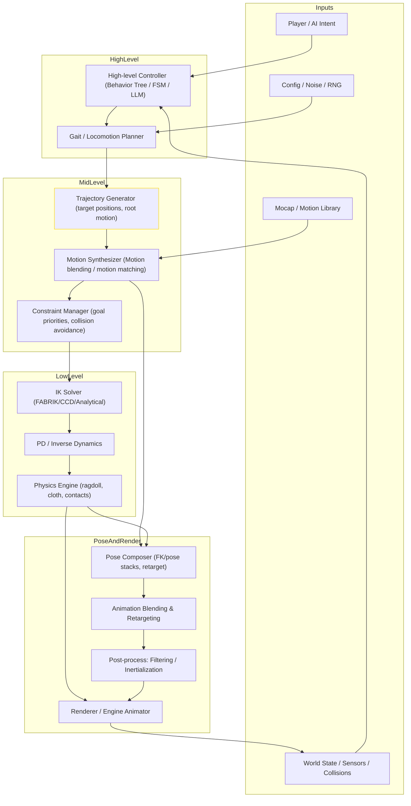

# Procedural Animation Pipeline — 系统级架构图

下面的文档包含：

1. 一张系统级流程图（Mermaid 格式），可在支持 Mermaid 的编辑器中渲染。\
    
2. 各模块职责说明、接口与数据结构要点、性能与调试建议、和引擎（Unity/Unreal/自研）集成要点。
    

---

## 系统级架构（Mermaid 流程图）

---

## 模块说明（按流程从上至下）

### 1. Inputs（输入层）

- **Player / AI Intent**：移动向量、动作指令、策略意图（可由 LLM/行为树输出）。
    
- **World State**：地形、动态障碍、碰撞检测、传感器数据。实时反馈到控制器。
    
- **Motion Library**：关键帧、mocap、动作片段、动作索引（供 motion matching / blending）。
    
- **Config / Noise**：可调参数、Perlin noise 生成器、随机种子用于自然化。
    

**接口要点**：统一帧级时间戳（timestamp/frameID），并在每帧以固定顺序消费这些输入。

### 2. High-level Controller（高层控制）

- 角色行为树 / 有限状态机 / LLM 指令解析。输出期望动作和高阶目标（例如：walk to X, pick up Y）。
    
- **职责**：决定 locomotion 模式、切换动画状态、触发特定动作。
    

**数据输出**：目标点、动作标签、优先级、时间窗。

### 3. Gait / Locomotion Planner（步态规划）

- 负责步伐周期、步频、落脚点初步规划。
    
- 可集成 RL 控制器或基于参数化曲线的 gait model。
    

**实现建议**：以 SRDF / footstep queue 形式输出离散落点。

### 4. Mid-level Motion Synthesizer（动作合成）

- Motion Matching / Blend Tree：找到或合成最合适的动作片段。
    
- Trajectory Generator：计算 root motion 与期望轨迹。
    
- Constraint Manager：将环境限制（如地面高度、障碍）加入目标约束集合。
    

**注意**：Motion Synth 应暴露可插拔策略（纯程序化、mocap-driven、AI-driven）。

### 5. Low-level Solvers（低层求解器）

- **IK Solver**：确保手、脚触点、头部指向等末端执行器满足目标。
    
- **PD / Inverse Dynamics Controller**：将角度/位置目标转成力矩或关节位置。用于和物理层协作。
    
- **Physics Sim**：处理碰撞响应、ragdoll、布料、物理约束解算。可作为最终姿态修正器。
    

**实时性**：控制器需保证稳定（抗震荡）与软限位（避免解发散）。

### 6. Pose Composer 与 Blending（姿态合成）

- FK/pose stacking：把 IK 结果、mocap pose、procedural offsets 逐层合成。
    
- 动画混合（Blend Tree），并用 Inertialization 平滑跨帧转变。
    
- Post-process：低通滤波、角速度限制、根运动校正。
    

**输出**：标准化骨骼变换数组（每骨骼的 position/rotation/scale），供引擎 animator 使用。

### 7. Animator Runtime / Renderer（运行时）

- 将骨骼数据送入渲染管线，驱动蒙皮、物理反馈与碰撞。
    
- 回写 WorldState（例如位移、碰撞体信息）供下一帧使用。
    

---

## 接口与数据结构建议

- **FramePacket**：{ frameID, timestamp, playerInput, worldStateSnapshot }
    
- **MotionQuery**：{ desiredVelocity, facingDir, actionTags, contextFeatures }
    
- **PoseBuffer**：Array of {boneName/id, positionVec3, rotationQuat, scaleVec3}
    
- **ConstraintSet**：List of priority-sorted constraints { effector, targetPos, weight, type }
    

接口应采用 lock-free 读/写或双缓冲（double-buffering）以保证渲染线程与动画线程低耦合。

---

## 性能、稳定性与测试要点

- **预算**：限定每帧运算预算（ms），低层物理与 IK 可采用迭代次数上限。
    
- **降级策略**：当帧预算不足时，优先保留根运动与关键 IK（手/脚），放弃次要抖动/噪声。
    
- **稳定性**：对 PD 控制器参数使用自动调谐与饱和策略；使用惯性化 (Inertialization) 减少抖动。
    
- **测试**：自动化覆盖各种地形、撞击场景、极端输入（瞬时 180° 转向、强碰撞）。
    

---

## 引擎集成要点（Unity / Unreal / 自研）

- **Unity**：实现为独立动画子系统（C# 或 DOTS），利用 Animator 的 Playable Graph 或 Job System 做并行计算；使用 IK 插件或自研 FABRIK。
    
- **Unreal**：实现为 AnimGraph + Native C++ 子系统，Motion Warping 与 Control Rig 可复用；Physics 子系统与 Chaos 结合。
    
- **自研**：核心模块分离为：HighLevel, MidLevel, LowLevel 三条进程/线程，采用 ECS 或 message-passing 保持低耦合。
    

---

## 调试与可视化建议

- 实时显示落脚点、IK 目标、constraint 权重、根轨迹。
    
- 可回放帧级日志（FramePacket），并可在编辑器中锁定帧单步调试。
    
- 引入离线记录（trace files）用于在不同机器/版本间复现问题。
    

---

## 进阶扩展（可选）

- **AI 模块**：将 LLM/Policy 输出作为高层策略，结合 RL 微调步态。\n- **Motion Diffusion**：用 diffusion 模型生成短期动作 priors，再用求解器修正以满足物理约束。\n- **多人同步**：网络带宽下只同步根运动和关键事件，局部动画由本地程序化生成。
    

---

如果需要，我可以把这张 Mermaid 图导出为 PNG、或把某一模块（例如：Low-level 控制器）扩展为详细类图与伪代码实现。