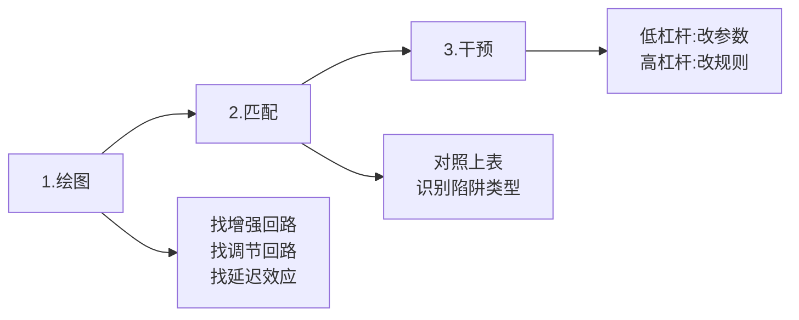

# 系统思考速查手册

## 🎯 核心公式

**线性思维** ❌ $A \rightarrow B$  
**系统思维** ✅ $A \rightleftarrows B$ (反馈回路)

**系统 = 要素(存量) + 连接(流量) + 目标(反馈)**

---

## 🔄 四大系统陷阱速查表

| 陷阱类型 | 你会看到 | 立即做这个 |
|:---------|:---------|:-----------|
| **增长极限** | 早期飞速增长→突然停滞 | ❌ 加更多力   ✅ **解开约束瓶颈** |
| **饮鸩止渴** | 问题反复出现且恶化 | ❌ 继续用"止疼药"   ✅ **切断依赖，攻根因** |
| **责任转移** | 依赖外援，自身能力退化 | ❌ 增加外部支持   ✅ **撤出拐杖，强制自愈** |
| **公地悲剧** | 各自最优→集体崩盘 | ❌ 道德说教   ✅ **建立约束机制** |

---

## ⚡ 三步解题法

### 详细步骤

**Step 1: 绘制因果回路图**
- 增强回路 🔄：什么在驱动雪球效应？
- 调节回路 🛑：什么在限制增长？
- 延迟效应 ⏱️：动作与结果的时差在哪？

**Step 2: 匹配原型**
- 对照"四大陷阱表"，找到你的困境模式

**Step 3: 施加干预**
- **低杠杆**：改参数（加钱/加人/加时间）← 通常无效
- **高杠杆**：改规则（改激励/改流程/改连接）← 四两拨千斤

---

## 💼 速用场景卡

### 组织管理
**症状**：部门互相甩锅  
**诊断**：责任转移陷阱  
**干预**：建立跨部门共享KPI

### 个人成长  
**症状**：努力但无突破  
**诊断**：增长极限陷阱  
**干预**：找到能力天花板并针对性训练（而非盲目努力）

### 社会问题
**症状**：环境污染加剧  
**诊断**：公地悲剧  
**干预**：碳税/排放配额等强制约束

---

## 🔑 记住这句话

> **不要推得更用力，要找到那个支点。**  
> 改变反馈回路 > 改变要素数量

---

## 📝 使用检查清单

遇到问题时问自己：
- [ ] 这是单次事件还是重复模式？
- [ ] 我看到的是症状还是根因？
- [ ] 系统中的延迟在哪里？
- [ ] 谁在承担短期利益？谁在承担长期成本？
- [ ] 我的解决方案是"止疼药"还是"手术"？