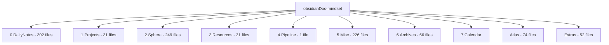

# 知识库架构评审报告
## Architecture Review: obsidianDoc-mindset

> [!NOTE]
> 本评审从《纽约客》专业知识管理的角度出发，强调**精简**和**高效**原则。评审聚焦于信息架构的可发现性、可维护性和认知负荷优化。

---

## 📊 当前架构概览

### 文件夹结构分析



### 核心技术栈
- **Obsidian** + Dataview Plugin (动态查询)
- **Python** 工具脚本 (`merge_md.py`)
- **FCPM 学习框架** (Factual, Conceptual, Procedural, Meta-cognitive)
- **MOC (Maps of Content)** 导航系统

---

## 🎯 核心问题诊断

### 1. **信息过载与碎片化** ⚠️

**症状:**
- `0.DailyNotes` 包含 **302 个文件** - 这是一个危险信号
- `2.Sphere/认知科学` 包含 **181 个文件** - 过度细分
- `5.Misc` 包含 **226 个文件** - "杂项"成为垃圾桶

**影响:**
- 认知负荷过高，违反 Miller's Law (7±2 原则)
- 信息检索成本上升，降低知识复用率
- 维护成本呈指数级增长

**纽约客视角:**
> 《纽约客》的编辑哲学是"每篇文章都必须值得读者的时间"。同样，知识库中的每个笔记都应该是**经过提炼的资产**，而非原始素材的堆积。

---

### 2. **导航系统复杂度过高** 🗺️

**当前导航层级:**
```
WARP.md (入口文档)
  ↓
Atlas/MOCs.md (总索引)
  ↓
Atlas/Index/*.md (多个 Dataview 查询文件)
  ↓
_Index_of_*.md (每个文件夹的索引)
  ↓
实际内容
```

**问题:**
- **4 层导航深度** - 超过认知心理学推荐的 3 层最大值
- 多个索引系统并存 (MOCs, _Index_of_*, Dataview queries)
- 缺乏统一的入口点 (`0.HomePage.md` 不存在)

**改进建议:**
采用**单一真实来源 (Single Source of Truth)** 原则，建立清晰的信息层级。

---

### 3. **自动化工具不足** 🤖

**当前状态:**
- 仅有 1 个 Python 脚本 (`merge_md.py`)
- 功能单一且存在 bug (硬编码路径 `"0. DailyNotes"` 与实际路径 `0.DailyNotes` 不匹配)
- 缺乏批量处理、归档、清理工具

**纽约客视角:**
> 专业编辑团队依赖强大的内容管理系统 (CMS) 和自动化工具。个人知识管理同样需要**工具链支持**，而非纯手工维护。

---

### 4. **内容生命周期管理缺失** ♻️

**观察:**
- `6.Archives` 仅 66 个文件 (vs `0.DailyNotes` 302 个)
- 缺乏明确的归档策略
- 没有内容老化/过期机制
- Dataview 查询显示关注"最近修改"，但缺少"长期未访问"的清理机制

**后果:**
- 活跃内容与过时内容混杂
- 搜索噪音增加
- 知识库"熵增"不可逆

---

## 💡 改进建议 (按优先级排序)

### 🔴 **高优先级 - 立即行动**

#### 1. 建立统一入口点和三层信息架构

**目标结构:**
```
📄 0.HomePage.md (唯一入口)
  ├─ 📊 核心指标 Dashboard (Dataview)
  ├─ 🎯 当前焦点 (Top 3 Projects)
  ├─ 🗺️ 主题导航 (5-7 个核心主题)
  └─ 🔍 快速检索 (Recent, Tags, Search)

📁 主题文件夹 (5-7 个)
  ├─ 每个主题一个 MOC
  └─ 相关笔记 (控制在 30-50 个/主题)

📁 系统文件夹
  ├─ .system/ (元数据、配置)
  ├─ .archive/ (自动归档)
  └─ .templates/ (模板)
```

**实施步骤:**
1. 创建 `0.HomePage.md` 作为唯一入口
2. 合并 `Atlas/MOCs.md` 和各种 `_Index_of_*.md` 到主题 MOCs
3. 删除冗余的导航文件

---

#### 2. DailyNotes 瘦身计划

**当前问题:** 302 个文件 = 信息墓地

**解决方案:**
```python
# 建议的自动化脚本功能
def daily_notes_lifecycle():
    """
    7 天内: 保留在 DailyNotes
    7-30 天: 提取精华 → 主题笔记
    30-90 天: 归档到 Archives
    90 天+: 删除或压缩
    """
```

**行动项:**
- [ ] 编写自动归档脚本 (基于文件修改时间)
- [ ] 每周执行 "DailyNotes Review" 流程
- [ ] 目标: 将 DailyNotes 控制在 **30 个文件以内**

---

#### 3. 重构文件夹结构

**当前问题:** 数字前缀 (0-7) 缺乏语义

**建议结构:**
```
📁 Active/          (替代 1.Projects + 4.Pipeline)
  ├─ current-focus.md
  └─ [具体项目文件夹]

📁 Knowledge/       (替代 2.Sphere)
  ├─ cognitive-science/
  ├─ learning-frameworks/
  └─ productivity/

📁 Resources/       (保留 3.Resources)
  ├─ templates/
  └─ references/

📁 Inbox/           (替代 0.DailyNotes)
  └─ [临时笔记，定期清理]

📁 Archive/         (替代 6.Archives)
  └─ [按年份组织]

📁 .system/         (替代 Atlas + Extras)
  ├─ navigation/
  ├─ automation/
  └─ config/
```

**优势:**
- ✅ 语义清晰，符合 PARA 方法论
- ✅ 减少认知负荷
- ✅ 更易于新用户理解

---

### 🟡 **中优先级 - 短期优化**

#### 4. 增强自动化工具链

**建议开发的脚本:**

```python
# 1. 智能归档工具
archive_old_notes.py
  - 基于最后修改时间
  - 基于访问频率 (需要 Obsidian 插件支持)
  - 生成归档报告

# 2. 笔记质量检查
note_quality_check.py
  - 检测孤立笔记 (无反向链接)
  - 检测空笔记或低质量笔记 (<100 字)
  - 检测重复内容

# 3. MOC 自动生成
auto_generate_moc.py
  - 基于标签自动聚合
  - 基于文件夹自动创建索引
  - 定期更新 Dataview 查询

# 4. 内容合并工具 (改进现有 merge_md.py)
smart_merge.py
  - 支持配置文件 (不要硬编码路径)
  - 支持去重
  - 支持按主题合并
```

---

#### 5. 优化 Dataview 查询

**当前问题:** `Dataviewer.md` 包含 **15+ 个查询**，缺乏组织

**改进方案:**
```markdown
# 0.HomePage.md

## 📊 核心指标 (每日查看)
- 总笔记数、标签数、任务完成率

## 🎯 今日焦点 (Top 5)
- 未完成任务 (按优先级)
- 最近修改笔记 (7 天内)

## ⚠️ 需要关注
- 孤立笔记 (无链接)
- 长期未访问 (90 天+)
- 低质量笔记 (待完善)
```

**原则:**
- 首页只保留 **3-5 个核心查询**
- 其他查询移到专门的 "Analytics Dashboard"
- 每个查询都应该**可操作** (actionable)

---

#### 6. 建立内容质量标准

**纽约客编辑标准改编:**

| 标准 | 要求 | 检查方法 |
|------|------|----------|
| **最小长度** | >200 字 (排除模板和索引) | 自动化脚本 |
| **链接密度** | 至少 2 个反向链接 | Obsidian Graph View |
| **标签规范** | 使用 3 层标签系统 | Dataview 查询 |
| **更新频率** | 核心笔记每季度 review | 元数据追踪 |
| **可操作性** | 包含 action items 或 key takeaways | 人工审核 |

---

### 🟢 **低优先级 - 长期优化**

#### 7. 引入版本控制最佳实践

**当前状态:** 使用 Git，但缺乏规范

**建议:**
- 使用 `.gitignore` 排除 `.obsidian/workspace` 等临时文件
- 建立 commit message 规范
- 定期备份到云端 (已有 OneDrive，良好)

---

#### 8. 考虑知识图谱可视化

**工具建议:**
- Obsidian Graph View (已有)
- Excalidraw (已部分使用)
- 考虑导出到 Roam Research 或 Logseq 进行对比

---

## 📋 行动清单 (Action Items)

### 第 1 周: 建立基础
- [ ] 创建 `0.HomePage.md` 作为唯一入口
- [ ] 审计 `0.DailyNotes`，归档 90 天以上的笔记
- [ ] 修复 `merge_md.py` 的路径 bug

### 第 2-3 周: 结构重组
- [ ] 重构文件夹结构 (数字前缀 → 语义化命名)
- [ ] 合并冗余的索引文件
- [ ] 优化 Dataview 查询，移到 HomePage

### 第 4 周: 自动化
- [ ] 开发 `archive_old_notes.py`
- [ ] 开发 `note_quality_check.py`
- [ ] 设置定期执行任务 (Windows Task Scheduler)

### 持续优化
- [ ] 每周执行 DailyNotes Review
- [ ] 每月执行 Archive Review
- [ ] 每季度执行全局架构审计

---

## 🎓 核心原则总结

### 纽约客知识管理哲学

1. **精简至上 (Essentialism)**
   - "少即是多" - 每个笔记都必须有价值
   - 定期清理，避免信息囤积

2. **可发现性 (Discoverability)**
   - 3 次点击原则: 任何内容不超过 3 次点击
   - 统一入口，清晰导航

3. **可维护性 (Maintainability)**
   - 自动化优先，减少手工操作
   - 标准化流程，降低认知负荷

4. **可操作性 (Actionability)**
   - 知识必须转化为行动
   - 每个 MOC 都应该有 "Next Steps"

5. **生命周期管理 (Lifecycle)**
   - 内容有生命周期: Inbox → Active → Archive → Delete
   - 定期审查，保持知识库"新鲜"

---

## 📚 参考资源

- **PARA Method** (Tiago Forte) - 信息组织框架
- **Zettelkasten Method** (Niklas Luhmann) - 原子化笔记
- **Building a Second Brain** - 知识管理系统
- **The New Yorker Style Guide** - 内容质量标准

---

## 🔍 附录: 技术债务清单

### 立即修复
1. `merge_md.py` 路径硬编码问题
2. 缺失的 `0.HomePage.md`
3. `_Index_of_*.md` 文件被 `.gitignore` 阻止访问

### 中期解决
1. Dataview 查询性能优化 (302 个文件可能导致卡顿)
2. 标签系统规范化 (当前标签使用不一致)
3. 模板系统整合 (Extras/Template 与 Copilot Prompts 重叠)

### 长期重构
1. 考虑迁移到 Logseq (更好的双向链接和查询)
2. 建立知识库 API (用于外部工具集成)
3. 开发自定义 Obsidian 插件 (针对 FCPM 框架)

---

**评审完成日期:** 2025-12-10  
**评审人:** Antigravity AI  
**下次评审建议:** 2025-03-10 (3 个月后)
