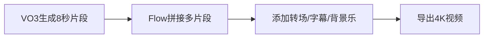

🌐 **《2024 谷歌AI十大重磅工具全景报告》—— 从图像克隆到全自动开发的生产力革命**

本报告系统梳理视频中谷歌发布的10大AI工具，深度解析其技术突破、应用场景、隐藏能力与商业潜力，并提供**可立即上手的操作指南+避坑建议+未来趋势预测**。所有工具均基于真实演示，适配个人创作者、中小企业、开发者三大群体。

---

## 🧭 一、工具全景速览（按颠覆性排序）

| 排名 | 工具名称          | 核心能力                     | 免费可用 | 关键突破点                  |
|------|-------------------|------------------------------|----------|-----------------------------|
| 1    | **Nano Banana**   | 精准人脸克隆+场景迁移         | ✅        | 发丝级细节保留，零伪影      |
| 2    | **Gemini Live**   | 实时视觉问答（手机摄像头）    | ✅        | 物体识别+上下文记忆         |
| 3    | **VO3**           | 好莱坞级8秒短视频生成         | ❌（付费）| 电影级光影/物理模拟         |
| 4    | **Google Flow**   | AI视频剪辑+多片段拼接         | ✅        | 类Premiere Pro的AI工作流    |
| 5    | **AI Mode (Search)** | 对话式搜索+跨轮次记忆       | ✅        | 取代传统链接搜索            |
| 6    | **Gemini 2.5 Flash** | 多模态分析（图/文/表）      | ✅        | 落地页优化+票据结构化       |
| 7    | **Project Mariner** | 跨平台AI代理（日历+订房+求职）| ❌（Ultra）| 自动执行复杂任务链          |
| 8    | **Notebook LM**   | 私有知识库问答               | ✅        | 仅基于上传文档回答          |
| 9    | **Stitch**        | 自然语言→UI设计稿            | ✅        | 一键生成Figma可编辑原型     |
| 10   | **Vibe Coding**   | 语音/文本→全栈应用部署       | ✅        | 20分钟构建SEO分析工具       |

---

## 🛠️ 二、六大必用工具深度操作指南（附Prompt模板）

### 🔥 1. Nano Banana —— 零成本打造“数字分身”
**适用场景**：社交媒体内容、虚拟试衣、广告素材  
**操作步骤**：
1. 访问 [Google AI Studio](https://aistudio.google.com/)
2. 上传清晰正脸照（建议纯色背景）
3. 输入Prompt：  
   > “将我的脸精准克隆到[场景描述]，保持发型/五官100%一致，背景虚化处理，风格为[写实/插画/电影感]”  
   *示例： “克隆到巴黎咖啡馆，手持咖啡杯，背景埃菲尔铁塔虚化，写实风格”*
4. 下载生成图 → 用[Remove.bg](https://www.remove.bg/) 二次抠图优化边缘

**⚠️ 避坑**：避免戴眼镜/帽子，强光下拍摄易失真

---

### 📱 2. Gemini Live —— 你的随身AI视觉顾问
**适用场景**：商品识别、学习辅助、旅行导航  
**操作步骤**：
1. 手机安装Gemini App → 点击右下角“镜头”图标
2. 对准物体/文字/场景 → 语音提问：  
   > “这是什么车型？生产年份？当前市场价？”  
   > “翻译这个菜单/路牌/说明书”  
   > “推荐附近评分>4.5的素食餐厅”
3. 追问技巧：不重复主语（AI自动关联上下文）

**💡 隐藏功能**：长按屏幕框选局部区域精准提问

---

### 🎬 3. VO3 + Flow —— 个人好莱坞工作室
**适用场景**：短视频营销、产品演示、教育内容  
**操作链**：

**Prompt模板**：  
> “生成[风格]视频：[主体]在[场景]中[动作]，镜头[运镜方式]，色调[色彩倾向]，8秒”  
*示例： “赛博朋克风格：机械猫在雨夜霓虹街道行走，手持稳定器跟拍，青橙色调”*

**⚠️ 限制**：单片段≤8秒，复杂场景需分镜生成

---

### 🔍 4. AI Mode搜索 —— 终结“链接地狱”
**适用场景**：旅行规划、学术研究、本地服务  
**神级Prompt组合**：
```text
第一问： “纽约今夏平均气温？推荐3个避暑活动”
第二问： “其中哪个活动适合带5岁孩子？” （无需重复“纽约”）
第三问： “预订明天下午的儿童票，预算<$50”
```
**💡 数据联动**：答案自动嵌入Google Maps/酒店比价/购票链接

---

### 📊 5. Gemini 2.5 Flash —— 商业智能分析师
**三类神操作**：
1. **转化率优化**：  
   上传落地页截图 → Prompt：  
   > “分析此页转化漏斗，指出3个致命缺陷，提供具体修改方案（含配色/文案/布局建议）”

2. **票据自动化**：  
   上传收据照片 → Prompt：  
   > “提取所有商品行项目，按[品名,单价,数量,总价]生成CSV，忽略促销信息”

3. **竞品监控**：  
   上传对手官网截图 → Prompt：  
   > “对比我方产品页，列出5个视觉/文案/功能优势点”

---

### ⚙️ 6. Vibe Coding —— 人人都是全栈工程师
**20分钟构建SEO工具实战**：
1. 在AI Studio输入：  
   > “用Firebase构建SEO分析工具：前端输入URL，后端调用Node.js爬取数据，分析字数/外链/图片优化度，结果存Firestore并在前端可视化”
2. 自动生成代码 → 下载ZIP包
3. 一键部署到Firebase Hosting
4. 自定义扩展：  
   > “增加PDF报告导出功能，使用Chart.js生成图表”

**💡 核心价值**：省去80%基础代码，专注业务逻辑

---

## 🚀 三、企业级应用蓝图

### 🤖 Project Mariner —— 自动化员工
**任务链示例**：
```python
# 伪代码逻辑
if user_request == "订蜜月酒店":
    check_calendar("空闲日期")
    search_expedia("马尔代夫+私人泳池+全包")
    book_room(selected_hotel)
    send_confirmation_email()
    add_to_google_calendar()
```
**当前限制**：需Google Ultra订阅（$19.99/月），仅支持英文

---

### 📚 Notebook LM —— 企业知识大脑
**部署方案**：
1. 上传：产品手册/客服话术/培训PPT
2. 设置问答规则：  
   > “仅基于2024版《客户服务规范》回答，拒绝推测”
3. 嵌入企业微信/Slack：  
   `/notebook 退款流程第3步是什么？`

**安全优势**：数据不出私有库，杜绝信息泄露

---

## 💡 四、被忽视的三大趋势

1. **多模态融合**：  
   Nano Banana（图）+ VO3（视频）+ Gemini Live（实时视觉） → **全感官AI交互时代**

2. **工具链闭环**：  
   Stitch（设计）→ Vibe Coding（开发）→ Firebase（部署）→ Flow（运营） → **零代码产品流水线**

3. **记忆革命**：  
   AI Mode的跨轮次记忆 → **终结“重复解释”痛点，逼近人类对话体验**

---

## 📅 五、个人/企业行动路线图

### 👤 个人创作者：
- **每日**：用Nano Banana生成3张场景图 → 发Instagram/小红书
- **每周**：用VO3+Flow制作1条8秒短视频 → 投TikTok/YouTube Shorts
- **每月**：用Vibe Coding搭建1个自动化工具（如：自动整理读书笔记）

### 🏢 中小企业：
- **Q3**：部署Notebook LM管理产品知识库
- **Q4**：用Stitch重设计官网UI，Vibe Coding添加预约功能
- **2025**：采购Project Mariner处理客服/订房等重复任务

---

## ⚠️ 六、风险与伦理警示

1. **深度伪造**：Nano Banana需添加“AI生成”水印（法律强制趋势）
2. **数据隐私**：Gemini Live避免拍摄他人/敏感文件
3. **版权陷阱**：VO3生成内容商用前需确认素材授权

> “谷歌正用AI重构数字世界的基础工具——从创作到开发，从搜索到执行。这不是升级，而是范式转移。掌握这些工具者，将获得10倍效率杠杆。”

---

**立即行动清单**：
1. [ ] 注册Google AI Studio → 试用Nano Banana
2. [ ] 手机安装Gemini → 体验Live视觉问答
3. [ ] 用AI Mode搜索规划下次旅行
4. [ ] 在Notebook LM上传1份工作文档测试问答

所有工具链接及Prompt模板库 → **[谷歌AI工具包官网](https://ai.google/)**

未来已来，只是分布不均——现在，它在你手中。 🚀