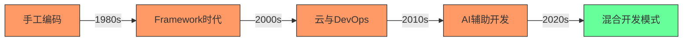
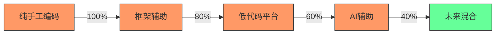
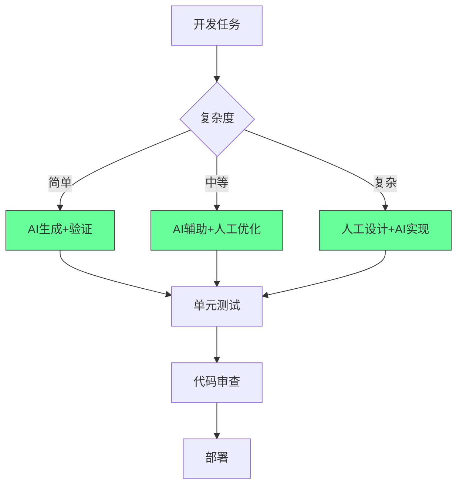
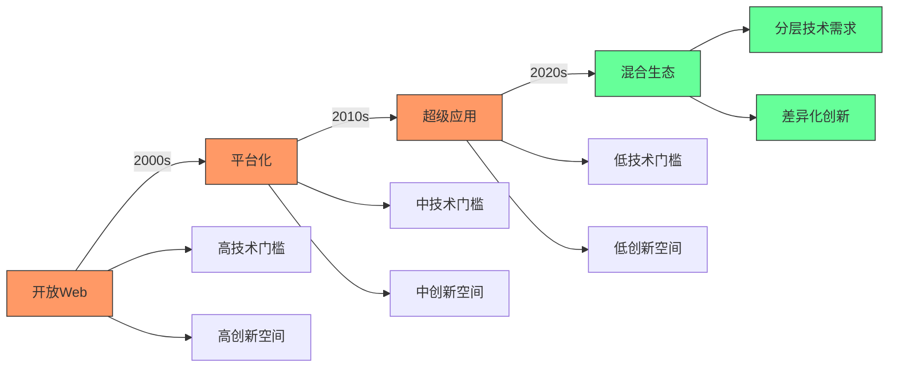
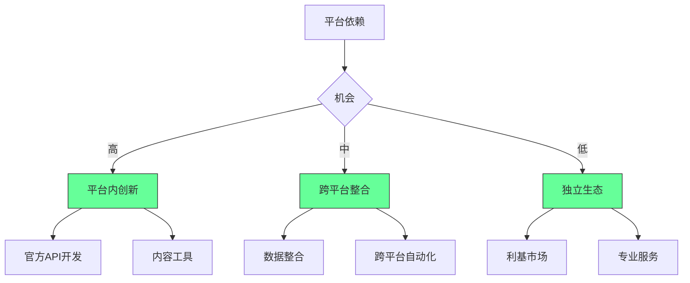
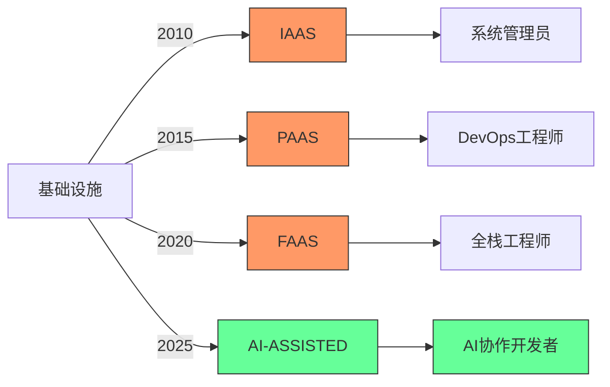
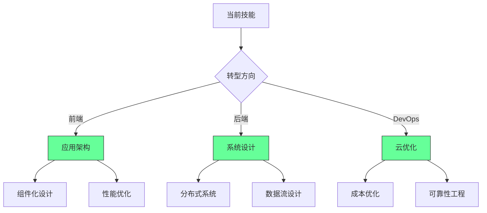

## 📊 三、开发者生存能力评估表

| 能力        | 评分 (1-5) | 提升方案                 |
| --------- | -------- | -------------------- |
| **AI 协作** | ⭐⭐⭐⭐☆    | 每天用 Copilot 写 50 行代码 |
| **云原生**   | ⭐⭐⭐☆☆    | 通过 AWS/Azure 认证      |
| **数据工程**  | ⭐⭐☆☆☆    | 学习 dbt + Snowflake   |
| **安全合规**  | ⭐⭐⭐☆☆    | 实践 OWASP Top 10      |
| **业务理解**  | ⭐⭐⭐⭐☆    | 参与产品会议，理解 ROI        |

> ✅ **目标**：6 个月内所有能力 ≥ 4 星

---


#### ✅ 职业演变轨迹 [High]

[High] 证据：编程职业并未消失，而是演变 - 全球开发者数量从2010年的1800万增长至2024年的2870万（SlashData开发者报告）

#### ✅ 未来开发者能力矩阵
| 能力 | 当前重要性 | 未来5年趋势 | 影响程度 |
|------|-----------|------------|---------|
| **基础编码** | 高 | ↓↓ | 中 |
| **系统设计** | 中 | ↑↑ | 高 |
| **领域知识** | 低 | ↑↑↑ | 极高 |
| **AI协作** | 低 | ↑↑↑ | 高 |
| **产品思维** | 中 | ↑↑ | 中 |
| **沟通协作** | 中 | ↑ | 低 |


### 4. 无代码/低代码与AI：效率工具而非替代品 [High]

**开发效率演进**：

[High] 证据：AI工具使编码效率提高55%，但复杂系统设计需求增长41%（GitHub Copilot影响研究）

#### ✅ AI协作开发最佳实践


**AI协作框架**：
```markdown
## AI开发协作协议

### 1. 任务分类
- [ ] 简单：重复性代码、基础CRUD
- [ ] 中等：业务逻辑、集成点
- [ ] 复杂：系统设计、核心算法

### 2. AI使用规范
- [ ] 简单任务：AI生成 → 人工验证 → 测试
- [ ] 中等任务：AI建议 → 人工优化 → 评审
- [ ] 复杂任务：人工设计 → AI实现 → 深度测试

### 3. 质量保障
- [ ] 所有AI生成代码必须有测试覆盖
- [ ] 关键路径必须人工审核
- [ ] 文档必须人工完善
- [ ] 安全敏感代码禁用AI
```


### 5. 社交媒体整合：新机会而非终结 [Medium]

**内容生态演变**：



#### ✅ 独立开发者的生存策略



### 6. 云平台简化：角色演变而非消失 [High]

**云技术栈演变**：

[High] 证据：云平台简化导致角色演变，但云相关岗位增长210%（2024年云就业报告）

#### ✅ 云时代开发者转型路径

