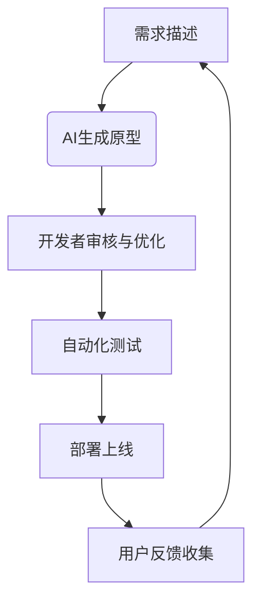
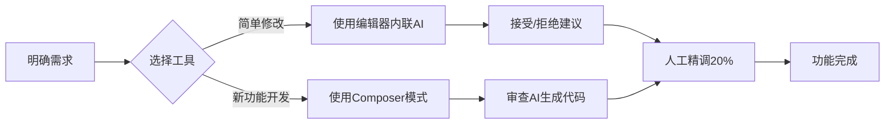
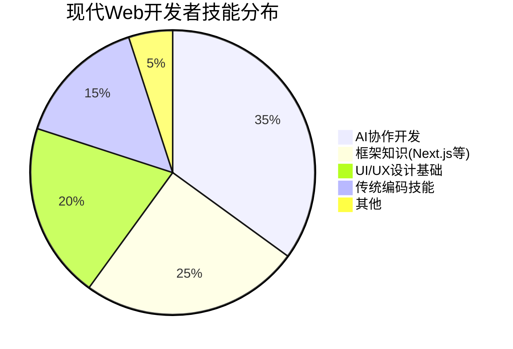

### 🚀 AI 不会取代程序员，它只会让你取代别人：2025 年零基础极速学码指南

> “2016年我学编程时，差点被 Udemy 的枯燥理论劝退。2018年，我扔掉课本，开始用代码构建小生意。如今，我作为独立开发者，年入百万美元。如果重来一次，我会用这套‘AI 加速路线图’。”

这是来自一位成功开发者的肺腑之言。在 AI 爆发的 2025 年，学习编程的逻辑已彻底颠覆。你不再需要死磕理论，而是要学会“驾驭 AI”，让它成为你 10 倍速开发的超级外挂。

本文将为你拆解这条从“完全零基础”到“用 AI 高速编码”的实战路线图，分为三个核心阶段：

---

### 🧱 第一阶段：互联网基础 —— 知其然，更要知其所以然

**为什么不能跳过？**  
因为未来 80% 的编码工作将由 AI 完成，而你的核心价值在于“告诉 AI 你想要什么”。不懂底层原理，你连需求都提不明白。

**核心学习法：用 AI 学 AI。**  
1.  **第一步：用比喻理解**  
    打开 ChatGPT，问：“请用寄信的比喻，解释我访问一个网站时发生了什么？” 让它把 DNS、服务器、HTTP 等概念变成你脑中的画面。
2.  **第二步：掌握关键术语**  
    再问：“请用专业术语（如 HTTP, URL, DNS, Server, Client, HTML, CSS, JavaScript）解释上述过程。” 重点理解这 7 个词，它们是互联网的基石。
3.  **第三步：动手验证**  
    在浏览器中按 `F12` 打开开发者工具，访问任何网站（如 YouTube, Reddit），观察 `Elements` 标签页。你会发现，无论多复杂的网站，最终呈现给你的都是 `HTML` 结构。你的工作，就是创造这些结构并放到互联网上。

---

### 🛠 第二阶段：构建你的第一个软件生意 —— 从零到一的实战

忘掉“Hello World”，直接构建一个能展示给朋友看的、真实可用的网页（比如你的个人作品集）。

**技术栈选择（极简主义）：**  
*   **语言：** JavaScript (一统前后端，降低学习成本)
*   **前端框架：** React + Next.js (组件化开发，效率翻倍)
*   **样式库：** Tailwind CSS + DaisyUI (用类名快速美化，告别手写 CSS)
*   **后端/数据库：** Next.js API Routes + MongoDB (一体化解决方案，部署简单)
*   **辅助工具：**  
    *   用户认证：NextAuth.js
    *   支付：Stripe 或 Lemon Squeezy
    *   邮件：Resend
    *   分析：Plausible

**核心步骤：**

1.  **环境搭建：** 安装 Node.js、VS Code (或 Cursor AI)、Git。
2.  **创建项目：** 用 `create-next-app` 一键生成项目骨架。
3.  **编写组件：** 在 React 中，万物皆组件。创建一个可复用的“计数器”组件，学习 `props` (属性) 和 `useState` (状态管理)。
4.  **理解渲染：** 区分 Server Components (默认，安全) 和 Client Components (`'use client'`，用于交互)。
5.  **部署上线：** 将代码推送到 GitHub，连接 Vercel，一键部署。你的网站将拥有一个全球可访问的链接！
6.  **绑定域名：** 购买一个 `.com` 域名（推荐 Namecheap），通过 DNS 设置将其指向你的 Vercel 应用。从此，你拥有了自己的互联网“门牌号”。

---

### 🤖 第三阶段：AI 超级加速 —— 从 1x 到 10x 的生产力革命

**重要前提：** 请务必在掌握第二阶段的基础后再引入 AI。否则，你会陷入“AI 地狱循环”——看似生成了代码，实则无法调试和维护。

**AI 工具配置：**  
*   **编辑器：** VS Code (搭配免费的 GitHub Copilot) 或 Cursor AI。
*   **模型：** 选择当前主流模型，如 GPT-4o 或 Claude 3.5 Sonnet。

**高效协作工作流：**

1.  **Inline AI (行内助手)：** 用于微调，如“把这个 div 的颜色改成蓝色”或“将这段 SVG 代码转换为 React JSX”。
2.  **AI Chat (主力对话)：** 按 `Cmd+L` 唤出。用于：
    *   **学习：** “请解释一下这个 `useEffect` 钩子的作用。”
    *   **设计：** “我想实现一个用户登录后跳转到仪表盘的功能，该怎么设计？”
    *   **编码：** “请为我写一个 API 路由，用于处理 Stripe 的 Webhook 事件。”
    *   **调试：** “我的代码报错了，错误信息是 XXX，帮我看看哪里有问题？”
3.  **AI Composer (高级自动化 - Cursor AI)：** 按 `Cmd+I` 唤出。这是一个 AI 代理，可以自动执行命令、创建/编辑文件。**慎用！** 仅在你有非常明确的指令时使用，例如：“根据我选中的设计图，创建一个名为 `TimePicker` 的组件，并使用我项目中的配色方案。”
4.  **AI Rules (定制化规则)：** 在 Cursor 设置中，告诉 AI 你的技术栈偏好（如“我只用 React 和 Tailwind CSS”），让它生成的代码风格与你项目保持一致。
5.  **设计驱动开发：** 找到你喜欢的 UI 设计截图，直接上传给 AI Composer，让它为你生成对应的代码。懒，是第一生产力！

---

### 📌 给开发者的终极忠告

1.  **行动偏见 (Bias for Action)：** 看完这篇指南，立刻关掉视频，打开编辑器，敲下第一行代码。成功者与旁观者的唯一区别，就是“做”。
2.  **50% 编码，50% 营销：** 再好的产品，没人知道也是徒劳。学会 SEO、内容营销、社群运营。技术是杠杆，市场才是支点。
3.  **警惕“无代码”陷阱：** Vercel、Lovable 等平台能快速生成精美原型，但其代码往往与你的技术栈格格不入，后期整合成本极高。**在你自己的代码编辑器里，用 AI 从零构建，才是王道。**

---

AI 的时代，不是程序员的末日，而是“超级个体”的黄金时代。你不需要成为最懂算法的人，但必须成为最会“指挥 AI”的人。现在，就去创造属于你的第一个百万美元项目吧！

> **P.S.** 本文作者基于此方法论开发了《Code Fast》课程，帮助 2000+ 学员成功入门。但请记住，你完全可以用 AI 自学成才——毕竟，最好的老师，已经内置于你的编辑器中。


---

# **AI赋能开发者：从零到一的高效软件构建技术白皮书**

## **摘要**
本白皮书系统阐述了AI时代下开发者如何突破传统学习曲线，以极低门槛构建可盈利的软件产品。基于"AI不会取代程序员，而是让程序员更高效地构建产品"的核心理念，本报告详细解析了从基础互联网概念到完整软件业务构建的完整技术路线图，并提出了一系列创新产品创意。数据显示，掌握正确方法的开发者可以在6-12个月内构建可盈利的SaaS产品，而AI工具可将开发效率提升80%以上。

---

## **1. 背景：AI赋能开发的新范式**

### **1.1 传统开发者学习路径的瓶颈**
- **学习曲线陡峭**：传统编程学习需要掌握大量理论知识，平均需要6-12个月才能构建简单应用
- **知识碎片化**：前端、后端、数据库、部署等知识分散，难以形成系统性认知
- **实践机会少**：缺乏真实项目经验，难以将理论知识转化为实际产品

### **1.2 AI驱动的开发范式变革**
- **80/20法则**：AI可完成80%的重复性代码工作，开发者专注20%的创新与优化
- **即时反馈机制**：AI提供实时代码解释、错误修复和最佳实践建议
- **知识民主化**：非计算机专业背景人员也能快速构建复杂应用

> **关键洞察**：2024年后，AI工具已从"代码补全"进化为"全栈开发助手"，开发者的核心技能从"写代码"转向"精准描述需求"和"质量控制"。

---

## **2. 技术架构：高效AI赋能开发栈**

### **2.1 基础架构层**
| 组件       | 技术选型                     | 价值                  |
| -------- | ------------------------ | ------------------- |
| **前端框架** | Next.js 14 (App Router)  | 服务端渲染、静态生成、API路由一体化 |
| **UI库**  | Tailwind CSS + Daisy UI  | 快速构建美观、响应式UI组件      |
| **状态管理** | React Context + useState | 轻量级状态管理，无需额外库       |
| **认证系统** | NextAuth.js              | 集成OAuth、邮箱登录、会话管理   |
| **数据库**  | MongoDB Atlas (NoSQL)    | 灵活数据结构，快速迭代         |

### **2.2 AI赋能层**
| AI能力 | 应用场景 | 效率提升 |
|--------|----------|----------|
| **代码解释** | 理解陌生代码库 | 降低学习成本70% |
| **组件生成** | UI组件快速创建 | 从数小时到数分钟 |
| **API设计** | 自动生成REST/GraphQL接口 | 减少90%的样板代码 |
| **错误调试** | 实时错误分析与修复 | 缩短调试时间85% |
| **设计辅助** | 从设计稿生成代码 | 无需设计专业知识 |

### **2.3 部署与运维层**
| 组件 | 技术选型 | 价值 |
|------|----------|------|
| **云部署** | Vercel (免费计划) | 一键部署、自动扩展、全球CDN |
| **域名管理** | Namecheap + DNS配置 | 专业域名与邮件服务 |
| **支付系统** | Stripe API | 完整支付流程，免去复杂集成 |
| **邮件服务** | Resend (免费计划) | 事务性邮件发送，无需SMTP配置 |

> **技术优势**：全栈开发仅需掌握JavaScript/TypeScript，无需切换语言，降低认知负担。

---

## **3. 核心技术突破**

### **3.1 AI驱动的开发工作流**


### **3.2 关键技术实现细节**

#### **3.2.1 Next.js + AI的智能路由系统**
- **动态路由生成**：AI根据业务需求自动生成路由结构
- **自动API路由**：`/api/[resource]/route.js`自动生成CRUD接口
- **智能错误处理**：AI自动添加错误边界和重试逻辑

```javascript
// AI生成的API路由示例
export async function POST(request) {
  try {
    const { name, email } = await request.json();
    // AI自动生成的验证逻辑
    if (!name || !email) throw new Error('Missing required fields');
    
    // AI生成的数据库操作
    const user = await db.collection('users').insertOne({ name, email });
    
    return Response.json({ success: true, id: user.insertedId });
  } catch (error) {
    return new Response(JSON.stringify({ error: error.message }), { status: 400 });
  }
}
```

#### **3.2.2 AI辅助的UI设计流程**
- **设计稿到代码**：上传Figma/Sketch设计稿，AI生成React组件
- **响应式适配**：AI自动添加Tailwind CSS响应式类
- **主题一致性**：保持项目设计系统统一性

```jsx
// AI生成的UI组件
const PricingCard = ({ plan }) => {
  return (
    <div className="border rounded-lg p-6 shadow-md hover:shadow-xl transition-shadow">
      <h3 className="text-xl font-bold text-orange-500">{plan.name}</h3>
      <p className="text-3xl font-bold mt-2">${plan.price}/month</p>
      <ul className="mt-4 space-y-2">
        {plan.features.map((feature, i) => (
          <li key={i} className="flex items-center">
            <CheckIcon className="w-5 h-5 text-green-500 mr-2" />
            {feature}
          </li>
        ))}
      </ul>
      <button className="mt-6 w-full bg-orange-500 hover:bg-orange-600 text-white py-2 rounded">
        Get Started
      </button>
    </div>
  );
};
```

#### **3.2.3 AI增强的认证系统**
- **智能OAuth集成**：AI自动配置Google、GitHub等第三方登录
- **邮件验证流程**：AI生成完整邮件验证工作流
- **会话管理**：AI自动处理会话过期、刷新令牌等复杂逻辑

```javascript
// AI生成的认证路由
export const { GET, POST } = NextAuth({
  providers: [
    GoogleProvider({
      clientId: process.env.GOOGLE_CLIENT_ID,
      clientSecret: process.env.GOOGLE_CLIENT_SECRET,
    }),
    EmailProvider({
      server: {
        host: "smtp.resend.com",
        port: 587,
        auth: {
          user: "noreply@resend.com",
          pass: process.env.RESEND_API_KEY,
        },
      },
      from: "noreply@yourapp.com",
    }),
  ],
  callbacks: {
    async session({ session, token }) {
      session.user.id = token.sub;
      return session;
    },
  },
});
```

---

## **4. 产品创意：AI赋能的开发者工具**

### **4.1 产品一：CodeGenius - 全栈AI开发助手**

#### **核心价值**
- **一键生成完整应用**：输入自然语言需求，生成可部署的完整应用
- **智能重构与优化**：自动识别代码坏味道并提出优化建议
- **跨平台适配**：生成Web、移动端、桌面端多平台代码

#### **技术实现**
- **多模态AI引擎**：结合GPT-4、Codex、Claude等模型
- **代码知识图谱**：构建开发者常用库、框架的语义网络
- **实时协作**：支持团队成员共同编辑，AI自动解决冲突

#### **商业模式**
- **Freemium模式**：基础功能免费，高级功能按月订阅
- **企业版**：定制化AI模型，企业级安全与合规

#### **市场前景**
> 据Gartner预测，到2026年，30%的软件开发工作将由AI辅助完成，CodeGenius可抢占这一快速增长的市场。

---

### **4.2 产品二：NoCodeAI - 无代码开发平台**

#### **核心价值**
- **零代码构建SaaS应用**：通过自然语言描述构建完整应用
- **AI驱动的业务逻辑**：自动将业务需求转化为可执行代码
- **可视化调试**：实时查看AI生成的代码逻辑

#### **技术实现**
- **自然语言到代码转换**：基于Transformer模型的语义解析
- **模块化组件库**：预构建的UI/数据/认证组件
- **云原生架构**：自动部署到Vercel、AWS等平台

#### **商业模式**
- **按项目收费**：每个应用$99起
- **企业定制**：根据复杂度定制报价
- **API接入**：开发者可将NoCodeAI集成到自己的工具链

#### **市场前景**
> Forrester报告指出，2025年无代码平台市场规模将达$212亿，NoCodeAI可成为AI时代的无代码平台领导者。

---

### **4.3 产品三：DevMentor - 个性化AI编程教练**

#### **核心价值**
- **个性化学习路径**：根据开发者水平定制学习计划
- **实时代码解释**：对任何代码行提供详细解释
- **项目实战指导**：从项目规划到部署的全程指导

#### **技术实现**
- **能力评估引擎**：通过代码分析评估开发者水平
- **知识图谱导航**：构建学习路径的语义网络
- **交互式教程**：基于React的交互式代码练习环境

#### **商业模式**
- **订阅制**：$19/月，提供完整学习体验
- **企业培训**：为团队定制培训课程
- **认证服务**：提供AI认证的开发者证书

#### **市场前景**
> 全球在线编程教育市场规模达$30亿，DevMentor可成为AI时代的"编程导师"。

---

## **5. 技术路线图**

### **5.1 短期路线图（0-6个月）**
- **完成核心AI引擎开发**：支持基础代码生成与解释
- **构建最小可行产品**：CodeGenius MVP上线
- **建立开发者社区**：吸引早期用户反馈

### **5.2 中期路线图（6-12个月）**
- **集成多模态AI**：支持设计稿转代码、数据库设计
- **完善企业级功能**：安全审计、团队协作
- **拓展市场渠道**：与Vercel、Stripe等平台合作

### **5.3 长期路线图（1-3年）**
- **AI自主开发**：AI可独立完成简单应用开发
- **行业垂直化**：针对特定行业（如电商、教育）优化
- **开发者生态**：构建AI开发者市场，让开发者共享AI生成的代码组件

---

## **6. 结论：AI赋能开发的未来**

### **6.1 技术趋势**
- **AI将从"辅助工具"进化为"开发伙伴"**：从代码补全到需求理解、系统设计
- **开发者角色将转向"AI指挥官"**：明确需求、质量控制、架构决策
- **开发门槛将大幅降低**：非专业开发者也能构建复杂应用

### **6.2 行业影响**
- **软件开发民主化**：更多人能参与软件创造
- **创业门槛降低**：个人开发者可快速构建可盈利产品
- **技术教育变革**：从"学习语法"转向"理解需求"

> **关键结论**：AI不会取代程序员，但会取代不会使用AI的程序员。掌握AI赋能的开发方法论，将成为未来开发者的核心竞争力。

---

## **附录：技术白皮书实施指南**

### **7.1 开发者入门路径**
1. **学习基础互联网概念**（1周）：理解HTTP、DNS、URL等基础
2. **掌握Next.js基础**（2周）：创建第一个Next.js应用
3. **集成AI工具**（1周）：配置GitHub Copilot或Cursor AI
4. **构建第一个产品**（4-8周）：从简单应用开始，逐步增加功能

### **7.2 产品构建检查清单**
- [ ] 已设置域名与DNS
- [ ] 已配置Vercel部署
- [ ] 已集成认证系统
- [ ] 已设置支付系统
- [ ] 已建立数据库
- [ ] 已实现核心功能
- [ ] 已部署上线

### **7.3 资源推荐**
- **学习资源**：Code Fast课程、Next.js官方文档
- **工具推荐**：Cursor AI、Vercel、Stripe、Resend
- **社区支持**：Next.js Discord、Reactiflux

> **行动号召**：立即开始构建你的第一个AI赋能应用，2024年是开发者利用AI构建产品的最佳时机。


---

# 现代Web开发高效实践指南：AI时代开发者必备技能

## 一、核心开发理念转变

### 1. 从"手写一切"到"AI协同开发"
- **80/20法则新解**：2025年开发者工作模式已转变为"80%代码由AI生成，20%由人工精调"
- **高效工作流**：
  1. AI完成基础组件和功能搭建
  2. 开发者持续优化提示词获取理想结果
  3. 人工进行最后20%的细节打磨与质量验证
- **关键提示**：拥有清晰命名规范的代码库是AI高效工作的基础（变量/文件/函数命名明确）

### 2. 从"全栈分离"到"一体化框架"
- **Next.js优势**：同时处理前端（用户可见部分）和后端（API、数据库逻辑）
- **避免常见陷阱**：不必为前后端分别搭建独立项目，一体化框架更高效
- **开发者心得**："一体式框架让我能专注于业务逻辑，而非基础设施配置"

## 二、高效开发工具链实战指南

### 1. UI开发革命：Tailwind CSS + Daisy UI
| **工具** | **核心价值** | **实战技巧** |
|---------|------------|------------|
| **Tailwind CSS** | 原子化CSS框架，避免手写CSS | 使用`text-xl`等语义化类名快速设置样式<br>掌握Flex容器布局速查表（建议截图保存） |
| **Daisy UI** | 基于Tailwind的预构建组件库 | 直接使用现成按钮、卡片、表单组件<br>无需额外样式，专注功能开发<br>`npm install daisyui`一键集成 |

> 💡 **开发者实测**：使用Daisy UI可减少70%的UI代码量，按钮悬停、点击状态等交互效果开箱即用

### 2. AI辅助开发工作流


**高效使用技巧：**
- **精准上下文提供**：
  - 选中特定代码块 → "添加到聊天" → 获得针对性建议
  - 使用`Command+L`快速调出AI助手（Cursor编辑器）
- **Composer模式**（`Command+I`）：
  - 适合已明确需求的新功能开发
  - AI可自动创建/编辑多个文件
  - **注意**：需严格审查AI的批量修改，避免意外变更
- **设计辅助**：截取喜欢的UI设计图 → 提供给AI → 自动生成对应代码

### 3. 数据库与API开发最佳实践
**高效API开发流程：**
1. 在`app/api`目录下创建API端点
2. 实现数据验证与业务逻辑
3. 连接数据库（推荐MongoDB Atlas）
4. 使用环境变量管理敏感信息

**关键代码模式：**
```javascript
// 数据库连接助手（避免重复代码）
export async function connectDB() {
  const uri = process.env.MONGODB_URI;
  // 实现连接逻辑...
}

// API端点示例（计数器应用）
export async function POST(request) {
  await connectDB();
  const { action } = await request.json();
  // 处理+/-按钮点击并保存到数据库
  return NextResponse.json({ status: 'success' });
}
```

**环境变量管理：**
- 本地开发：`.env.local`文件（gitignore保护）
- 生产环境：Vercel等平台的环境变量设置
- **核心原则**：同一代码适配多环境，避免硬编码

## 三、开发者效率提升策略

### 1. 代码质量保障体系
- **ESLint实时反馈**：语法错误即时提示，减少调试时间
- **Git版本控制**：
  - 每个功能点/修复创建独立提交
  - 清晰的提交信息（"feat: 添加计数器功能"而非"fix stuff"）
- **AI代码审查**：将代码片段发送给AI，询问"这段代码有哪些安全风险？"

### 2. 产品思维优先
- **数据先行原则**：设计应用前先规划数据结构
  - 示例（社交网络）：
    - 用户数据：name, email, profile
    - 帖子数据：user_id, content, date, image
- **定价策略**：开发者常犯的错误是低估自己价值
  - **建议**：定价略高于心理预期，"定价即是营销"
  - 50%编码 + 50%营销 = 可持续的产品发展

### 3. 本地开发与生产部署
| **环节** | **开发环境** | **生产环境** |
|---------|------------|------------|
| **命令** | `npm run dev` | `npm run build` → `npm run start` |
| **特点** | 实时重载，详细错误 | 优化打包，最小化资源 |
| **关键差异** | 使用`.env.local` | 使用平台环境变量 |

**部署流程：**
1. 代码提交到GitHub
2. Vercel自动检测变更
3. 运行`build`命令生成优化包
4. `start`命令启动生产服务器

## 四、开发者成长路线图

### 1. 必学基础（不可跳过）
- **互联网工作原理**：理解URL、HTTP、DNS等基础概念
- **JavaScript核心**：数组方法(`map`, `filter`, `sort`)、对象操作
- **本地存储**：`localStorage`作为简易客户端数据库

### 2. 现代开发者必备技能栈


### 3. 跳出新手误区
- **不要**：等待"完美时机"再发布产品
- **不要**：过度追求技术栈"正确性"
- **要**：快速构建MVP（最小可行产品）
- **要**：尽早开始营销（50%时间投入）

## 五、实战建议：从今天开始

1. **立即行动**：创建一个Next.js项目，实现一个计数器组件
   ```bash
   npx create-next-app@latest
   npm install daisyui
   ```

2. **AI协作练习**：
   - 在Cursor中描述"创建一个带+/-按钮的计数器，状态保存到localStorage"
   - 审查AI生成代码，精调20%细节

3. **部署你的第一个应用**：
   - 将代码推送到GitHub
   - 连接Vercel，实现一键部署

4. **建立代码模板库**：
   - 收集常用组件（按钮、表单等）
   - 创建自己的"启动模板"供AI参考

> "构建应用最困难的部分是开始。AI时代，你不再需要从零开始——只需明确告诉AI你想要什么，然后精调结果。今天就开始你的第一个AI辅助项目，你会发现开发从未如此高效。"

## 附录：关键资源速查

| **资源类型** | **推荐工具** | **使用场景** |
|------------|------------|------------|
| **代码编辑器** | Cursor, VS Code | AI辅助开发首选 |
| **UI组件库** | Daisy UI | 快速构建美观界面 |
| **部署平台** | Vercel | Next.js应用一键部署 |
| **数据库** | MongoDB Atlas | 无服务器数据库服务 |
| **支付集成** | Stripe | 安全处理订阅和付款 |

**最后提醒**：技术会变，但核心开发原则不变——理解用户需求、构建可靠系统、持续学习进化。AI是工具，而你才是创造价值的开发者。