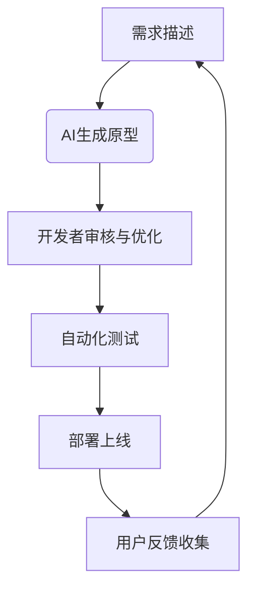

### 🛠 第二阶段：构建你的第一个软件生意 —— 从零到一的实战

忘掉“Hello World”，直接构建一个能展示给朋友看的、真实可用的网页（比如你的个人作品集）。

**技术栈选择（极简主义）：**  
*   **语言：** JavaScript (一统前后端，降低学习成本)
*   **前端框架：** React + Next.js (组件化开发，效率翻倍)
*   **样式库：** Tailwind CSS + DaisyUI (用类名快速美化，告别手写 CSS)
*   **后端/数据库：** Next.js API Routes + MongoDB (一体化解决方案，部署简单)
*   **辅助工具：**  
    *   用户认证：NextAuth.js
    *   支付：Stripe 或 Lemon Squeezy
    *   邮件：Resend
    *   分析：Plausible

**核心步骤：**

1.  **环境搭建：** 安装 Node.js、VS Code (或 Cursor AI)、Git。
2.  **创建项目：** 用 `create-next-app` 一键生成项目骨架。
3.  **编写组件：** 在 React 中，万物皆组件。创建一个可复用的“计数器”组件，学习 `props` (属性) 和 `useState` (状态管理)。
4.  **理解渲染：** 区分 Server Components (默认，安全) 和 Client Components (`'use client'`，用于交互)。
5.  **部署上线：** 将代码推送到 GitHub，连接 Vercel，一键部署。你的网站将拥有一个全球可访问的链接！
6.  **绑定域名：** 购买一个 `.com` 域名（推荐 Namecheap），通过 DNS 设置将其指向你的 Vercel 应用。从此，你拥有了自己的互联网“门牌号”。

---

### 🤖 第三阶段：AI 超级加速 —— 从 1x 到 10x 的生产力革命

**重要前提：** 请务必在掌握第二阶段的基础后再引入 AI。否则，你会陷入“AI 地狱循环”——看似生成了代码，实则无法调试和维护。

**AI 工具配置：**  
*   **编辑器：** VS Code (搭配免费的 GitHub Copilot) 或 Cursor AI。
*   **模型：** 选择当前主流模型，如 GPT-4o 或 Claude 3.5 Sonnet。

**高效协作工作流：**

1.  **Inline AI (行内助手)：** 用于微调，如“把这个 div 的颜色改成蓝色”或“将这段 SVG 代码转换为 React JSX”。
2.  **AI Chat (主力对话)：** 按 `Cmd+L` 唤出。用于：
    *   **学习：** “请解释一下这个 `useEffect` 钩子的作用。”
    *   **设计：** “我想实现一个用户登录后跳转到仪表盘的功能，该怎么设计？”
    *   **编码：** “请为我写一个 API 路由，用于处理 Stripe 的 Webhook 事件。”
    *   **调试：** “我的代码报错了，错误信息是 XXX，帮我看看哪里有问题？”
3.  **AI Composer (高级自动化 - Cursor AI)：** 按 `Cmd+I` 唤出。这是一个 AI 代理，可以自动执行命令、创建/编辑文件。**慎用！** 仅在你有非常明确的指令时使用，例如：“根据我选中的设计图，创建一个名为 `TimePicker` 的组件，并使用我项目中的配色方案。”
4.  **AI Rules (定制化规则)：** 在 Cursor 设置中，告诉 AI 你的技术栈偏好（如“我只用 React 和 Tailwind CSS”），让它生成的代码风格与你项目保持一致。
5.  **设计驱动开发：** 找到你喜欢的 UI 设计截图，直接上传给 AI Composer，让它为你生成对应的代码。懒，是第一生产力！

---

### 📌 给开发者的终极忠告

1.  **行动偏见 (Bias for Action)：** 看完这篇指南，立刻关掉视频，打开编辑器，敲下第一行代码。成功者与旁观者的唯一区别，就是“做”。
2.  **50% 编码，50% 营销：** 再好的产品，没人知道也是徒劳。学会 SEO、内容营销、社群运营。技术是杠杆，市场才是支点。
3.  **警惕“无代码”陷阱：** Vercel、Lovable 等平台能快速生成精美原型，但其代码往往与你的技术栈格格不入，后期整合成本极高。**在你自己的代码编辑器里，用 AI 从零构建，才是王道。**

---

AI 的时代，不是程序员的末日，而是“超级个体”的黄金时代。你不需要成为最懂算法的人，但必须成为最会“指挥 AI”的人。现在，就去创造属于你的第一个百万美元项目吧！

> **P.S.** 本文作者基于此方法论开发了《Code Fast》课程，帮助 2000+ 学员成功入门。但请记住，你完全可以用 AI 自学成才——毕竟，最好的老师，已经内置于你的编辑器中。


---

# **AI赋能开发者：从零到一的高效软件构建技术白皮书**

## **摘要**
本白皮书系统阐述了AI时代下开发者如何突破传统学习曲线，以极低门槛构建可盈利的软件产品。基于"AI不会取代程序员，而是让程序员更高效地构建产品"的核心理念，本报告详细解析了从基础互联网概念到完整软件业务构建的完整技术路线图，并提出了一系列创新产品创意。数据显示，掌握正确方法的开发者可以在6-12个月内构建可盈利的SaaS产品，而AI工具可将开发效率提升80%以上。

---

## **1. 背景：AI赋能开发的新范式**

### **1.1 传统开发者学习路径的瓶颈**
- **学习曲线陡峭**：传统编程学习需要掌握大量理论知识，平均需要6-12个月才能构建简单应用
- **知识碎片化**：前端、后端、数据库、部署等知识分散，难以形成系统性认知
- **实践机会少**：缺乏真实项目经验，难以将理论知识转化为实际产品

### **1.2 AI驱动的开发范式变革**
- **80/20法则**：AI可完成80%的重复性代码工作，开发者专注20%的创新与优化
- **即时反馈机制**：AI提供实时代码解释、错误修复和最佳实践建议
- **知识民主化**：非计算机专业背景人员也能快速构建复杂应用

> **关键洞察**：2024年后，AI工具已从"代码补全"进化为"全栈开发助手"，开发者的核心技能从"写代码"转向"精准描述需求"和"质量控制"。

---

## **2. 技术架构：高效AI赋能开发栈**

### **2.1 基础架构层**
| 组件       | 技术选型                     | 价值                  |
| -------- | ------------------------ | ------------------- |
| **前端框架** | Next.js 14 (App Router)  | 服务端渲染、静态生成、API路由一体化 |
| **UI库**  | Tailwind CSS + Daisy UI  | 快速构建美观、响应式UI组件      |
| **状态管理** | React Context + useState | 轻量级状态管理，无需额外库       |
| **认证系统** | NextAuth.js              | 集成OAuth、邮箱登录、会话管理   |
| **数据库**  | MongoDB Atlas (NoSQL)    | 灵活数据结构，快速迭代         |

### **2.2 AI赋能层**
| AI能力 | 应用场景 | 效率提升 |
|--------|----------|----------|
| **代码解释** | 理解陌生代码库 | 降低学习成本70% |
| **组件生成** | UI组件快速创建 | 从数小时到数分钟 |
| **API设计** | 自动生成REST/GraphQL接口 | 减少90%的样板代码 |
| **错误调试** | 实时错误分析与修复 | 缩短调试时间85% |
| **设计辅助** | 从设计稿生成代码 | 无需设计专业知识 |

### **2.3 部署与运维层**
| 组件 | 技术选型 | 价值 |
|------|----------|------|
| **云部署** | Vercel (免费计划) | 一键部署、自动扩展、全球CDN |
| **域名管理** | Namecheap + DNS配置 | 专业域名与邮件服务 |
| **支付系统** | Stripe API | 完整支付流程，免去复杂集成 |
| **邮件服务** | Resend (免费计划) | 事务性邮件发送，无需SMTP配置 |

> **技术优势**：全栈开发仅需掌握JavaScript/TypeScript，无需切换语言，降低认知负担。

---

## **3. 核心技术突破**

### **3.1 AI驱动的开发工作流**


### **3.2 关键技术实现细节**

#### **3.2.1 Next.js + AI的智能路由系统**
- **动态路由生成**：AI根据业务需求自动生成路由结构
- **自动API路由**：`/api/[resource]/route.js`自动生成CRUD接口
- **智能错误处理**：AI自动添加错误边界和重试逻辑

```javascript
// AI生成的API路由示例
export async function POST(request) {
  try {
    const { name, email } = await request.json();
    // AI自动生成的验证逻辑
    if (!name || !email) throw new Error('Missing required fields');
    
    // AI生成的数据库操作
    const user = await db.collection('users').insertOne({ name, email });
    
    return Response.json({ success: true, id: user.insertedId });
  } catch (error) {
    return new Response(JSON.stringify({ error: error.message }), { status: 400 });
  }
}
```

#### **3.2.2 AI辅助的UI设计流程**
- **设计稿到代码**：上传Figma/Sketch设计稿，AI生成React组件
- **响应式适配**：AI自动添加Tailwind CSS响应式类
- **主题一致性**：保持项目设计系统统一性

```jsx
// AI生成的UI组件
const PricingCard = ({ plan }) => {
  return (
    <div className="border rounded-lg p-6 shadow-md hover:shadow-xl transition-shadow">
      <h3 className="text-xl font-bold text-orange-500">{plan.name}</h3>
      <p className="text-3xl font-bold mt-2">${plan.price}/month</p>
      <ul className="mt-4 space-y-2">
        {plan.features.map((feature, i) => (
          <li key={i} className="flex items-center">
            <CheckIcon className="w-5 h-5 text-green-500 mr-2" />
            {feature}
          </li>
        ))}
      </ul>
      <button className="mt-6 w-full bg-orange-500 hover:bg-orange-600 text-white py-2 rounded">
        Get Started
      </button>
    </div>
  );
};
```

#### **3.2.3 AI增强的认证系统**
- **智能OAuth集成**：AI自动配置Google、GitHub等第三方登录
- **邮件验证流程**：AI生成完整邮件验证工作流
- **会话管理**：AI自动处理会话过期、刷新令牌等复杂逻辑

```javascript
// AI生成的认证路由
export const { GET, POST } = NextAuth({
  providers: [
    GoogleProvider({
      clientId: process.env.GOOGLE_CLIENT_ID,
      clientSecret: process.env.GOOGLE_CLIENT_SECRET,
    }),
    EmailProvider({
      server: {
        host: "smtp.resend.com",
        port: 587,
        auth: {
          user: "noreply@resend.com",
          pass: process.env.RESEND_API_KEY,
        },
      },
      from: "noreply@yourapp.com",
    }),
  ],
  callbacks: {
    async session({ session, token }) {
      session.user.id = token.sub;
      return session;
    },
  },
});
```

---

