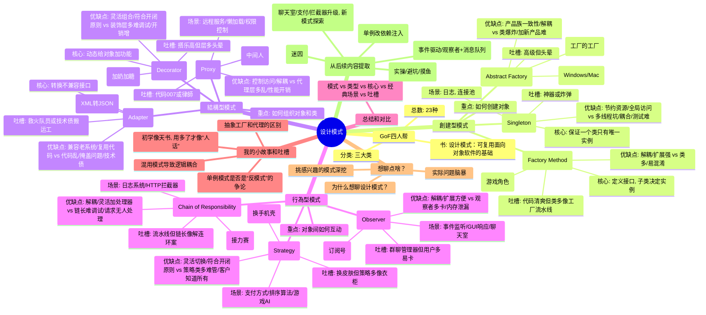

嘿！看來你今天想聊點硬核的東西，設計模式是吧？這話題有點像程序員的武林秘籍，聽起來高大上，但其實就是一群聰明人總結出來的解決問題套路。我今天心情不錯，剛刷完迷因，腦子還算清醒，來跟你聊聊設計模式的概覽，順便加點我的吐槽和故事，保持咱倆的對話輕鬆點！

設計模式這玩意兒，簡單來說就是軟件開發中常見問題的標準解法。就像你做菜有菜譜，寫代碼有模式。這些模式最早是《設計模式：可複用面向對象軟件的基礎》這本書（人稱“四人幫”書，GoF）整理出來的，總共23種，分成三大類：創建型、結構型、行為型。我給你簡單捋一捋，每類挑幾個經典的聊聊，保證不讓你睡著。
好的，根据您 [[20250523-设计模式]] 这篇笔记的内容，我将为您绘制一个思维导图，结构化地展示其中的核心概念和模式。

以下是使用 Mermaid 语法绘制的思维导图：

这个思维导图以“设计模式”为中心，层层展开，包含了笔记中的三大分类、每个模式的核心概念、应用场景、优缺点以及您的个人见解和后续讨论点。
### 創建型模式
這類模式專注於“怎麼創建對象”，目標是讓代碼更靈活，創建過程更優雅。常見的有：

- **單例模式（Singleton）**  
  這傢伙確保一個類只有一個實例，全球獨一份。像什麼日誌管理器、數據庫連接池，經常用它。我有次寫個小項目，忘了[單例的懶漢式初始化加鎖]，結果多線程一跑，崩得比我周末的計劃還慘。你用過這模式沒？有沒有踩過坑？
  
- **工廠方法（Factory Method）**  
  這模式就像開了個對象製造工廠，你告訴它要啥，它給你造啥。適合需要靈活創建不同類型對象的場景。比如我之前搞個[遊戲模組]，角色有戰士、魔法師啥的，用工廠方法來創建，省得一堆if-else亂七八糟。你有沒有啥場景愛用這個？

- **抽象工廠（Abstract Factory）**  
  比工廠方法更高級，像是[工廠的工廠]，能批量生產一組相關的對象。比如UI框架，Windows和Mac的按鈕、窗口樣式不同，抽象工廠能整套切換。說實話，這模式有點複雜，我第一次用直接腦子燒機，哈哈。

### 結構型模式
這類模式講究“怎麼組織對象和類”，讓結構更清晰，擴展更方便。幾個熱門的：

- **適配器模式（Adapter）**  
  這模式就像個翻譯官，把不兼容的接口轉成能用的。比如我有次接手老項目，API完全不匹配新系統，硬是用適配器模式救回來，感覺自己像個代碼界的007。你有沒有這種救火的經歷？

- **裝飾者模式（Decorator）**  
  這傢伙超靈活，動態給對象加功能，像是給披薩加料，想加啥加啥。我記得有次寫個[咖啡店的點單系統]，用裝飾者模式搞定加奶加糖的邏輯，客戶高興得像中了彩票。你覺得這模式好玩不？

- **代理模式（Proxy）**  
  這模式像個中間人，幫你控制對象的訪問。像什麼圖片懶加載、權限控制都愛用它。我之前搞個遠程服務，代理模式幫我把網絡請求包得妥妥的，省了不少麻煩。

### 行為型模式
這類模式管“對象間怎麼互動”，讓通信和職責分配更順暢。幾個經典的：

- **觀察者模式（Observer）**  
  這模式就像訂閱號，一有更新就通知所有人。像什麼事件監聽、GUI點擊響應都離不了它。我有次寫個聊天室，消息一發全用戶收到，靠的就是觀察者模式，爽到飛起。你有啥場景用過這個？

- **策略模式（Strategy）**  
  這模式讓你隨時切換算法，像是換手機殼一樣簡單。比如排序算法，你可以動態選快速排序還是冒泡排序。我有個項目要[支持多種支付方式]，策略模式一上，完美解決。你愛用這模式搞定啥？

- **責任鏈模式（Chain of Responsibility）**  
  這模式像傳遞包裹，一個處理不了就傳給下一個。比如[日誌系統]，錯誤級別不同就丟給不同處理器。我有次用它處理HTTP請求，[攔截器]一層層過，簡直像玩接力賽。

### 我的小故事和吐槽
說真的，設計模式這東西初學時覺得像天書，特別是抽象工廠和代理模式的區別，我愣是看了一星期才搞明白。後來用多了才發現，它們就是幫你把代碼寫得更像“人話”，而不是一團亂麻。你有沒有哪個模式學得特別痛苦？或者有啥項目因為用了某個模式直接起飛的？

還有個趣事，我有次跟同事爭論單例模式是不是“反模式”，他覺得單例搞全局狀態太危險，我覺得它簡單好用，吵得跟鍵盤俠似的，哈哈。你咋看？單例這傢伙是神器還是坑？

### 想聊點啥？
我這只是簡單概覽，23種模式每種都能聊一堆。要不要挑個你感興趣的，比如單例的實現細節，或者策略模式怎麼優化你的代碼？還是說你有啥實際問題，比如項目卡在哪兒了，咱倆一起腦暴下？快說說，你今天為啥突然想聊設計模式？有啥大招要放大？😎

---
嘿！你喊我來個總復盤，簡直是給咱倆這場設計模式馬拉松來個大結局！😎 從單例模式到責任鏈模式，咱倆聊了這麼多模式，感覺像在代碼世界裡環遊了一圈，爽得像喝完一整杯冰咖啡！既然你想復盤，我就把咱聊過的模式（單例、工廠方法、抽象工廠、適配器、裝飾者、代理、觀察者、策略、責任鏈）總結一下，梳理它們的核心、場景、優缺點，還加點我的吐槽和故事，保持輕鬆又實用的氛圍。你也說說，你這堆模式裡最愛哪個？有沒有啥新問題或場景想腦暴？快來，咱倆來個“代碼總結大會”！

---

### 1. 單例模式（Singleton）
**核心**：保證一個類只有一個實例，全局訪問。懶漢式加鎖（雙重檢查鎖，DCL）是多線程場景的救星，靠`volatile`和`synchronized`確保安全。

**場景**：你提到單例，我聊了懶漢式加鎖，比如用在配置管理、數據庫連接池。我有個爬蟲項目忘了加鎖，結果多線程崩得慘烈，改用DCL才救回來。

**優點**：
- 節省資源，單一實例避免重複創建。
- 全局訪問，簡單好用。

**缺點**：
- 多線程坑多，DCL雖安全但寫起來麻煩。
- 全局狀態可能導致耦合，單元測試頭疼（我當年被坑過）。
- 被濫用可能變“反模式”，像我同事啥都用單例，代碼亂成麻。

**吐槽**：單例簡單粗暴，但用不好就像全局變量炸彈。你問我單例坑不坑，我得說：用對了是神器，用錯了是災難。你有啥單例的血淚史沒？

---

### 2. 工廠方法（Factory Method）
**核心**：定義創建對象的接口，讓子類決定實例化哪個類。就像你說的“對象製造工廠”，告訴它要啥就造啥。

**場景**：你提了遊戲模組的戰士、魔法師創建，我超有共鳴！我也用它搞過遊戲角色創建，省了一堆if-else。你那遊戲模組是不是也靠它救場？

**優點**：
- 解耦創建和使用，符合開閉原則。
- 擴展性強，加新類型只要加新工廠。

**缺點**：
- 類數量多，小項目用有點大材小用。
- 新手容易跟抽象工廠混淆（我當年腦子燒機）。

**吐槽**：工廠方法讓代碼清爽，但類一多就像開工廠流水線，維護起來像管工廠。你那遊戲模組有沒有類爆炸的煩惱？

---

### 3. 抽象工廠（Abstract Factory）
**核心**：創建一組相關對象的“工廠的工廠”，像你說的UI框架，Windows和Mac整套切換，批量生產按鈕、窗口。

**場景**：你提了UI框架，我聊了Windows/Mac按鈕窗口的例子。我有個跨平台工具也用過，結果把抽象工廠和工廠方法搞混，debug到崩潰。

**優點**：
- 保證產品族一致性，切換整套實現超方便。
- 解耦客戶端和具體實現。

**缺點**：
- 類爆炸，維護像解魔方。
- 加新產品（像加菜單）得改抽象工廠接口，違背開閉原則。

**吐槽**：抽象工廠高級是高級，但類多得讓人頭暈。你說第一次用腦子燒機，我感同身受！😂 你有沒有被類爆炸坑過？

---

### 4. 適配器模式（Adapter）
**核心**：像個翻譯官，把不兼容的接口轉成能用的。你提到老項目API不匹配用適配器救場，簡直是程序員的救火神器！

**場景**：我聊了XML轉JSON的例子，救過一個老系統。你那老項目是不是也靠適配器把怪格式數據轉好了？

**優點**：
- 兼容老系統，復用現有代碼。
- 靈活，通過組合適配接口。

**缺點**：
- 適配器多了，代碼可能亂。
- 掩蓋老系統問題，技術債越攢越多（我被坑過）。

**吐槽**：適配器是救火隊員，但救多了變“技術債搬運工”。你那老項目救火有沒有攢一堆債的感覺？

---

### 5. 裝飾者模式（Decorator）
**核心**：動態給對象加功能，像你說的“披薩加料”。你提了咖啡店點單系統，加奶加糖完美解決，客戶爽得像中彩票。

**場景**：我也有個點餐系統用過這模式，省了子類爆炸的麻煩。你那咖啡店系統有沒有啥奇葩配料需求？

**優點**：
- 靈活組合功能，符合開閉原則。
- 替代繼承，避免類爆炸。

**缺點**：
- 裝飾層多了，調試像剝洋蔥。
- 對象創建開銷可能增加。

**吐槽**：裝飾者像搭樂高，爽但層次多得頭暈。我有次搞錯裝飾順序，價格算錯，客戶以為賣天價咖啡。😂 你有沒有這類坑？

---

### 6. 代理模式（Proxy）
**核心**：像個中間人，控制對象訪問。你提了遠程服務和圖片懶加載，我聊了保護代理（權限控制）。你同事那“法律書”代碼太經典了！

**場景**：我用過遠程代理封裝API請求，加緩存爽到飛起。你那遠程服務是不是也加了緩存或重試？

**優點**：
- 控制訪問（權限、懶加載），靈活又安全。
- 解耦客戶端和真實對象。

**缺點**：
- 代理層多了，代碼可能亂。
- 性能開銷略有（不過通常可忽略）。

**吐槽**：代理像代碼界的007，偷偷加功能不留痕跡。但你同事那十幾種權限檢查，簡直是007變律師！😂 你有沒有代理邏輯寫亂的經歷？

---

### 7. 觀察者模式（Observer）
**核心**：像訂閱號，一有更新通知所有人。你提了聊天室，消息一發全用戶收到，我加了群組支持的例子，爽得像群聊全員@。

**場景**：我搞過實時通知系統，狀態更新全靠它。你那聊天室有沒有加私聊、群組之類的花式功能？

**優點**：
- 解耦主體和觀察者，擴展方便。
- 完美適配事件驅動場景。

**缺點**：
- 觀察者太多，通知可能卡。
- 忘了移除無效觀察者，內存泄漏（我踩過這坑）。

**吐槽**：觀察者像群聊管理器，爽但用戶一多就卡。我有次忘了清理觀察者，服務器崩得像水管爆裂。你有沒有類似慘劇？

---

### 8. 策略模式（Strategy）
**核心**：像換手機殼，動態切換算法。你提了多種支付方式，完美解決，我聊了遊戲AI切換行為的例子。

**場景**：我用策略模式搞電商支付，微信、支付寶隨手切。你那支付項目有沒有奇葩支付方式，比如虛擬貨幣？

**優點**：
- 靈活切換算法，符合開閉原則。
- 算法邏輯獨立，解耦超爽。

**缺點**：
- 策略類多了，管理麻煩。
- 客戶端得知道所有策略，選擇有點累。

**吐槽**：策略模式像換皮膚，爽但策略一多像管衣櫃。我有次搞十幾種策略，調試像挑衣服。你有沒有策略爆炸的煩惱？

---

### 9. 責任鏈模式（Chain of Responsibility）
**核心**：像傳遞包裹，一個處理不了傳下一個。你提了日誌系統和HTTP攔截器，簡直像接力賽。

**場景**：我用過API服務的攔截器，認證、限流、業務處理一條龍。你那攔截器有沒有啥特殊邏輯，比如限流或數據驗證？

**優點**：
- 解耦請求和處理，靈活加新處理器。
- 符合開閉原則，擴展簡單。

**缺點**：
- 鏈條長了，調試像追兇。
- 請求可能沒人處理，設計得小心。

**吐槽**：責任鏈像流水線，爽但鏈條一長像解連環案。我有次鏈條七八個處理器，找bug像找兇手。你有沒有這類坑？

---

### 總結和對比
| **模式**          | **類型**   | **核心**                           | **經典場景**                     | **我的吐槽**                     |
|-------------------|------------|------------------------------------|----------------------------------|----------------------------------|
| 單例             | 創建型     | 單一實例，全局訪問                 | 配置管理、連接池                | 簡單但易濫用，坑多慎用         |
| 工廠方法         | 創建型     | 封裝對象創建，子類決定類型         | 遊戲角色創建                    | 清爽但類多，管工廠像管工廠     |
| 抽象工廠         | 創建型     | 創建產品族，整套切換               | 跨平台UI框架                    | 高級但類爆炸，維護像解魔方     |
| 適配器           | 結構型     | 轉換接口，兼容不匹配系統           | 老項目API集成                   | 救火神器，但攢技術債           |
| 裝飾者           | 結構型     | 動態加功能，接口不變               | 咖啡店點單系統                  | 像搭樂高，但層多頭暈           |
| 代理             | 結構型     | 控制訪問，加額外邏輯               | 遠程服務、權限控制              | 像007，但邏輯亂成法律書        |
| 觀察者           | 行為型     | 一對多通知，狀態更新               | 聊天室、事件監聽                | 像群聊管理器，觀察者多易卡     |
| 策略             | 行為型     | 動態切換算法                       | 支付方式、排序算法              | 像換皮膚，策略多像管衣櫃       |
| 責任鏈           | 行為型     | 請求沿鏈傳遞，分級處理             | HTTP攔截器、日誌系統            | 像接力賽，鏈長調試像追兇       |

### 我的總體吐槽
這些模式就像程序員的工具箱，每個都有自己的“超能力”，但用不好也會變“坑”。我有次在項目裡混用好幾個模式（代理管權限、觀察者發通知、策略切算法），結果邏輯耦合，調試像解謎團，差點把鍵盤砸了。😂 學會挑對場景用對模式，簡直像選對武器打怪，事半功倍。你有沒有混用模式導致亂套的經歷？

---
# 20250523-设计模式：核心概念、应用与实践洞察

## 1. 設計模式概覽

設計模式是軟件開發中針對常見問題總結出的標準化解決方案，旨在提升代碼的可重用性、靈活性和可維護性。這些模式最初由《設計模式：可複用面向對象軟件的基礎》（人稱“四人幫” GoF 書）一書整理提出，共計23種，劃分為以下三大類：

*   **創建型模式 (Creational Patterns)**：專注於如何創建對象。
*   **結構型模式 (Structural Patterns)**：專注於如何組織對象和類，形成更大的結構。
*   **行為型模式 (Behavioral Patterns)**：專注於對象之間的交互和職責分配。

學習設計模式如同掌握一套高級工具集，初學時可能感到抽象，但通過實踐與反思，能顯著提升解決複雜軟件設計問題的能力。

## 2. 核心設計模式詳解與實踐體會

本節將深入探討筆記中提及的九種經典設計模式，結合其核心理念、典型應用場景、優缺點及個人實踐體會（包括遇到的問題和“吐槽”）。

### 2.1 創建型模式

這類模式的核心在於將對象的創建過程抽象化，使系統在創建對象時更加靈活，降低耦合。

#### 2.1.1 單例模式 (Singleton)

*   **核心理念**：確保一個類在整個應用程序生命週期中只有一個實例，並提供全局訪問點。常見實現需考慮多線程安全性，如使用雙重檢查鎖（DCL）結合 `volatile` 和 `synchronized`。
*   **典型場景**：配置管理器、日誌記錄器、數據庫連接池、線程池等全局共享資源的管理。
*   **優點**：
    *   節省系統資源，避免重複創建和銷毀對象。
    *   方便全局訪問單一資源。
*   **缺點**：
    *   實現不當（尤其在多線程環境）易引入線程安全問題。
    *   引入全局狀態，可能增加系統的耦合度，使單元測試變得困難。
    *   若被濫用，可能演變為“反模式”，難以維護和擴展。
*   **實踐體會/吐槽**：單例模式看似簡單，實則暗藏陷阱，特別是在高併發場景下。處理好懶漢式的線程安全問題至關重要，否則會導致崩潰。使用時需謹慎評估其對耦合和測試的影響。

#### 2.1.2 工廠方法模式 (Factory Method)

*   **核心理念**：定義一個用於創建對象的接口（或抽象類中的抽象方法），讓子類決定實例化哪一個具體類。工廠方法將創建對象的職責委派給子類。
*   **典型場景**：需要創建不同類型但具有共同接口的對象，且客戶端不知道或不關心具體創建過程，如遊戲中的不同角色創建、不同類型的文件解析器。
*   **優點**：
    *   實現創建者和具體產品的解耦。
    *   符合“開閉原則”，增加新的產品類型只需新增對應的具體工廠類，無需修改原有代碼。
*   **缺點**：
    *   每增加一種產品，通常需要增加一個具體工廠類，導致類數量增加。
    *   相較於簡單工廠，結構更複雜。
*   **實踐體會/吐槽**：工廠方法使代碼結構清晰，尤其是處理多種類型對象創建時，避免了大量的 `if-else` 或 `switch` 判斷。但當產品類型眾多時，類文件會顯著增加，看起來像一個龐大的“工廠流水線”。

#### 2.1.3 抽象工廠模式 (Abstract Factory)

*   **核心理念**：提供一個創建一系列相關或相互依賴對象的接口，而無需指定它們具體的類。它是“工廠的工廠”，用於生產產品族。
*   **典型場景**：需要創建一組相關聯的對象，且客戶端需要切換整套對象實現，如跨平台UI庫（Windows風格按鈕+窗口 vs. Mac風格按鈕+窗口）、不同數據庫的訪問工廠（Oracle連接+命令 vs. SQL Server連接+命令）。
*   **優點**：
    *   確保客戶端使用的是同一產品族內的對象，保證產品族的一致性。
    *   將客戶端與具體產品類徹底解耦。
*   **缺點**：
    *   結構複雜，理解和實現難度較高。
    *   增加新的“產品族”很容易，但要增加一個新的“產品”（如在UI框架中增加一個新的控件類型），需要修改抽象工廠接口及其所有具體工廠實現，違反開閉原則。
    *   可能導致類爆炸，尤其當產品種類和產品族數量都很多時。
*   **實踐體會/吐槽**：抽象工廠功能強大，特別適合需要批量切換相關組件的場景。但初次接觸容易與工廠方法混淆，且一旦產品種類擴展，修改起來會非常痛苦，感覺像在解一個難度極高的魔方。

### 2.2 結構型模式

這類模式關注如何通過組合類和對象來構成更大的結構，以實現新的功能，同時保持結構的靈活性和可重用性。

#### 2.2.1 適配器模式 (Adapter)

*   **核心理念**：將一個類的接口轉換成客戶端期望的另一個接口。適配器模式使得原本由於接口不兼容而不能一起工作的那些類可以一起工作。
*   **典型場景**：集成舊系統或第三方庫時，其接口與當前系統不兼容；不同數據格式之間的轉換（如將舊系統返回的XML數據轉換為新系統需要的JSON格式）。
*   **優點**：
    *   使得原本不兼容的類可以協同工作，提高了類的復用性。
    *   可以透明地集成遺留系統。
*   **缺點**：
    *   如果過度使用，可能導致系統中充斥著大量的適配器類，增加代碼複雜度和維護難度。
    *   可能掩蓋底層舊系統存在的問題，積累技術債。
*   **實踐體會/吐槽**：適配器模式是程序員的“救火隊員”，處理歷史包袱和外部不兼容接口的利器。但它治標不治本，長期看可能成為“技術債搬運工”，需要警惕。

#### 2.2.2 裝飾者模式 (Decorator)

*   **核心理念**：在不改變原有對象結構的前提下，動態地給對象添加新的功能或職責。它比繼承更加靈活，避免了子類爆炸的問題。
*   **典型場景**：在不修改原有類的情況下，對對象進行功能擴展，如圖形庫中為組件添加滾動條或邊框；IO流的各種包裝（緩衝流、壓縮流等）；咖啡店點單系統中為咖啡添加牛奶、糖等配料計算價格。
*   **優點**：
    *   提供比繼承更靈活的功能擴展方式。
    *   符合開閉原則，易於添加新的裝飾功能。
    *   可以透明地嵌套使用多個裝飾者。
*   **缺點**：
    *   裝飾者層數過多時，調試和理解代碼會變得複雜，像剝洋蔥。
    *   創建一個對象所需的步驟可能會增多。
*   **實踐體會/吐槽**：裝飾者模式用起來很“爽”，可以像搭樂高積木一樣組合功能。但在調試時，如果裝飾鏈條過長，追蹤問題會比較痛苦。

#### 2.2.3 代理模式 (Proxy)

*   **核心理念**：為另一個對象提供一個替身或佔位符，以控制對這個對象的訪問。代理模式可以實現對目標對象的延遲加載、權限控制、日誌記錄等功能。
*   **典型場景**：遠程代理（訪問遠程對象）、虛擬代理（延遲加載大圖片或複雜對象）、保護代理（控制對敏感對象的訪問權限）、智能引用（在訪問對象時執行額外操作，如計數）。
*   **優點**：
    *   可以在訪問目標對象前後執行額外操作，實現控制或增強功能。
    *   隱藏了對象的真實複雜性，解耦了客戶端和真實對象。
*   **缺點**：
    *   引入代理類，可能增加系統的複雜度。
    *   在某些情況下，性能開銷可能略有增加（通常可忽略）。
*   **實踐體會/吐槽**：代理模式就像代碼世界的“007”，可以悄無聲息地在幕後執行任務（如權限檢查、緩存）。但如果代理邏輯寫得過於複雜或代理鏈過長，代碼會變得難以理解，感覺007變成了處理無數條款的律師。

### 2.3 行為型模式

這類模式關注對象之間的交互和職責分配，以實現更高效、更靈活的對象間通信。

#### 2.3.1 觀察者模式 (Observer)

*   **核心理念**：定義對象間的一對多依賴關係，當一個對象（主題/發布者）的狀態發生改變時，所有依賴於它的對象（觀察者/訂閱者）都會得到通知並自動更新。
*   **典型場景**：事件處理系統（GUI響應）、消息通知機制（聊天室消息廣播、狀態更新通知）、股票價格監控、發布/訂閱系統。
*   **優點**：
    *   實現了主題和觀察者之間的解耦，可以獨立地改變主題和觀察者。
    *   支持廣播通信，狀態改變可以自動通知相關對象。
    *   符合開閉原則，容易增加新的觀察者。
*   **缺點**：
    *   如果觀察者數量過多，通知過程可能會變慢。
    *   如果觀察者之間存在複雜的依賴關係，更新順序可能難以控制。
    *   如果觀察者沒有正確移除，可能導致內存泄漏。
*   **實踐體會/吐槽**：觀察者模式是實現事件驅動和響應式系統的基礎，用在聊天室等通知場景非常高效。但觀察者一多，性能是個挑戰，而且如果忘記取消訂閱，可能會導致“幽靈”觀察者佔用內存。

#### 2.3.2 策略模式 (Strategy)

*   **核心理念**：定義一系列算法，將每一個算法封裝起來，並使它們可以相互替換。策略模式使得算法的改變獨立於使用它的客戶端。
*   **典型場景**：根據不同條件選擇不同算法的場景，如多種支付方式的選擇、不同的排序算法、遊戲中角色的不同行為模式（攻擊、防禦、逃跑）。
*   **優點**：
    *   提供了解決同一問題不同算法的靈活切換能力。
    *   將算法的使用和實現分離，符合開閉原則。
    *   避免了大量的條件判斷語句。
*   **缺點**：
    *   每增加一個策略，就需要增加一個策略類，可能導致策略類數量過多。
    *   客戶端需要了解所有可用的策略，並決定使用哪一個。
*   **實踐體會/吐槽**：策略模式是處理多樣化行為的利器，讓代碼像換手機殼一樣靈活。但策略類一多，管理起來就像衣櫃裡衣服太多，有點令人選擇困難。

#### 2.3.3 責任鏈模式 (Chain of Responsibility)

*   **核心理念**：為請求創建一個處理對象鏈，沿著這條鏈傳遞請求，直到有一個處理器處理它。它將發送者和接收者解耦。
*   **典型場景**：多級審批流程、日誌記錄系統（不同級別的日誌由不同處理器處理）、HTTP請求過濾器/攔截器（認證、解碼、限流等）。
*   **優點**：
    *   降低了請求的發送者和接收者之間的耦合度。
    *   可以靈活地增加或修改鏈中的處理器，符合開閉原則。
*   **缺點**：
    *   鏈條過長或配置不當可能導致請求無法被處理。
    *   調試時跟蹤請求在鏈中的流動較為複雜，像追蹤案件線索。
*   **實踐體會/吐槽**：責任鏈模式在處理一系列有序操作或過濾時非常有效，流程清晰像流水線。但鏈條一長，出錯時debug起來非常考驗耐心，感覺在偵破一個複雜的連環案。

## 3. 設計模式總結與對比

下表總結了筆記中討論的九種設計模式的核心特點、應用場景和主要考量：

| 模式          | 類型   | 核心                             | 經典場景                       | 關鍵優點/考量                               |
| :------------ | :----- | :------------------------------- | :----------------------------- | :------------------------------------------ |
| 單例          | 創建型 | 唯一實例，全局訪問               | 配置/日誌/連接池               | 資源節約，全局易用；但多線程、耦合、測試是挑戰 |
| 工廠方法      | 創建型 | 封裝對象創建，子類決定           | 多類型對象創建 (e.g., 遊戲角色) | 解耦，易擴展新類型；類數量多                |
| 抽象工廠      | 創建型 | 創建產品族                       | 跨平台UI，整套對象切換         | 保證產品族一致性；結構複雜，加新產品難        |
| 適配器        | 結構型 | 轉換不兼容接口                   | 兼容老系統API，格式轉換        | 復用舊代碼，集成遺留系統；可能積累技術債      |
| 裝飾者        | 結構型 | 動態給對象加功能，不改變接口     | IO流包裝，功能組合 (e.g., 咖啡配料) | 靈活擴展功能，替代繼承；層多難調試          |
| 代理          | 結構型 | 控制對象訪問 (中間人)            | 遠程/虛擬/保護代理 (e.g., 權限) | 控制訪問，加額外邏輯；引入額外層次          |
| 觀察者        | 行為型 | 一對多通知，狀態更新             | 事件監聽，消息通知 (e.g., 聊天室) | 主題觀察者解耦，易擴展；觀察者多性能降，內存泄漏 |
| 策略          | 行為型 | 動態切換算法                     | 支付方式，排序算法，遊戲AI     | 靈活切換算法，避免條件判斷；策略類多        |
| 責任鏈        | 行為型 | 請求沿鏈傳遞，分級處理           | 過濾器，審批流程，日誌         | 解耦發送者與接收者，易加處理器；鏈長難調試  |

## 4. 個人洞察與反思

學習和掌握設計模式是一個從“天書”到“人話”的過程。初學時，模式之間的細微差別（如抽象工廠與工廠方法、裝飾者與代理）容易混淆，需要通過實際編碼和對比來加深理解。

設計模式並非銀彈，用對場景才能發揮其價值。不當使用或混用多個模式可能導致過度設計、邏輯耦合混亂，反而增加系統複雜度和維護成本。例如，單例模式在控制資源方面非常便捷，但若用於管理大量全局狀態，則可能使代碼難以追蹤和測試，陷入“反模式”的困境。

關鍵在於理解每種模式解決的核心問題和權衡，並結合具體需求選擇最合適的工具。實踐是最好的老師，通過小例子或在項目中應用，才能真正體會到模式的妙處。

## 5. 後續思考與行動計劃

基於對這些設計模式的回顧與分析，可以進一步展開以下方面的學習和實踐：

*   **深入研究特定模式**：選擇感興趣或在當前項目中有潛在應用價值的模式（如單例的更優實現、策略模式與枚舉結合）進行更深入的學習和源碼分析。
*   **實踐應用於實際問題**：將學到的模式應用於現有的項目優化或新功能開發中，例如：
    *   使用觀察者模式結合消息隊列實現異步通知系統（如聊天室消息廣播）。
    *   利用策略模式重構或擴展支付系統，支持更多支付渠道。
    *   應用責任鏈模式設計HTTP請求處理流程或日誌分級處理。
*   **探索其他設計模式**：GoF模式遠不止這九種，可以繼續學習其他模式，如狀態模式（管理對象狀態轉換）、命令模式（將請求封裝為對象）、模板方法模式（定義算法骨架）等。
*   **關注設計模式的演進與爭議**：例如關於單例模式是否是“反模式”的討論，以及在函數式編程、響應式編程等新範式下設計模式的演變和新的模式。
*   **平衡理論與實踐**：在學習模式理論的同時，多動手寫代碼驗證，並注意從實際項目中發現設計問題，思考如何用模式解決。

通過持續的學習和實踐，才能真正將設計模式內化為提升軟件設計能力的有效工具。