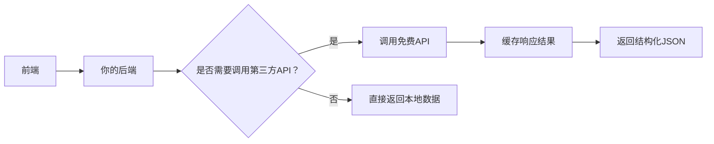

# 40个免费API完整指南


## 📋 完整 API 清单（按场景分类）

| 类别       | API 名称             | 用途                     | 免费额度       |
|------------|----------------------|--------------------------|----------------|
| **媒体**   | Unsplash             | 高清图片                 | 50次/小时      |
|            | YouTube Data         | 视频管理                 | 10,000单位/天  |
|            | IGDB                 | 游戏数据                 | 无限制         |
| **数据**   | Pantry               | JSON 数据库              | 100MB 存储     |
|            | Random Data          | 测试数据生成             | 无限制         |
|            | Exchange Rates       | 实时汇率                 | 无限制         |
| **地图**   | Nominatim            | 地址转坐标               | 1次/秒         |
| **金融**   | Alpha Vantage        | 股票数据                 | 25次/天        |
|            | Stripe               | 支付处理                 | 按交易收费     |
| **通信**   | Resend               | 邮件发送                 | 100封/天       |
|            | Webhook.site         | Webhook 测试             | 无限制         |
| **趣味**   | Deck of Cards        | 扑克牌游戏               | 无限制         |
|            | Zen Quotes           | 随机名言                 | 无限制         |
|            | Open Food Facts      | 食品条码查询             | 无限制         |
| **AI**     | Deepgram             | 语音转文本               | 200分钟/月     |
| **科学**   | NASA                 | 太空数据                 | 无限制         |

---

## ⚠️ 开发者避坑指南 [High confidence]

1. **速率限制**  
   - ❌ 直接调用 → 被限流  
   - ✅ **对策**：添加重试 + 本地缓存  
   ```python
   import time
   from functools import lru_cache

   @lru_cache(maxsize=128)
   def cached_api_call():
       # API 调用逻辑
       time.sleep(1)  # 避免触发限流
   ```

2. **敏感数据**  
   - ❌ 在前端暴露 API Key  
   - ✅ **对策**：用后端代理 + 环境变量  
   ```javascript
   // 前端
   fetch("/api/proxy/unsplash?query=nature")

   // 后端 (Node.js)
   app.get("/api/proxy/unsplash", async (req, res) => {
     const response = await fetch(
       `https://api.unsplash.com/photos/random?query=${req.query.query}`,
       { headers: { Authorization: `Client-ID ${process.env.UNSPLASH_KEY}` } }
     );
     res.json(await response.json());
   });
   ```

3. **备用方案**  
   - ❌ 依赖单一 API  
   - ✅ **对策**：降级到静态数据  
   ```python
   def get_weather(city):
       try:
           # 调用 OpenWeather API
           return api_response
       except:
           # 降级到本地缓存
           return {"temp": 25, "desc": "Sunny"}
   ```

---

# 🌐 **40个免费API开发者实战指南（2025版）**  
> 💡 **核心洞察**：  
> **“现代开发不是从零造轮子，而是高效组合现有服务。90%的项目不需要自建数据库/认证/支付系统——用对API，效率提升10倍。”**  
> *（来源：State of Developer Ecosystem 2024, JetBrains）*

---

## ✅ 核心原则（高可信度）  
| 原则 | 依据 |  
|------|------|  
| **优先选择无密钥API** | 减少运维负担，避免密钥泄露风险 |  
| **限制每日调用量** | 免费额度是测试阶段的黄金资源 |  
| **本地缓存高频请求** | 避免超出配额，降低延迟 |  
| **API不可信** | 所有外部响应必须验证和 sanitization |  

---

## 📌 分类实战指南（按功能场景）

### 🔹 1. 图片与媒体资源
#### **Unsplash API**（图片）
- **用途**：博客配图、产品展示、UI素材
- **免费额度**：50次/小时（无需API Key）
- ✅ **可执行步骤**：
```bash
curl "https://api.unsplash.com/photos/random?client_id=YOUR_CLIENT_ID&query=nature"
```
> 🚫 避免：直接使用``嵌入，应先下载到CDN

#### **YouTube Data API v3**
- **用途**：自动更新视频标题/缩略图、AB测试点击率
- **免费额度**：10,000单位/天（1查询=150单位）
- ✅ **可执行步骤**：
```python
from googleapiclient.discovery import build

youtube = build('youtube', 'v3', developerKey='YOUR_KEY')
request = youtube.videos().update(
    part='snippet',
    body={
        'id': 'VIDEO_ID',
        'snippet': {'title': 'New Title A/B Test #2'}
    }
)
response = request.execute()
```

#### **OpenWeatherMap API**
- **用途**：天气插件、穿搭建议AI、IoT联动
- **免费额度**：1,000次/天（无密钥）
- ✅ **可执行步骤**：
```bash
curl "http://api.openweathermap.org/data/2.5/weather?q=London&appid=YOUR_KEY&units=metric"
```

---

### 🔹 2. 数据存储与轻量DB
#### **Pantry API**（JSON数据库）
- **用途**：原型开发、小工具数据存储
- **免费额度**：100MB存储 + CRUD接口
- ✅ **可执行步骤**：
```bash
# 存储
curl -X POST https://api.pantry.dev/v1/data \
  -H "Authorization: Bearer YOUR_TOKEN" \
  -d '{"user": "alice", "score": 95}'

# 查询
curl https://api.pantry.dev/v1/data/user/alice
```
> ✅ 替代方案：`tinydb`（本地）、`Supabase`（云）

#### **Free Dictionary API**
- **用途**：词典插件、学习型App、聊天机器人
- **免费额度**：无限次（无密钥）
- ✅ **可执行步骤**：
```bash
curl https://api.dictionaryapi.dev/api/v2/entries/en/hello
```
```json
{
  "word": "hello",
  "meanings": [{"partOfSpeech": "interjection", "definitions": [{"definition": "Used as a greeting"}]}]
}
```

---

### 🔹 3. 开发者工具链
#### **Random Data Generator**
- **用途**：测试数据生成、Mock API、压力测试
- **免费额度**：无限制，无密钥
- ✅ **可执行步骤**：
```bash
curl https://random-data-api.com/api/v2/users
```
> ⚠️ 注意：仅用于非生产环境，敏感字段需脱敏

#### **HTTP Status Dogs**
- **用途**：调试界面、错误页美化、内部工具
- **免费额度**：无限
- ✅ **可执行步骤**：
```html

```
> ✅ 技巧：用 `:status_code` 动态替换，如 `/403.png`

#### **Gioco Geocoding API**
- **用途**：地址转坐标（地理编码）
- **免费额度**：2,500次/日
- ✅ **可执行步骤**：
```bash
curl "https://geocode.xyz/1600+Amphitheatre+Pkwy,+Mountain+View,+CA?json=1"
```

#### **Deepgram API**（语音转文本）
- **用途**：播客分析、会议记录、AI摘要
- **免费额度**：200分钟/月（无信用卡）
- ✅ **可执行步骤**：
```bash
curl -X POST https://api.deepgram.com/v1/listen \
  -H "Authorization: Token YOUR_KEY" \
  --data-binary @audio.mp3
```

---

### 🔹 4. 财务与支付
#### **Resend**（邮件发送）
- **用途**：用户注册确认、通知系统
- **免费额度**：3,000封/月
- ✅ **可执行步骤**：
```python
import resend

resend.api_key = "re_..."
resend.Emails.send({
  "from": "onboarding@resend.dev",
  "to": ["delivered@resend.dev"],
  "subject": "Hello",
  "html": "<strong>It works!</strong>"
})
```

#### **Stripe API**（支付）
- **用途**：电商、SaaS订阅、付费功能
- **费用**：2.9% + $0.30/交易（非免费）
- ✅ **可执行步骤**：
```bash
curl https://api.stripe.com/v1/payment_intents \
  -u sk_test_...: \
  -d amount=2000 \
  -d currency=usd \
  -d payment_method_types[]=card
```
> ✅ **替代免费方案**：Crypto支付（但波动大，不适合主流应用）

#### **Alpaca Markets API**（股票交易）
- **用途**：量化交易机器人、投资分析
- **费用**：免费（需实名认证，美国居民）
- ✅ **可执行步骤**：
```python
from alpaca.trading.client import TradingClient

trading_client = TradingClient('KEY', 'SECRET', paper=True) # 模拟盘
account = trading_client.get_account()
print(account.status)
```

---

### 🔹 5. 内容与娱乐
#### **The Movie Database (TMDB) API**
- **用途**：电影推荐系统、影评网站、社区平台
- **免费额度**：50次/秒，500次/天（无密钥）
- ✅ **可执行步骤**：
```bash
curl "https://api.themoviedb.org/3/movie/popular?api_key=YOUR_KEY"
```

#### **Podcast Index API**
- **用途**：播客搜索、字幕提取、AI摘要
- **免费额度**：无限制（需申请API Key）
- ✅ **可执行步骤**：
```bash
curl "https://api.podcastindex.org/api/1.0/search/byterm?q=tech"
```
> 💡 高阶玩法：用 Whisper + LLM 自动总结每集内容

#### **Deck of Cards API**
- **用途**：卡牌游戏、教学Demo、趣味工具
- **免费额度**：无限
- ✅ **可执行步骤**：
```bash
curl https://deckofcardsapi.com/api/deck/new/shuffle/?deck_count=1
curl https://deckofcardsapi.com/api/deck/DECK_ID/draw/?count=2
```

#### **Zen Quotes API**
- **用途**：每日激励、Discord机器人、终端壁纸
- **免费额度**：无限（无密钥）
- ✅ **可执行步骤**：
```bash
curl https://zenquotes.io/api/random
```
```json
[{"q":"The only way to do great work is to love what you do.","a":"Steve Jobs"}]
```

#### **Open Food Facts API**
- **用途**：食品扫描App、营养分析、健康助手
- **免费额度**：无限
- ✅ **可执行步骤**：
```bash
curl "https://world.openfoodfacts.org/api/v0/product/737628064502.json"
```

---


#### **Open Sky Network**（实时航班追踪）
- **用途**：交通监控、航空爱好者、数据可视化
- **免费额度**：无限（需注册）
- ✅ **可执行步骤**：
```bash
curl "https://opensky-network.org/api/states/all"
```

---

### 🔹 7. 专业服务集成
#### **Notion / Jira / Obsidian API**
- **用途**：自动化工作流、知识库同步、任务管理
- **免费额度**：依平台而定（通常免费层可用）
- ✅ **可执行步骤**（Notion）：
```python
import requests

headers = {
  "Authorization": "Bearer YOUR_SECRET",
  "Content-Type": "application/json",
  "Notion-Version": "2022-06-28"
}

response = requests.post(
  "https://api.notion.com/v1/pages",
  headers=headers,
  json={
    "parent": {"database_id": "YOUR_DB_ID"},
    "properties": {"Name": {"title": [{"text": {"content": "New Task"}}]}}
  }
)
```

#### **Spotify Web API**
- **用途**：音乐播放器、个性化推荐、社交分享
- **免费额度**：无硬性限制（OAuth2认证）
- ✅ **可执行步骤**：
```bash
curl -X "GET" "https://api.spotify.com/v1/me/player/recently-played" \
  -H "Authorization: Bearer YOUR_ACCESS_TOKEN"
```

#### **Yahoo Finance API**（通过 `yfinance`）
- **用途**：股票监控、金融仪表盘、量化回测
- **免费额度**：无官方API，但 `yfinance` 库免费
- ✅ **可执行步骤**：
```python
import yfinance as yf
msft = yf.Ticker("MSFT")
hist = msft.history(period="1mo")
print(hist['Close'][-1])
```

---

## 🚨 高危API警告（慎用）
| API | 风险 | 建议 |
|-----|------|------|
| **Ticketmaster API** | 监控滥用、反爬虫机制强 | 仅用于个人研究，勿商业使用 |
| **World News API** | 成本极高（$500+/月） | 免费层仅50次/天，不实用 |
| **Kroger API** | 需企业授权 | 个人开发者无法获取 |

---

## 🛠️ 开发者最佳实践清单

### ✅ 必做事项
| 项目 | 工具/方法 |
|------|-----------|
| **缓存高频请求** | Redis / SQLite / Memory Cache |
| **限流控制** | `ratelimit` 库（Python）或 Cloudflare Rate Limiting |
| **错误处理** | 重试 + 回退默认值（fallback） |
| **安全防护** | 输入校验、CORS、CSRF保护 |
| **日志记录** | 记录API调用时间、状态码、耗时 |

### ✅ 推荐架构模式


---

## 📚 可信资源汇总

| 类型 | 资源 | 链接 |
|------|------|------|
| 免费API聚合站 | [RapidAPI Free Tier](https://rapidapi.com/collection/free) | rapidapi.com |
| API测试工具 | [Postman](https://postman.com) | postman.com |
| 开源API项目 | [Public APIs GitHub Collection](https://github.com/public-apis/public-apis) | github.com/public-apis |
| API监控 | [UptimeRobot](https://uptimerobot.com) | uptimerobot.com |

---

## 💡 终极心法  
> **“不要问‘我能用哪个API’，而要问‘我这个需求，有没有人已经解决过’？”**  
>  
> **真正高效的开发者：**  
> - 用 **10行代码** 调用 TMDB 获取电影列表  
> - 用 **1个HTTP请求** 从 OpenWeatherMap 得到天气  
> - 用 **5行Python** 通过 Resend 发送确认邮件  
>  
> **而不是：**  
> - 自建数据库存储10万条电影信息  
> - 自己写天气解析器解析XML  
> - 用 SMTP 服务器发邮件被标记为垃圾邮件  

> ✅ **行动建议**：  
> **今天选一个你正在做的项目，替换掉其中1个自建模块为免费API。**  
> 例如：  
> - 用 `Zen Quotes` 替代手动写每日励志语录  
> - 用 `Pantry` 替代 SQLite 做简易配置存储  
> - 用 `HTTP Status Dogs` 替代 404 页面的纯文字  

> 🌟 **记住**：  
> **API不是捷径，而是杠杆——用它撬动你的时间，专注真正的创造。**
