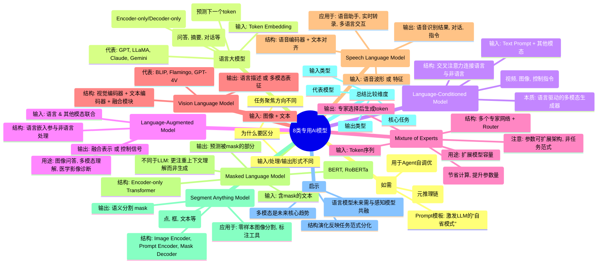

好的，根据您 [[8类专用AI模型]] 这篇笔记的内容，我为您绘制一个思维导图。

以下是使用 Mermaid 语法绘制的思维导图：

这张图展示了 **8类专用AI模型（8 Specialized AI Models）** 的结构对比图。每一类模型都有自己的输入类型、处理流程和输出形式，代表了当前主流AI模型的任务聚焦方向。

我们逐一解析这8类模型的核心架构与定位用途：

---

## 🔳 1. **LLM - Large Language Model**（语言大模型）

- **输入**：Token Embedding
    
- **结构**：经典 Transformer 堆叠结构（Encoder-only 或 Decoder-only）
    
- **输出**：语言输出（如预测下一个token）
    
- **代表**：GPT、LLaMA、Claude、Gemini等
    

✅ 用途：通用语言任务，如问答、摘要、对话、代码生成等。

---

## 🟪 2. **LCM - Language-Conditioned Model**

- **输入**：Text Prompt + 其他模态信息（如图像、动作）
    
- **结构**：交叉注意力结构（Cross-Attention）链接语言与非语言输入
    
- **输出**：非语言输出（如视频、图像、控制指令等）
    

✅ 例子：Text-to-3D、Text-to-Robot-Control

> 🧠 本质上是“语言驱动的多模态生成器”

---

## 🟩 3. **LAM - Language-Augmented Model**

- **输入**：语言 & 其他模态联合输入
    
- **结构**：语言嵌入参与非语言处理流程，增强理解（如图文联合理解）
    
- **输出**：融合表示或控制信号
    

✅ 例子：图像问答、多模态理解、医学影像诊断等

---

## 🟧 4. **MoE - Mixture of Experts**

- **输入**：Token序列
    
- **结构**：多个并行专家网络（Experts）+ Router 路由机制
    
- **输出**：专家选择后生成的token
    
- **特征**：激活子模型中的一部分（节省计算，提升参数量）
    

✅ 用于扩展模型容量（如 Google Switch Transformer）

> ⚠️ 这是参数可扩展架构，而非任务范式本身。

---

## 🔷 5. **VLM - Vision Language Model**

- **输入**：图像 + 文本（如图文对、指令）
    
- **结构**：视觉编码器（如 ViT） + 文本编码器 + 融合模块
    
- **输出**：语言描述（如图像问答）或多模态表征
    

✅ 代表模型：BLIP, Flamingo, GPT-4V

---

## 🟦 6. **SLM - Speech Language Model**

- **输入**：语音波形或特征（如 Mel）
    
- **结构**：语音编码器（如Conformer）+文本对齐
    
- **输出**：语音识别结果、对话、指令等
    

✅ 应用于：语音助手、实时转录、多语言交互

---

## 🟥 7. **MLM - Masked Language Model**

- **输入**：含mask的文本（如“我喜欢[mask]”）
    
- **结构**：Encoder-only Transformer（如 BERT）
    
- **输出**：预测被mask的部分
    

✅ 用于：预训练语言理解（BERT, RoBERTa）  
🧠 与LLM不同，它更注重上下文理解而非生成。

---

## 🔵 8. **SAM - Segment Anything Model**

- **输入**：图像 + Prompt（点、框、文本等）
    
- **结构**：
    
    - Image Encoder 提取全图特征
        
    - Prompt Encoder 处理人类指令
        
    - Mask Decoder 输出语义分割 mask
        

✅ 应用于：零样本图像分割、标注工具、计算机视觉标注自动化

---

## 🧩 总结比较表：

|模型类别|输入类型|输出类型|核心任务|代表模型|
|---|---|---|---|---|
|**LLM**|Token|Token|语言生成|GPT, Claude|
|**LCM**|Text + X|X（动作/图像）|条件控制|Text-to-3D|
|**LAM**|Text + X|表征/指令|联合理解|图文QA|
|**MoE**|Token|Token|大模型扩展|Switch Transformer|
|**VLM**|Image + Text|Text|多模态QA|BLIP, GPT-4V|
|**SLM**|Audio|Text|ASR/语音对话|Whisper, AudioLM|
|**MLM**|Masked Text|Token|语言理解|BERT|
|**SAM**|Image + Prompt|Mask|分割标注|Segment Anything|

---

## 📌 启示

1. **模型结构的演化反映了任务范式的分化**  
    → 从统一语言处理走向任务专用结构，如 SAM 的三分支结构、MoE 的稀疏激活架构。
    
2. **多模态是未来核心趋势**  
    → LCM、LAM、VLM、SAM 都在强调“语言 × 图像/动作/空间”的复合推理能力。
    
3. **语言模型未来需与感知模型共融，才能触及真实世界的复杂任务**  
    → 构建系统时应考虑“感知 → 表征 → 推理 → 执行”的整体链条。
    

---

如你需要，我可以基于此图为你构建：

- 一套 **模型能力定位表 + 框架选型建议**
    
- 或者一个 **多模态 AI 系统架构图谱（适用于 agent 设计）**
    

是否要继续展开？

---
好的，Sam。我们来分析笔记 [[8类专用AI模型]] 中 `how`, `why`, 特别是 `have to` (或类似表达) 如何帮助我们理解这些专业 AI 模型的本质和笔记的结构。

这篇笔记的核心是将当前主流的 AI 模型按照其任务聚焦方向，通过“输入”、“结构”和“输出”三个维度进行分类和描述。

1.  **关于 `how`：**
    这篇笔记主要通过描述模型的“结构”（Structure）以及简述其“输入”如何转化为“输出”来体现 `how`（如何工作）这一点。
    *   笔记详细列出了每类模型的**结构**，例如 LLM 的“经典 Transformer 堆叠结构”、LCM 的“交叉注意力结构”、MoE 的“多个并行专家网络 + Router”，以及 SAM 的三分支结构。这些结构描述了模型内部是如何组织起来处理信息的。
    *   通过描述**输入**和**输出**（例如 LLM 的 Token Embedding 输入到语言输出，SAM 的图像+Prompt 输入到 Mask 输出），笔记 implicitly (隐含地) 说明了模型工作的**流程**——数据是如何进入、处理并离开模型的。
    *   “**用途**”或“**应用于**”部分则说明了这些模型在实际中**如何**被用来解决特定的任务（例如 LLM **如何**用于问答、摘要；SAM **如何**用于图像分割）。
    因此，笔记通过结构、输入输出流程和实际应用场景，清晰地阐述了这些模型在技术和应用层面上的 `how`。

2.  **关于 `why`：**
    笔记没有直接问“为什么”，但其分类体系和“启示”部分深刻地解释了这些模型存在的**原因**和**目的** (`why`)。
    *   **整体分类的 `why`：** 将模型分为8类，原因在于“每一类模型都有自己的输入类型、处理流程和输出形式，代表了当前主流AI模型的任务聚焦方向”。这说明了模型**为什么**会分化——是为了更有效地聚焦和解决不同类型的任务。
    *   **每类模型存在的 `why`：** 每类模型下的“用途”或“应用于”部分，解释了这类模型是**为什么**被设计出来的——是为了服务于特定的任务需求（例如，VLM 的存在是**为了**处理图像与文本的联合理解和问答任务）。
    *   **演化趋势的 `why`（启示部分）：**
        *   启示1：“模型结构的演化反映了任务范式的分化”。**为什么**结构会演化？**因为**任务范式在分化，需要更专用的结构来匹配。
        *   启示2：“多模态是未来核心趋势”。**为什么**多模态是趋势？因为（隐含地）真实世界的任务往往是多模态的，AI **需要**处理多种信息。
        *   启示3：“语言模型未来**需**与感知模型共融，才能触及真实世界的复杂任务”。**为什么**需要融合？**因为**只有这样，AI 才能构建“感知 → 表征 → 推理 → 执行”的完整链条，去应对复杂、真实的物理世界或交互任务。
    所以，笔记通过阐述任务需求、模型的设计目的和未来的发展趋势，解释了 `why` 不同类型的专用 AI 模型会出现并演化。

3.  **关于 `have to` (及“需具备”、“请包含”、“用于”、“代表”等)：**
    与上一篇笔记（Prompt 设计）中的 `have to` 主要指代用户对 AI 的**强制性要求**或**约束**不同，这篇笔记中的类似表达更多地体现了对这些 AI 模型类别的**定义性特征**和**内在必要性**。它们是理解每类模型“是什么”的关键。
    *   **定义性特征：** 当笔记说 LLM **“代表”** GPT、 Claude 时；说 MLM **“用于”** 预训练语言理解，**“与 LLM 不同，它更注重上下文理解而非生成”**；说 SAM **“应用”** 于零样本分割，其结构 **“需要”**  Image Encoder、Prompt Encoder 和 Mask Decoder 时，这些都是在描述该模型类别**必须具备的**（have to possess/be characterized by）核心属性、典型代表、主要功能或关键结构。
    *   **内在必要性（结构与功能）：** 描述每类模型的“结构”时，如 MoE **“需要”** 多个专家网络和 Router，SAM **“需要”** 三个分支结构，这些描述的是实现该模型功能的**必要组成部分**。没有这些结构，它就不是 MoE 或 SAM。
    *   **任务匹配的必然性：** “每一类模型都有自己的输入类型、处理流程和输出形式，代表了当前主流AI模型的任务聚焦方向。” 这隐含着一种必然性——特定的任务**需要**（have to be handled by）具备特定输入/输出和结构的 AI 模型。你处理语言生成任务，就**需要** LLM；处理图像分割，就**需要** SAM。
    *   **未来发展的必要条件（启示3）：** “语言模型未来**需**与感知模型共融，才能触及真实世界的复杂任务。” 这里的“需”是指为了达成“触及真实世界的复杂任务”这一目标，融合是**必须**走的道路。

**总结：**

通过分析这篇笔记中的 `how`, `why`, 和 `have to` (及类似表达)：

*   `how` 说明了这些模型**如何**在技术层面和应用层面工作，强调了其**结构和流程**。
*   `why` 解释了这些模型**为什么**存在、**为什么**会分化、**为什么**会朝着多模态融合的方向发展，强调了其**任务匹配性和演化驱动力**。
*   `have to` (以及描述定义特征的表达) 则揭示了每类模型**必须具备**的**核心属性、关键结构和功能**。它们是区分不同模型类别的**本质特征**，也是理解其专业化定位的基石。与上一篇笔记强调的**外部约束**不同，这里的 `have to` 更多是描述模型**内部构成**或其作为某个类别**必须符合**的定义。

反思这些词汇，可以帮助我们从“是什么”（结构、输入、输出、特征 - many relate to `have to`）、“为什么”（任务需求、演化原因 - `why`）和“怎么用”（用途、应用 - `how`）这三个维度对这8类专用 AI 模型建立更深刻、更系统的理解。特别是 `have to`，它划定了模型的边界和核心身份，让我们明白为什么一个模型是 LLM 而不是 VLM，因为它**必须**符合 LLM 的基本定义和特性。