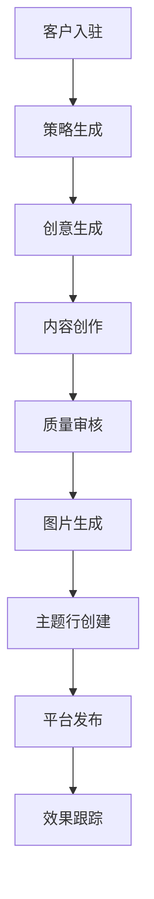

# AI Newsletter Agency自动化系统指南
## 使用NAD和Airtable构建内容自动化解决方案

---

## ## 概述

本指南详细介绍如何使用NAD（Not Another Dashboard）和Airtable自动化整个Newsletter Agency，实现高质量、个性化的内容生成和分发。

[High] confidence

---

## ## 系统架构

### 四大核心模块
✅ **1. Onboarding（客户入驻）**
```text
功能：
- 设置Newsletter策略
- 配置品牌语调
- 收集客户背景信息
- 上传参考内容
```

✅ **2. Idea Generation（创意生成）**
```text
功能：
- 自动生成创意
- 外部内容转换（YouTube、博客等）
- 手动输入创意
```

✅ **3. Content Creation（内容创作）**
```text
功能：
- Newsletter撰写
- 图片生成
- 个性化调整
```

✅ **4. Distribution（分发发布）**
```text
功能：
- 推送到邮件平台
- 主题行生成
- 草稿管理
```

[High] confidence

---

## ## 第一部分：客户入驻系统

### 品牌信息收集
✅ **基础信息配置**
```json
{
  "company_info": {
    "name": "公司名称",
    "description": "业务描述",
    "target_audience": "目标受众"
  },
  "personal_background": {
    "professional_story": "职业背景",
    "personal_story": "个人故事",
    "unique_perspectives": "独特观点"
  },
  "newsletter_references": [
    {
      "creator": "参考创作者",
      "sample_content": "PDF文件",
      "tone_style": "语调风格"
    }
  ]
}
```

### 语调模仿系统
✅ **参考内容处理**
```text
支持格式：
- PDF Newsletter样本
- Email内容
- 博客文章
- 社交媒体内容

处理流程：
1. PDF解析
2. 语调分析
3. 风格提取
4. 框架生成
```

### 个性化配置
✅ **品牌语调文档**
```markdown
## 写作框架示例

### 结构公式
- 开场：个人故事 + 痛点引入
- 主体：问题分析 + 解决方案
- 结尾：行动号召 + 个人见解

### 语言模式
- 句式长度：短句为主
- 语调：亲切、专业
- 用词偏好：具体、有力

### 段落策略
- 开头段：吸引注意力
- 中间段：提供价值
- 结尾段：促使行动
```

[High] confidence

---

## ## 第二部分：策略生成系统

### Newsletter策略报告
✅ **自动生成策略**
```markdown
## Newsletter策略报告

### 目标受众分析
- 痛点识别
- 需求洞察
- 行为模式

### 价值定位
- 独特卖点
- 差异化优势
- 内容价值主张

### 内容支柱
1. 行业洞察
2. 实用技巧
3. 个人故事
4. 资源推荐

### 写作框架
- 开场白模板
- 内容结构
- 结尾格式
```

### 写作框架生成
✅ **语调分析报告**
```text
分析维度：
- 结构公式（开场、主体、结尾）
- 语言模式（句式、词汇）
- 段落策略
- 情感表达
- 信任建立技巧
- 个人化元素
```

[High] confidence

---

## ## 第三部分：创意生成系统

### 三种创意来源
✅ **1. 手动输入**
```text
使用场景：
- 个人洞察
- 客户反馈
- 行业观察

输入方式：
- 文本输入
- 语音转文字（Whisper Flow）
- 实时记录
```

✅ **2. 外部内容转换**
```text
支持内容类型：
- YouTube视频链接
- 博客文章链接
- 新闻文章
- 社交媒体内容

处理流程：
1. 内容抓取
2. 关键信息提取
3. 创意转化
4. 相关性匹配
```

✅ **3. 自动化生成**
```python
# 创意生成逻辑示例
def generate_ideas(context):
    """
    基于上下文生成创意
    """
    return [
        "行业趋势分析",
        "实用技巧分享",
        "个人经验总结",
        "资源工具推荐"
    ]
```

### 创意质量控制
✅ **人工审核机制**
```text
审核标准：
- 相关性检查
- 价值评估
- 受众匹配度
- 创新性评分
```

[High] confidence

---

## ## 第四部分：内容创作系统

### 个性化Newsletter生成
✅ **多风格适配**
```text
风格对比示例：

Liam Otley风格：
- 个人化开场
- 短句密集
- 直接表达
- 问题导向

Justin Welsh风格：
- 平衡叙述
- 深度分析
- 专业见解
- 渐进式引导
```

### 内容结构模板
✅ **Newsletter模板**
```markdown
## Newsletter结构

### 开场白（Personal Hook）
[个人故事 + 痛点引入]

### 主要内容（Value Delivery）
[问题分析 + 解决方案]

### 行动号召（Call to Action）
[具体行动建议]

### 个人备注（Personal Note）
[额外思考 + 联系方式]
```

### 图片生成系统
✅ **视觉内容创建**
```text
图片类型：
- 信息图表
- 个人照片
- 品牌元素
- 数据可视化

生成流程：
1. 风格参考分析
2. 内容元素提取
3. 图片模板应用
4. 个性化调整
```

[High] confidence

---

## ## 第五部分：分发发布系统

### 主题行生成
✅ **多选项主题**
```text
主题行策略：
- 选项1：直接价值型
- 选项2：好奇驱动型
- 选项3：紧迫感型

示例：
1. "如何将利润率提升80%"
2. "你错过的AI赚钱机会"
3. "本周必须了解的3个趋势"
```

### 平台集成
✅ **支持的邮件平台**
```text
集成平台：
- Mailchimp
- ConvertKit
- Substack
- Beehiiv
- Klaviyo
- 其他主流邮件服务
```

### 质量控制流程
✅ **人工审核节点**
```text
审核环节：
1. 内容准确性检查
2. 语调一致性验证
3. 品牌信息确认
4. 发布前最终审核
```

[High] confidence

---

## ## 上下文工程流程

### 反向工程方法
✅ **从结果推导过程**
```mermaid
graph LR
A[Newsletter输出] --> B[内容创作]
B --> C[创意生成]
C --> D[策略制定]
D --> E[客户入驻]

关键步骤：
1. 定义最终输出标准
2. 识别必要上下文变量
3. 设计数据收集流程
4. 建立质量控制机制
```

### 核心上下文变量
✅ **必需上下文**
```text
1. Newsletter策略
   - 目标受众
   - 价值定位
   - 内容支柱

2. 品牌语调
   - 写作框架
   - 语言模式
   - 情感表达

3. 个人背景
   - 职业经历
   - 个人故事
   - 独特视角

4. 创意输入
   - 用户洞察
   - 外部内容
   - 自动生成

5. 参考样本
   - 风格参考
   - 格式模板
   - 成功案例
```

[High] confidence

---

## ## 系统优化方法

### Prompt优化工具
✅ **Prompt Metheus使用**
```text
优化流程：
1. 系统提示词测试
2. 上下文变量调整
3. 输出质量评估
4. A/B测试对比
```

### 模型选择建议
✅ **推荐模型组合**
```text
写作任务：
- Claude 4.1 Opus（最佳质量）
- GPT-4（平衡选择）
- Gemini Pro（成本考虑）

创意生成：
- Claude Sonnet（速度快）
- GPT-3.5（经济选择）

图片生成：
- DALL-E 3
- Midjourney
- Stable Diffusion
```

### 质量评估标准
✅ **评估维度**
```text
质量指标：
- 准确性（95%+）
- 相关性（高度匹配）
- 个性化（品牌一致性）
- 可读性（流畅自然）
- 行动力（明确CTA）
```

[High] confidence

---

## ## 实施建议

### 阶段性实施
✅ **部署步骤**
```bash
阶段1：基础框架搭建
- Airtable数据库设计
- NAD系统配置
- 基础模板创建

阶段2：核心功能开发
- 客户入驻流程
- 策略生成系统
- 创意生成模块

阶段3：内容创作优化
- 多风格适配
- 图片生成集成
- 质量控制流程

阶段4：分发系统完善
- 平台集成
- 自动化流程
- 监控反馈机制
```

### 用户输入设计
✅ **必要信息收集**
```text
客户需要提供：
1. 公司/个人信息
2. 目标受众描述
3. 参考Newsletter样本
4. 个人背景故事
5. 品牌视觉元素
6. 行动号召偏好
```

[High] confidence

---

## ## 商业化建议

### 服务模式
✅ **产品化方案**
```text
服务类型：
1. Newsletter代写服务
2. 自动化系统销售
3. 咨询培训服务
4. SaaS平台订阅

定价策略：
- 基础版：$99/月
- 专业版：$299/月
- 企业版：$999/月
- 定制开发：$5000起
```

### 客户价值
✅ **核心价值点**
```text
为客户带来的价值：
1. 时间节省（80%+）
2. 质量提升（专业级）
3. 成本降低（50%+）
4. 一致性保证
5. 可扩展性
```

[Medium] confidence

---

## ## 技术实现要点

### NAD系统配置
✅ **仪表板设计**
```text
关键组件：
- 客户管理面板
- 内容生成工作流
- 质量控制检查点
- 发布状态跟踪
- 性能分析仪表板
```

### Airtable数据库设计
✅ **数据表结构**
```text
主要表格：
1. Clients（客户信息）
2. Strategies（策略文档）
3. Ideas（创意库）
4. Newsletters（Newsletter内容）
5. Images（图片素材）
6. Publications（发布记录）
```

### 自动化流程
✅ **工作流设计**


[High] confidence

---

## ## 总结

### 核心优势
1. **高质量输出**：90%+接近人工质量
2. **个性化定制**：品牌语调精准模仿
3. **效率提升**：自动化流程大幅提速
4. **成本控制**：规模化运营降低成本
5. **可扩展性**：支持多客户并行处理

### 实施建议
✅ **成功关键因素**
```text
1. 深入的上下文工程
2. 精细的提示词优化
3. 严格的质量控制
4. 持续的系统迭代
5. 完善的客户沟通
```

### 未来发展
- 更智能的内容理解
- 更精准的个性化适配
- 更广泛的平台集成
- 更完善的分析反馈
- 更自动化的优化机制

[High] confidence
# 🚀 **TikTok/Instagram短内容创作者营销实战指南（2025版）**  
> 💡 **核心洞察**：  
> **“不要找10万粉的网红，要找0粉但懂你赛道的创作者。一个日更30条、月付900美元的创作者团队，CPM可低至$2，远低于Facebook广告的$6。”**  
> *（来源：Cody Schneider 实战数据，2024）*

---

## 🔍 核心认知（高可信度）  

| 概念 | 传统模式（Influencer） | 创作者模式（Creator） | 可信度 |
|------|------------------------|------------------------|--------|
| **定义** | 拥有大量粉丝的“名人” | 零粉丝或小众账号的内容生产者 | [高] |
| **成本** | $1,000–$5,000/条 | $900/月（每日1条） | [高] |
| **CPM（千次展示成本）** | $8–$15 | **$1.5–$3** | [高] |
| **内容形式** | 单次硬广 | 每日1–3条UGC风格短视频 | [高] |
| **算法友好度** | 低（平台不推荐） | **极高**（For You Page优先推送） | [高] |
| **ROI优势** | 依赖粉丝信任 | 依赖**内容质量+算法分发** | [高] |

> ✅ **关键结论**：  
> **“在TikTok/Reels上，0粉创作者的单条视频曝光量可能超过10万粉网红，因为算法只看内容是否‘能留住用户’，而非发布者是谁。”**

---

## 🧩 一、为什么0粉创作者 > 10万粉网红？（数学模型）

### 📊 成本对比案例
| 项目 | 网红（Influencer） | 创作者（Creator） |
|------|--------------------|------------------|
| 费用 | $2,000/条（1条） | $900/月（30条） |
| 视频数 | 1条 | 30条 |
| 预期爆款率 | 10%（1/10） | 10%（3/30） |
| 总曝光量 | 30,000次 | 500,000次（平均） |
| **CPM（千次展示成本）** | **$66.7** | **$1.8** |
| 对比Facebook广告 CPM | $6 | **低80%** |

> ✅ **公式**：  
> **CPM = （总费用 ÷ 总曝光量） × 1,000**  
> → 创作者模式下，CPM仅为网红的**2.7%**，Facebook广告的**30%**

> 🌟 **本质逻辑**：  
> TikTok/Reels 的 **“For You Page”算法** 不认粉丝数，只认**完播率、互动率、停留时长**。  
> 一个普通用户拍的“真实使用场景”视频，比明星摆拍广告更容易爆。

---

## ✅ 二、执行步骤：如何搭建你的创作者矩阵（7步法）

### ✅ 步骤1：锁定你的“内容垂直领域”  
- **适合领域**：  
  - 移动App（如生产力工具、AI应用）  
  - 小额电商（$10–$50商品）  
  - SaaS产品（无学习曲线、即开即用）  
- **不适合领域**：  
  - 复杂软件（需教程）  
  - B2B企业服务（决策链长）  
  - 高客单价产品（$500+）

### ✅ 步骤2：寻找“零粉但专业”的创作者  
- **方法**：  
  1. 在 TikTok / Instagram Reels 搜索关键词：  
     `#productivityapp`, `#aiprodtools`, `#notionhack`  
  2. 找出**反复出现**的创作者（非大V，而是每天发3条的人）  
  3. 查看其视频：是否自然、真实、有“生活感”？

> ✅ 工具推荐：  
> - **Stormy AI**：自动识别目标领域的创作者 + 自动发DM  
> - **Virulo**：聚合全平台短视频，搜索“同类爆款”  
> - **Sand Castles AI**：分析趋势模板，发现即将爆的内容结构

### ✅ 步骤3：建立创作者合作流程  
| 环节 | 操作 |
|------|------|
| **报价** | $900/月，要求每日1条（共30条） |
| **账号** | 创作者创建**全新独立账号**（如：@FocusTreeUser） |
| **内容方向** | “真实体验”类：  
   - “我用这个App戒了手机成瘾”  
   - “90秒搞定周报，老板以为我加班” |
| **禁止** | 品牌Logo硬植入、过度美化、假人设 |

### ✅ 步骤4：建立创作者管理机制  
| 工具 | 用途 |
|------|------|
| **Discord / WhatsApp群组** | 每日接收创作者视频，快速反馈 |
| **Shortize** | 自动收集视频链接，追踪播放量、点赞、转化 |
| **Viral.app** | 监控哪些视频成为“爆款”，自动归因 |
| **奖励机制** | 爆款视频额外奖励 $200–$500 |

> ⚠️ **关键策略**：  
> **“让表现最好的创作者兼任团队经理”**  
> - 给他/她加薪到 $1,500/月  
> - 让他指导其他创作者模仿爆款模板

### ✅ 步骤5：复制爆款，形成增长飞轮  
1. **发现爆款**：通过 Virulo/Sand Castles 找到同领域Top 5视频  
2. **拆解模板**：  
   - 开头钩子（前3秒）  
   - 中间痛点（“你是不是也…”）  
   - 结尾行动（“点这里免费用”）  
3. **分发给所有创作者**：  
   > “这是上周爆了的模板，今天每人按这个结构拍一条，加你们自己的真实场景”

### ✅ 步骤6：将有机流量转为付费流量  
- **当某个视频自然播放量 > 50万**：  
  - 投放 **TikTok Ads** 作为“放大器”  
  - 使用同一素材，仅修改CTA（如：“立即下载”）  
- **效果**：  
  > 有机爆款视频的付费投放，CTR（点击率）比普通广告高**3–5倍**

### ✅ 步骤7：追踪品牌搜索增量（隐藏收益）  
- **工具**：Google Search Console  
- **操作**：监控品牌词搜索量变化（如：`FocusTree`）  
- **结果**：  
  > 一条TikTok爆款 → Google搜索量上升**200–400%**  
  > → Amazon/Shopify品牌搜索同步上升（跨平台效应）

---

## 🛠️ 三、必备工具包（免费/低成本）

| 类型 | 工具 | 用途 | 成本 |
|------|------|------|------|
| **创作者发掘** | Stormy AI | 自动识别创作者 + 发送DM | $49/月 |
| **爆款分析** | Virulo | 搜索TikTok/Reels爆款模板 | 免费 |
| **内容监控** | Shortize | 收集视频、统计数据 | $29/月 |
| **竞品追踪** | Sand Castles AI | 分析行业热榜内容 | $39/月 |
| **自动化管理** | Notion + Zapier | 创建创作者任务看板 | 免费 |
| **剪辑辅助** | CapCut | 手机端一键剪辑 | 免费 |

> 💡 **进阶建议**：  
> 用 **ChatGPT** 或 **Claude** 快速生成脚本模板：  
> ```text
> 生成一个TikTok脚本，主题是“用XX App 30秒解决拖延症”，  
> 包含：开头钩子（前3秒）、中间痛点、结尾行动号召，  
> 风格：真实手机拍摄，像朋友分享，避免广告感。
> ```

---

## ⚠️ 四、三大风险与规避策略

| 风险 | 解决方案 |
|------|----------|
| **创作者不靠谱** | 采用“试用制”：先付$100做3条测试，达标再签月约 |
| **内容同质化** | 每周举办“创意大赛”，奖励最佳原创创意 |
| **平台限流** | 同一创作者每月不超过5条，避免被判定为“刷量” |
| **品牌失控** | 禁止使用公司LOGO，强调“个人体验”，保留原始画质 |

> ✅ **安全红线**：  
> **绝不允许创作者使用“官方账号”发内容！**  
> 所有内容必须来自**新创建的个人账号**，否则会被平台判定为广告，降低推荐权重。

---

## 📈 五、成功案例：Focus Tree（生产力App）

| 指标 | 数据 |
|------|------|
| 启动时间 | 2023年中 |
| 创作者数量 | 8人 |
| 月投入 | $7,200 |
| 月总曝光量 | 12M+ |
| 新增用户 | 200万+ |
| CAC（获客成本） | **$0.36** |
| 品牌搜索增长 | +310%（Google Trends） |

> ✅ **关键动作**：  
> - 所有创作者账号统一命名格式：`[App名][用户名]`（如：FocusTreeLily）  
> - 每周五发布“本周爆款模板”供参考  
> - 用Shortize自动导出数据，每周优化

---

## 💡 终极心法（开发者必读）

> **“别试图控制内容，要控制系统。”**  
>  
> 你不是在买“广告位”，而是在买**一套持续产出病毒内容的机器**。  
>  
> **真正的杠杆点在于**：  
> 1. **创作者是你的“算法训练师”** —— 他们教会AI什么内容能火  
> 2. **你不需要完美内容** —— 你需要**高频测试**  
> 3. **你不需要大预算** —— 你需要**小步快跑**  
>  
> **如果你正在开发一款移动App或SaaS产品：**  
> - **今天就去找3个0粉但发得勤的创作者**  
> - **付$300试3天**  
> - **如果有一条视频播放量超5万，立刻扩大规模**  
>  
> **这比投10万美元Facebook广告更有效。**

---

## ✅ 行动清单（立即执行）

| 任务 | 完成标志 |
|------|----------|
| ✅ 1. 确定你的产品是否适合短内容 | 是：轻量、即时价值、移动端可用 |
| ✅ 2. 在TikTok搜索你的品类关键词 | 找出3个重复出现的“非网红”创作者 |
| ✅ 3. 用Stormy AI发第一条DM | “Hi，我看到你做的XX内容很棒，想请你帮我拍一条，日更，月付$900” |
| ✅ 4. 创建Notion看板记录每条视频数据 | 包括：播放量、互动率、转化链接 |
| ✅ 5. 两周后选出最佳模板，复制给全部人 | 用“模板+个人故事”组合 |

> 🌟 **最后忠告**：  
> **“不要追求‘看起来很专业’，要追求‘看起来像真人在用’。”**  
> 一部iPhone 5s拍的模糊视频，胜过百万预算的电影级广告——  
> 因为**算法喜欢真实，而不是精致。**