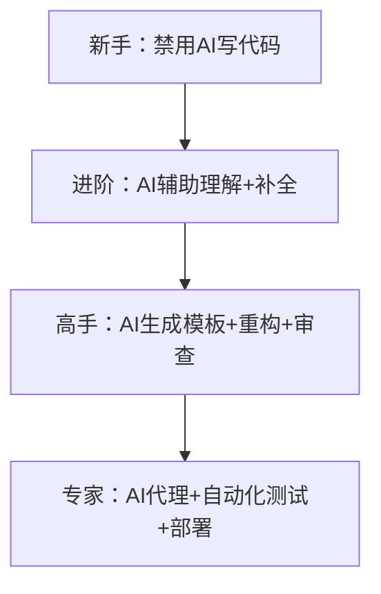

---
aliases:
date: 2025-09-15 23:01
tags:
source:
update:
rating:
view-count: 4
---


## 🎯 核心命题

> **“99% 的开发者在用 AI 写更烂的代码。”**\
> AI 不是魔法，而是放大器 ——
>
> - 放大你的效率，如果你懂架构
> - 放大你的混乱，如果你不懂基础
>
> 本白皮书提供一套**防失控、保理解、提效率**的AI协作框架，让你在2025年既快又稳。

## 🧭 第二章：AI 协作心智模型

### 🔄 AI 使用成熟度模型



### 💡 核心原则

> **“你必须比AI更懂你的代码。”**
>
> - AI是“高级实习生”，不是“架构师”
> - 你负责设计，AI负责打字
> - 所有AI输出 → 必须Review → 必须测试 → 必须小步提交

---

## 🛠️ 第三章：实战AI协作框架（分场景）

### 场景1：规划阶段（Pre-Coding）

> “不规划，直接让AI写功能 = 自杀式开发”

#### ✅ 正确做法：

1. **手绘架构图**：用户流程 → API端点 → 数据库表
2. **定义数据结构**：明确字段类型、关联关系
3. **拆解任务**：用Linear/Notion列出每个小步骤

#### 🛠️ AI辅助：

```prompt
“基于以下架构，帮我生成API端点文档：
- 用户创建短链接
- 请求体：{original_url: string, title: string}
- 响应：{short_code: string, created_at: ISO8601}”
```

> 输出 → 人工调整 → 存入项目/docs

---

### 场景2：编码阶段（In-Coding）

#### ✅ 安全模式（推荐）

| 操作    | 工具             | 示例                                |
| ----- | -------------- | --------------------------------- |
| 代码补全  | GitHub Copilot | 写`function calculateTax(` → Tab接受 |
| 生成单函数 | Claude Code    | “写一个Go函数：根据ID获取产品，参考get_user.go”  |
| 重构提取  | Cursor         | “将重复的错误处理提取到utils/error.go”       |

#### ❌ 危险模式（禁止）

```prompt
“帮我实现一个短链接系统” → AI生成500行混乱代码
```

#### 🛡️ 防护措施：

- **设置上下文规则**：\
  “所有工具函数在`/utils`，组件在`/components`，不要重复造轮子”
- **强制代码审查**：\
  每次AI生成后 → `git diff` → 逐行检查
- **小步提交**：\
  每次AI修改 → 立即提交 → 注释“AI生成，已审查”

---

### 场景3：调试阶段（Debugging）

#### ✅ 高效流程：

1. 复制错误日志 → 粘贴到Claude
2. 提问：“这个Go错误是什么原因？如何修复？”
3. AI给出方案 → **在测试环境验证** → 修复

#### ⚠️ 禁止行为：

- 让AI“直接修复我的代码” → 可能引入新Bug
- 不测试直接提交AI修复 → 生产环境爆炸

---

### 场景4：代码审查（Code Review）

#### ✅ AI审查工具矩阵

| 工具                | 优势         | 适用场景      |
| ----------------- | ---------- | --------- |
| **Cubic**         | 捕获细微Bug    | 逻辑错误、边界条件 |
| **CodeRabbit**    | 代码风格一致性    | 团队协作、PR预审 |
| **Cursor BugBot** | 集成IDE，快速反馈 | 个人项目、实时审查 |

#### 🛠️ 配置建议：

```yaml
# cubic.config.yaml
rules:
  - no-unused-vars
  - consistent-error-handling
  - database-query-optimization
ignore:
  - /legacy/  # 旧代码不审查
```

> 📌 **审查原则**：\
> “AI审查是‘第二双眼睛’，不是‘最终裁判’ —— 你仍有否决权。”

---

## 📜 第五章：团队/个人AI使用规范

### ✅ 个人开发者规范

```markdown
# AI使用守则（个人版）

1. **规划先行**：无架构图 → 禁用AI
2. **小步生成**：每次AI生成 ≤ 50行代码
3. **强制审查**：所有AI输出 → 必须`git diff` → 必须测试
4. **注释标记**：AI生成代码头部加注释：
   // AI-Generated by Claude Code v3
   // Reviewed by [Your Name] on 2025-06-01
5. **每周清理**：周日花1小时删除/重构低质量AI代码
```

### 👥 团队协作规范（附加）

```markdown
# AI使用守则（团队版）

1. **禁用自由发挥**：AI必须按`/docs/architecture.md`生成
2. **PR强制AI审查**：所有PR必须通过Cubic/CodeRabbit
3. **风格一致性**：AI配置团队ESLint/Prettier规则
4. **知识沉淀**：优秀AI生成案例 → 存入`/docs/ai_examples.md`
```

---

## 🧪 第六章：技术选型建议（2025）

### 🛠️ 工具推荐矩阵

| 场景       | 推荐工具             | 理由                  |
| -------- | ---------------- | ------------------- |
| **概念学习** | ChatGPT-4o网页版    | 无IDE干扰，专注理解         |
| **代码补全** | GitHub Copilot   | 流畅自然，不打断心流          |
| **函数生成** | Claude Code      | 上下文理解强，风格匹配好        |
| **重构优化** | Cursor Agent     | 深度集成VS Code，可视化Diff |
| **代码审查** | Cubic            | 捕获Bug能力强，可定制规则      |
| **架构设计** | Mermaid + Claude | 文字转图表，快速迭代设计        |

> ⚠️ **避坑提示**：
>
> - 避免使用Replit等“全AI生成”平台 → 曾删除用户数据库
> - 慎用“AI代理全自动开发” → 目前技术不成熟

---

## 📈 第七章：效率监控指标

| 指标       | 健康值   | 监控方式                            |
| -------- | ----- | ------------------------------- |
| AI生成代码占比 | ≤ 30% | `git log --grep="AI-Generated"` |
| AI代码Bug率 | ≤ 5%  | Cubic报告 + 人工抽查                  |
| 代码审查通过率  | ≥ 90% | PR工具统计                          |
| 架构文档更新频率 | 每周1次  | `docs/`目录Commit记录               |

> 📌 **警戒线**：\
> 若AI生成代码占比 > 50% → 立即暂停AI，回归手写

---

---

## 📎 附录：作者工具链（Creator Kiwi项目）

```yaml
# 技术栈
Frontend: Next.js + TypeScript + Tailwind
Backend: Go + PostgreSQL
AI工具:
  - Claude Code (VS Code插件) # 主力生成
  - GitHub Copilot # 补全
  - Cubic # 代码审查
  - Mermaid Live Editor # 架构图

# 工作流
1. Linear规划 → 2. 手绘架构 → 3. Claude生成骨架 → 4. 手写核心逻辑 → 5. Cubic审查 → 6. 部署
```
