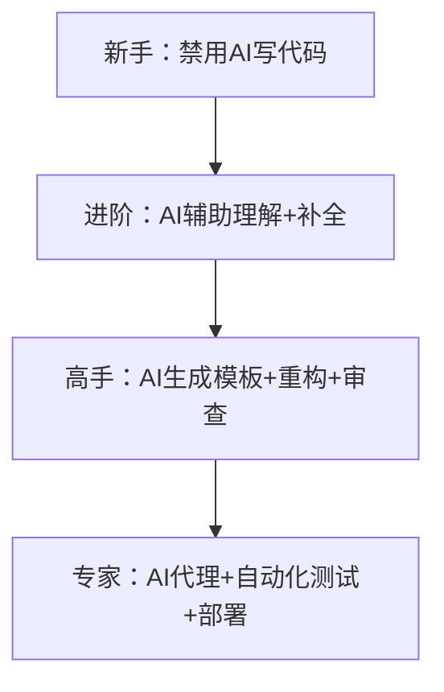

📘 **《AI 编程生存指南：如何用 AI 加速而不失控 —— 开发者技术白皮书（2025 实战版）》**\
*作者：8年开发者，曾误入“AI地狱”，现用AI高效构建SaaS产品*\
*适用对象：焦虑的初学者、依赖AI的中级者、追求效率的资深者*

---

## 🎯 核心命题

> **“99% 的开发者在用 AI 写更烂的代码。”**\
> AI 不是魔法，而是放大器 ——
>
> - 放大你的效率，如果你懂架构
> - 放大你的混乱，如果你不懂基础
>
> 本白皮书提供一套**防失控、保理解、提效率**的AI协作框架，让你在2025年既快又稳。

---

## ⚠️ 第一章：AI 使用红线（新手必读）

### ❌ 绝对禁区（新手阶段）

| 行为           | 风险等级  | 后果          |
| ------------ | ----- | ----------- |
| 让AI写整段函数     | 🔴 红色 | 丧失基础能力，调试崩溃 |
| 复制粘贴AI代码不理解  | 🔴 红色 | 技术债爆炸，生产事故  |
| 用AI代替文档/教程学习 | 🔴 红色 | 知识碎片化，无法体系化 |

### ✅ 安全区（新手阶段）

| 行为        | 工具推荐       | 示例                     |
| --------- | ---------- | ---------------------- |
| 用AI提问概念   | ChatGPT网页版 | “React的useEffect是干嘛的？” |
| 问语法/最佳实践  | Claude 3   | “Go中如何优雅处理错误？”         |
| 查内置函数是否存在 | 官方文档+AI    | “Python有内置的日期解析吗？”     |

> 📌 **新手铁律**：\
> “前3个月，禁用所有IDE内嵌AI（Cursor/Copilot等），只用网页版提问。”

---

## 🧭 第二章：AI 协作心智模型

### 🔄 AI 使用成熟度模型



### 💡 核心原则

> **“你必须比AI更懂你的代码。”**
>
> - AI是“高级实习生”，不是“架构师”
> - 你负责设计，AI负责打字
> - 所有AI输出 → 必须Review → 必须测试 → 必须小步提交

---

## 🛠️ 第三章：实战AI协作框架（分场景）

### 场景1：规划阶段（Pre-Coding）

> “不规划，直接让AI写功能 = 自杀式开发”

#### ✅ 正确做法：

1. **手绘架构图**：用户流程 → API端点 → 数据库表
2. **定义数据结构**：明确字段类型、关联关系
3. **拆解任务**：用Linear/Notion列出每个小步骤

#### 🛠️ AI辅助：

```prompt
“基于以下架构，帮我生成API端点文档：
- 用户创建短链接
- 请求体：{original_url: string, title: string}
- 响应：{short_code: string, created_at: ISO8601}”
```

> 输出 → 人工调整 → 存入项目/docs

---

### 场景2：编码阶段（In-Coding）

#### ✅ 安全模式（推荐）

| 操作    | 工具             | 示例                                |
| ----- | -------------- | --------------------------------- |
| 代码补全  | GitHub Copilot | 写`function calculateTax(` → Tab接受 |
| 生成单函数 | Claude Code    | “写一个Go函数：根据ID获取产品，参考get_user.go”  |
| 重构提取  | Cursor         | “将重复的错误处理提取到utils/error.go”       |

#### ❌ 危险模式（禁止）

```prompt
“帮我实现一个短链接系统” → AI生成500行混乱代码
```

#### 🛡️ 防护措施：

- **设置上下文规则**：\
  “所有工具函数在`/utils`，组件在`/components`，不要重复造轮子”
- **强制代码审查**：\
  每次AI生成后 → `git diff` → 逐行检查
- **小步提交**：\
  每次AI修改 → 立即提交 → 注释“AI生成，已审查”

---

### 场景3：调试阶段（Debugging）

#### ✅ 高效流程：

1. 复制错误日志 → 粘贴到Claude
2. 提问：“这个Go错误是什么原因？如何修复？”
3. AI给出方案 → **在测试环境验证** → 修复

#### ⚠️ 禁止行为：

- 让AI“直接修复我的代码” → 可能引入新Bug
- 不测试直接提交AI修复 → 生产环境爆炸

---

### 场景4：代码审查（Code Review）

#### ✅ AI审查工具矩阵

| 工具                | 优势         | 适用场景      |
| ----------------- | ---------- | --------- |
| **Cubic**         | 捕获细微Bug    | 逻辑错误、边界条件 |
| **CodeRabbit**    | 代码风格一致性    | 团队协作、PR预审 |
| **Cursor BugBot** | 集成IDE，快速反馈 | 个人项目、实时审查 |

#### 🛠️ 配置建议：

```yaml
# cubic.config.yaml
rules:
  - no-unused-vars
  - consistent-error-handling
  - database-query-optimization
ignore:
  - /legacy/  # 旧代码不审查
```

> 📌 **审查原则**：\
> “AI审查是‘第二双眼睛’，不是‘最终裁判’ —— 你仍有否决权。”

---

## 🚫 第四章：AI 地狱逃生指南

### 🚨 AI 地狱症状

- 没有AI → 完全不知道如何开始编码
- 代码库中有大量“不知道谁写的”函数
- 调试时发现AI生成的代码互相冲突
- 项目结构混乱，重复代码泛滥

### 🛠️ 逃生方案

1. **立即冻结AI写代码**：回归手写1周
2. **清理技术债**：
   - 用`grep -r "AI generated" .` 找出AI代码
   - 逐个重写/理解/测试
3. **重建架构文档**：手绘当前系统架构图
4. **制定AI使用规范**（见下文）

---

## 📜 第五章：团队/个人AI使用规范

### ✅ 个人开发者规范

```markdown
# AI使用守则（个人版）

1. **规划先行**：无架构图 → 禁用AI
2. **小步生成**：每次AI生成 ≤ 50行代码
3. **强制审查**：所有AI输出 → 必须`git diff` → 必须测试
4. **注释标记**：AI生成代码头部加注释：
   // AI-Generated by Claude Code v3
   // Reviewed by [Your Name] on 2025-06-01
5. **每周清理**：周日花1小时删除/重构低质量AI代码
```

### 👥 团队协作规范（附加）

```markdown
# AI使用守则（团队版）

1. **禁用自由发挥**：AI必须按`/docs/architecture.md`生成
2. **PR强制AI审查**：所有PR必须通过Cubic/CodeRabbit
3. **风格一致性**：AI配置团队ESLint/Prettier规则
4. **知识沉淀**：优秀AI生成案例 → 存入`/docs/ai_examples.md`
```

---

## 🧪 第六章：技术选型建议（2025）

### 🛠️ 工具推荐矩阵

| 场景       | 推荐工具             | 理由                  |
| -------- | ---------------- | ------------------- |
| **概念学习** | ChatGPT-4o网页版    | 无IDE干扰，专注理解         |
| **代码补全** | GitHub Copilot   | 流畅自然，不打断心流          |
| **函数生成** | Claude Code      | 上下文理解强，风格匹配好        |
| **重构优化** | Cursor Agent     | 深度集成VS Code，可视化Diff |
| **代码审查** | Cubic            | 捕获Bug能力强，可定制规则      |
| **架构设计** | Mermaid + Claude | 文字转图表，快速迭代设计        |

> ⚠️ **避坑提示**：
>
> - 避免使用Replit等“全AI生成”平台 → 曾删除用户数据库
> - 慎用“AI代理全自动开发” → 目前技术不成熟

---

## 📈 第七章：效率监控指标

| 指标       | 健康值   | 监控方式                            |
| -------- | ----- | ------------------------------- |
| AI生成代码占比 | ≤ 30% | `git log --grep="AI-Generated"` |
| AI代码Bug率 | ≤ 5%  | Cubic报告 + 人工抽查                  |
| 代码审查通过率  | ≥ 90% | PR工具统计                          |
| 架构文档更新频率 | 每周1次  | `docs/`目录Commit记录               |

> 📌 **警戒线**：\
> 若AI生成代码占比 > 50% → 立即暂停AI，回归手写

---

## 🚀 第八章：30天渐进式训练计划

| 周数  | 目标        | 关键动作                    | 成功标志          |
| --- | --------- | ----------------------- | ------------- |
| 第1周 | 戒断AI写代码   | 禁用IDE AI，手写所有代码         | 完成1个小功能（如登录页） |
| 第2周 | 引入安全AI辅助  | 仅用Copilot补全 + Claude查概念 | 理解所有手写代码的每一行  |
| 第3周 | 尝试AI生成单函数 | 生成≤50行工具函数，强制Review+测试  | AI生成函数0 Bug   |
| 第4周 | 部署AI审查流程  | 配置Cubic，所有PR过审          | 捕获≥3个潜在Bug    |

---

## 💡 终极心法

> **“AI时代，真正的护城河不是‘会不会用AI’，而是‘懂不懂不用AI也能活’。”**
>
> - 用AI加速，但保持手写能力
> - 用AI生成，但保持架构思维
> - 用AI审查，但保持最终决策权
>
> **记住：你是指挥官，AI是士兵。士兵可以换，指挥官不能倒。**

---

## 📎 附录：作者工具链（Creator Kiwi项目）

```yaml
# 技术栈
Frontend: Next.js + TypeScript + Tailwind
Backend: Go + PostgreSQL
AI工具:
  - Claude Code (VS Code插件) # 主力生成
  - GitHub Copilot # 补全
  - Cubic # 代码审查
  - Mermaid Live Editor # 架构图

# 工作流
1. Linear规划 → 2. 手绘架构 → 3. Claude生成骨架 → 4. 手写核心逻辑 → 5. Cubic审查 → 6. 部署
```

---

> ✍️ **作者结语**：\
> 我曾让AI毁掉我的项目，也曾让AI加速我的成功。\
> 区别只在于：我是否先理解了问题，再让AI帮我打字。\
> **现在，关掉这篇文档，打开你的编辑器——先手写10行代码，再考虑AI。**\
> 30天后，你会感谢今天的自己。

---

📘 **本白皮书持续更新**\
GitHub仓库：github.com/yourname/ai-coding-survival-guide\
**欢迎提交Issue/PR，共同完善这份“AI时代开发者生存手册”**

---

# AI辅助编程实战指南：避免99%开发者正在犯的致命错误

## 引言：AI时代开发者的生存法则

"99%的开发者仍不了解AI的基础知识，这使他们编写的代码比以往更糟糕。" 作为一名拥有8年编程经验的开发者，我最近才发布了我的首个商业SaaS产品。这段4个月的项目经历教会了我比4年计算机科学学位更多的东西。AI确实让我能快速交付新功能，但关键在于——我仍然完全理解整个应用的工作原理，因此当问题出现时，我能准确修复。

本指南将揭示如何正确使用AI辅助编程，避免陷入"AI地狱"（比教程地狱危险10倍的陷阱），同时保持对代码的掌控力。

> **核心原则**：AI不是替代开发者，而是放大器。它能将优秀开发者的工作效率提升10倍，但也会放大新手的无知。

## 第一部分：AI使用的基本原则

### 1. 初学者的AI使用守则

**绝对禁忌**：

- 不要让AI为你编写第一个函数
- 不要跳过基础语法和概念学习
- 不要依赖AI生成完整项目结构

**推荐策略**：

- **阶段1（0-100小时编码经验）**：
  - 完全避免AI代码生成
  - 使用纯VS Code或简单文本编辑器
  - 通过短YouTube教程学习基础
  - 用AI作为"概念问答器"（单独窗口，非集成到编辑器）

- **阶段2（100-500小时编码经验）**：
  - 仅使用AI解释概念："如何理解JavaScript闭包？"
  - 查询内置函数："Python中是否有类似JavaScript的map方法？"
  - 询问最佳实践："React组件应该用函数还是类？"
  - 验证语法："TypeScript中如何定义可选属性？"

> "如果你从未写过一行代码，不要碰AI代码生成工具。先理解基础，再让AI加速。"

### 2. 识别并避免"AI地狱"

**什么是AI地狱**：

> "能够借助AI取得进展，但没有AI就迷失方向，不知从何开始的状态。"

**危险信号**：

- 无法解释自己代码库中的关键部分
- 遇到错误时首先求助AI而非尝试理解
- 不知道如何手动修复AI生成的bug
- 项目复杂度增加后，AI修复一个bug导致三个新bug

**预防策略**：

- **5分钟规则**：遇到问题先尝试自己解决5分钟
- **代码注释**：为所有AI生成的代码添加详细注释
- **定期"断电"**：每周一天禁用AI工具，仅用基础编辑器
- **理解验证**：每次接受AI建议前，能向假想学生解释其原理

### 3. 项目规划：AI时代被忽视的关键

**致命错误**：认为"快速迭代"意味着无需规划

**AI强化规划框架**：

```
需求 → 架构图 → API设计 → 数据库结构 → UI流程 → 代码实现
```

**具体实施步骤**：

1. **需求明确化**：
   - 用自然语言描述功能："用户应能创建带标题、段落和表单的落地页"
   - 避免模糊表述："构建一个简单的页面生成器"

2. **架构可视化**：
   - 手绘或使用Mermaid生成系统图
   - 明确前端-后端交互点
   - 标注关键数据流

3. **API设计先行**：
   ````markdown
   ## GET /api/pages/:id
   **请求**:
   - 路径参数: id (页面ID)

   **响应**:
   ```json
   {
     "id": "string",
     "blocks": [
       {
         "type": "heading|paragraph|form",
         "content": "string"
       }
     ]
   }
   ````

4. **数据库结构**：
   ```sql
   CREATE TABLE pages (
     id UUID PRIMARY KEY,
     user_id UUID REFERENCES users(id),
     created_at TIMESTAMP
   );

   CREATE TABLE page_blocks (
     id UUID PRIMARY KEY,
     page_id UUID REFERENCES pages(id),
     block_type VARCHAR(20),
     content JSONB,
     position INT
   );
   ```

> **案例教训**：作者尝试构建落地页生成器时，因缺乏前期规划，导致花费数周时间处理块状结构问题，最终不得不搁置。"即使使用AI，没有规划的编码只会产生更多技术债务。"

## 第二部分：AI协作开发实战技巧

### 1. 高效与AI沟通的框架

**低效提示**：

> "构建一个简单的落地页生成器"

**高效提示**：

```markdown
我需要一个落地页生成器，类似Tally的界面。具体要求：
- 用户可添加三种区块：标题、段落、表单
- 每个区块可拖拽排序
- 表单区块应包含电子邮件输入和提交按钮
- 数据应存储在page_blocks表中（结构如下）
- 前端使用React + Tailwind CSS
- 后端使用Go，API端点为POST /api/pages

请生成以下内容：
1. 前端PageBuilder组件骨架
2. 处理区块添加/删除的React状态管理
3. 与后端API交互的函数
```

**提示工程原则**：

- **提供上下文**：当前代码结构、相关文件位置
- **指定格式**：要求特定代码风格或结构
- **限制范围**：明确需要生成的具体部分
- **参考示例**：提供类似功能的现有代码

### 2. AI工具选择与配置

**工具对比矩阵**：

| 工具                 | 优势           | 适用场景       | 配置建议      |
| ------------------ | ------------ | ---------- | --------- |
| **Claude Code**    | 上下文理解强，风格一致  | API开发、后端逻辑 | 设置代码库结构描述 |
| **Cursor**         | 深度集成，Agent模式 | 前端开发、UI构建  | 配置组件库位置   |
| **GitHub Copilot** | 代码补全流畅       | 日常编码加速     | 开启严格模式    |
| **Cubic**          | 深度代码审查       | PR审查、质量保证  | 自定义规则集    |

**关键配置技巧**：

- **上下文映射**：明确告知AI关键代码位置
  ```
  共享组件位于/src/components/shared
  API客户端在/src/lib/api
  样式变量定义在/src/styles/variables.css
  ```

- **风格指南**：提供代码风格示例
  ```
  我们使用单引号、2空格缩进、函数组件命名规范为PascalCase
  参考文件: /src/components/Button.jsx
  ```

- **避免冗余**：指定已有功能位置
  ```
  表单验证已实现在/src/lib/validation.js
  不要重新实现toast通知，使用/src/components/Toast.jsx
  ```

### 3. 重构与代码质量维护

**AI辅助重构流程**：

1. **问题识别**：明确需要改进的具体方面
   - "将/src/pages/Dashboard.jsx拆分为可重用组件"
   - "优化/user-service.js中的数据库查询性能"

2. **分步指令**：避免一次性大改动
   ```
   步骤1: 提取Dashboard中的统计卡片为独立组件
   步骤2: 为新组件添加TypeScript接口
   步骤3: 将数据获取逻辑移到自定义hook
   ```

3. **验证与测试**：
   - 要求AI生成测试用例
   - 手动验证关键路径
   - 逐步集成而非一次性替换

**代码质量保障**：

- **PR审查自动化**：即使单人项目也使用PR流程

- **AI审查工具配置**：
  ```yaml
  # cubic.yml
  rules:
    - name: "Avoid console.log in production"
      pattern: "console\.log"
      severity: "error"
    - name: "TypeScript interfaces should be PascalCase"
      pattern: "interface [a-z]"
      severity: "warning"
  ```

- **定期技术债务检查**：每月运行AI审查整个代码库

### 4. UI开发的精准控制

**低效使用**：

> "创建一个空状态页面"

**高效使用**：

1. **提供视觉参考**：
   - 截图设计灵感（Mobbin等网站）
   - Figma链接或具体描述

2. **精确组件指令**：
   ```
   创建一个空状态组件，要求：
   - 使用flex布局，垂直居中
   - 包含一个24x24的SVG图标（使用/src/icons/EmptyState.jsx）
   - 标题为"尚未创建落地页"，使用text-lg
   - 描述文本为"点击'新建'按钮开始创建你的第一个落地页"
   - 主要按钮为蓝色，次要按钮为白色边框
   - 整体内边距为p-6，最大宽度为max-w-md
   ```

3. **渐进式构建**：
   - 先生成基础结构
   - 再添加交互逻辑
   - 最后优化样式

> "关键不是让AI自由发挥，而是提供足够指导，让它只负责'打字'，而你掌控设计决策。"

## 第三部分：专业工作流整合

### 1. AI增强的开发工作流

**理想工作流**：

```
规划 → 手动实现核心逻辑 → AI加速样板代码 → 人工审查 → AI代码审查 → 提交
```

**每日实践**：

- **早晨**：手动编写核心业务逻辑（无AI）
- **下午**：使用AI加速样板代码和UI实现
- **结束前**：运行AI代码审查，记录学习点

**关键平衡点**：

- 核心业务逻辑：手动编写（确保理解）
- 样板代码：AI加速（提高效率）
- 边界情况：人工思考（AI不擅长）

### 2. Tab补全：保持控制的AI辅助

**高效使用策略**：

- **确认式接受**：只接受完全理解的建议
- **部分采用**：使用部分建议，修改其余
- **风格匹配**：确保建议符合项目风格

**最佳实践**：

1. 看到建议后，先尝试自己编写
2. 比较自己方案与AI建议
3. 选择最佳部分，添加必要修改
4. 为采用的部分添加注释解释

> "GitHub Copilot的补全功能是我最喜欢的AI辅助方式——它不会接管控制权，只是让我打字更快。"

### 3. 代码所有权与责任

**关键原则**：

- **你对所有代码负责**，无论是否由AI生成
- **理解优先于功能**：能解释比能运行更重要
- **技术债务意识**：AI生成的代码可能有隐藏债务

**责任检查表**：

- [ ] 我能解释这段代码的工作原理
- [ ] 我理解所有关键依赖关系
- [ ] 我知道如何测试主要场景
- [ ] 我能识别潜在边界情况
- [ ] 我知道如何调试常见问题

### 4. 长期技能发展策略

**避免技能退化**：

- **基础维护**：每周留出2小时"无AI编码"
- **深度学习**：每月选择一个AI生成的模块，手动重写
- **教学输出**：通过博客/视频解释AI生成的关键部分
- **技术雷达**：定期评估基础技术的掌握程度

**技能成长路径**：

```
基础掌握 → 有效使用AI → 理解AI局限 → 指导AI → 优化AI工作流
```

> "真正的生产力提升来自于对基础的深刻理解，而非工具的频繁更换。AI只是放大器，你才是核心。"

## 第四部分：实施路线图

### 第1-2周：建立基础

| 天数 | 任务               | 验收标准                       |
| -- | ---------------- | -------------------------- |
| 1  | 禁用所有AI代码生成工具     | 能在纯VS Code中创建"Hello World" |
| 2  | 手动实现简单功能（如表单验证）  | 无AI辅助完成并理解全部代码             |
| 3  | 用AI作为问答工具（单独窗口）  | 能解释3个关键概念                  |
| 4  | 创建项目规划模板         | 有API设计和数据库结构示例             |
| 5  | 实现第一个小功能，完整规划    | 从需求到代码的完整文档                |
| 6  | 引入AI补全（如Copilot） | 仅用于语法加速，理解所有建议             |
| 7  | 周回顾与调整           | 识别2个可改进点                   |

### 第3-4周：AI集成

| 天数 | 任务                   | 验收标准       |
| -- | -------------------- | ---------- |
| 8  | 配置Claude Code/Cursor | 有清晰的上下文映射  |
| 9  | 使用AI生成样板代码           | 100%审查并理解  |
| 10 | 实施AI代码审查工具           | 有自定义规则集    |
| 11 | 尝试重构一个小模块            | 有前后对比和学习总结 |
| 12 | 创建组件库文档              | AI能准确引用组件  |
| 13 | 手动重写AI生成的关键模块        | 能解释改进点     |
| 14 | 月度回顾与规划              | 制定下阶段目标    |

### 持续实践：AI增强开发者每日习惯

1. **晨间编码**（无AI）：30-60分钟核心逻辑开发
2. **规划时间**：为当天任务创建详细计划
3. **AI加速期**：使用AI处理样板代码和UI
4. **审查环节**：人工+AI双重审查
5. **学习记录**：记录当天AI辅助学到的关键点
6. **无AI时段**：每周留出半天"基础维护"时间

## 结语：成为AI时代的超级开发者

AI不是开发工作的终点，而是新起点。真正的赢家不是那些最早采用AI的人，而是那些懂得如何让AI服务于清晰思维和扎实基础的人。

> "AI能让你写代码更快，但只有理解才能让你构建正确的东西。"

**行动号召**：

1. 如果你是初学者：禁用AI代码生成，专注基础
2. 如果你有经验：实施严格的AI使用规范
3. 所有开发者：建立清晰的规划流程，即使使用AI

记住：**你的价值不在于你能生成多少代码，而在于你能解决多少问题。** AI只是工具，而你是掌舵者。掌握这一平衡，你将成为99%开发者无法企及的超级开发者。
