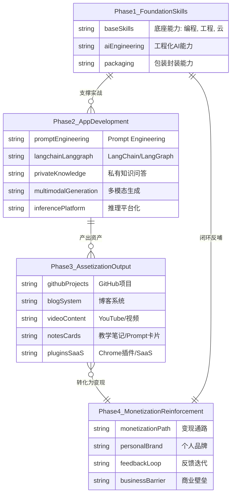
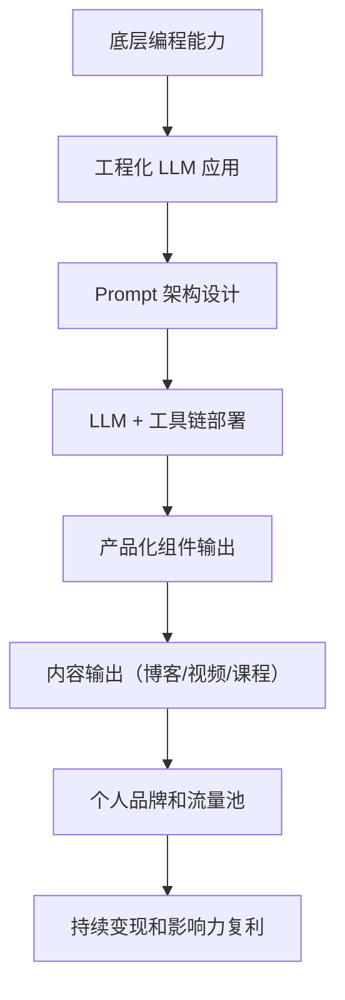

好的 Sam，我们将围绕你的目标「高效掌握 AIGC 应用，以最大限度发挥个人的财富潜能」，构建一套系统的 **能力飞轮学习路线图**。

---





这个图现在符合 Mermaid ER 图的语法，并能较好地体现笔记中 AIGC 能力飞轮的构建过程：基础能力支撑应用实战，实战产出资产，资产转化为变现，变现反过来强化基础能力，形成闭环。
## 🧠 AIGC 能力飞轮学习路线图（v1）

我们将分 4 阶段构建，按能力复利结构设计，从基础到底层、从实战到变现，带动能力互相增强。

---

### ✅ 阶段一：构建底座能力（系统掌控 + 快速迁移）

**目标：掌握所有 AIGC 应用的通用技能底层，快速适配任何新技术趋势。**

| 核心模块         | 技能要点                                | 推荐任务                             |
| ------------ | ----------------------------------- | -------------------------------- |
| 🧱 编程基础      | Python、JS、Shell（熟练建模、API 构建、异步处理）   | 编写 LLM 推理服务（FastAPI）             |
| 🧩 系统工程力     | Git、Docker、CI/CD、Makefile、任务调度      | 构建 Docker 化 AI 应用，部署到本地 / 云      |
| 🔧 云原生入门     | K3s / EKS、Helm、Ingress、服务治理         | 用 Helm 一键部署一个 LangChain 应用       |
| ⚙️ 工程化 AI 能力 | OpenAI SDK、LangChain、RAG、Embeddings | 搭建 RAG pipeline + 快速迭代 Prompt    |
| 📦 包装封装能力    | 抽象出 API/SDK/微服务组件                   | 编写可复用 Python 包（eg. `aigc-utils`） |

---

### ✅ 阶段二：AIGC 应用实战（从调用者 → 架构师）

**目标：掌握 AIGC 全链路落地技术，构建 Agent + UI + 推理引擎 + 数据流**

| 核心模块                     | 技能要点                                      | 推荐项目                      |
| ------------------------ | ----------------------------------------- | ------------------------- |
| 📜 Prompt Engineering    | Prompt Tree / ReAct / Few-shot / Tool Use | ChatGPT + 插件系统 Prompt 设计  |
| 🔗 LangChain / LangGraph | Agent 模型 / 多工具协作 / 状态管理                   | 构建多角色 LLM Agent（多工具调用）    |
| 🧠 私有知识问答系统              | RAG / 向量库（FAISS / Weaviate）               | 企业级文档助手 / PDF 文档 Q&A      |
| 🛠️ 多模态生成                | 图像（SDXL）、语音（TTS）、视频（Runway）               | 图文转视频助手 / 模拟讲师工具          |
| 📊 LLM 推理平台化             | 推理 API、调度、任务池、日志                          | 使用 FastAPI + Redis 构建推理平台 |

---

### ✅ 阶段三：资产化输出（从实战能力 → 影响力 + 产品）

**目标：将技术资产转化为可运营、可分发的「赚钱工具 / 内容 / 产品」**

|输出类型|技能要点|示例操作|
|---|---|---|
|🧑‍💻 GitHub 项目|开源结构 + 说明文档 + 自动部署|搭建一个 Star 级 RAG 项目|
|📚 博客系统|技术深度文章 + SEO 优化 + 连载计划|使用 Hugo + Notion 发布 AIGC 系列|
|📹 YouTube/视频|AI 实战录屏 + 提示词解析 + 视觉引导|视频系列：《用 LangChain 构建 LLM 工具箱》|
|🧠 教学笔记 / Prompt 卡片|提示词集合 / 多模态流程图 / 模板库|发布到 Notion + GitHub + 产品化|
|💡 Chrome 插件 / SaaS|产品 MVP，构建用户通道|构建 ChatGPT 增强工具插件|

---

### ✅ 阶段四：闭环强化（从内容变现 → 构建 AI 财富飞轮）

**目标：构建长期变现通路和 AIGC 商业模型，持续积累收益与用户资产**

|板块|技能要点|路径建议|
|---|---|---|
|🚀 变现通路|Stripe API / Gumroad / 订阅系统|构建 AIGC SaaS，提供 API 或工具包|
|🏗️ 个人品牌|SEO / 社交曝光 / 内容矩阵|与 GitHub + 博客 + 视频同步输出|
|🔄 反馈迭代|模型评估 + 自动收集用户使用数据|加入日志/监控体系，持续优化 Prompt|
|🔒 商业壁垒|训练私有模型 / 增加知识图谱|构建企业内知识图谱 + 嵌入定制模型|

---

## 📌 可视化图谱结构（模块视角）



---

## 📦 下一步我可以为你做什么？

1. ✅ 根据路线图自动生成「学习任务清单 + 项目实践计划」
    
2. ✅ 为每一阶段搭建 GitHub + 博客模板（含项目结构）
    
3. ✅ 提炼 3 个落地变现方向并直接生成 MVP 代码框架
    

你只需回复：「开始第一阶段」，我将自动为你展开任务表 + 配套工具链。


---

非常好，Sam。结合你的目标（高效掌握 AIGC 应用，实现能力变现），以下是 **3 个具备短期落地 + 中期商业化潜力** 的小产品方向，我将同时为每个方向附带 MVP Demo 架构与生成建议。

---

## 🧩 产品方向 1：LLM + 私有知识库智能助手（RAG）

**用户痛点：** 企业内部知识碎片化，查资料低效  
**目标用户：** 企业技术支持、律师事务所、高校教师  
**核心能力链：** Embedding + LangChain + FastAPI + ChatUI

### ✅ MVP 功能

- 上传本地 PDF / DOCX / Markdown
    
- 自动向量化存储（FAISS / Weaviate）
    
- 使用 GPT 进行上下文问答
    
- 支持 Chat History + Markdown 渲染
    

### 📦 Demo 目录结构

```
rag-assistant/
├── backend/               # FastAPI + LangChain
│   ├── app.py
│   ├── rag_engine.py
│   └── vector_store/
├── frontend/              # React + Tailwind + ChatUI
│   ├── pages/
│   └── components/
├── docker-compose.yml
└── README.md
```

> ✅ 技术亮点：RAG 架构完整、可扩展上传接口、知识私有化安全、Chat 界面易商业化。

---

## 🧩 产品方向 2：多工具协作型 AI Agent（Agent Workflow Tool）

**用户痛点：重复任务手动操作（如写日报、汇报、邮件）  
**目标用户：程序员、产品经理、销售、运营  
**核心能力链：LangGraph / LangChain Agent + Tools + Streamlit

### ✅ MVP 功能

- 支持自然语言指令解析任务（如“总结本周日报”）
    
- 支持调用工具链（Google Search、Markdown Generator、邮件格式模板）
    
- 输出结构化文档（自动保存为 Markdown + 发送）
    

### 📦 Demo 目录结构

```
agent-assistant/
├── agents/
│   ├── task_router.py
│   ├── tools/
│   │   └── search_tool.py
│   └── planner.py
├── ui/
│   ├── streamlit_app.py
├── workflows/
│   └── weekly_summary.yaml
└── README.md
```

> ✅ 技术亮点：可逐步添加自定义工具；适合打造「个人 AI 执行官」雏形。

---

## 🧩 产品方向 3：AI Prompt 智能提示词市场（Prompt Tool + Monetization）

**用户痛点：找不到高质量 Prompt，或者不会复用优化  
**目标用户：AI 内容创作者、设计师、新媒体人  
**核心能力链：Next.js + Prisma + Stripe + PromptEngine

### ✅ MVP 功能

- 高质量 Prompt 管理（分类、搜索、版本管理）
    
- 支持一键执行（GPT API 集成）
    
- 登录 + 收藏 + 下载 JSON/PDF
    
- 付费用户专属 Prompt 区
    

### 📦 Demo 目录结构

```
prompt-marketplace/
├── pages/
│   ├── index.tsx
│   ├── prompt/[id].tsx
├── lib/
│   ├── gptExecutor.ts
├── prisma/
│   └── schema.prisma
├── stripe/
│   └── checkout.ts
└── README.md
```

> ✅ 技术亮点：具备平台化、内容变现、可迭代空间大，是能力复利场景闭环。

---

## 🎁 下一步：为你自动生成代码仓库模板？

你可以回复如下操作指令，我将开始生成：

- 「生成第一个项目的 GitHub 模板并打包下载」
    
- 「生成三个项目的完整 starter 包（含 Docker + Readme）」
    
- 「选择第二个项目，并创建一个 YouTube 视频脚本」
    
- 「将第一个项目封装成 VS Code 插件/浏览器插件」
    

---

你选哪一个方向，我们就能立刻开始 MVP 实战落地。🚀