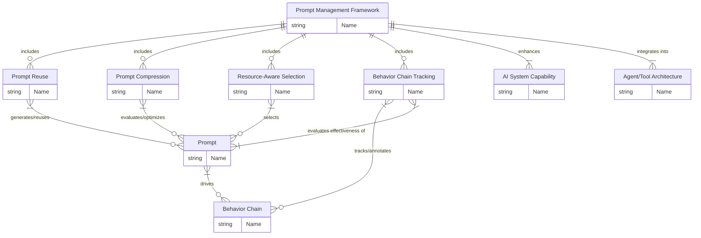

**引言：复杂AI系统中的Prompt挑战与高级管理框架**

随着大型语言模型（LLM）在构建AI Agent、实现Tool Injection以及结合知识图谱（如GraphRAG）等复杂应用中的核心作用日益凸显，对Prompt的管理不再是简单的文本编写。我们需要一个系统化、可量化、资源感知且易于调试的高级Prompt管理框架。

本文将深入探讨构建这一框架的四个关键技术：**Cross-Task Prompt Transfer Mapping (Prompt复用与迁移)**、**Prompt Compression Metrics Design (Prompt压缩与评估)**、**Memory-Aware Prompt Comparison (资源感知的Prompt选择)**，以及 **Nested Behavior Chain Annotation (行为链的追踪与标注)**。它们共同构成了一个旨在提升AI系统效率、鲁棒性和可维护性的Prompt生态系统。


Mermaid实体关系图代码：



这张修正后的图应该能够正确渲染，并继续展示 Prompt 管理框架的核心概念及其关系。
---

## 🔄 1. Prompt复用与跨任务迁移 (Cross-Task Prompt Transfer Mapping)

**啥意思？**

Cross-task prompt transfer mapping是指在不同任务之间复用和迁移Prompt的策略。简单说，就是把一个任务（比如查天气）的Prompt逻辑，映射到另一个任务（比如查股票），避免每个任务都从头写Prompt，省时省力还能提高一致性。这就像搭乐高，把通用模块抽出来，拼到不同结构里。

**核心知识点**：

*   **任务语义分解**：把任务拆成通用组件（意图、实体、动作）。比如“查明天上海天气”和“查苹果公司股票”都能分解成“查询+实体+时间/对象”。利用GraphRAG（你之前提的）的能力，可以提取这些语义，构建通用的Prompt模板。
*   **映射规则**：设计跨任务的映射函数，把任务A的Prompt结构转到任务B。例如：
    *   查天气Prompt：`{location} {time} 天气`
    *   映射到查股票：`{company} {time} 股票`
    *   实现可以用规则引擎（if-else）或小模型（像BERT）做语义对齐。
*   **迁移学习**：用迁移学习（transfer learning）微调Prompt生成模型，让它学会跨任务的语义映射。比如用一个预训练的LLM，喂点跨任务样本，教它把“天气”任务的Prompt改成“股票”任务的。
*   **上下文共享**：跨任务时，保留共享的上下文（比如用户ID、时间范围），用知识图谱（如GraphRAG）存这些信息，方便映射，确保迁移的Prompt依然能融入当前会话。

**实操例子**：

*   输入：`查明天上海天气`
*   语义分解：`{意图: 查询, 实体: 上海, 时间: 明天, 目标: 天气}`
*   映射到股票任务：`{意图: 查询, 实体: 苹果公司, 时间: 今天, 目标: 股票}`
*   输出Prompt：`苹果公司 今天 股票`
*   用GraphRAG的图结构存映射关系：`(上海)-[查询]->(天气)` 映射到 `(苹果公司)-[查询]->(股票)`。

**挑战/注意事项**：

*   **任务差异的鸿沟**：跨任务映射听起来高大上，但实际搞起来容易被任务差异坑死。比如天气和股票的语义还算接近，换成“写诗”这种开放任务，映射规则就得重写，烦得要命，通用性是最大的挑战。

---

## 📏 2. Prompt压缩与评估 (Prompt Compression Metrics Design)

**啥意思？**

Prompt compression metrics是用来评估Prompt压缩效果的指标。压缩的目标是让Prompt更短、更高效（减少Token数），但不能丢关键信息，更不能显著降低AI完成任务的性能。设计metrics得确保压缩后的Prompt在性能（准确性、速度）和资源消耗（内存、算力）间找平衡。

**核心知识点**：

*   **语义保留率**：
    *   衡量压缩后Prompt保留了多少原始语义。用信息检索的指标（像BLEU、ROUGE）或语义相似度（Cosine Similarity，基于BERT嵌入或更先进的句子嵌入模型）评估。
    *   例子：原始Prompt“请详细告诉我明天上海的天气情况”压缩成“上海 明天 天气”，用嵌入模型算两者的语义相似度，目标>0.9。
*   **长度压缩比**：
    *   计算压缩后Prompt的长度减少比例：`压缩比 = (原始长度 - 压缩后长度) / 原始长度`。目标是最大化这个值。
    *   例子：原始50个字符，压缩后10个字符，压缩比=80%。
*   **任务性能影响**：
    *   比较压缩前后LLM在执行Prompt对应任务时的输出质量（准确率、F1分数、召回率等）。比如压缩后Prompt查天气的准确率从95%掉到90%，说明压缩过头，语义损失影响了任务执行。
*   **计算效率**：
    *   测量使用压缩后Prompt进行推理的时间（ms）和LLM占用的GPU/CPU内存（MB）。用`token/s`或`GPU内存使用量`评估，目标是减少这两者。
*   **鲁棒性**：
    *   测试压缩Prompt在不同输入变体、多轮对话、甚至对抗性输入下的稳定性。比如“上海 明天 天气”在多轮对话里是否还能正确解析，或者用户稍微改动说法是否还能识别。

**设计一个metrics组合**：

*   为了全面评估，通常需要一个综合得分：`Score = w1 * 语义保留率 + w2 * 压缩比 + w3 * 任务性能 + w4 * 计算效率 (+ w5 * 鲁棒性)`（w1~w5是权重，需要通过实验和业务需求调参决定）。

**实操工具**：

*   语义相似度：Hugging Face的`sentence-transformers`库。
*   计算效率（推理时间/内存）：Pytorch Profiler, `torch.cuda.memory_allocated()` 或其他深度学习框架的性能监控工具。
*   任务性能：标准的NLP评估库（如NLTK, scikit-learn的metrics）。
*   鲁棒性：自定义测试集或对抗样本生成工具。

**挑战/注意事项**：

*   **权重平衡难题**：设计metrics最头疼的是权重咋调，语义保留和任务性能往往与压缩比和计算效率是相互矛盾的。压缩太多，模型懵逼，性能和语义掉；压缩太少，算力浪费。得靠大量实验慢慢磨，找到不同应用场景下的最优平衡点。

---

## 💾 3. 资源感知的Prompt选择 (Memory-Aware Prompt Comparison)

**啥意思？**

Memory-aware prompt comparison是指在比较不同Prompt（或同一个Prompt的不同压缩版本）时，核心考量内存和计算资源的约束。尤其在边缘设备（像手机、IoT设备）或低算力服务器场景下，必须得挑内存占用低、推理效率高的Prompt，即使它可能不是语义最丰富的版本。这是Prompt管理走向实际部署的关键环节。

**核心知识点**：

*   **内存占用评估**：
    *   测量Prompt的token数是初步手段（LLM处理时，Prompt的Token数直接影响激活内存）。可以用特定模型对应的tokenizer（像`transformers`库的`tokenizer.encode`）统计。更精确需要监控实际显存/内存占用。
    *   例子：`上海 明天 天气`（3 tokens）比`请详细告诉我明天上海的天气情况`（10 tokens）省内存，因为需要载入和处理的输入序列更短。
*   **推理成本比较**：
    *   用推理时间（ms）和GPU/CPU内存占用（MB）定量比较不同Prompt对AI模型带来的负载。可以用Pytorch的`torch.cuda.memory_allocated()` 或类似的系统级监控工具。
*   **语义等效性/可接受性**：
    *   在资源约束下，我们可能无法追求完美的语义保留或任务性能，而是寻找“足够好”的版本。需要设定一个最低可接受标准，确保内存低的Prompt虽然精简，但在语义上对用户或下游任务是可接受的（用语义相似度或最低任务F1分数评估）。
*   **动态选择策略**：
    *   根据当前的运行环境（设备类型、实时负载、可用内存）动态选择使用哪个Prompt版本。比如边缘设备或高并发时自动切换到高压缩/低内存 Prompt；高性能服务器或低负载时使用更详细的 Prompt。
*   **缓存机制**：
    *   用LRU（Least Recently Used）或其他缓存策略，存储常用Prompt的Token化结果或语义表示，减少重复的预处理和计算，进一步节省实时资源。可以用Redis、内存缓存或Python的`functools.lru_cache`。

**实操例子**：

*   假设有两个Prompt版本用于查询天气：
    *   Prompt A：`请详细告诉我明天上海的天气情况并推荐穿衣搭配`（10 tokens，200ms推理，50MB内存）
    *   Prompt B：`上海 明天 天气 穿衣建议`（3 tokens，150ms推理，30MB内存）
*   比较：
    *   语义相似度 (B vs A): 0.93（语义基本等效）
    *   内存节省：40%
    *   推理加速：25%
*   结论：如果部署在手机上，Preference Engine会选择Prompt B；如果部署在有T4 GPU的服务器上，可能会选择Prompt A以获得更详细的输出。

**挑战/注意事项**：

*   **模型对Token敏感度**：内存这块最烦的是模型对token数的敏感度，尤其对于长序列，内存占用可能呈非线性增长。稍微长一点的Prompt就可能爆内存，尤其在手机上跑LLM，感觉像在刀尖上跳舞，需要对目标模型的资源特性有深入了解。

---

## 🔗 4. 行为链的追踪与标注 (Nested Behavior Chain Annotation)

**啥意思？**

Nested behavior chain annotation是指在复杂任务中，给AI Agent执行的“行为链”（比如解析用户意图、调用工具、生成中间结果、与其他Agent交互、最终生成输出）加标注。记录每步的动作类型、输入输出、依赖关系、执行状态等关键信息。其“嵌套”特性体现在复杂任务可以分解为有层次结构的子任务和行为序列，这对于理解AI的决策过程、调试和优化至关重要。

**核心知识点**：

*   **行为链分解**：
    *   把用户的复杂任务分解成层次化的行为链。比如处理用户输入`查明天上海天气并推荐穿衣`：
        *   **主任务：** 处理用户请求 (HandleUserRequest)
            *   **子任务1：** 查询天气 (QueryWeather)
                *   行为 1.1：解析意图与实体 (ParseIntent) -> 输入: `查明天上海天气`，输出: `{intent: weather, entities: {location: 上海, date: 明天}}`
                *   行为 1.2：调用天气API (CallTool) -> 工具: `weather_api`，输入: `{location: 上海, date: 明天}`，输出: `{temp: 25°C, condition: 晴}`
                *   行为 1.3：解析API返回 (ParseData) -> 输入: `{temp: 25°C, condition: 晴}`，输出: `{temp: 25, condition: 晴}`
            *   **子任务2：** 生成穿衣建议 (GenerateClothingRecommendation)
                *   行为 2.1：提取必要数据 (ExtractData) -> 输入: `{temp: 25, condition: 晴}` (依赖于子任务1的输出)，输出: `{temp: 25, condition: 晴}`
                *   行为 2.2：生成建议文本 (GenerateText) -> 输入: `{temp: 25, condition: 晴}`，输出: `短袖+薄外套`
            *   **行为 3：** 整合最终回复 (IntegrateResponse) -> 输入: 天气数据 + 穿衣建议，输出: `明天上海25°C晴，建议穿短袖加薄外套。`
*   **标注格式**：
    *   用结构化格式（JSON/YAML）记录每步的行为（action）、使用的工具（tool）、输入（input）、输出（output）、执行状态（status）、时间戳（timestamp）、以及与其他步骤的依赖关系（dependencies）。
    *   例子（简化版JSON结构）：
      ```json
      {
        "task_id": "...",
        "user_input": "查明天上海天气并推荐穿衣",
        "behavior_chain": [
          {
            "step_id": "parse_intent_1",
            "type": "Parse",
            "input": "查明天上海天气并推荐穿衣",
            "output": {"intent": ["weather", "clothing"], "entities": {"location": "上海", "date": "明天"}}
          },
          {
            "step_id": "query_weather_2",
            "type": "ToolCall",
            "tool": "weather_api",
            "input": {"location": "上海", "date": "明天"},
            "dependencies": ["parse_intent_1"],
            "output": {"temp": "25°C", "condition": "晴"},
            "status": "completed"
          },
          {
            "step_id": "generate_clothing_3",
            "type": "Generate",
            "input": {"weather_data": {"temp": 25, "condition": "晴"}},
            "dependencies": ["query_weather_2"],
            "output": "短袖+薄外套",
            "status": "completed"
          },
          {
            "step_id": "integrate_response_4",
            "type": "Integrate",
            "input": ["weather_data_from_2", "clothing_text_from_3"], // 指向前面步骤的输出
            "dependencies": ["query_weather_2", "generate_clothing_3"],
            "output": "明天上海25°C晴，建议穿短袖加薄外套。",
            "status": "completed"
          }
        ]
      }
      ```
*   **Trace与Logging整合**：
    *   行为链标注提供了结构，结合分布式追踪（Trace）记录行为的执行顺序、耗时、系统间调用关系，以及详细日志（Logging）记录每步的输入参数、内部状态、错误信息等，形成完整的可观测性链路。这参考了你之前问的Trace和Logging概念在AI Agent场景的应用。
    *   例子（Log条目）：`[timestamp] [task_id] [step_id] [type] [status] - details...`
*   **动态调整与优化**：
    *   通过分析行为链的执行数据，可以识别瓶颈（如哪个工具调用慢）、失败点（如解析错误、API调用失败），并据此动态调整后续行为（如切换备用工具、重试），或离线优化Agent的决策逻辑（如通过强化学习训练更优的行为策略）。

**实操工具**：

*   Trace：OpenTelemetry, Jaeger, Zipkin。
*   Logging：ELK Stack (Elasticsearch, Logstash, Kibana), Grafana Loki。
*   存储嵌套关系/行为图：Neo4j或其他图数据库。
*   可视化：Datadog, New Relic, 或基于Trace/Logging数据的自定义面板。

**挑战/注意事项**：

*   **标注的粒度与复杂性**：嵌套行为链看着清晰，实际标注起来贼麻烦，尤其是当任务分解得非常细、子任务依赖关系复杂时，标注格式得改好几轮才能准确反映逻辑，不然Trace和Logging乱成一团，查问题能查到崩溃。需要平衡标注的详细度和实现成本。

---

## 🌱 5. 概念间的协同与关联 (Synergy & Relationships)

前述四个概念并非孤立存在，它们在构建高效Prompt管理系统时相互依赖、协同工作：

*   **Prompt复用 (Cross-Task Transfer) 是源头：** 它负责生成针对特定任务的初步Prompt。这些生成的Prompt可能是详细的，也可能是模板化的。
*   **Prompt压缩 (Compression Metrics) 是优化手段：** 它评估复用生成的Prompt（或其他来源的Prompt）的压缩潜力，并指导如何生成更短、更高效的Prompt版本。压缩后的Prompt是资源感知的基础。
*   **资源感知选择 (Memory-Aware Comparison) 是决策层：** 它利用压缩指标（特别是计算效率和内存占用）以及实时的系统资源信息，在多个可用Prompt版本（包括原始、复用、压缩后的）中，选择最适合当前执行环境的一个。
*   **行为链追踪 (Behavior Chain Annotation) 是评估与调试框架：** 它记录了从用户输入到最终输出的整个AI执行流程，包括Prompt的生成、选择、以及Prompt驱动的工具调用和内部推理步骤。通过分析行为链，我们可以评估Prompt复用和压缩的实际效果（例如，某个复用/压缩后的Prompt是否导致下游任务失败或效率低下），验证资源感知选择是否奏效，并快速定位问题所在。

简而言之，Prompt复用生成候选项，压缩和资源感知帮助选择最优项，而行为链追踪则监控并评估整个过程，为持续优化提供数据反馈。

---

## 架构整合：融入GraphRAG与Tool Injection范式

这个高级Prompt管理框架可以无缝融入您之前探讨的 GraphRAG 和 Tool Injection 等AI系统架构中：

1.  **用户输入** ->
2.  **意图识别与语义提取 (利用GraphRAG)**：GraphRAG解析用户输入，提取核心意图、实体和上下文信息。这部分信息可用于 Prompt 复用和构建。
3.  **Prompt 生成与选择 (整合前述概念)**：
    *   **Prompt 复用:** 根据提取的意图和实体，从Prompt库中查找可复用的Prompt模板，并根据当前上下文进行填充，生成一个或多个候选Prompt。
    *   **Prompt 压缩:** 对候选Prompt进行压缩，生成更精简的版本。
    *   **资源感知选择:** 根据系统当前负载、目标LLM特性、用户设备等因素，使用 Memory-Aware 比较方法，从原始、复用、压缩等版本中选出最合适的最终Prompt。
4.  **行为链追踪开始**：记录选定的最终Prompt。
5.  **Prompt 执行 (驱动Tool Injection/Agent)**：选定的Prompt被发送给LLM，驱动其执行后续任务，这可能包括：
    *   调用工具 (Tool Injection)：LLM 根据Prompt决定调用哪个工具，参数是什么。行为链记录工具调用信息。
    *   知识检索 (GraphRAG)：LLM 根据Prompt触发GraphRAG进行知识检索，并将检索结果融入生成过程。行为链记录检索行为。
    *   内部推理/生成：LLM进行文本生成、逻辑推理等。行为链记录这些内部步骤。
6.  **行为链追踪记录每一步**：在整个执行过程中，Nested Behavior Chain Annotation 记录每次工具调用、解析结果、中间生成等步骤，形成完整的行为链。
7.  **生成最终输出** ->
8.  **行为链追踪结束**：标注整个任务流程的完成状态。
9.  **分析行为链**：通过分析记录的行为链（结合 Trace 和 Logging），评估Prompt的效果，识别性能瓶颈，调试错误，并为Prompt复用、压缩策略的优化提供数据。

**例子**：

*   **输入：** `查明天上海天气并推荐穿衣`
*   **GraphRAG提取：** `{上海, 明天, 天气, 穿衣建议}` (语义组件)
*   **Prompt 生成/选择：**
    *   根据语义组件和当前设备（手机），选择 Memory-Aware 后最优的压缩Prompt：`上海 明天 天气 穿衣建议`
*   **行为链标注（核心片段）：**
    ```json
    {
      "task": "weather_and_clothing",
      "final_prompt_used": "上海 明天 天气 穿衣建议", // 记录最终使用的Prompt
      "chain": [
        {"action": "extract_semantics", "tool": "GraphRAG", "output": {"entities": ["上海", "明天"], "tasks": ["天气查询", "穿衣建议"]}}, // 记录前置的语义提取步骤
        {"action": "call_api", "tool": "weather_api", "input_prompt_driven": "上海 明天", "output": "25°C, 晴"}, // 记录工具调用，输入来自Prompt解析
        {"action": "generate", "input_data": {"temp": 25, "condition": "晴"}, "output": "短袖+薄外套"} // 记录生成步骤，输入来自API结果
        // ... 其他步骤 ...
      ]
      // ... trace/logging ids ...
    }
    ```
*   **Metrics：** 在行为链分析时计算，例如该Prompt的推理时间150ms，内存占用3 tokens，对应的任务完成率95%。

---

## 🔧 实操建议与未来展望

将这些概念落地是一个系统工程，可以分步进行并利用现有工具：

1.  **工具栈建议**：
    *   **Prompt 语义与复用 (基于图)**：微软开源的GraphRAG框架 或 自建基于知识图谱 (如 Neo4j, ArangoDB) + Embedding 模型 (BERT, LLaMA) 的语义提取和映射系统。
    *   **Prompt 压缩与比较 (Metrics)**：Hugging Face 的 `sentence-transformers` 库用于语义相似度，Pytorch Profiler 或其他 APM 工具用于性能和内存监控。可以开发一个独立的Prompt评估服务。
    *   **行为链追踪与标注**：
        *   Trace：OpenTelemetry (云原生通用方案), Jaeger, Zipkin。
        *   Logging：标准的日志系统 (ELK Stack, Grafana Loki) 结合结构化日志格式 (JSON)。
        *   存储嵌套关系/行为图：Neo4j或其他图数据库。
        *   可视化：Datadog, New Relic, 或基于 Trace/Logging 数据的自定义监控面板。
    *   **Prompt 管理层**：开发一个中心化的 Prompt 注册、版本管理和路由服务，整合上述功能。

2.  **优化方向**：
    *   用 GNN (图神经网络) 增强 GraphRAG 的语义提取和映射能力，实现更智能、更快的跨任务 Prompt 转换。
    *   训练一个专门的小模型（像 DistilBERT 或更小的专家模型）用于快速评估 Prompt 的语义相似度和预测资源消耗，替代调用大模型或复杂的分析工具。
    *   利用强化学习自动优化 Prompt 压缩策略和资源感知选择策略，让系统自己学习在不同约束下找到最优Prompt。

3.  **脑洞与未来探索**：
    *   搞一个**可视化 Prompt 行为链工具**：把复杂的行为链和 GraphRAG 的图结构实时展示出来，甚至可以回放执行过程。调试起来直观又炫酷，让排查问题不再是“大海捞针”找日志。
    *   **基于行为链的Prompt自优化**：Agent 在执行任务失败或效率低下时，Prompt 管理系统能自动分析行为链，找出Prompt本身可能的问题，并尝试生成优化后的Prompt版本进行重试或用于未来的任务。
    *   **Prompt 的“版本控制与A/B测试平台”**：像管理代码一样管理Prompt，支持版本回滚、不同Prompt版本的流量分配和A/B测试，通过真实用户数据评估Prompt效果。

**吐槽**：这些东西单个看都挺好，整合起来就是个大工程。尤其是嵌套行为链，标注得不好，日志一团乱，查问题能查到崩溃，需要细致的设计和持续的迭代。但一旦建成，AI系统的可理解、可维护和可优化性将大大提升。你现在有啥具体场景想落地？比如是优化客服机器人、自动化脚本，还是别的？分享下呗，我帮你细化！😄 另外，这套思路你觉得咋样？有啥想深挖的，比如metrics的具体实现还是行为链的工具选型？

---

## ✨ 总结：构建Prompt管理科学

总的来说，这篇笔记通过对 Cross-Task Prompt Transfer Mapping、Prompt Compression Metrics Design、Memory-Aware Prompt Comparison 和 Nested Behavior Chain Annotation 四个具体技术点的深入探讨，归纳出在构建先进AI系统时，Prompt管理正从一门依靠经验的“艺术”演变成一门需要系统工程、量化评估、资源优化和行为可视化的“科学”。

它不再仅仅是关于如何生成好的Prompt文本，而是关于如何设计一个能够高效、灵活、可靠地处理、转换、执行和追踪 Prompt 及其相关行为的管理系统。这要求我们将对Prompt的思考上升到系统设计的层面，拥抱结构化、可观测和数据驱动的方法，才能真正释放LLM在复杂AI应用中的全部潜力。

