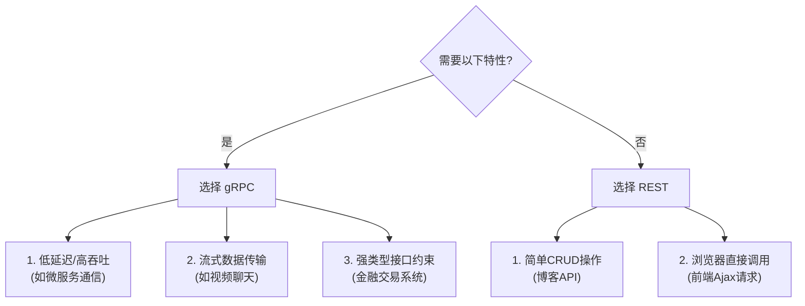

以下是针对文本的清晰汇总，采用分点式结构突出核心信息，并强调API在数据科学工作流中的角色：

---

### **数据科学家时间分配与API应用场景汇总**
#### **1. 主要时间消耗（Anaconda报告数据）**
- **数据清洗与准备**（38%）
  - *API应用*：通过API接入实时/云端数据（如AWS S3、Google BigQuery API），自动化清洗流程（如Pandas API或专用ETL工具API）。
- **报告与可视化**（29%）
  - *API应用*：调用可视化库API（Matplotlib/Plotly）、BI工具API（Tableau/Power BI嵌入式API）动态生成图表。
- **模型开发与部署**（27%）
  - *API应用*：利用ML平台API（TensorFlow Serving、SageMaker API）快速训练与部署模型，或调用预训练模型API（如OpenAI/Hugging Face）。

#### **2. 本书核心命题**
- **API如何优化三大任务效率**：
  - **减少重复劳动**：通过API自动化数据采集、清洗流水线。
  - **增强可复用性**：封装常用分析步骤为API（如Python Flask/RESTful服务）。
  - **加速模型迭代**：利用云平台API实现一站式训练-部署-监控。

---

### **关键对比：传统流程 vs API驱动流程**
| **任务**               | 传统方式痛点                  | API驱动的改进                 |
|------------------------|-----------------------------|-----------------------------|
| 数据清洗               | 手动下载/格式转换耗时          | 直接调用API获取结构化数据      |
| 可视化生成             | 静态图表需反复调整代码         | 动态API集成实时数据源         |
| 模型部署               | 环境配置复杂，跨团队协作困难    | 通过标准化API一键部署         |

---

### **附：典型API工具链示例**
```plaintext
1. 数据准备: Pandas (Python) + Apache Beam API (大规模ETL)
2. 可视化: Plotly.js API (交互式图表) + Slack API (自动推送报告)
3. 模型部署: FastAPI (封装模型) + Kubernetes API (弹性扩展)
``` 

此结构突出了数据科学家的真实痛点与API的解决方案，符合技术文档的实用导向。


### **用户故事（User Stories）范例**
以下是为 **体育赛事数据API** 设计的用户故事模板，涵盖不同角色和需求场景。

---

#### **1. 数据分析师（Data Analyst）**
**用户故事**：
> **As a** sports data analyst
> **I want to** fetch real-time match statistics via API
> **So that** I can build automated performance dashboards for coaches without manual data entry.

**验收条件（Acceptance Criteria）**：
- API返回JSON格式数据，包含 `possession%, shots_on_target, pass_accuracy`
- 数据延迟不超过30秒
- 支持按`match_id`和`time_interval`筛选

---

#### **2. 博彩建议网站开发者（Betting Advisor Dev）**
**用户故事**：
> **As a** developer of a betting tips website
> **I want to** access historical head-to-head records between teams
> **So that** I can calculate win probability algorithms for users.

**验收条件**：
- 提供过去5年两支队伍的交战记录（`home_win_rate, avg_goals`）
- 数据包含比赛日期、主客场、最终比分
- 支持批量查询（最多50组队伍对比）

---

#### **3. 移动App产品经理（Mobile App PM）**
**用户故事**：
> **As a** mobile app product manager
> **I want to** integrate lightweight player profile data
> **So that** fans can check player stats without leaving our app.

**验收条件**：
- 单次API响应小于10KB（优化低速网络）
- 包含`player_name, age, position, recent_form_rating`
- 支持CDN缓存以减少服务器负载

---

#### **4. 赛事解说员（Commentator）**
**用户故事**：
> **As a** live match commentator
> **I want to** receive instant event alerts (goals, red cards)
> **So that** I can provide accurate real-time commentary.

**验收条件**：
- 通过Webhook推送关键事件，延迟<5秒
- 事件类型包括 `goal, penalty, substitution`
- 提供测试用沙箱环境

---

#### **5. 广告投放商（Advertiser）**
**用户故事**：
> **As a** sports advertiser
> **I want to** query audience demographics by team
> **So that** I can target ads to fans of specific clubs.

**验收条件**：
- 返回粉丝的`age_distribution, country_ratio`（聚合数据，去敏）
- 数据按月度更新
- 符合GDPR合规要求

---

### **用户故事撰写技巧**
1. **角色具体化**：避免模糊的"用户"，明确是"教练"还是"赞助商"
2. **价值导向**：`So that`后必须描述**业务收益或痛点解决**
3. **可测试性**：验收条件需量化（如延迟时间、数据字段）

**错误示范 ❌**：
> "As a user, I want data, so I can see it."
**修复建议 ✅**：
> "As a fantasy league player, I want to compare player stats from last 3 matches, so I can make better transfer decisions."

---

### **用户故事映射API功能**
| 用户角色 | 所需API端点 | 数据示例 | 商业模式 |
|----------|------------|---------|----------|
| 数据分析师 | `/matches/stats/live` | `{"possession": 62%}` | 企业订阅 |
| 博彩开发者 | `/teams/h2h` | `{"last_5_meetings": [2-1, 0-0]}` | 按查询量计费 |
| 广告商 | `/fans/demographics` | `{"18-24_age": 38%}` | 数据许可费 |

通过用户故事，可将抽象需求转化为具体的API规范和商业模式设计。

Postman 2023 State of the API Report found these were the
top six API architectural styles:
REST: 86%
Webhooks: 36%
GraphQL: 29%
Simple Object Access Protocol (SOAP): 26%
WebSockets: 25%
gRPC: 11%


以下是关于 **gRPC 与 REST 核心差异** 的对比总结，结合技术特性和适用场景分析：

---

### **gRPC vs REST 关键技术差异**
| 特性                | gRPC                          | REST (HTTP/JSON)              |
|---------------------|-------------------------------|-------------------------------|
| **通信模式**        | 远程过程调用（RPC）            | 资源操作（CRUD）               |
| **数据格式**        | 二进制 Protocol Buffers        | 文本型 JSON/XML               |
| **传输协议**        | HTTP/2 （多路复用、低延迟）    | HTTP/1.1 （无状态请求响应）     |
| **交互类型**        | 支持 **四种模式**：<br>• 一元调用<br>• 服务端流<br>• 客户端流<br>• 双向流 | 仅支持 **请求-响应**           |
| **接口定义**        | 通过 `.proto` 文件定义          | 通过 OpenAPI/Swagger 描述      |
| **性能**            | 更高（编码效率+HTTP/2特性）    | 较低（文本解析+HTTP/1.1限制）  |

---

### **gRPC 的四大核心优势**
1. **高效序列化**
   - Protocol Buffers 比 JSON 小 3-10 倍，解析速度更快
   - *适用场景*：物联网设备传输、游戏实时数据同步

2. **强类型接口**
   - `.proto` 文件生成客户端/服务端代码，减少手动编码错误
   - *示例*：
     ```protobuf
     service UserService {
       rpc GetUser (UserRequest) returns (UserResponse);
     }
     message UserRequest {
       int32 user_id = 1;
     }
     ```

3. **流式处理能力**
   - 长连接持续传输数据，适合：
     - 实时日志分析
     - 股票价格推送
     - 多人游戏状态同步

4. **多语言支持**
   - 自动生成代码支持 Java/C++/Go/Python 等10+语言
   - *对比*：REST 需手动处理不同语言的HTTP客户端

---

### **REST 的保留优势**
| 场景                | 原因                          |
|---------------------|-------------------------------|
| 公开API产品          | JSON更人类可读，调试简单       |
| 浏览器集成          | gRPC-Web 仍需额外转换层        |
| 快速原型开发        | 无需编译 `.proto` 文件         |

---

### **技术选型决策树**


---

### **混合架构实践**
现代系统常组合使用两者：
- **内部服务间**：gRPC（性能优先）
  ```python
  # gRPC 客户端调用示例
  stub = user_pb2_grpc.UserServiceStub(channel)
  response = stub.GetUser(user_pb2.UserRequest(user_id=123))
  ```
- **对外公开API**：REST（兼容性优先）
  ```bash
  # RESTful 请求示例
  GET /users/123 HTTP/1.1
  Accept: application/json
  ```

---

通过理解这些差异，可针对 **延迟敏感性**、**数据规模**、**开发效率** 等维度选择最佳方案。