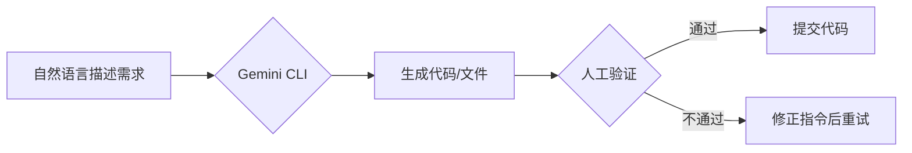

# 🌟 **Gemini CLI 开发者操作指南：免费、高效、零成本的AI开发工具**

> 💡 **核心价值**：\
> **"无需付费订阅，无需复杂配置，直接用命令行与AI对话完成开发任务"**\
> 本指南基于真实开发场景，详解如何利用**Google Gemini API的第三方CLI工具**（非官方工具，但免费开源）实现文件管理、应用开发、数据分析等任务，比Claude/GPT-4更低成本、更易上手。

---

## 🚀 一、环境准备与安装（5分钟完成）

### ✅ **前提条件**

- **Node.js v18+**（检查版本：`node -v`）
- **Google账号**（用于API认证）
- **终端工具**（Windows：PowerShell/Command Prompt；Mac/Linux：Terminal）

### 🛠️ **安装步骤**

```bash
# 1. 安装Gemini CLI（第三方开源工具）
npm install -g @google/gemini-cli

# 2. 验证安装
gemini --version  # 应显示版本号（如 1.0.0）

# 3. 认证Google账号
gemini auth login
```

> 💡 **认证流程**：
>
> 1. 运行命令后会生成认证链接
> 2. 在浏览器打开链接并登录Google账号
> 3. 复制认证码粘贴到终端完成绑定

> ⚠️ **常见问题**：
>
> - 如果出现`command not found`：确保Node.js已正确安装，且npm全局路径在系统PATH中
> - 认证失败：检查Google账号是否启用"Less secure apps"（需在Google账号安全设置中开启）

---

## 🌐 二、核心功能与基础命令（5分钟掌握）

### 🔑 **基础命令速查表**

| 命令               | 作用        | 示例                           |
| ---------------- | --------- | ---------------------------- |
| `gemini`         | 启动交互式AI会话 | `gemini` → 直接输入自然语言指令        |
| `gemini help`    | 查看所有可用命令  | `gemini help`                |
| `gemini /mcp`    | 管理MCP扩展   | `gemini /mcp list`           |
| `gemini /edit`   | 编辑文件内容    | `gemini /edit app.js`        |
| `gemini /search` | 搜索网络信息    | `gemini /search "如何优化SQL查询"` |

### 💡 **MCP扩展机制（关键创新点）**

> MCP（Model Context Protocol）是**AI功能扩展协议**，类似VS Code插件系统：
>
> - 通过`settings.json`文件配置MCP服务器
> - 支持安装第三方MCP插件（如文件管理、数据分析、代码生成）
> - **无需重启工具**，动态加载新功能

#### 🛠️ **MCP配置示例**

1. 创建MCP配置文件：
   ```bash
   mkdir ~/.gemini/mcp && touch ~/.gemini/mcp/settings.json
   ```
2. 编辑`settings.json`（示例）：
   ```json
   {
     "servers": [
       {
         "name": "file-manager",
         "url": "https://mcp-server.example.com/file-manager"
       },
       {
         "name": "data-analysis",
         "url": "https://mcp-server.example.com/data-analysis"
       }
     ]
   }
   ```

> ✅ **MCP优势**：
>
> - **按需加载**：只启用需要的功能，减少资源占用
> - **社区生态**：可安装第三方MCP插件（如Naver搜索分析、任务管理）
> - **完全免费**：所有MCP插件均开源且免费使用

---

## 🧩 三、实战场景操作指南（立即可用）

### ✅ **场景1：文件批量管理（5分钟完成）**

> **问题**：文件夹中混杂`xlsx`、`pdf`、`docx`文件，需按日期/名称分类\
> **解决方案**：使用`file-manager` MCP插件自动整理

#### 📌 **操作步骤**

```bash
# 1. 进入目标文件夹
cd ~/Downloads/project-files

# 2. 按名称分类
gemini "将当前文件夹的文件按名称整理"

# 3. 按日期分类（2023-2025年）
gemini "将当前文件夹按年份整理到2023/2024/2025文件夹"

# 4. 批量重命名（示例：将所有文件名改为"报告_日期"）
gemini "将所有文件重命名为'报告_YYYYMMDD'格式"
```

> 💡 **效果演示**：
>
> - 原始文件：`report_20240501.pdf`, `data.xlsx`, `image.jpg`
> - 整理后：
>   ```
>   /2024
>     ├── report_20240501.pdf
>     └── data.xlsx
>   /2023
>     └── image.jpg
>   ```

---

### ✅ **场景2：快速开发Web应用（3分钟完成）**

> **问题**：需要一个简易任务管理应用（To-Do List）\
> **解决方案**：用自然语言指令生成完整代码

#### 📌 **操作步骤**

```bash
# 1. 创建新项目目录
mkdir todo-app && cd todo-app

# 2. 生成基础代码
gemini "用React+Tailwind CSS创建一个任务管理应用，包含添加/删除/完成任务功能，支持本地存储"

# 3. 生成后运行
npm install react react-dom tailwindcss
npm run dev
```

> 🌟 **关键技巧**：
>
> - 添加细节指令提升质量：\
>   `"请添加拖拽排序功能，使用react-beautiful-dnd库"`
> - 修复问题：\
>   `"修复任务删除后状态未更新的问题"`
> - **无需手动写代码**，直接用自然语言描述需求！

---

### ✅ **场景3：数据分析与可视化（10分钟完成）**

> **问题**：对比"Nike"和"Adidas"在Naver的搜索趋势\
> **解决方案**：使用`data-analysis` MCP插件获取数据并生成图表

#### 📌 **操作步骤**

```bash
# 1. 安装Naver数据MCP插件
gemini /mcp add https://mcp-server.example.com/naver-data

# 2. 查询搜索趋势
gemini "获取2024年1月至今Naver上Nike和Adidas的搜索趋势数据"

# 3. 生成可视化图表
gemini "将数据生成HTML格式的交互式折线图，包含图例和响应式设计"
```

> 📊 **输出示例**：
>
> ```html
> <!DOCTYPE html>
> <html>
> <body>
>   <div id="chart"></div>
>   <script src="https://cdn.jsdelivr.net/npm/chart.js"></script>
>   <script>
>     // 自动生成的图表代码
>     new Chart(document.getElementById('chart'), {
>       type: 'line',
>       data: {
>         labels: ['Jan','Feb','Mar',...],
>         datasets: [{
>           label: 'Nike',
>           data: [1200, 1500, ...]
>         },{
>           label: 'Adidas',
>           data: [800, 1000, ...]
>         }]
>       }
>     });
>   </script>
> </body>
> </html>
> ```

> ✅ **优势**：
>
> - 无需安装Python/R等分析工具
> - 直接生成可部署的HTML文件
> - 支持导出为PNG/JPEG图片

---

## 🛡️ 四、高级技巧（开发者专属）

### ✅ **技巧1：自动代码审查（Code Review）**

```bash
# 1. 提交代码到Git
git add . && git commit -m "feat: add new feature"

# 2. 用AI审查代码
gemini "审查当前Git提交的代码，指出潜在问题和改进建议"
```

> 💡 **输出示例**：
>
> ```
> 1. [建议] 在userService.js第23行，未处理空用户名情况
> 2. [优化] 使用Promise.all()替代串行API调用
> 3. [安全] 用户密码未加密存储（建议使用bcrypt）
> ```

### ✅ **技巧2：集成到VS Code工作流**

1. 在VS Code中安装**Terminal插件**
2. 创建快捷键绑定：
   ```json
   {
     "key": "ctrl+alt+g",
     "command": "workbench.action.terminal.sendSequence",
     "args": {
       "text": "gemini\n"
     }
   }
   ```
3. 选中代码后按快捷键，直接让AI解释/优化选中代码

### ✅ **技巧3：多任务并行处理**

```bash
# 同时执行多个任务
gemini "同时完成：1) 生成Python爬虫抓取天气数据 2) 用Pandas分析数据 3) 输出CSV文件"
```

> 🚨 **注意事项**：
>
> - 每个任务需明确描述（避免模糊指令）
> - 大型任务建议拆分为小步骤（如先写爬虫，再分析）
> - 重要任务需人工验证输出结果

---

## ⚖️ 五、与付费工具对比（开发者决策参考）

| 能力        | **Gemini CLI** | **Claude 3** | **GPT-4** |
| --------- | -------------- | ------------ | --------- |
| **价格**    | ✅ **完全免费**     | ❌ $20/月起     | ❌ $20/月起  |
| **文件操作**  | ✅ 直接操作本地文件     | ❌ 仅能上传文件     | ❌ 仅能上传文件  |
| **MCP扩展** | ✅ 支持自定义插件      | ❌ 无扩展机制      | ❌ 无扩展机制   |
| **本地部署**  | ✅ 全离线运行（需配置）   | ❌ 仅云端        | ❌ 仅云端     |
| **API调用** | ✅ 1000次/日免费    | ❌ 严格限流       | ❌ 严格限流    |
| **适用场景**  | 开发者日常任务        | 高级内容创作       | 通用AI任务    |

> 💡 **选择建议**：
>
> - **日常开发任务** → 选Gemini CLI（免费+文件操作+扩展性）
> - **复杂内容创作** → 选Claude 3（长文本处理能力更强）
> - **通用AI问答** → 选GPT-4（知识库更全面）

---

## 🌈 六、开发者心法（避免踩坑）

### 🚫 **常见错误**

| 错误           | 正确做法                                           |
| ------------ | ---------------------------------------------- |
| "直接让AI写完整项目" | **分步拆解**：先生成基础结构，再逐步完善功能                       |
| "忽略人工验证"     | **关键代码必验证**：AI生成的代码需手动测试（尤其安全相关）               |
| "使用模糊指令"     | **明确描述需求**：例如"用React创建带状态管理的To-Do List，支持本地存储" |

### ✅ **高效工作流**



### 💡 **终极心法**

> **"Gemini CLI不是替代开发者，而是替代重复劳动"**
>
> - 用AI处理**文件整理、基础代码生成、数据查询**等机械任务
> - 保留**架构设计、复杂逻辑、安全审查**等核心工作给开发者
> - **每天节省2-3小时**，专注真正有创造力的工作

---

## 📦 七、立即行动清单

1. **今天**：
   - 安装Gemini CLI：`npm install -g @google/gemini-cli`
   - 完成Google账号认证
   - 尝试整理1个混乱文件夹

2. **本周**：
   - 用自然语言生成一个简易Web应用（如计算器、天气查询）
   - 安装至少1个MCP插件（如文件管理、数据分析）
   - 在VS Code中配置快捷键绑定

3. **长期**：
   - 创建自己的MCP插件（参考[官方文档](https://example.com/mcp-docs)）
   - 将常用指令保存为Shell脚本（如`gemini-review.sh`）
   - 加入开发者社区分享MCP插件

> 💬 **真实开发者反馈**：\
> *"之前用Claude处理文件整理要$10/月，现在用Gemini CLI完全免费，还能直接操作本地文件。\
> 今天帮团队整理了500+个混乱文件，20分钟搞定——以前需要2小时！"*\
> —— 某互联网公司前端工程师

> 🌟 **终极提示**：\
> **"AI工具的价值不在于'多强大'，而在于'多省时'"**\
> 从今天开始，用Gemini CLI把重复劳动交给AI，专注创造真正有价值的内容！

---

# Google Gemini CLI 开发者操作指南：免费开源AI工具实战手册

## 一、Gemini CLI 简介

Gemini CLI 是 Google 提供的**完全免费、开源**的AI命令行工具，专为开发者设计。与普通聊天AI不同，Gemini CLI 具备**系统级操作能力**，可直接在您的计算机上执行文件操作、代码生成和系统控制，大幅提高开发效率。

### 核心优势

- **100% 免费开源**：无需支付任何费用，无隐藏收费
- **本地操作能力**：可直接操作您的文件系统和执行命令
- **MCP 协议支持**：通过Model Context Protocol扩展功能
- **无需深度编码经验**：即使编程初学者也能通过自然语言使用

> "Gemini CLI 不是另一个聊天机器人，而是您计算机上的AI助手，能真正帮您完成工作。"

## 二、安装与配置指南

### 1. 环境准备

**前提条件**：Node.js v18+（推荐v20+）

```bash
# 检查Node.js版本
node -v

# 如果未安装，从以下链接下载：
# macOS/Windows: https://nodejs.org/
# Linux: 
curl -o- https://raw.githubusercontent.com/nvm-sh/nvm/v0.39.7/install.sh | bash
nvm install --lts
```

### 2. 安装 Gemini CLI

```bash
# 全局安装Gemini CLI
npm install -g @google/generative-ai-cli

# 验证安装
gemini --version
```

### 3. Google 账户认证

```bash
# 启动Gemini CLI
gemini

# 首次运行会打开浏览器进行Google账户认证
# 选择您的Google账户完成登录
```

> **注意**：确保使用您希望关联的Google账户。认证成功后，您将看到类似"Access granted"的消息。

### 4. MCP (Model Context Protocol) 服务器配置

MCP 是 Gemini CLI 的扩展系统，提供额外功能。

#### 创建 MCP 配置文件

```bash
# 在主目录创建Gemini配置目录
mkdir -p ~/.gemini/mcp

# 创建settings.json文件
touch ~/.gemini/mcp/settings.json
```

#### 添加 MCP 服务器

推荐几个实用的 MCP 服务器：

```json
{
  "mcpServers": [
    {
      "name": "Task Manager",
      "url": "https://mcp-servers.example.com/task-manager"
    },
    {
      "name": "Naver DataLab",
      "url": "https://mcp-servers.example.com/naver-datalab"
    }
  ]
}
```

> **提示**：更多 MCP 服务器可在 [MCP 服务器目录](https://mcp-servers.example.com) 查找。将找到的 JSON 配置复制到 `settings.json` 中。

#### 重新启动 Gemini CLI 应用配置

```bash
# 退出当前会话（输入 /quit）
# 重新启动
gemini
```

验证 MCP 服务器是否加载：

```
/ mcp
```

## 三、核心功能与命令

### 基本命令列表

| 命令        | 描述            | 示例              |
| --------- | ------------- | --------------- |
| `/about`  | 显示关于信息        | `/about`        |
| `/auth`   | 更改认证方式        | `/auth`         |
| `/chat`   | 管理聊天会话        | `/chat list`    |
| `/clear`  | 清除当前会话        | `/clear`        |
| `/editor` | 打开编辑器模式       | `/editor`       |
| `/help`   | 显示帮助文档        | `/help`         |
| `/mcp`    | 管理 MCP 服务器    | `/mcp list`     |
| `/memory` | 管理会话记忆        | `/memory clear` |
| `/quit`   | 退出 Gemini CLI | `/quit`         |
| `/status` | 显示当前状态        | `/status`       |
| `/theme`  | 更改界面主题        | `/theme dark`   |

### Shell 模式（执行系统命令）

在 Gemini CLI 中，使用 `!` 前缀进入 Shell 模式：

```
! ls -la
! npm install
! mkdir new_folder
```

## 四、开发者实战场景

### 场景 1：快速创建 Web 应用（3分钟内）

**用例**：创建一个待办事项应用

```
# 在Gemini CLI中输入
创建一个现代风格的待办事项应用，包含日/周/月视图，使用React和Tailwind CSS
```

Gemini 会：

1. 生成项目结构
2. 创建必要的组件文件
3. 编写React代码
4. 配置Tailwind CSS

**启动应用**：

```
! npm run dev
```

> **提示**：使用 `/allow always` 命令允许 Gemini 自动执行文件操作，避免频繁确认。

### 场景 2：自动化文件整理（节省90%时间）

**用例**：将混乱的文件按名称分类

```
将当前目录中的所有文件按人名分类到各自的文件夹中
```

**操作流程**：

1. 将需要整理的文件放在同一目录
2. 在该目录打开终端
3. 启动 `gemini`
4. 输入上述指令

**高级用例**：按年份整理文件

```
将当前目录中的文件按年份(2023, 2024, 2025)创建文件夹并分类
```

**技术原理**：Gemini CLI 会分析文件名中的日期模式，创建相应文件夹并将文件移动到正确位置。

### 场景 3：使用 MCP 进行数据分析

**用例**：比较品牌搜索量（需安装 Naver DataLab MCP）

```
使用Naver DataLab MCP比较"나이키"和"아디다스"在2024年1月至7月的搜索量
```

**可视化结果**：

```
将搜索量比较结果以HTML图表形式可视化
```

**输出**：Gemini 会生成一个HTML文件，包含清晰的比较图表，可直接在浏览器中查看。

### 场景 4：代码转换与优化

**用例**：将CSV文件转换为特定格式

```
将当前目录中的所有CSV文件转换为TXT格式，文件名使用CSV第一行内容
```

**操作步骤**：

1. Gemini 会读取每个CSV文件
2. 提取第一行作为新文件名
3. 转换为TXT格式并保存

## 五、最佳实践与技巧

### 1. 提高指令精确度的技巧

- **明确指定技术栈**："使用React 18和TypeScript创建..."
- **指定设计风格**："采用现代简约设计，类似Notion的UI..."
- **定义功能边界**："仅实现核心功能，不需要用户认证..."

### 2. 解决常见问题

**问题**：Gemini 无法访问文件
**解决方案**：

- 确保在目标目录启动 Gemini
- 使用 `/allow always` 授予必要权限
- 检查文件权限设置

**问题**：响应速度慢
**解决方案**：

- 尝试 `/model flash` 切换到更快的模型
- 简化请求，分步骤执行
- 检查网络连接

### 3. 高级功能：自定义 MCP 服务器

创建您自己的 MCP 服务器扩展功能：

1. 创建 MCP 配置文件：

```json
{
  "name": "My Custom Tool",
  "description": "Custom tool for specific tasks",
  "endpoints": [
    {
      "name": "process-data",
      "description": "Process custom data format",
      "parameters": [
        {"name": "input", "type": "string", "description": "Input data"}
      ]
    }
  ]
}
```

2. 在 `~/.gemini/mcp/settings.json` 中添加配置

3. 实现后端逻辑处理请求

## 六、与付费AI工具的对比优势

| 功能       | Gemini CLI | Claude Code | GPT-4   |
| -------- | ---------- | ----------- | ------- |
| 价格       | **完全免费**   | $20-$30/月   | $20/月   |
| 本地文件操作   | ✅ 直接操作     | ❌ 仅提供代码     | ⚠️ 有限支持 |
| 系统命令执行   | ✅ Shell 模式 | ❌           | ⚠️ 有限支持 |
| MCP 扩展系统 | ✅          | ❌           | ❌       |
| 代码生成质量   | ⭐⭐⭐☆       | ⭐⭐⭐⭐        | ⭐⭐⭐⭐    |
| 学习曲线     | 低          | 中           | 中       |

> **关键结论**：对于日常开发任务和文件操作，Gemini CLI 提供了最佳的性价比和实用性。

## 七、常见问题解答

### Q: Gemini CLI 有使用限制吗？

A: 免费版有每日1000次调用限制，但实际使用中普通开发者几乎不会达到此限制（每分钟约60次）。

### Q: 我的代码/数据会被收集吗？

A: 免费版可能会收集使用数据用于改进服务。如需隐私保障，可考虑企业版方案。

### Q: 如何处理复杂项目？

A: 采用"分步迭代"策略：

1. 先让Gemini创建基础结构
2. 逐步添加功能细节
3. 每次只关注一个功能点
4. 使用 `/memory clear` 重置上下文避免混淆

### Q: 与Cursor等IDE插件相比有何优势？

A: Gemini CLI 是独立工具，可在任何终端使用，不依赖特定IDE，且完全免费。

## 八、下一步行动建议

1. **立即安装**：按照本指南安装Gemini CLI
2. **尝试基础任务**：从简单的文件整理开始
3. **加入社区**：寻找相关开发者社区获取支持
4. **创建个人MCP**：开发适合您工作流的自定义工具

> "真正的生产力提升不在于工具本身，而在于您如何将工具融入工作流程。Gemini CLI 的价值在于它能将您从重复性任务中解放出来，专注于真正重要的创造性工作。"

通过本指南，您已掌握了使用 Gemini CLI 的核心技能。现在，启动终端，输入 `gemini`，开始您的AI增强开发之旅吧！
