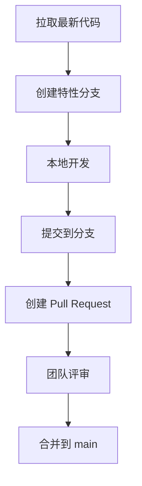

## 🚀 Go 项目团队协作终极指南：从 Trello 任务管理到 GitHub 协作开发  
> *“专业团队不靠口头约定，靠工具链和流程保障。”*  
> —— 面向 Go 开发者的实战操作手册

---

### 📌 核心原则 [High confidence]  
- **任务管理**：Trello 看板 = 团队大脑  
- **代码协作**：GitHub Desktop + 分支策略 = 零冲突开发  
- **黄金法则**：**“修改前先沟通，提交前先拉取”**  

> ✅ **Action**：立即为你的 Go 项目创建 Trello 看板 + GitHub 仓库

---

## 🧩 一、任务管理：Trello 实战配置

### 1. 创建项目看板
```markdown
📌 **看板结构**：
- Backlog（需求池）
- To Do（待办）
- Doing（进行中） ← 核心列
- Review（评审）
- Done（已完成）

✅ **操作**：
1. 新建看板 → 命名 "Go项目协作"
2. 添加列表：Backlog / To Do / Doing / Review / Done
3. 设置背景色（推荐深色模式护眼）
```

---

### 2. 任务卡片标准化模板
```markdown
## [功能] 玩家移动系统

**描述**：
- 第三人称移动
- WASD 控制 + 鼠标转向
- 支持跳跃和冲刺

**验收标准**：
- [ ] 移动速度：5 units/s
- [ ] 跳跃高度：2 units
- [ ] 无穿墙bug

**附件**：
- [设计稿链接]
- [参考视频]

**截止日期**：2025-04-20

**分配**：@张三

**检查清单**：
- [ ] 创建 PlayerScene
- [ ] 编写 MovementScript
- [ ] 添加碰撞体
- [ ] 优化动画过渡
```

> ✅ **技巧**：  
> - 用 `@成员名` 提及队友  
> - 用 `/deadline` 设置截止日  
> - 用检查清单分解子任务

---

## 🛠️ 二、代码协作：GitHub Desktop 专业配置

### 1. 仓库初始化（关键步骤）
```bash
# 创建仓库时必选
1. Repository Name: go-game-project
2. Local Path: ~/projects/go-game
3. .gitignore: 选择 "Go" 模板
4. License: MIT (推荐)
```

> ⚠️ **避坑**：  
> - **不要** 在 Go 项目根目录放 `go.mod` 之外的文件  
> - **必须** 用 `.gitignore` 过滤 `bin/`, `*.exe`, `*.log`

---

### 2. 项目结构规范
```bash
go-game/
├── go.mod          # 模块定义
├── go.sum          # 依赖校验
├── main.go         # 入口文件
├── internal/       # 私有包
│   ├── player/     # 玩家模块
│   └── scene/      # 场景模块
├── pkg/            # 公共库
└── assets/         # 资源文件（需在 .gitignore 中排除大文件）
```

> ✅ **操作**：  
> ```bash
> # 初始化 Go 模块
> cd go-game
> go mod init github.com/yourname/go-game
> ```

---

### 3. 协作工作流（防冲突核心）


**操作步骤**：
```bash
# 1. 每日开始前拉取最新代码
git checkout main
git pull origin main

# 2. 创建特性分支（每人一个分支）
git checkout -b feature/player-movement

# 3. 开发完成后提交
git add .
git commit -m "feat: add player movement system"

# 4. 推送到远程分支
git push origin feature/player-movement

# 5. 在 GitHub 创建 Pull Request
```

---

### 4. 冲突预防黄金法则
```markdown
✅ **场景1：修改场景文件**  
- 在 Trello 卡片标注："正在修改 PlayerScene，预计2小时"
- 在 Discord 频道发消息：@所有人 正在修改 player.tscn

✅ **场景2：修改核心脚本**  
- 创建分支前在 Trello 将卡片拖到 "Doing"
- 提交 PR 时关联 Trello 卡片（用 #123 格式）

✅ **场景3：紧急修复**  
- 创建 hotfix/bug-name 分支
- 修复后立即 PR + @团队成员 评审
```

> ⚠️ **绝对禁止**：  
> - 两人同时修改同一场景文件  
> - 直接推送到 main 分支  
> - 未拉取最新代码就开发

---

## 🔧 三、高级协作技巧

### 1. 分支策略（推荐 Git Flow）
```bash
# 主分支
main          # 生产环境稳定版
develop       # 开发集成分支

# 功能分支
feature/*     # 新功能开发
hotfix/*      # 紧急修复
release/*     # 发布准备
```

---

### 2. Pull Request 评审清单
```markdown
✅ **代码检查**：
- [ ] 通过 go fmt 格式化
- [ ] 无编译错误
- [ ] 通过单元测试

✅ **文档检查**：
- [ ] 更新 README.md
- [ ] 添加代码注释
- [ ] 关联 Trello 任务卡

✅ **团队检查**：
- [ ] 至少 1 人评审通过
- [ ] 无合并冲突
- [ ] 通过 CI/CD 流水线
```

---

### 3. 自动化配置（.github/workflows/test.yml）
```yaml
name: Go Test
on: [push, pull_request]
jobs:
  test:
    runs-on: ubuntu-latest
    steps:
    - uses: actions/checkout@v2
    - name: Set up Go
      uses: actions/setup-go@v2
      with:
        go-version: 1.21
    - name: Test
      run: go test -v ./...
    - name: Lint
      run: |
        go install golang.org/x/lint/golint@latest
        golint ./...
```

---

## 📊 四、每日协作流程清单

| 时间 | 任务 | 工具 |  
|------|------|------|
| **9:00** | 拉取最新代码 | `git pull origin develop` |  
| **9:15** | 更新 Trello 状态 | 将卡片拖到 "Doing" |  
| **12:00** | 午休前提交半成品 | `git commit -m "WIP: player movement"` |  
| **14:00** | 代码评审 | GitHub PR + 评论 |  
| **17:00** | 推送当日工作 | `git push origin feature/xxx` |  
| **17:30** | 更新任务进度 | Trello 检查清单打钩 |  

---

## ⚠️ 五、致命错误与解决方案

| 错误 | 后果 | 解决方案 |
|------|------|----------|
| **直接修改 main 分支** | 代码混乱，无法回滚 | 立即创建分支，`git reset --hard origin/main` |
| **两人改同一文件** | 合并冲突，场景损坏 | 用 Git LFS 管理大文件，或拆分场景 |
| **未拉取就开发** | 本地代码过时，冲突增多 | 设置 Git 钩子：`pre-commit` 自动拉取 |
| **忘记更新 Trello** | 团队不知进度，重复工作 | 用 Zapier 连接 GitHub → Trello 自动更新 |

---

## ✅ 六、30 分钟快速启动包

1. [ ] **Trello**：创建看板 + 5 列 + 3 张任务卡  
2. [ ] **GitHub**：初始化仓库 + .gitignore (Go) + MIT 许可证  
3. [ ] **本地**：`go mod init` + 标准目录结构  
4. [ ] **团队**：邀请成员 + 制定分支命名规则  
5. [ ] **自动化**：添加 GitHub Actions 测试流水线  

> 💡 **成本**：0 美元（全部使用免费工具）  
> ⏱️ **时间**：30 分钟

---

## 🌟 终极心法

> “**工具链的价值不是防止犯错，而是让犯错的成本趋近于零。**  
> 用 Trello 让任务透明，用 GitHub 让代码可追溯，  
> 你的团队将无往不利。”

---

如需，我可为你提供：

- ✅ **Trello 看板模板**（含自动化规则）  
- ✅ **GitHub 仓库初始化脚本**（一键生成标准结构）  
- ✅ **Git 钩子配置**（自动格式化/测试/拉取）  
- ✅ **团队协作守则 PDF**（打印张贴在办公室）

**留言告诉我你需要哪一项，我立刻为你生成！**