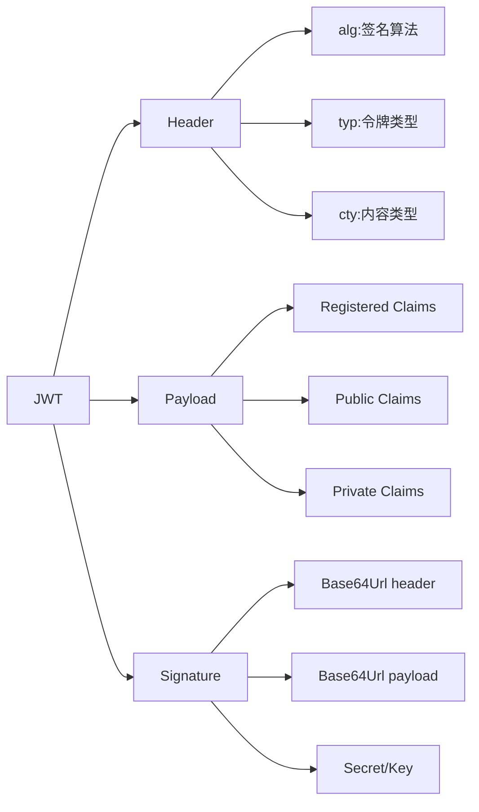

# JWT (JSON Web Token) 必要知识点深度解析

## 一、JWT 核心概念与结构

### 1. JWT 定义与特点
- **定义**：JSON Web Token (RFC 7519) 是一种开放标准，用于在网络应用环境间安全地传递声明（claims）
- **核心特点**：
  - **紧凑性**：适合在URL、POST参数或HTTP头部传输
  - **自包含**：包含所有必要信息，减少数据库查询
  - **可验证**：通过数字签名确保内容完整性
  - **跨域友好**：天然支持跨域认证
  - **无状态**：服务端无需存储会话信息

### 2. JWT 结构详解


#### 完整JWT格式
```
xxxxx.yyyyy.zzzzz
│      │      └─ Signature
│      └─ Payload
└─ Header
```

#### 头部(Header)示例
```json
{
  "alg": "HS256",
  "typ": "JWT"
}
```
- **alg**：签名算法（必填）
- **typ**：令牌类型（通常为"JWT"）
- **cty**：内容类型（用于嵌套JWT）

#### 载荷(Payload)详解
**注册声明(Registered Claims - 推荐但非强制)**：

| 声明    | 全称              | 说明        |
| ----- | --------------- | --------- |
| `iss` | Issuer          | 签发者       |
| `sub` | Subject         | 主题        |
| `aud` | Audience        | 接收方       |
| `exp` | Expiration Time | 过期时间(时间戳) |
| `nbf` | Not Before      | 生效时间      |
| `iat` | Issued At       | 签发时间      |
| `jti` | JWT ID          | 唯一ID      |

**公共声明(Public Claims)**：
- 自定义但应注册在IANA JSON Web Token Registry
- 避免命名冲突（建议使用URI命名空间）

**私有声明(Private Claims)**：
- 自定义业务数据（如`user_id`, `role`）
- 需确保双方约定好含义

#### 签名(Signature)生成
```
HMACSHA256(
  base64UrlEncode(header) + "." +
  base64UrlEncode(payload),
  secret
)
```

## 二、JWT 工作流程与认证机制

### 1. 标准认证流程


### 2. 令牌刷新机制


### 3. 双令牌模式
| 令牌类型 | 有效期 | 存储位置 | 安全要求 |
|----------|--------|----------|----------|
| **Access Token** | 短(15-30分钟) | 内存 | 高(防XSS) |
| **Refresh Token** | 长(7-30天) | HTTP Only Cookie | 极高(防CSRF) |

## 三、JWT 安全机制与算法

### 1. 签名算法对比
| 算法类别 | 代表算法 | 密钥类型 | 安全强度 | 适用场景 |
|----------|----------|----------|----------|----------|
| **对称加密** | HS256, HS384, HS512 | 共享密钥 | 中 | 内部系统、简单场景 |
| **非对称加密** | RS256, RS384, RS512 | RSA公私钥 | 高 | 公开API、多服务方 |
| **椭圆曲线** | ES256, ES384, ES512 | EC公私钥 | 高 | 移动设备、资源受限环境 |

### 2. 算法选择安全指南
- **避免使用 "none" 算法**：会导致无签名验证
- **优先选择 RS256**：平衡安全性和性能
- **密钥长度要求**：
  - HMAC：至少256位
  - RSA：至少2048位
  - ECDSA：P-256曲线或更高

### 3. 密钥管理最佳实践
- **密钥轮换**：定期更新密钥（尤其HMAC）
- **环境隔离**：不同环境使用不同密钥
- **安全存储**：
  - 避免硬编码在代码中
  - 使用密钥管理服务(KMS)
  - 环境变量存储（不提交到版本控制）

## 四、JWT 安全威胁与防护

### 1. 常见安全威胁矩阵
| 威胁类型 | 原理 | 防护措施 | 严重程度 |
|----------|------|----------|----------|
| **令牌劫持** | 通过XSS/网络嗅探获取令牌 | HTTPS、HttpOnly Cookie、短期有效期 | ⭐⭐⭐⭐ |
| **重放攻击** | 截获并重复使用有效令牌 | nonce机制、短期有效期 | ⭐⭐⭐ |
| **算法混淆** | 强制服务端使用"none"算法 | 显式指定算法、验证头部 | ⭐⭐⭐⭐ |
| **密钥泄露** | HMAC密钥被获取 | 密钥轮换、使用非对称加密 | ⭐⭐⭐⭐ |
| **令牌膨胀** | 载荷过大影响性能 | 限制令牌大小、仅存必要数据 | ⭐⭐ |
| **缺乏撤销机制** | 无法提前使令牌失效 | 短期有效期、令牌黑名单 | ⭐⭐⭐ |

### 2. 关键防护措施
#### a. 令牌验证流程


#### b. 防御算法混淆攻击
```javascript
// 正确验证方式（示例）
jwt.verify(token, secret, { 
  algorithms: ['RS256'] // 显式指定允许的算法
}, (err, payload) => {
  // 处理结果
});
```

#### c. 令牌撤销策略
| 策略 | 实现方式 | 优点 | 缺点 |
|------|----------|------|------|
| **短期有效期** | 设置短exp | 简单有效 | 频繁刷新 |
| **令牌黑名单** | 存储已撤销令牌ID | 精确控制 | 需要存储 |
| **基于撤销端点** | 定期检查撤销列表 | 无需服务端存储 | 延迟生效 |
| **动态密钥** | 每用户独立密钥 | 高安全性 | 管理复杂 |

## 五、JWT 实现与最佳实践

### 1. 代码实现示例
#### Node.js (使用jsonwebtoken库)
```javascript
const jwt = require('jsonwebtoken');

// 生成令牌
const payload = { 
  sub: '1234567890', 
  name: 'John Doe', 
  role: 'admin',
  iat: Math.floor(Date.now() / 1000),
  exp: Math.floor(Date.now() / 1000) + (60 * 15) // 15分钟
};
const secret = 'your-256-bit-secret';
const token = jwt.sign(payload, secret, { algorithm: 'HS256' });

// 验证令牌
try {
  const decoded = jwt.verify(token, secret, { 
    algorithms: ['HS256'],
    maxAge: '15m'
  });
  console.log('Valid token:', decoded);
} catch (err) {
  console.error('Invalid token:', err.message);
}
```

#### Python (使用PyJWT库)
```python
import jwt
import datetime

# 生成令牌
payload = {
    'sub': '1234567890',
    'name': 'John Doe',
    'role': 'admin',
    'iat': datetime.datetime.utcnow(),
    'exp': datetime.datetime.utcnow() + datetime.timedelta(minutes=15)
}
secret = 'your-256-bit-secret'
token = jwt.encode(payload, secret, algorithm='HS256')

# 验证令牌
try:
    decoded = jwt.decode(
        token, 
        secret, 
        algorithms=['HS256'],
        leeway=10,  # 允许10秒时钟偏差
        options={"verify_exp": True}
    )
    print("Valid token:", decoded)
except jwt.InvalidTokenError as e:
    print("Invalid token:", str(e))
```

### 2. JWT 存储最佳实践
| 存储位置 | 优点 | 缺点 | 安全建议 |
|----------|------|------|----------|
| **Authorization Header** | 防止XSS窃取 | 可能被日志记录 | 使用Bearer方案 |
| **HttpOnly Cookie** | 防XSS | 易受CSRF | SameSite=Strict, Secure |
| **LocalStorage** | 持久化 | 易受XSS | 仅用于短期令牌 |
| **SessionStorage** | 页面会话级 | 关闭标签即失效 | 配合内存存储 |

### 3. 令牌设计最佳实践
- **最小化载荷**：只包含必要信息（避免敏感数据）
- **合理设置有效期**：
  - Access Token：15-30分钟
  - Refresh Token：7-30天
- **使用jti防重放**：为每个令牌生成唯一ID
- **audience验证**：确保令牌针对当前服务
- **签发者验证**：验证iss声明

## 六、JWT 与其他认证方式对比

### 1. JWT vs Session-Based Authentication
| 特性 | JWT | Session |
|------|-----|---------|
| **状态管理** | 无状态 | 有状态（服务端存储） |
| **扩展性** | 易于水平扩展 | 需要会话共享 |
| **跨域支持** | 天然支持 | 需特殊处理 |
| **移动端友好** | 高 | 中 |
| **令牌撤销** | 复杂 | 简单 |
| **带宽使用** | 每次请求携带 | 仅需session ID |
| **安全性** | 依赖令牌保护 | 依赖会话保护 |

### 2. JWT vs OAuth 2.0
- **JWT是令牌格式**，OAuth 2.0是授权框架
- OAuth 2.0 可以使用JWT作为令牌格式
- JWT解决"是什么"（令牌内容），OAuth解决"如何获取"（授权流程）

### 3. JWT vs SAML
| 特性 | JWT | SAML |
|------|-----|------|
| **格式** | JSON | XML |
| **大小** | 小（适合移动端） | 大 |
| **解析** | 简单（原生JSON支持） | 复杂（需XML解析） |
| **签名** | HMAC/RSA | XML Signature |
| **主要用途** | API认证 | 企业级SSO |
| **加密支持** | JWE | 内置加密 |

## 七、高级应用场景

### 1. 微服务架构中的JWT


**关键实践**：
- API Gateway统一验证
- 服务间传递原始令牌
- 服务只验证签名，不重新签发
- 使用分布式追踪关联请求

### 2. 多租户系统中的JWT
- **租户识别**：
  ```json
  {
    "tid": "tenant-123",
    "iss": "https://auth.example.com/tenant-123"
  }
  ```
- **租户特定密钥**：
  - 每个租户使用独立密钥
  - 密钥管理服务动态获取

### 3. 分布式系统中的令牌链
```
Client → API Gateway → Service A → Service B
  JWT1      JWT2 (转发)    JWT3 (转发)
```
- 服务A/B不验证令牌，只验证签名
- 网关负责初始验证和授权

## 八、JWT 标准与扩展

### 1. 核心RFC标准
| RFC编号 | 标准 | 说明 |
|---------|------|------|
| RFC 7515 | JWS (JSON Web Signature) | 签名机制 |
| RFC 7516 | JWE (JSON Web Encryption) | 加密机制 |
| RFC 7517 | JWK (JSON Web Key) | 密钥表示 |
| RFC 7518 | JWA (JSON Web Algorithms) | 算法定义 |
| RFC 7519 | JWT (JSON Web Token) | 令牌格式 |
| RFC 8037 | CFRG Elliptic Curve | 椭圆曲线算法 |

### 2. 常用JWT库对比
| 语言 | 推荐库 | 特点 |
|------|--------|------|
| JavaScript | jsonwebtoken | 轻量、广泛使用 |
| Python | PyJWT | 简单易用 |
| Java | jjwt | 功能全面 |
| Go | golang-jwt | 高性能 |
| .NET | System.IdentityModel.Tokens.Jwt | 微软官方 |

## 九、JWT 实战检查清单

### 1. 实现前必须考虑的问题
- [ ] 选择对称还是非对称加密？
- [ ] 令牌有效期如何设置？
- [ ] 如何处理令牌撤销？
- [ ] 令牌存储在何处最安全？
- [ ] 需要支持哪些声明？
- [ ] 如何处理跨服务通信？
- [ ] 是否需要加密载荷(JWE)？

### 2. 安全配置检查表
- [ ] 显式指定允许的算法
- [ ] 验证所有必要声明（iss, aud, exp）
- [ ] 使用HTTPS传输
- [ ] 为敏感数据设置短期有效期
- [ ] 实现令牌刷新机制
- [ ] 防止令牌泄露（HttpOnly, Secure标志）
- [ ] 监控异常令牌使用模式

### 3. 常见错误避免
- **错误**：使用"none"算法
  **正确**：始终指定算法并验证
- **错误**：将敏感信息放入令牌
  **正确**：仅存储必要标识符
- **错误**：无限期令牌
  **正确**：设置合理有效期
- **错误**：不验证签名
  **正确**：始终验证签名和声明
- **错误**：在URL中传递令牌
  **正确**：使用Authorization头

## 十、JWT 未来发展趋势

### 1. 技术演进方向
- **更安全的算法**：Post-quantum cryptography准备
- **增强隐私保护**：选择性披露(Selective Disclosure)
- **去中心化身份**：与DID(Decentralized Identifiers)集成
- **零知识证明**：隐私保护的认证方式

### 2. 行业最佳实践演进
- **短期令牌趋势**：5-10分钟有效期成为标准
- **多因素认证集成**：JWT与MFA结合
- **细粒度授权**：基于属性的访问控制(ABAC)与JWT结合
- **自动化密钥管理**：云服务集成KMS

## 总结：JWT 核心原则与决策框架

### JWT 决策树


### JWT 核心原则
1. **最小化原则**：只在令牌中包含必要信息
2. **短期化原则**：尽可能缩短令牌有效期
3. **验证完整性**：始终验证签名和所有关键声明
4. **安全传输**：仅通过HTTPS传输，避免URL参数
5. **密钥管理**：安全存储和定期轮换密钥

> **关键洞见**：JWT不是银弹，而是解决特定问题的工具。成功的JWT实现不在于技术本身，而在于理解业务需求并做出适当的权衡。在微服务和API优先的架构中，JWT已成为事实标准，但必须正确实施才能发挥其优势并避免安全风险。记住：**"JWT使无状态认证成为可能，但不保证安全"** —— 安全取决于如何使用它。