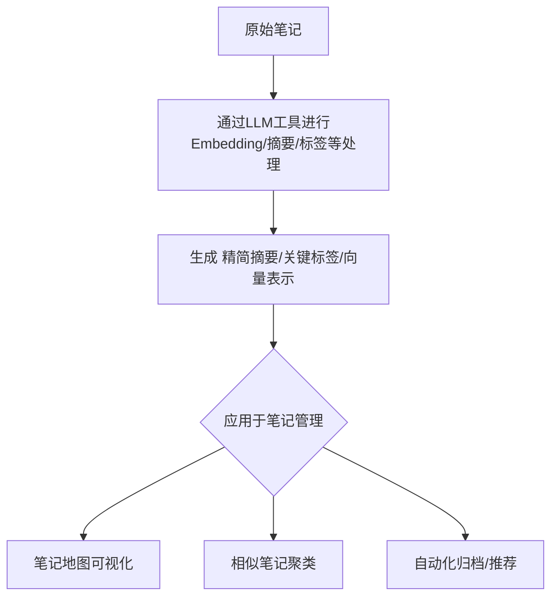

好的，我们来按照[[LLM 中的“降维”本质]]中提到的方法，对这篇笔记本身进行“认知降维”，目标是“以更低的信息密度，保留尽可能多的有用结构。”

根据笔记中的理念，我们可以提取这篇笔记的核心信息、关键结构和重要观点，将其浓缩呈现：

**1. 核心思想/精简版摘要（类似笔记中的“摘要层”）：**

这篇笔记阐述了LLM中“降维”的本质（信息压缩+表达迁移），通过Embedding、Attention和Bottleneck层实现。作者将此理念类比到笔记管理，提出了通过向量化、摘要、概念图等策略，实现笔记的“认知降维”，核心在于用更少的信息保留笔记的关键结构和语义，提升效率。

**2. 主要结构与关键概念提取：**

笔记的核心结构可以概括为：
*   **LLM中的降维机制**: Embedding（高维->低维向量）、Attention（特征提取/过滤）、Bottleneck（压缩/升维）。
*   **将降维理念应用于笔记管理**: 类比LLM机制到笔记操作。
*   **具体的笔记应用策略**:
    *   笔记向量化 (Embedding) -> 聚类、推荐、归档
    *   构建笔记地图/概念图 (PCA/t-SNE类比) -> 可视化结构
    *   创建摘要层 (Projection/Attention类比) -> 精简版、标签
    *   构造认知压缩流 (Agent流程) -> 自动化压缩与组织
*   **结论**: 认知降维的目的不是少记，而是以更低信息密度保留有用结构。

**3. 类比映射总结（笔记核心映射结构的再现）：**

| LLM 降维场景 | 笔记场景的对应理解 |
| :----------- | :----------------- |
| Embedding    | 将笔记向量化       |
| Projection   | 笔记摘要/主题提取  |
| Attention    | 识别笔记重点句     |

**4. 认知压缩流概念图（将流程可视化）：**

这个流程图本身就是对笔记中复杂流程的一种“降维”表示。

通过以上方式，我们从原始笔记中提取了最核心的概念、结构和策略，用更少的文字和更清晰的结构（摘要、列表、表格、流程图）表达了笔记的精髓，实现了“以更低的信息密度，保留尽可能多的有用结构”，这正是对这篇笔记进行认知降维的应用。