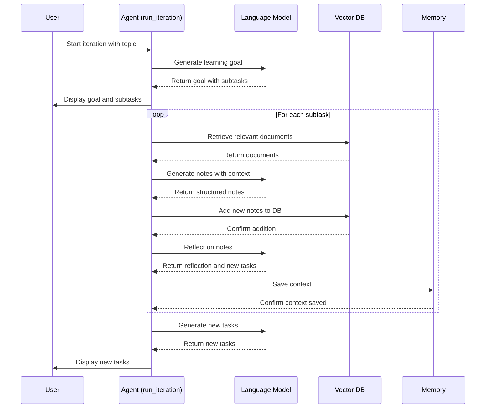

> **LangChain 是框架，LangGraph 是执行引擎。**

---

## 🧠 一句话对比

|项目|一句话概括|
|---|---|
|**LangChain**|提供构建 LLM 应用的全家桶（Prompt、Agent、Retriever、Memory 等组件）。|
|**LangGraph**|提供构建 LLM 驱动的**状态机 / 多步流程**（有状态、可回溯、可恢复的 DAG 执行引擎）。|

---

## 🧩 功能定位拆解

|维度|LangChain|LangGraph|
|---|---|---|
|**功能定位**|应用层框架：封装 prompt、agent、retriever、tool，快速构建 LLM 应用|控制流系统：定义、运行、回溯、检查 LLM 应用中**多步骤任务流程**|
|**是否必须依赖 LangChain？**|是主产品|可脱离 LangChain 使用，但对 LangChain 对象有深度支持|
|**目标场景**|单轮问答、RAG、轻量 agent、多工具集成|多轮 agent、复杂任务流程、状态机系统、流程 AI|
|**开发范式**|Chain-of-Thought 风格，串行链|DAG（有向无环图）状态机，显式定义分支、回退、条件跳转|
|**抽象难度**|易于上手|思维方式更接近 “AI 工作流引擎”|

---

## ⚙️ 核心技术区别

|特性|LangChain|LangGraph|
|---|---|---|
|执行流程|线性/递归调用（Chains, Agents）|明确状态图定义 + 编排|
|状态支持|Memory 提供上下文，但不是强状态机|每一步是“状态节点”，支持并发/条件跳转/回滚|
|可观测性|LangSmith 提供 tracing|原生支持 tracing、历史 replay、checkpoint|
|并发/恢复能力|较弱|支持 node-level 并发、出错恢复、流程暂停/恢复|

---

## 📦 使用方式对比（代码视角）

### 🔹 LangChain 构建一个 Agent（大致流程）：

```python
agent = initialize_agent(
    tools=[search_tool, math_tool],
    llm=ChatOpenAI(),
    agent_type="zero-shot-react-description",
)
response = agent.run("Who is the CEO of Google and what is 1.5 x 2.3?")
```

### 🔹 LangGraph 构建一个带分支的 Agent 状态图：

```python
from langgraph.graph import StateGraph

graph = StateGraph(MyCustomState)
graph.add_node("search", search_node)
graph.add_node("math", math_node)

graph.set_entry_point("search")
graph.add_edge("search", "math")
graph.set_finish_point("math")

app = graph.compile()
app.invoke({"input": "..."})
```

LangGraph 让你显式控制：

- 执行路径
    
- 节点依赖
    
- 状态演变
    
- 异常处理和中断恢复
    

非常像一个 LLM 的 **Airflow + 状态机合体版本**。

---

## 🤖 使用场景对比

|场景|推荐使用|
|---|---|
|FAQ / RAG 系统|✅ LangChain|
|多轮对话、智能助手|✅ LangChain + Memory|
|多阶段任务流程（如“解析 → 计划 → 执行 → 汇报”）|✅ LangGraph|
|多 Agent 协作（如 Boss-Agent、Planner-Executor 架构）|✅ LangGraph|
|可回溯、恢复的企业流程（如法务审查、内容生成审核）|✅ LangGraph|
|Agent 调用链混乱、难以调试|✅ 用 LangGraph 显式管理状态|

---

## 🔮 未来展望（2025）

|预测|说明|
|---|---|
|**LangChain 成为 LLM 应用的组件标准**|类似于“标准库”，用于调用 LLM、接入数据源、封装工具|
|**LangGraph 成为复杂应用的调度引擎**|特别适合 Agent、RAG 工作流、AI pipeline、企业级流程自动化|
|**组合使用是趋势**|LangGraph 用于 orchestrate，LangChain 负责每个 step 的具体逻辑|

---

## ✅ 总结对比表

|属性|LangChain|LangGraph|
|---|---|---|
|本质|构建 LLM App 的模块框架|编排 LLM App 流程的状态机|
|抽象层级|API 级调用|流程级控制|
|适合|Prompt 编排、单步调用、快速开发|多步流程、可恢复状态、Agent 协作系统|
|开发难度|中|中上（但更可控）|
|配合推荐|PromptTemplate、Retriever、Agent|LangChain + LangSmith|

---

如果你准备搭建一个 **智能问答 + Agent + 多阶段验证的企业级 AI 系统**，推荐架构为：

```
LangGraph（执行流程）
    ├── 节点 1: LangChain RAG
    ├── 节点 2: LangChain Tool 使用
    ├── 节点 3: LangChain Agent 验证
    └── 节点 4: Output 结构化 + Storage
```

如果你需要，我可以帮你画一张系统架构图 + 推荐组件。是否要针对某个业务场景来定制？



[[LangChain vs LangGraph - 另则]]