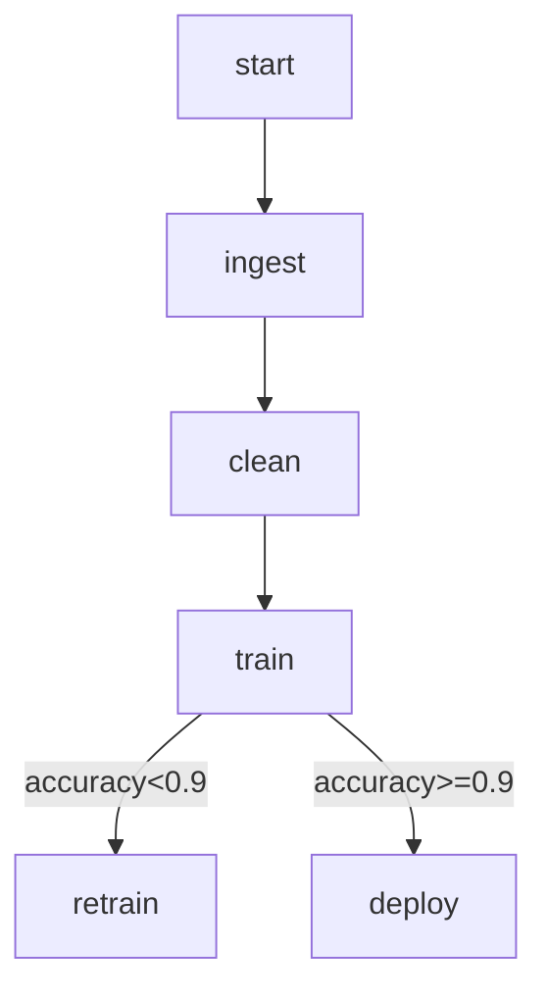

这个问题直指核心：「**LangGraph vs LangChain，谁在多轮对话、MLOps 编排中更有优势？**」我们来做一轮实战对比 + 案例抽象分析。

---

## ✅ 先定义区别：LangChain vs LangGraph

|对比项|LangChain|LangGraph|
|---|---|---|
|编排模型|顺序执行链（LLMChain, AgentExecutor）|状态图（StateGraph）|
|控制结构|线性 / 条件逻辑较弱|强分支、状态跳转、循环、异步|
|状态持久化|Memory 模块支持上下文|明确建模状态字段，支持状态流|
|调试体验|函数嵌套 + 输出难追踪|状态机可视化，路径清晰|
|应用场景|Prompt 工程、单轮问答|多轮对话、动态任务流、任务协作|

---

## 🎯「LangGraph 更合适」的两个关键场景：

### ① 多轮对话 Agent Orchestration（典型用例：客服、写作辅助、代码协作）

**为什么 LangGraph 更合适：**

- 多轮状态需要持久（上下文、意图、反思）
    
- 动态调用多个模块（如：问答、澄清、搜索）
    
- 支持条件跳转、Agent 循环、异常处理（fallback）
    

👀 例如：

```python
START -> classify_intent -> 
    if: needs_context => retriever_agent -> llm_response
    else: llm_response
```

---

### ② MLOps Workflow Orchestration（典型用例：数据清洗 → 模型训练 → 验证 → 监控）

**为什么 LangGraph 更合适：**

- 任务需要明确的阶段控制（数据准备 → 训练 → 验证 → 回滚）
    
- 支持「失败重试」「跳过」「条件跳转」
    
- 易于集成异步任务（上传日志、远程评估）
    

🧠 可以定义成状态图：



---

## ♻️ 复盘：能否重构你的现有项目？

🔍 请思考你是否有如下场景：

- 多步流程判断（如 Agent 在运行时做决策）
    
- 状态切换（用户输入、上下文演化）
    
- 多模块协同（RAG + Tool + Rewriter）
    
- 非常规路径（比如 fallback、提问-反问-总结链）
    

💡 那你就可以从 LangChain 的 `AgentExecutor` 或 `LLMChain`，重构为 LangGraph 的 `StateGraph`。

---

## ✅ 总结一句话：

> **LangChain 是函数调用的序列化工具，而 LangGraph 是具备状态感知、条件跳转、循环能力的 Agent 编排引擎，适合更复杂、更动态的流程。**

如果你给出一个你当前的 LangChain 项目（比如 RAG agent、客服 bot 或 fine-tune pipeline），我可以帮你出一个 LangGraph 重构草图。要试试？

好的，将学习LangChain和LangGraph这两套强大的工具视为一个“复杂问题”，并套用我们刚刚探讨的分解之道，确实是一种高效且符合认知规律的策略。

要快速掌握任何一个复杂的知识体系，本质上就是要有效地管理学习过程中的**认知负荷**。LangChain和LangGraph之所以显得复杂，是因为它们引入了大量概念、组件以及它们之间灵活多变的组合方式。试图一下子理解所有部分及其相互作用，无疑会瞬间压垮我们的**工作记忆**，导致“不知所措”。

因此，运用分解的智慧，就是要将这个庞大的学习任务拆解成更小、更易于消化的部分，并理清这些部分之间的关系。以下是一些解构和掌握LangChain + LangGraph的建议：

1.  **识别核心“原子”或“节点”：**
    *   首先，识别构成这两套工具的最小、最基本的功能单元。在LangChain中，这包括：
        *   **语言模型 (LLMs/ChatModels):** 这是基石，是执行文本处理的核心。先理解如何调用它们，输入输出是什么。
        *   **提示模板 (Prompt Templates):** 理解如何结构化地向模型提问或给出指令。这是与模型“对话”的规范方式。
        *   **输出解析器 (Output Parsers):** 理解如何将模型的自由文本输出转化为结构化的数据（如JSON）。这是让模型输出可被后续程序处理的关键。
        *   **工具 (Tools):** 理解如何定义和使用外部功能（如搜索、计算器）供LLM调用。
    *   在LangGraph中，核心概念更集中：
        *   **节点 (Nodes):** 每个节点就是一个处理步骤，它可以是一个LLM调用、一个工具调用，或者你定义的任何一个Python函数。理解节点就是理解“一个独立的任务单元”。
        *   **边 (Edges):** 连接节点，定义了信息流向。边可以是固定的（总是从A到B），也可以是条件性的（根据节点输出决定去B还是C）。理解边就是理解“控制流和数据流”。
        *   **状态 (State):** LangGraph的核心。理解Graph的状态如何在节点之间传递和更新。这是维持整个流程“记忆”和“上下文”的方式。

    **建议：** 不要试图同时掌握所有类型的LLMs、Prompt Templates、Tools的细节。先从最简单、最常用的开始（例如：一个OpenAI ChatModel，一个简单的字符串模板，一个简单的搜索工具）。掌握其概念和基本用法。

2.  **构建简单的“链”或“图”：**
    *   一旦理解了基本原子，下一步就是学习如何将它们组合起来形成一个简单的流程。
    *   **LangChain的链 (Chains):** 从最简单的LCEL (LangChain Expression Language) 链开始，比如 `prompt | model | output_parser`。理解数据的管道式流动。这是线性的、顺序的组合。
    *   **LangGraph的图 (Graphs):** 构建一个最简单的Graph，比如只有两个节点和一条固定边的Graph。理解Graph结构的基本定义方式：添加节点，添加边，设置入口。

    **建议：** 动手写最简单的示例代码。运行它，观察输入如何变成输出。理解其内部机制比单纯阅读概念重要得多。

3.  **引入“控制流”和“状态管理”——理解LangGraph的威力：**
    *   LangGraph与LangChain Chains的主要区别在于对**状态管理**和**复杂控制流**的显式支持。这是其解决更复杂Agent行为的关键。
    *   学习如何在LangGraph中定义**StateGraph**，如何在节点函数中访问和更新`state`。
    *   学习如何定义**条件边 (Conditional Edges)**，让Graph能够根据某个节点的输出结果动态地决定下一步执行哪个节点。这引入了决策和分支能力，模仿了Agent的思考过程。

    **建议：** 构建一个简单的Agent骨架：一个节点调用LLM决定下一步行动（使用工具或结束），一个节点执行工具调用。利用条件边根据LLM的输出决定走向工具节点还是结束节点。这是一个经典的ReAct模式的简化版，能让你深刻理解状态和条件流的作用。

4.  **整合与迭代：**
    *   理解LangChain的组件（如复杂的Agent Executor，Retrieval Chain）如何可以作为LangGraph中的一个**节点**来使用。LangGraph提供了更高层次的编排能力。
    *   学习不是线性的，是迭代的。从简单功能开始，逐步添加复杂性：增加更多工具、加入记忆(Memory，在LangGraph中就是更新State的一部分)、处理错误、优化提示词等。

    **建议：** 选择一个小的、具体的问题作为目标（例如：一个能够回答特定文档问题的Agent，一个能够执行简单网页搜索的Agent）。从最简陋的版本开始实现，然后根据需要逐步添加功能和优化结构。每次迭代都让你对组件的配合有更深的理解。

**避免“过度分解”的陷阱：**

在学习LangChain/LangGraph时，“过度分解”可能表现为：

*   **陷入细节 API：** 一开始就试图弄懂每个类、每个方法的细枝末节，而不是先理解核心概念和组件的**作用**以及它们之间如何**协同**。
*   **忽略整体流程：** 只关注单个节点或单个工具的用法，而没有花时间去思考整个Agent或Graph的**流程图**是什么样子的，数据和控制是如何在不同节点之间传递的。最终导致虽然会用很多组件，但不知道如何将它们有效地组织起来解决一个实际问题。

**理性与反思：**

学习这两套库，是在学习如何构建复杂的AI应用流程。这不仅仅是写代码，更是在学习一种**系统设计**的思维。LangGraph尤其强调了流程的**显性化**和**状态的可管理性**。当你遇到困难时，停下来画一个Graph的图，思考数据流和控制流在哪里出了问题，往往比盲目修改代码更有效。这与我们在分解问题时，要清晰地定义模块接口和关联是同理的。

正如Donella Meadows所说：“结构决定行为。” 你如何“结构化”你的AI应用流程（用Chain还是Graph，如何定义节点和边），直接决定了这个应用将如何“行为”，是健壮易维护，还是脆弱难调试。

**推荐资源：**

*   **官方文档 (LangChain & LangGraph):** 这是最权威的资料，尤其要关注“Expressiveness / LCEL”和“LangGraph”的部分。它们通常会从简单的例子开始。
*   **Tutorials/Cookbooks:** 官方或社区提供的逐步教程，它们通常会围绕一个具体的应用场景展开，通过实践来理解概念。

快速掌握的关键在于**抓主干、抛细节**（初期），**理解接口、注重组合**，以及**动手实践、迭代优化**。将复杂的整体分解为可控的局部，再逐步学习如何高效地将这些局部“整合”起来，这正是解决任何复杂问题的普适之道，也同样适用于征服LangChain和LangGraph。

---

## LangChain 的核心设计理念

LangChain 的核心设计理念是帮助开发者构建**复杂的大语言模型（LLM）应用程序**。它通过提供一套工具、组件和接口，使得将 LLMs 与外部数据源、计算过程和其他工具结合起来变得更加容易。

简而言之，其核心理念可以概括为以下几点：

1. **组合性（Composability）**: LangChain 将 LLM 应用程序的各个部分（如模型调用、提示模板、解析器、工具等）视为独立的、可组合的模块。你可以像乐高积木一样，将这些小模块灵活地组合起来，构建出复杂的工作流。
    
2. **可观测性（Observability）**: 强调对 LLM 应用程序运行过程的透明化。LangChain 提供了一系列工具（如 LangSmith），帮助开发者追踪、调试和优化 LLM 调用链中的每一步，理解模型是如何做出决策的。
    
3. **代理（Agents）**: LangChain 引入了“代理”的概念，它是一个能够根据 LLM 的思考和对工具的访问来决定下一步行动的系统。代理能够进行多步推理和决策，使得 LLM 应用程序能够执行更复杂的任务。
    
4. **数据感知（Data-Awareness）**: LLMs 自身可能不具备最新或特定领域的数据。LangChain 旨在方便地将 LLMs 与外部数据源（如数据库、文档、API）连接起来，让 LLM 能够访问和利用这些数据来生成更准确、相关的回答。
    
5. **LLM 编排（LLM Orchestration）**: LangChain 的最终目标是简化 LLM 应用程序的开发和部署，通过提供标准化的接口和工作流，让开发者能够专注于业务逻辑而不是底层模型的集成细节。
    

---

## 代码示例

为了更好地理解 LangChain 的核心设计理念，我们来看一个简单的代码示例：**构建一个能够回答关于特定文档问题的问答系统。**

这个示例将展示如何组合 LLM、提示模板、文档加载和检索功能。

Python

```
from langchain_community.document_loaders import TextLoader
from langchain_community.embeddings import OllamaEmbeddings
from langchain_community.vectorstores import Chroma
from langchain_core.prompts import ChatPromptTemplate
from langchain_community.llms import Ollama
from langchain_core.output_parsers import StrOutputParser
from langchain_core.runnables import RunnablePassthrough

# 假设你有一个名为 'example.txt' 的文档
# 请在运行前创建一个 example.txt 文件，并添加一些内容，例如：
# --- example.txt ---
# LangChain is a framework designed to make building applications with large language models (LLMs) easier.
# It provides tools for chaining together different components, allowing for more complex applications.
# Key features include prompt management, chains, agents, and integrations with various data sources.
# --- end example.txt ---

# --- 1. 数据加载 ---
# 使用 TextLoader 加载本地文本文件
loader = TextLoader("example.txt")
docs = loader.load()
print("--- 1. 文档加载完成 ---")

# --- 2. 文本嵌入和向量存储 ---
# 使用 OllamaEmbeddings 作为嵌入模型 (你需要本地运行 Ollama 并下载一个模型，例如 'llama2')
# 如果没有 Ollama，可以替换为 OpenAIEmbeddings 等
embeddings = OllamaEmbeddings(model="llama2")

# 使用 Chroma 作为向量存储，并从文档创建向量
# 这里的 from_documents 会自动进行文本分块和嵌入
vectorstore = Chroma.from_documents(documents=docs, embedding=embeddings)
print("--- 2. 向量存储创建完成 ---")

# 创建一个检索器，用于从向量存储中查找相关文档
retriever = vectorstore.as_retriever()
print("--- 2. 检索器创建完成 ---")


# --- 3. LLM 初始化 ---
# 使用 Ollama 本地运行 LLM (例如 'llama2')
# 确保你的 Ollama 服务器已启动，并且 'llama2' 模型已下载
llm = Ollama(model="llama2")
print("--- 3. LLM 初始化完成 ---")

# --- 4. 提示模板定义 ---
# 定义一个聊天提示模板，包含上下文和用户问题
template = """你是一个问答助手。请根据提供的上下文信息来回答问题。
如果问题无法从上下文中得到答案，请说明你无法找到相关信息。

上下文:
{context}

问题: {question}
"""
prompt = ChatPromptTemplate.from_template(template)
print("--- 4. 提示模板定义完成 ---")

# --- 5. 输出解析器 ---
# 定义一个简单的字符串输出解析器
output_parser = StrOutputParser()
print("--- 5. 输出解析器定义完成 ---")

# --- 6. 构建链 (Chain) ---
# 这是 LangChain 组合性的核心体现：使用 Runnable 接口将各个组件连接起来
# RunnablePassthrough 允许输入直接传递给链的下一个组件，同时可以在字典中添加新的键
# 这里我们将原始问题传递给检索器，同时将检索到的上下文和问题传递给提示模板
chain = (
    {"context": retriever, "question": RunnablePassthrough()}
    | prompt
    | llm
    | output_parser
)
print("--- 6. 链构建完成 ---")

# --- 7. 运行链 ---
question = "What is LangChain designed for?"
print(f"\n--- 7. 提出问题: {question} ---")
answer = chain.invoke(question)
print("\n--- 回答 ---")
print(answer)

# 清理向量存储资源 (可选)
vectorstore.delete_collection()
print("\n--- 向量存储已清理 ---")

```

---

### 示例解析：

这个示例展示了 LangChain 如何实现其核心理念：

- **组合性**:
    
    - 我们看到了 `TextLoader` (加载数据), `OllamaEmbeddings` (生成向量), `Chroma` (向量存储), `retriever` (检索器), `Ollama` (LLM), `ChatPromptTemplate` (提示模板), `StrOutputParser` (输出解析器) 等模块。
    - 这些独立的模块通过 `|` 运算符（LangChain 的 **LCEL - LangChain Expression Language**）被**链式组合**在一起，形成一个完整的问答工作流。`chain = {"context": retriever, "question": RunnablePassthrough()} | prompt | llm | output_parser` 是组合性的最佳体现。
- **数据感知**:
    
    - 通过 `TextLoader` 加载本地 `example.txt` 文档，并使用 `Chroma` 向量存储和 `retriever`，使得 LLM 能够访问并理解文档中的特定信息。这是将 LLM 与外部数据结合的典型模式。
- **LLM 编排**:
    
    - LangChain 负责协调整个流程：首先检索相关上下文，然后将上下文和问题格式化到提示中，接着调用 LLM，最后解析 LLM 的输出。开发者无需手动管理这些步骤之间的复杂交互。
- **模块化**:
    
    - 每个组件（如加载器、嵌入模型、向量存储、LLM、提示、解析器）都是独立的，可以轻松替换为其他实现（例如，将 `Ollama` 替换为 `OpenAI`，将 `Chroma` 替换为 `FAISS`）。

这个例子虽然简单，但它涵盖了构建大多数 RAG (Retrieval-Augmented Generation) 应用程序所需的核心 LangChain 组件和设计模式，清晰地体现了 LangChain 致力于简化复杂 LLM 应用程序开发的理念。