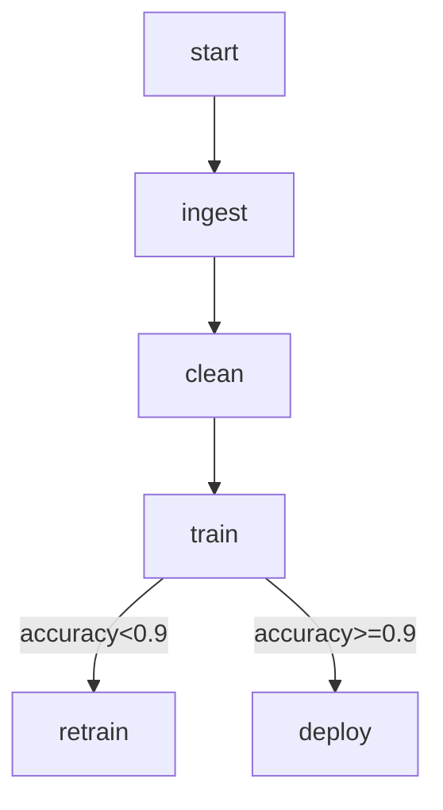

这个问题直指核心：「**LangGraph vs LangChain，谁在多轮对话、MLOps 编排中更有优势？**」我们来做一轮实战对比 + 案例抽象分析。

---

## ✅ 先定义区别：LangChain vs LangGraph

|对比项|LangChain|LangGraph|
|---|---|---|
|编排模型|顺序执行链（LLMChain, AgentExecutor）|状态图（StateGraph）|
|控制结构|线性 / 条件逻辑较弱|强分支、状态跳转、循环、异步|
|状态持久化|Memory 模块支持上下文|明确建模状态字段，支持状态流|
|调试体验|函数嵌套 + 输出难追踪|状态机可视化，路径清晰|
|应用场景|Prompt 工程、单轮问答|多轮对话、动态任务流、任务协作|

---

## 🎯「LangGraph 更合适」的两个关键场景：

### ① 多轮对话 Agent Orchestration（典型用例：客服、写作辅助、代码协作）

**为什么 LangGraph 更合适：**

- 多轮状态需要持久（上下文、意图、反思）
    
- 动态调用多个模块（如：问答、澄清、搜索）
    
- 支持条件跳转、Agent 循环、异常处理（fallback）
    

👀 例如：

```python
START -> classify_intent -> 
    if: needs_context => retriever_agent -> llm_response
    else: llm_response
```

---

### ② MLOps Workflow Orchestration（典型用例：数据清洗 → 模型训练 → 验证 → 监控）

**为什么 LangGraph 更合适：**

- 任务需要明确的阶段控制（数据准备 → 训练 → 验证 → 回滚）
    
- 支持「失败重试」「跳过」「条件跳转」
    
- 易于集成异步任务（上传日志、远程评估）
    

🧠 可以定义成状态图：


```mermaid
graph TD
  start --> ingest
  ingest --> clean
  clean --> train
  train -->|accuracy<0.9| retrain
  train -->|accuracy>=0.9| deploy
```

---

## ♻️ 复盘：能否重构你的现有项目？

🔍 请思考你是否有如下场景：

- 多步流程判断（如 Agent 在运行时做决策）
    
- 状态切换（用户输入、上下文演化）
    
- 多模块协同（RAG + Tool + Rewriter）
    
- 非常规路径（比如 fallback、提问-反问-总结链）
    

💡 那你就可以从 LangChain 的 `AgentExecutor` 或 `LLMChain`，重构为 LangGraph 的 `StateGraph`。

---

## ✅ 总结一句话：

> **LangChain 是函数调用的序列化工具，而 LangGraph 是具备状态感知、条件跳转、循环能力的 Agent 编排引擎，适合更复杂、更动态的流程。**

如果你给出一个你当前的 LangChain 项目（比如 RAG agent、客服 bot 或 fine-tune pipeline），我可以帮你出一个 LangGraph 重构草图。要试试？

好的，将学习LangChain和LangGraph这两套强大的工具视为一个“复杂问题”，并套用我们刚刚探讨的分解之道，确实是一种高效且符合认知规律的策略。

要快速掌握任何一个复杂的知识体系，本质上就是要有效地管理学习过程中的**认知负荷**。LangChain和LangGraph之所以显得复杂，是因为它们引入了大量概念、组件以及它们之间灵活多变的组合方式。试图一下子理解所有部分及其相互作用，无疑会瞬间压垮我们的**工作记忆**，导致“不知所措”。

因此，运用分解的智慧，就是要将这个庞大的学习任务拆解成更小、更易于消化的部分，并理清这些部分之间的关系。以下是一些解构和掌握LangChain + LangGraph的建议：

1.  **识别核心“原子”或“节点”：**
    *   首先，识别构成这两套工具的最小、最基本的功能单元。在LangChain中，这包括：
        *   **语言模型 (LLMs/ChatModels):** 这是基石，是执行文本处理的核心。先理解如何调用它们，输入输出是什么。
        *   **提示模板 (Prompt Templates):** 理解如何结构化地向模型提问或给出指令。这是与模型“对话”的规范方式。
        *   **输出解析器 (Output Parsers):** 理解如何将模型的自由文本输出转化为结构化的数据（如JSON）。这是让模型输出可被后续程序处理的关键。
        *   **工具 (Tools):** 理解如何定义和使用外部功能（如搜索、计算器）供LLM调用。
    *   在LangGraph中，核心概念更集中：
        *   **节点 (Nodes):** 每个节点就是一个处理步骤，它可以是一个LLM调用、一个工具调用，或者你定义的任何一个Python函数。理解节点就是理解“一个独立的任务单元”。
        *   **边 (Edges):** 连接节点，定义了信息流向。边可以是固定的（总是从A到B），也可以是条件性的（根据节点输出决定去B还是C）。理解边就是理解“控制流和数据流”。
        *   **状态 (State):** LangGraph的核心。理解Graph的状态如何在节点之间传递和更新。这是维持整个流程“记忆”和“上下文”的方式。

    **建议：** 不要试图同时掌握所有类型的LLMs、Prompt Templates、Tools的细节。先从最简单、最常用的开始（例如：一个OpenAI ChatModel，一个简单的字符串模板，一个简单的搜索工具）。掌握其概念和基本用法。

2.  **构建简单的“链”或“图”：**
    *   一旦理解了基本原子，下一步就是学习如何将它们组合起来形成一个简单的流程。
    *   **LangChain的链 (Chains):** 从最简单的LCEL (LangChain Expression Language) 链开始，比如 `prompt | model | output_parser`。理解数据的管道式流动。这是线性的、顺序的组合。
    *   **LangGraph的图 (Graphs):** 构建一个最简单的Graph，比如只有两个节点和一条固定边的Graph。理解Graph结构的基本定义方式：添加节点，添加边，设置入口。

    **建议：** 动手写最简单的示例代码。运行它，观察输入如何变成输出。理解其内部机制比单纯阅读概念重要得多。

3.  **引入“控制流”和“状态管理”——理解LangGraph的威力：**
    *   LangGraph与LangChain Chains的主要区别在于对**状态管理**和**复杂控制流**的显式支持。这是其解决更复杂Agent行为的关键。
    *   学习如何在LangGraph中定义**StateGraph**，如何在节点函数中访问和更新`state`。
    *   学习如何定义**条件边 (Conditional Edges)**，让Graph能够根据某个节点的输出结果动态地决定下一步执行哪个节点。这引入了决策和分支能力，模仿了Agent的思考过程。

    **建议：** 构建一个简单的Agent骨架：一个节点调用LLM决定下一步行动（使用工具或结束），一个节点执行工具调用。利用条件边根据LLM的输出决定走向工具节点还是结束节点。这是一个经典的ReAct模式的简化版，能让你深刻理解状态和条件流的作用。

4.  **整合与迭代：**
    *   理解LangChain的组件（如复杂的Agent Executor，Retrieval Chain）如何可以作为LangGraph中的一个**节点**来使用。LangGraph提供了更高层次的编排能力。
    *   学习不是线性的，是迭代的。从简单功能开始，逐步添加复杂性：增加更多工具、加入记忆(Memory，在LangGraph中就是更新State的一部分)、处理错误、优化提示词等。

    **建议：** 选择一个小的、具体的问题作为目标（例如：一个能够回答特定文档问题的Agent，一个能够执行简单网页搜索的Agent）。从最简陋的版本开始实现，然后根据需要逐步添加功能和优化结构。每次迭代都让你对组件的配合有更深的理解。

**避免“过度分解”的陷阱：**

在学习LangChain/LangGraph时，“过度分解”可能表现为：

*   **陷入细节 API：** 一开始就试图弄懂每个类、每个方法的细枝末节，而不是先理解核心概念和组件的**作用**以及它们之间如何**协同**。
*   **忽略整体流程：** 只关注单个节点或单个工具的用法，而没有花时间去思考整个Agent或Graph的**流程图**是什么样子的，数据和控制是如何在不同节点之间传递的。最终导致虽然会用很多组件，但不知道如何将它们有效地组织起来解决一个实际问题。

**理性与反思：**

学习这两套库，是在学习如何构建复杂的AI应用流程。这不仅仅是写代码，更是在学习一种**系统设计**的思维。LangGraph尤其强调了流程的**显性化**和**状态的可管理性**。当你遇到困难时，停下来画一个Graph的图，思考数据流和控制流在哪里出了问题，往往比盲目修改代码更有效。这与我们在分解问题时，要清晰地定义模块接口和关联是同理的。

正如Donella Meadows所说：“结构决定行为。” 你如何“结构化”你的AI应用流程（用Chain还是Graph，如何定义节点和边），直接决定了这个应用将如何“行为”，是健壮易维护，还是脆弱难调试。

**推荐资源：**

*   **官方文档 (LangChain & LangGraph):** 这是最权威的资料，尤其要关注“Expressiveness / LCEL”和“LangGraph”的部分。它们通常会从简单的例子开始。
*   **Tutorials/Cookbooks:** 官方或社区提供的逐步教程，它们通常会围绕一个具体的应用场景展开，通过实践来理解概念。

快速掌握的关键在于**抓主干、抛细节**（初期），**理解接口、注重组合**，以及**动手实践、迭代优化**。将复杂的整体分解为可控的局部，再逐步学习如何高效地将这些局部“整合”起来，这正是解决任何复杂问题的普适之道，也同样适用于征服LangChain和LangGraph。