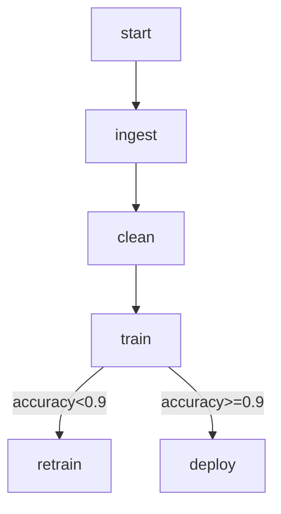

这个问题直指核心：「**LangGraph vs LangChain，谁在多轮对话、MLOps 编排中更有优势？**」我们来做一轮实战对比 + 案例抽象分析。

---

## ✅ 先定义区别：LangChain vs LangGraph

|对比项|LangChain|LangGraph|
|---|---|---|
|编排模型|顺序执行链（LLMChain, AgentExecutor）|状态图（StateGraph）|
|控制结构|线性 / 条件逻辑较弱|强分支、状态跳转、循环、异步|
|状态持久化|Memory 模块支持上下文|明确建模状态字段，支持状态流|
|调试体验|函数嵌套 + 输出难追踪|状态机可视化，路径清晰|
|应用场景|Prompt 工程、单轮问答|多轮对话、动态任务流、任务协作|

---

## 🎯「LangGraph 更合适」的两个关键场景：

### ① 多轮对话 Agent Orchestration（典型用例：客服、写作辅助、代码协作）

**为什么 LangGraph 更合适：**

- 多轮状态需要持久（上下文、意图、反思）
    
- 动态调用多个模块（如：问答、澄清、搜索）
    
- 支持条件跳转、Agent 循环、异常处理（fallback）
    

👀 例如：

```python
START -> classify_intent -> 
    if: needs_context => retriever_agent -> llm_response
    else: llm_response
```

---

### ② MLOps Workflow Orchestration（典型用例：数据清洗 → 模型训练 → 验证 → 监控）

**为什么 LangGraph 更合适：**

- 任务需要明确的阶段控制（数据准备 → 训练 → 验证 → 回滚）
    
- 支持「失败重试」「跳过」「条件跳转」
    
- 易于集成异步任务（上传日志、远程评估）
    

🧠 可以定义成状态图：


```mermaid
graph TD
  start --> ingest
  ingest --> clean
  clean --> train
  train -->|accuracy<0.9| retrain
  train -->|accuracy>=0.9| deploy
```

---

## ♻️ 复盘：能否重构你的现有项目？

🔍 请思考你是否有如下场景：

- 多步流程判断（如 Agent 在运行时做决策）
    
- 状态切换（用户输入、上下文演化）
    
- 多模块协同（RAG + Tool + Rewriter）
    
- 非常规路径（比如 fallback、提问-反问-总结链）
    

💡 那你就可以从 LangChain 的 `AgentExecutor` 或 `LLMChain`，重构为 LangGraph 的 `StateGraph`。

---

## ✅ 总结一句话：

> **LangChain 是函数调用的序列化工具，而 LangGraph 是具备状态感知、条件跳转、循环能力的 Agent 编排引擎，适合更复杂、更动态的流程。**

如果你给出一个你当前的 LangChain 项目（比如 RAG agent、客服 bot 或 fine-tune pipeline），我可以帮你出一个 LangGraph 重构草图。要试试？