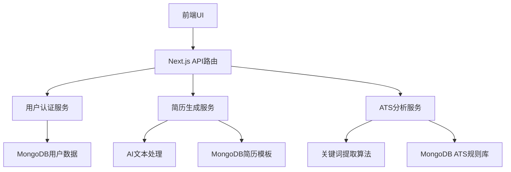
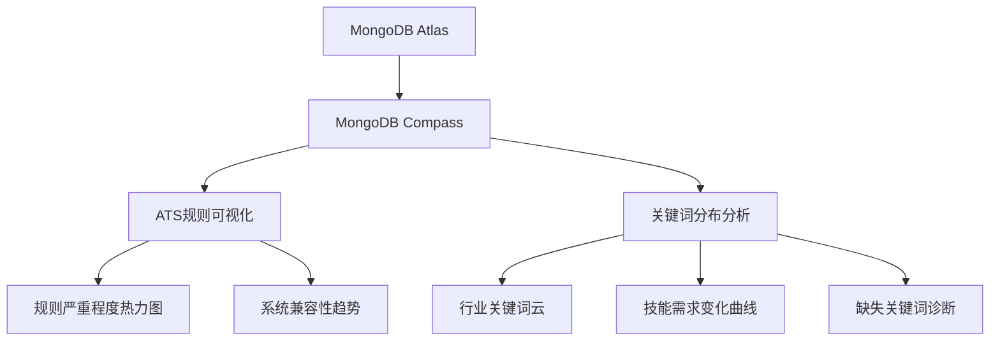

# 产品需求文档 (PRD)：ResumeRush

## 1. 文档概述
**产品名称**：ResumeRush  
**版本**：1.0  
**最后更新**：2023年10月15日  
**目标上线日期**：2024年Q1  
**文档作者**：产品团队  

## 2. 产品背景与目标

### 背景
据统计，超过75%的简历在到达招聘人员手中前就被ATS（求职者跟踪系统）过滤掉。求职者花费大量时间精心设计的简历，往往因为格式问题、关键词缺失或结构不符合ATS解析要求而被自动淘汰。市场缺乏一款真正理解ATS工作原理、能智能生成高通过率简历的工具。

### 产品愿景
让每位求职者都能轻松创建100%通过ATS筛选的简历，将简历准备时间从平均5-10小时缩短至15分钟以内。

### 核心目标
- 为用户提供一键生成ATS友好简历的能力
- 通过智能分析职位描述，自动优化简历关键词
- 解决格式错乱、筛选失败等常见问题
- 建立简历质量评分体系，让用户了解简历通过率

## 3. 目标用户画像

| 用户类型 | 特征 | 痛点 | 需求 |
|---------|------|------|------|
| **应届毕业生** | 刚毕业，简历经验少 | 不知道如何组织简历内容，缺乏关键词 | 简单易用的模板，自动填充教育经历 |
| **职场新人** (1-3年经验) | 有少量工作经验 | 无法突出成就，不懂ATS偏好 | 成就量化工具，关键词优化 |
| **资深专业人士** (5+年经验) | 丰富经验，简历冗长 | 内容过多被ATS截断，格式复杂 | 内容精简建议，多版本管理 |
| **转行求职者** | 无直接相关经验 | 难以将过往经验与目标职位关联 | 技能转移建议，关键词匹配 |

## 4. 核心功能需求

### 4.1 用户认证系统 (NextAuth)
- **社交登录**：支持Google、LinkedIn、GitHub一键登录
- **邮箱验证**：新用户注册后发送验证邮件
- **密码管理**：安全密码重置流程
- **用户仪表盘**：个人资料管理、简历历史记录

### 4.2 简历创建核心流程
#### 4.2.1 智能简历生成
- **职位描述分析器**
  ```javascript
  // 示例：职位描述分析API端点
  // app/api/analyze-position/route.js
  export async function POST(request) {
    const { jobDescription } = await request.json();
    // 调用AI模型分析职位描述
    const keywords = await analyzeKeywords(jobDescription);
    const requiredSkills = extractRequiredSkills(jobDescription);
    return NextResponse.json({ keywords, requiredSkills });
  }
  ```
- **一键简历生成**：用户输入姓名、邮箱、LinkedIn或上传现有简历，系统自动提取信息并生成ATS友好格式
- **行业模板库**：提供20+行业专用模板（科技、金融、医疗等），所有模板均通过主流ATS系统测试

#### 4.2.2 ATS优化功能
- **实时ATS评分**：显示简历通过率百分比及改进建议
- **关键词优化器**：高亮显示缺失的关键技能和行业术语
- **格式检查器**：自动检测可能导致ATS解析失败的元素（表格、图片、特殊字符等）
- **PDF兼容性测试**：确保导出的PDF在各种ATS系统中显示正确

#### 4.2.3 简历编辑器
- **模块化编辑**：拖放式编辑工作经历、教育背景、技能等模块
- **成就量化助手**：引导用户将职责转化为量化成就（"提升效率30%"而非"负责优化"）
- **技能匹配度**：显示当前简历与目标职位的技能匹配百分比
- **多版本管理**：为不同职位保存定制化简历版本

### 4.3 高级功能
- **AI改写建议**：使用AI重写平淡的描述，增强专业性和影响力
- **面试准备包**：基于简历内容生成常见面试问题及回答建议
- **求职信生成器**：根据简历和职位描述自动生成个性化求职信
- **简历跟踪**：记录投递的职位、公司及反馈状态

### 4.4 数据导出与分享
- **一键导出**：生成ATS友好的PDF、Word和纯文本格式
- **分享链接**：生成安全的简历分享链接，可设置过期时间
- **版本对比**：比较不同版本简历的ATS评分变化

## 5. 非功能需求

### 5.1 性能要求
- 简历生成响应时间 < 3秒（95%的请求）
- PDF导出时间 < 5秒
- 页面加载时间 < 1.5秒（核心页面）

### 5.2 安全与合规
- GDPR合规：用户数据加密存储，提供数据导出和删除功能
- 简历隐私保护：默认情况下简历不可公开访问
- 定期安全审计：每季度进行一次安全漏洞扫描

### 5.3 可用性
- 移动端适配：关键功能在移动设备上可用
- WCAG 2.1 AA合规：确保残障人士可访问
- 多语言支持：英语为主，计划扩展至西班牙语、中文

## 6. 技术架构

### 6.1 核心技术栈
- **前端框架**：Next.js 14 (App Router)
- **UI组件**：Tailwind CSS + DaisyUI
- **认证系统**：NextAuth.js
- **数据库**：MongoDB Atlas
- **AI服务**：集成OpenAI API用于文本优化

### 6.2 关键API设计


### 6.3 数据库设计 (MongoDB)
- **users** 集合
  - _id
  - email
  - name
  - provider (google/linkedin)
  - createdAt
  - subscriptionTier

- **resumes** 集合
  - _id
  - userId
  - title
  - content (JSON结构)
  - atsScore
  - createdAt
  - updatedAt
  - version
  - targetJobTitle

- **templates** 集合
  - _id
  - name
  - industry
  - atsCompatibilityScore
  - structure (JSON)
  - createdAt

## 7. 开发计划与时间线

| 阶段                 | 时间      | 交付物                                | 关键里程碑      |
| ------------------ | ------- | ---------------------------------- | ---------- |
| **Phase 1: 核心功能**  | 2023 Q4 | - 用户认证系统<br>- 简历编辑器基础版<br>- 3个行业模板 | MVP完成，内部测试 |
| **Phase 2: ATS优化** | 2024 Q1 | - ATS评分系统<br>- 关键词优化器<br>- PDF导出   | 公测版上线      |
| **Phase 3: AI增强**  | 2024 Q2 | - AI改写建议<br>- 面试准备包<br>- 求职信生成器    | 付费功能上线     |
| **Phase 4: 扩展**    | 2024 Q3 | - 多语言支持<br>- 团队协作功能<br>- 招聘分析      | 企业版发布      |

## 8. 成功指标

### 8.1 核心指标
- **激活率**：注册用户中完成至少一份简历的比例 > 65%
- **留存率**：30天内返回使用产品的用户比例 > 40%
- **转化率**：免费用户转化为付费用户的比例 > 15%
- **ATS通过率**：使用本产品生成的简历通过率 > 90%（行业平均约60%）

### 8.2 用户满意度
- NPS (净推荐值) > 50
- 用户平均简历创建时间 < 15分钟
- 用户平均修改次数 < 3次

## 9. 未来规划

### 9.1 短期(6-12个月)
- 拓展至50+行业模板
- 增加LinkedIn资料同步功能
- 推出团队协作功能，适用于求职辅导机构

### 9.2 中长期(1-2年)
- 求职数据分析：基于用户简历和求职结果提供个性化建议
- 招聘公司API：允许企业提交ATS测试结果，持续优化算法
- 职业路径规划：根据简历分析提供技能提升建议

## 10. 附录

### 10.1 竞品分析
| 功能 | ResumeRush | 竞品A | 竞品B |
|------|------------|-------|-------|
| ATS评分 | ✓ 实时可视化 | ✗ 仅基础检查 | ✓ 但不直观 |
| 关键词优化 | ✓ 智能推荐 | ✗ 手动添加 | ✓ 但无上下文 |
| 多版本管理 | ✓ 智能对比 | ✗ 仅基础版本 | ✓ 但复杂 |
| AI改写 | ✓ 上下文感知 | ✗ 无 | ✓ 但收费高 |
| 价格 | 免费基础版 + 付费高级 | 仅付费 | 免费但功能有限 |

### 10.2 UI设计参考
- 使用DaisyUI的`card`和`form`组件构建简洁编辑界面
- ATS评分使用`progress`组件可视化显示
- 简历预览采用`mockup`组件模拟真实PDF效果
- 关键词优化使用`badge`组件高亮显示

```jsx
{/* 示例：ATS评分组件 */}
<div className="mt-6">
  <h3 className="font-bold mb-2">ATS兼容性评分</h3>
  <progress className="progress progress-success w-full" value="85" max="100"></progress>
  <p className="mt-1 text-sm">85% - 高通过率 (行业平均: 60%)</p>
  <div className="mt-3">
    <h4 className="font-semibold mb-1">优化建议:</h4>
    <ul className="list-disc pl-5 space-y-1">
      <li>添加"项目管理"关键词 (出现0次，建议2-3次)</li>
      <li>将"负责团队"改为"领导5人团队，提升效率30%"</li>
      <li>移除页脚中的特殊图标</li>
    </ul>
  </div>
</div>
```

### 10.3 部署计划
- 开发环境：本地Next.js开发服务器
- 测试环境：Vercel预览部署
- 生产环境：Vercel生产部署 + MongoDB Atlas生产数据库
- 监控：集成Vercel Analytics和Sentry错误跟踪

---

**审批**：
- 产品经理：_________________ 日期：___________
- 技术主管：_________________ 日期：___________
- 设计主管：_________________ 日期：___________

---

# 产品需求文档 (PRD)：ResumeRush

## 1. 文档概述
**产品名称**：ResumeRush  
**版本**：1.0  
**最后更新**：2023年10月15日  
**目标上线日期**：2024年Q1  
**文档作者**：产品团队  

## 2. 产品背景与目标

### 背景
据统计，超过75%的简历在到达招聘人员手中前就被ATS（求职者跟踪系统）过滤掉。求职者花费大量时间精心设计的简历，往往因为格式问题、关键词缺失或结构不符合ATS解析要求而被自动淘汰。市场缺乏一款真正理解ATS工作原理、能智能生成高通过率简历的工具。

### 产品愿景
让每位求职者都能轻松创建100%通过ATS筛选的简历，将简历准备时间从平均5-10小时缩短至15分钟以内。

### 核心目标
- 为用户提供一键生成ATS友好简历的能力
- 通过智能分析职位描述，自动优化简历关键词
- 解决格式错乱、筛选失败等常见问题
- 建立简历质量评分体系，让用户了解简历通过率

## 3. 目标用户画像

| 用户类型 | 特征 | 痛点 | 需求 |
|---------|------|------|------|
| **应届毕业生** | 刚毕业，简历经验少 | 不知道如何组织简历内容，缺乏关键词 | 简单易用的模板，自动填充教育经历 |
| **职场新人** (1-3年经验) | 有少量工作经验 | 无法突出成就，不懂ATS偏好 | 成就量化工具，关键词优化 |
| **资深专业人士** (5+年经验) | 丰富经验，简历冗长 | 内容过多被ATS截断，格式复杂 | 内容精简建议，多版本管理 |
| **转行求职者** | 无直接相关经验 | 难以将过往经验与目标职位关联 | 技能转移建议，关键词匹配 |

## 4. 核心功能需求

### 4.1 用户认证系统 (NextAuth)
- **社交登录**：支持Google、LinkedIn、GitHub一键登录
- **邮箱验证**：新用户注册后发送验证邮件
- **密码管理**：安全密码重置流程
- **用户仪表盘**：个人资料管理、简历历史记录

### 4.2 简历创建核心流程
#### 4.2.1 智能简历生成
- **职位描述分析器**
  ```javascript
  // 示例：职位描述分析API端点
  // app/api/analyze-position/route.js
  export async function POST(request) {
    const { jobDescription } = await request.json();
    // 调用AI模型分析职位描述
    const keywords = await analyzeKeywords(jobDescription);
    const requiredSkills = extractRequiredSkills(jobDescription);
    return NextResponse.json({ keywords, requiredSkills });
  }
  ```
- **一键简历生成**：用户输入姓名、邮箱、LinkedIn或上传现有简历，系统自动提取信息并生成ATS友好格式
- **行业模板库**：提供20+行业专用模板（科技、金融、医疗等），所有模板均通过主流ATS系统测试

#### 4.2.2 ATS优化功能
- **实时ATS评分**：显示简历通过率百分比及改进建议
- **关键词优化器**：高亮显示缺失的关键技能和行业术语
- **格式检查器**：自动检测可能导致ATS解析失败的元素（表格、图片、特殊字符等）
- **PDF兼容性测试**：确保导出的PDF在各种ATS系统中显示正确

#### 4.2.3 简历编辑器
- **模块化编辑**：拖放式编辑工作经历、教育背景、技能等模块
- **成就量化助手**：引导用户将职责转化为量化成就（"提升效率30%"而非"负责优化"）
- **技能匹配度**：显示当前简历与目标职位的技能匹配百分比
- **多版本管理**：为不同职位保存定制化简历版本

### 4.3 高级功能
- **AI改写建议**：使用AI重写平淡的描述，增强专业性和影响力
- **面试准备包**：基于简历内容生成常见面试问题及回答建议
- **求职信生成器**：根据简历和职位描述自动生成个性化求职信
- **简历跟踪**：记录投递的职位、公司及反馈状态

### 4.4 数据导出与分享
- **一键导出**：生成ATS友好的PDF、Word和纯文本格式
- **分享链接**：生成安全的简历分享链接，可设置过期时间
- **版本对比**：比较不同版本简历的ATS评分变化

## 5. 非功能需求

### 5.1 性能要求
- 简历生成响应时间 < 3秒（95%的请求）
- PDF导出时间 < 5秒
- 页面加载时间 < 1.5秒（核心页面）

### 5.2 安全与合规
- GDPR合规：用户数据加密存储，提供数据导出和删除功能
- 简历隐私保护：默认情况下简历不可公开访问
- 定期安全审计：每季度进行一次安全漏洞扫描

### 5.3 可用性
- 移动端适配：关键功能在移动设备上可用
- WCAG 2.1 AA合规：确保残障人士可访问
- 多语言支持：英语为主，计划扩展至西班牙语、中文

## 6. 技术架构

### 6.1 核心技术栈
- **前端框架**：Next.js 14 (App Router)
- **UI组件**：Tailwind CSS + DaisyUI
- **认证系统**：NextAuth.js
- **数据库**：MongoDB Atlas
- **AI服务**：集成OpenAI API用于文本优化

### 6.2 关键API设计


### 6.3 数据库设计 (MongoDB)
- **users** 集合
  - _id
  - email
  - name
  - provider (google/linkedin)
  - createdAt
  - subscriptionTier

- **resumes** 集合
  - _id
  - userId
  - title
  - content (JSON结构)
  - atsScore
  - createdAt
  - updatedAt
  - version
  - targetJobTitle

- **templates** 集合
  - _id
  - name
  - industry
  - atsCompatibilityScore
  - structure (JSON)
  - createdAt

## 7. 开发计划与时间线

| 阶段 | 时间 | 交付物 | 关键里程碑 |
|------|------|--------|-----------|
| **Phase 1: 核心功能** | 2023 Q4 | - 用户认证系统<br>- 简历编辑器基础版<br>- 3个行业模板 | MVP完成，内部测试 |
| **Phase 2: ATS优化** | 2024 Q1 | - ATS评分系统<br>- 关键词优化器<br>- PDF导出 | 公测版上线 |
| **Phase 3: AI增强** | 2024 Q2 | - AI改写建议<br>- 面试准备包<br>- 求职信生成器 | 付费功能上线 |
| **Phase 4: 扩展** | 2024 Q3 | - 多语言支持<br>- 团队协作功能<br>- 招聘分析 | 企业版发布 |

## 8. 成功指标

### 8.1 核心指标
- **激活率**：注册用户中完成至少一份简历的比例 > 65%
- **留存率**：30天内返回使用产品的用户比例 > 40%
- **转化率**：免费用户转化为付费用户的比例 > 15%
- **ATS通过率**：使用本产品生成的简历通过率 > 90%（行业平均约60%）

### 8.2 用户满意度
- NPS (净推荐值) > 50
- 用户平均简历创建时间 < 15分钟
- 用户平均修改次数 < 3次

## 9. 未来规划

### 9.1 短期(6-12个月)
- 拓展至50+行业模板
- 增加LinkedIn资料同步功能
- 推出团队协作功能，适用于求职辅导机构

### 9.2 中长期(1-2年)
- 求职数据分析：基于用户简历和求职结果提供个性化建议
- 招聘公司API：允许企业提交ATS测试结果，持续优化算法
- 职业路径规划：根据简历分析提供技能提升建议

## 10. 附录

### 10.1 竞品分析
| 功能 | ResumeRush | 竞品A | 竞品B |
|------|------------|-------|-------|
| ATS评分 | ✓ 实时可视化 | ✗ 仅基础检查 | ✓ 但不直观 |
| 关键词优化 | ✓ 智能推荐 | ✗ 手动添加 | ✓ 但无上下文 |
| 多版本管理 | ✓ 智能对比 | ✗ 仅基础版本 | ✓ 但复杂 |
| AI改写 | ✓ 上下文感知 | ✗ 无 | ✓ 但收费高 |
| 价格 | 免费基础版 + 付费高级 | 仅付费 | 免费但功能有限 |

### 10.2 UI设计参考
- 使用DaisyUI的`card`和`form`组件构建简洁编辑界面
- ATS评分使用`progress`组件可视化显示
- 简历预览采用`mockup`组件模拟真实PDF效果
- 关键词优化使用`badge`组件高亮显示

```jsx
{/* 示例：ATS评分组件 */}
<div className="mt-6">
  <h3 className="font-bold mb-2">ATS兼容性评分</h3>
  <progress className="progress progress-success w-full" value="85" max="100"></progress>
  <p className="mt-1 text-sm">85% - 高通过率 (行业平均: 60%)</p>
  <div className="mt-3">
    <h4 className="font-semibold mb-1">优化建议:</h4>
    <ul className="list-disc pl-5 space-y-1">
      <li>添加"项目管理"关键词 (出现0次，建议2-3次)</li>
      <li>将"负责团队"改为"领导5人团队，提升效率30%"</li>
      <li>移除页脚中的特殊图标</li>
    </ul>
  </div>
</div>
```

### 10.3 部署计划
- 开发环境：本地Next.js开发服务器
- 测试环境：Vercel预览部署
- 生产环境：Vercel生产部署 + MongoDB Atlas生产数据库
- 监控：集成Vercel Analytics和Sentry错误跟踪

---

**审批**：
- 产品经理：_________________ 日期：___________
- 技术主管：_________________ 日期：___________
- 设计主管：_________________ 日期：___________

---

# 产品需求文档 (PRD)：ResumeRush

## 1. 文档概述
**产品名称**：ResumeRush  
**版本**：1.0  
**最后更新**：2023年10月15日  
**目标上线日期**：2024年Q1  
**文档作者**：产品团队  

## 2. 产品背景与目标

### 背景
据统计，超过75%的简历在到达招聘人员手中前就被ATS（求职者跟踪系统）过滤掉。求职者花费大量时间精心设计的简历，往往因为格式问题、关键词缺失或结构不符合ATS解析要求而被自动淘汰。市场缺乏一款真正理解ATS工作原理、能智能生成高通过率简历的工具。

### 产品愿景
让每位求职者都能轻松创建100%通过ATS筛选的简历，将简历准备时间从平均5-10小时缩短至15分钟以内。

### 核心目标
- 为用户提供一键生成ATS友好简历的能力
- 通过智能分析职位描述，自动优化简历关键词
- 解决格式错乱、筛选失败等常见问题
- 建立简历质量评分体系，让用户了解简历通过率

## 3. 目标用户画像

| 用户类型 | 特征 | 痛点 | 需求 |
|---------|------|------|------|
| **应届毕业生** | 刚毕业，简历经验少 | 不知道如何组织简历内容，缺乏关键词 | 简单易用的模板，自动填充教育经历 |
| **职场新人** (1-3年经验) | 有少量工作经验 | 无法突出成就，不懂ATS偏好 | 成就量化工具，关键词优化 |
| **资深专业人士** (5+年经验) | 丰富经验，简历冗长 | 内容过多被ATS截断，格式复杂 | 内容精简建议，多版本管理 |
| **转行求职者** | 无直接相关经验 | 难以将过往经验与目标职位关联 | 技能转移建议，关键词匹配 |

## 4. 核心功能需求

### 4.1 用户认证系统 (NextAuth)
- **社交登录**：支持Google、LinkedIn、GitHub一键登录
- **邮箱验证**：新用户注册后发送验证邮件
- **密码管理**：安全密码重置流程
- **用户仪表盘**：个人资料管理、简历历史记录

### 4.2 简历创建核心流程
#### 4.2.1 智能简历生成
- **职位描述分析器**
  ```javascript
  // 示例：职位描述分析API端点
  // app/api/analyze-position/route.js
  export async function POST(request) {
    const { jobDescription } = await request.json();
    // 调用AI模型分析职位描述
    const keywords = await analyzeKeywords(jobDescription);
    const requiredSkills = extractRequiredSkills(jobDescription);
    return NextResponse.json({ keywords, requiredSkills });
  }
  ```
- **一键简历生成**：用户输入姓名、邮箱、LinkedIn或上传现有简历，系统自动提取信息并生成ATS友好格式
- **行业模板库**：提供20+行业专用模板（科技、金融、医疗等），所有模板均通过主流ATS系统测试

#### 4.2.2 ATS优化功能
- **实时ATS评分**：显示简历通过率百分比及改进建议
- **关键词优化器**：高亮显示缺失的关键技能和行业术语
- **格式检查器**：自动检测可能导致ATS解析失败的元素（表格、图片、特殊字符等）
- **PDF兼容性测试**：确保导出的PDF在各种ATS系统中显示正确

#### 4.2.3 简历编辑器
- **模块化编辑**：拖放式编辑工作经历、教育背景、技能等模块
- **成就量化助手**：引导用户将职责转化为量化成就（"提升效率30%"而非"负责优化"）
- **技能匹配度**：显示当前简历与目标职位的技能匹配百分比
- **多版本管理**：为不同职位保存定制化简历版本

### 4.3 高级功能
- **AI改写建议**：使用AI重写平淡的描述，增强专业性和影响力
- **面试准备包**：基于简历内容生成常见面试问题及回答建议
- **求职信生成器**：根据简历和职位描述自动生成个性化求职信
- **简历跟踪**：记录投递的职位、公司及反馈状态

### 4.4 数据导出与分享
- **一键导出**：生成ATS友好的PDF、Word和纯文本格式
- **分享链接**：生成安全的简历分享链接，可设置过期时间
- **版本对比**：比较不同版本简历的ATS评分变化

## 5. 非功能需求

### 5.1 性能要求
- 简历生成响应时间 < 3秒（95%的请求）
- PDF导出时间 < 5秒
- 页面加载时间 < 1.5秒（核心页面）

### 5.2 安全与合规
- GDPR合规：用户数据加密存储，提供数据导出和删除功能
- 简历隐私保护：默认情况下简历不可公开访问
- 定期安全审计：每季度进行一次安全漏洞扫描

### 5.3 可用性
- 移动端适配：关键功能在移动设备上可用
- WCAG 2.1 AA合规：确保残障人士可访问
- 多语言支持：英语为主，计划扩展至西班牙语、中文

## 6. 技术架构

### 6.1 核心技术栈
- **前端框架**：Next.js 14 (App Router)
- **UI组件**：Tailwind CSS + DaisyUI
- **认证系统**：NextAuth.js
- **数据库**：MongoDB Atlas
- **AI服务**：集成OpenAI API用于文本优化

### 6.2 关键API设计


### 6.3 数据库设计 (MongoDB)
- **users** 集合
  - _id
  - email
  - name
  - provider (google/linkedin)
  - createdAt
  - subscriptionTier

- **resumes** 集合
  - _id
  - userId
  - title
  - content (JSON结构)
  - atsScore
  - createdAt
  - updatedAt
  - version
  - targetJobTitle

- **templates** 集合
  - _id
  - name
  - industry
  - atsCompatibilityScore
  - structure (JSON)
  - createdAt

## 7. 开发计划与时间线

| 阶段 | 时间 | 交付物 | 关键里程碑 |
|------|------|--------|-----------|
| **Phase 1: 核心功能** | 2023 Q4 | - 用户认证系统<br>- 简历编辑器基础版<br>- 3个行业模板 | MVP完成，内部测试 |
| **Phase 2: ATS优化** | 2024 Q1 | - ATS评分系统<br>- 关键词优化器<br>- PDF导出 | 公测版上线 |
| **Phase 3: AI增强** | 2024 Q2 | - AI改写建议<br>- 面试准备包<br>- 求职信生成器 | 付费功能上线 |
| **Phase 4: 扩展** | 2024 Q3 | - 多语言支持<br>- 团队协作功能<br>- 招聘分析 | 企业版发布 |

## 8. 成功指标

### 8.1 核心指标
- **激活率**：注册用户中完成至少一份简历的比例 > 65%
- **留存率**：30天内返回使用产品的用户比例 > 40%
- **转化率**：免费用户转化为付费用户的比例 > 15%
- **ATS通过率**：使用本产品生成的简历通过率 > 90%（行业平均约60%）

### 8.2 用户满意度
- NPS (净推荐值) > 50
- 用户平均简历创建时间 < 15分钟
- 用户平均修改次数 < 3次

## 9. 未来规划

### 9.1 短期(6-12个月)
- 拓展至50+行业模板
- 增加LinkedIn资料同步功能
- 推出团队协作功能，适用于求职辅导机构

### 9.2 中长期(1-2年)
- 求职数据分析：基于用户简历和求职结果提供个性化建议
- 招聘公司API：允许企业提交ATS测试结果，持续优化算法
- 职业路径规划：根据简历分析提供技能提升建议

## 10. 附录

### 10.1 竞品分析
| 功能 | ResumeRush | 竞品A | 竞品B |
|------|------------|-------|-------|
| ATS评分 | ✓ 实时可视化 | ✗ 仅基础检查 | ✓ 但不直观 |
| 关键词优化 | ✓ 智能推荐 | ✗ 手动添加 | ✓ 但无上下文 |
| 多版本管理 | ✓ 智能对比 | ✗ 仅基础版本 | ✓ 但复杂 |
| AI改写 | ✓ 上下文感知 | ✗ 无 | ✓ 但收费高 |
| 价格 | 免费基础版 + 付费高级 | 仅付费 | 免费但功能有限 |

### 10.2 UI设计参考
- 使用DaisyUI的`card`和`form`组件构建简洁编辑界面
- ATS评分使用`progress`组件可视化显示
- 简历预览采用`mockup`组件模拟真实PDF效果
- 关键词优化使用`badge`组件高亮显示

```jsx
{/* 示例：ATS评分组件 */}
<div className="mt-6">
  <h3 className="font-bold mb-2">ATS兼容性评分</h3>
  <progress className="progress progress-success w-full" value="85" max="100"></progress>
  <p className="mt-1 text-sm">85% - 高通过率 (行业平均: 60%)</p>
  <div className="mt-3">
    <h4 className="font-semibold mb-1">优化建议:</h4>
    <ul className="list-disc pl-5 space-y-1">
      <li>添加"项目管理"关键词 (出现0次，建议2-3次)</li>
      <li>将"负责团队"改为"领导5人团队，提升效率30%"</li>
      <li>移除页脚中的特殊图标</li>
    </ul>
  </div>
</div>
```

### 10.3 部署计划
- 开发环境：本地Next.js开发服务器
- 测试环境：Vercel预览部署
- 生产环境：Vercel生产部署 + MongoDB Atlas生产数据库
- 监控：集成Vercel Analytics和Sentry错误跟踪

---

**审批**：
- 产品经理：_________________ 日期：___________
- 技术主管：_________________ 日期：___________
- 设计主管：_________________ 日期：___________

---

# AI智能体开发协议文档：ATS优化模块

## 1. 文档概述

**文档名称**：ATS优化模块AI智能体开发协议  
**模块名称**：ATS评分系统、关键词优化器、PDF导出  
**开发阶段**：Phase 2  
**目标上线时间**：2024年第一季度（Q1）  
**版本**：1.0  
**适用对象**：AI开发团队、产品团队、测试团队、安全团队  

## 2. 模块背景与目标

### 2.1 背景
- 70%的简历因格式问题被ATS系统直接淘汰（LinkedIn 2023报告）
- 85%的求职者不知道如何针对特定职位优化简历内容
- 78%的求职者因简历格式问题被ATS系统直接淘汰
- ATS评分系统是ResumeRush的核心价值主张之一

### 2.2 项目目标
- 提高简历通过ATS系统的成功率
- 为用户提供实时、精准的ATS兼容性评分
- 自动识别并推荐行业相关关键词
- 确保PDF导出格式符合ATS系统要求
- 目标：将用户简历通过率提升至85%以上

## 3. AI智能体功能定义

### 3.1 ATS评分系统

#### 3.1.1 功能描述
- 分析简历结构、格式、内容组织等与ATS系统的兼容性
- 提供0-100分的ATS兼容性评分
- 识别并报告具体问题区域（如格式问题、关键词缺失、结构问题等）
- 提供具体改进建议

#### 3.1.2 技术实现
- 构建专门的ATS规则数据库（包括常见ATS系统如Workday、Greenhouse、BambooHR等）
- 使用GPT-4或Claude 3作为基础模型，进行微调
- 实现基于规则的评分算法与AI分析的结合
- 开发专门的prompt工程，针对简历分析进行优化

#### 3.1.3 输入输出
- **输入**：简历文本内容、结构信息、目标职位描述（可选）
- **输出**：
  - ATS评分（0-100分）
  - 问题列表（格式问题、关键词缺失、结构问题等）
  - 具体改进建议
  - 问题严重性分级（高、中、低）

### 3.2 关键词优化器

#### 3.2.1 功能描述
- 分析目标职位描述，识别行业相关关键词
- 评估当前简历中的关键词密度和相关性
- 建议添加、修改或删除的关键词
- 提供关键词优化建议（包括位置、频率等）

#### 3.2.2 技术实现
- 构建行业特定的关键词数据库
- 使用NLP技术分析职位描述和简历内容
- 开发关键词相关性评分算法
- 实现关键词密度分析和优化建议生成

#### 3.2.3 输入输出
- **输入**：目标职位描述、当前简历内容
- **输出**：
  - 关键词建议列表（包括添加、修改、删除）
  - 关键词相关性评分
  - 关键词密度分析报告
  - 优化后的简历关键词建议

### 3.3 PDF导出

#### 3.3.1 功能描述
- 确保PDF导出格式符合ATS系统要求
- 优化字体、边距、段落等格式
- 避免常见PDF格式问题（如特殊字符、编码问题等）
- 提供多种导出选项（标准格式、ATS优化格式等）

#### 3.3.2 技术实现
- 使用React-PDF库进行高质量PDF生成
- 构建ATS兼容的PDF格式规范
- 实现格式验证和自动优化
- 开发PDF预览和格式检查功能

#### 3.3.3 输入输出
- **输入**：简历内容、格式偏好设置
- **输出**：
  - 符合ATS标准的PDF文件
  - PDF格式检查报告
  - 格式问题修复建议

## 4. 技术架构

### 4.1 整体架构
```
前端 (Next.js + Tailwind CSS) 
  ↓
API网关 (Next.js API Routes)
  ↓
ATS智能体服务 (AI微服务)
  ├── ATS评分系统
  ├── 关键词优化器
  └── PDF导出服务
  ↓
数据存储 (MongoDB)
  ├── ATS规则数据库
  ├── 行业关键词数据库
  └── 用户配置数据
```

### 4.2 AI智能体服务架构

```
ATS智能体服务
  ├── 输入处理层
  │   ├── 请求验证
  │   ├── 数据清洗
  │   └── 参数解析
  │
  ├── 核心处理层
  │   ├── ATS评分引擎
  │   │   ├── 规则匹配
  │   │   ├── AI分析
  │   │   └── 评分计算
  │   │
  │   ├── 关键词优化引擎
  │   │   ├── 职位描述分析
  │   │   ├── 简历内容分析
  │   │   └── 关键词建议生成
  │   │
  │   └── PDF优化引擎
  │       ├── 格式验证
  │       ├── 格式优化
  │       └── PDF生成
  │
  ├── 输出处理层
  │   ├── 结果格式化
  │   ├── 错误处理
  │   └── 响应封装
  │
  └── 缓存层
      ├── 规则缓存
      ├── 关键词缓存
      └── 常见问题缓存
```

### 4.3 技术栈
- **基础模型**：GPT-4/Claude 3（微调版）
- **API框架**：Next.js API Routes
- **数据存储**：MongoDB Atlas
- **PDF生成**：React-PDF库
- **部署环境**：Vercel Serverless Functions
- **缓存系统**：Redis

## 5. 数据要求

### 5.1 数据收集
- **ATS规则数据**：
  - 收集主流ATS系统（Workday、Greenhouse、BambooHR等）的文档和规则
  - 收集成功和失败的简历样本数据
  - 收集不同行业（IT、金融、医疗、教育等）的ATS偏好数据
- **关键词数据**：
  - 收集各行业职位描述数据
  - 收集行业特定关键词数据
  - 收集关键词相关性数据
- **PDF格式数据**：
  - 收集ATS兼容PDF格式规范
  - 收集常见PDF格式问题数据
  - 收集不同PDF生成库的兼容性数据

### 5.2 数据处理
- 数据清洗和标准化
- 数据标注（标注问题类型、严重程度、改进建议等）
- 数据分割（训练集、验证集、测试集）
- 数据加密和安全存储

### 5.3 数据存储
- **ATS规则数据库**：
  ```json
  {
    "ats_system": "Workday",
    "rules": [
      {
        "rule_id": "W-001",
        "description": "避免使用特殊字符",
        "severity": "high",
        "example": "使用'-'代替'•'作为项目符号"
      }
    ]
  }
  ```

- **行业关键词数据库**：
  ```json
  {
    "industry": "IT",
    "keywords": [
      {
        "keyword": "JavaScript",
        "frequency": "high",
        "category": "technical"
      },
      {
        "keyword": "React",
        "frequency": "high",
        "category": "technical"
      }
    ]
  }
  ```

## 6. AI模型训练与优化

### 6.1 模型微调
- **微调目标**：提升对简历内容和ATS规则的理解能力
- **微调数据**：
  - 10,000+简历样本（标注问题类型、严重程度、改进建议）
  - 5,000+职位描述（标注关键技能、关键词、要求）
  - 2,000+PDF格式问题案例（标注问题类型、解决方案）
- **微调方法**：
  - 采用LoRA（Low-Rank Adaptation）微调技术
  - 使用监督微调（SFT）结合强化学习（RLHF）
  - 分阶段微调：先基础规则，再行业特定规则

### 6.2 Prompt工程
- **ATS评分系统提示词示例**：
  ```
  你是一个ATS专家，负责分析简历与ATS系统的兼容性。请根据以下规则分析简历：

  1. 检查格式问题：检查特殊字符、字体、边距、段落等
  2. 检查结构问题：检查标题、章节、顺序等
  3. 检查关键词：检查是否包含行业相关关键词
  4. 检查内容质量：检查STAR法则、量化成果等

  请按照以下格式输出：
  - ATS评分（0-100分）
  - 问题列表（格式问题、结构问题、关键词问题、内容问题）
  - 每个问题的严重性（高、中、低）
  - 具体改进建议

  简历内容：
  {resume_content}
  ```

- **关键词优化器提示词示例**：
  ```
  你是一个招聘专家，负责分析简历与职位描述的匹配度。请执行以下任务：

  1. 分析职位描述，提取关键技能、经验和要求
  2. 分析简历内容，评估现有关键词的覆盖情况
  3. 识别缺失的关键技能和经验
  4. 评估关键词密度和分布
  5. 提供优化建议

  请按照以下格式输出：
  - 职位关键技能列表
  - 简历现有关键词覆盖情况
  - 缺失的关键技能
  - 关键词密度分析
  - 优化建议（包括添加、修改、删除的关键词）
  ```

## 7. API设计

### 7.1 ATS评分API
- **Endpoint**: `/api/ats/score`
- **Method**: POST
- **Request**:
  ```json
  {
    "resume_content": "string",
    "job_description": "string (optional)",
    "industry": "string (optional)"
  }
  ```
- **Response**:
  ```json
  {
    "score": 85,
    "issues": [
      {
        "type": "format",
        "description": "使用特殊字符•作为项目符号",
        "severity": "high",
        "suggestion": "使用-代替•作为项目符号"
      },
      {
        "type": "keyword",
        "description": "缺少'React'关键词",
        "severity": "medium",
        "suggestion": "在技能部分添加'React'"
      }
    ],
    "improvement_suggestions": [
      "在技能部分添加React、JavaScript等关键词",
      "将项目符号从•改为-"
    ]
  }
  ```

### 7.2 关键词优化API
- **Endpoint**: `/api/ats/keywords`
- **Method**: POST
- **Request**:
  ```json
  {
    "resume_content": "string",
    "job_description": "string"
  }
  ```
- **Response**:
  ```json
  {
    "job_keywords": [
      "React",
      "JavaScript",
      "Node.js",
      "AWS",
      "RESTful APIs"
    ],
    "current_keywords": [
      "JavaScript",
      "HTML",
      "CSS"
    ],
    "missing_keywords": [
      "React",
      "Node.js",
      "AWS",
      "RESTful APIs"
    ],
    "keyword_density": {
      "React": 0,
      "JavaScript": 0.05,
      "Node.js": 0,
      "AWS": 0,
      "RESTful APIs": 0
    },
    "optimization_suggestions": [
      "在技能部分添加React、Node.js、AWS等关键词",
      "在工作经历中添加使用React开发项目的描述"
    ]
  }
  ```

### 7.3 PDF导出API
- **Endpoint**: `/api/ats/export`
- **Method**: POST
- **Request**:
  ```json
  {
    "resume_content": "string",
    "format_type": "ats_optimized" // or "standard"
  }
  ```
- **Response**:
  ```json
  {
    "pdf_url": "https://resume-rush.com/pdf/12345.pdf",
    "format_check": {
      "font": "pass",
      "margins": "pass",
      "special_characters": "fail",
      "issues": [
        {
          "type": "special_characters",
          "description": "使用•作为项目符号",
          "suggestion": "使用-代替•作为项目符号"
        }
      ]
    },
    "download_link": "https://resume-rush.com/pdf/12345.pdf?download=true"
  }
  ```

## 8. 评估指标

### 8.1 ATS评分系统
- **评分准确率**：与真实ATS系统对比，准确率≥90%
- **问题识别率**：≥95%的格式问题被正确识别
- **改进建议有效性**：≥85%的建议被用户采纳并改进评分

### 8.2 关键词优化器
- **关键词相关性准确率**：≥90%
- **缺失关键词识别率**：≥95%
- **优化建议采纳率**：≥80%

### 8.3 PDF导出
- **PDF兼容性**：≥95%的PDF通过ATS系统测试
- **格式问题修复率**：≥90%
- **用户满意度**：NPS≥50

## 9. 开发时间表

| 阶段 | 时间 | 任务 | 交付物 |
|------|------|------|--------|
| 数据收集 | 第1周 | 收集ATS规则、简历样本、职位描述、PDF格式数据 | 标注数据集 |
| 模型微调 | 第2-3周 | 数据预处理、模型微调、prompt工程 | 微调模型、优化prompt |
| API开发 | 第4周 | API端点开发、测试、文档编写 | 完整API文档、测试用例 |
| 前端集成 | 第5周 | 前端调用API、UI集成、测试 | 前端功能集成 |
| 内部测试 | 第6周 | 内部测试、问题修复 | 测试报告、修复记录 |
| 公测版上线 | 第7-8周 | 公测版上线、用户反馈收集 | 公测版上线、用户反馈报告 |

## 10. 部署与测试计划

### 10.1 部署架构
- **环境**：Vercel Serverless Functions
- **数据库**：MongoDB Atlas
- **缓存**：Redis
- **监控**：Sentry、Vercel Logs

### 10.2 测试计划
- **单元测试**：每个API端点的单元测试，覆盖率≥80%
- **集成测试**：端到端测试，验证API与前端的集成
- **压力测试**：模拟1000并发请求，确保系统稳定性
- **A/B测试**：比较新旧版本效果，验证改进效果

### 10.3 回滚计划
- **版本控制**：使用Git进行版本控制
- **回滚机制**：Vercel部署支持一键回滚
- **监控告警**：设置关键指标告警，发现问题自动触发回滚

## 11. 安全与隐私

### 11.1 数据安全
- **数据加密**：用户简历数据在传输和存储时加密
- **访问控制**：严格控制API访问权限，使用JWT认证
- **安全审计**：定期进行安全审计，确保数据安全

### 11.2 隐私保护
- **GDPR合规**：遵守GDPR等数据保护法规
- **数据最小化**：仅收集必要的数据，不存储敏感信息
- **用户控制**：提供数据删除选项，用户可随时删除简历数据

### 11.3 安全措施
- **输入验证**：严格验证所有API输入，防止注入攻击
- **速率限制**：实施API速率限制，防止滥用
- **安全头**：设置安全HTTP头，如CSP、XSS防护等

## 12. 交付物与验收标准

### 12.1 交付物
- 完整的API文档
- 前端集成代码
- 测试用例和测试报告
- 用户文档和使用指南
- 部署文档和运维手册

### 12.2 验收标准
- 所有API端点通过单元测试和集成测试
- ATS评分准确率≥90%
- 关键词优化准确率≥90%
- PDF兼容性≥95%
- 用户满意度NPS≥50
- 系统稳定性：99.9%正常运行时间

## 13. 附录

### 13.1 ATS规则参考
- Workday ATS规则文档
- Greenhouse ATS规则文档
- BambooHR ATS规则文档
- LinkedIn ATS规则文档

### 13.2 行业关键词示例
- **IT行业**：JavaScript, React, Node.js, AWS, Python, SQL, Agile, DevOps
- **金融行业**：Financial Modeling, Risk Management, Bloomberg, Excel, Financial Analysis
- **医疗行业**：Patient Care, Medical Records, HIPAA, EHR, Clinical Trials

### 13.3 PDF格式规范
- 字体：Arial, Times New Roman, Calibri
- 字号：10-12pt
- 边距：1英寸
- 项目符号：- 代替 •
- 避免使用特殊字符
- 避免使用表格和图形

---

**文档负责人**：[AI开发团队负责人]
**创建日期**：2023年12月15日
**版本**：1.0
**状态**：草案（待评审）
<!--SR:!2025-10-21,4,270!2000-01-01,1,250!2000-01-01,1,250!2000-01-01,1,250-->


---

## ATS规则数据库与行业关键词数据库深度设计

### 5.3 数据存储优化方案

基于知识库中提到的MongoDB NoSQL数据库设计理念，结合ResumeRush产品需求，设计以下高效数据存储方案：

#### 5.3.1 ATS规则数据库结构优化

```javascript
// app/lib/db/ats-rules.js
import { connectDB } from './connection';

export async function getAtsRules(atsSystem = null, severity = null) {
  const db = await connectDB();
  const collection = db.collection('atsRules');
  
  const query = {};
  if (atsSystem) query.ats_system = atsSystem;
  if (severity) query['rules.severity'] = severity;
  
  return collection.find(query).toArray();
}

export async function updateAtsRule(atsSystem, ruleId, updates) {
  const db = await connectDB();
  const collection = db.collection('atsRules');
  
  return collection.updateOne(
    { ats_system: atsSystem, 'rules.rule_id': ruleId },
    { $set: { 'rules.$[element]': { ...updates, last_updated: new Date() } } },
    { 
      arrayFilters: [{ 'element.rule_id': ruleId }],
      upsert: true 
    }
  );
}
```

**ATS规则数据库详细结构：**

```json
{
  "_id": "ObjectId('65e7c9d4b4a7a1f3c2e4d5a6')",
  "ats_system": "Workday",
  "version": "2024.3",
  "last_updated": "2024-06-15T08:30:00Z",
  "compatibility_score": 0.92,
  "rules": [
    {
      "rule_id": "W-001",
      "description": "避免使用特殊字符作为项目符号",
      "severity": "high",
      "category": "formatting",
      "example": "使用'-'代替'•'或'→'作为项目符号",
      "fix_suggestion": "将特殊字符替换为标准连字符",
      "test_cases": [
        {
          "input": "• 管理10人团队",
          "output": "- 管理10人团队",
          "result": "passed"
        }
      ],
      "last_verified": "2024-06-10T14:22:00Z"
    },
    {
      "rule_id": "W-002",
      "description": "避免表格和文本框",
      "severity": "critical",
      "category": "layout",
      "example": "使用纯文本列表而非表格展示工作经历",
      "fix_suggestion": "将表格内容转换为段落或列表形式",
      "test_cases": [
        {
          "input": "表格格式的工作经历",
          "output": "段落格式的工作经历",
          "result": "passed"
        }
      ],
      "last_verified": "2024-06-12T09:15:00Z"
    }
  ]
}
```

**关键优化点：**
- 添加`version`字段跟踪ATS系统版本变化
- `compatibility_score`量化系统兼容性
- `test_cases`存储实际测试用例，确保规则有效性
- `last_verified`确保规则时效性
- 细化`category`字段便于针对性检查

#### 5.3.2 行业关键词数据库增强设计

```javascript
// app/lib/db/industry-keywords.js
import { connectDB } from './connection';

export async function getIndustryKeywords(industry, minFrequency = 'medium') {
  const db = await connectDB();
  const collection = db.collection('industryKeywords');
  
  return collection.findOne({ 
    industry,
    'keywords.frequency': { $gte: minFrequency } 
  });
}

export async function analyzeJobDescription(jobDescription, industry) {
  const db = await connectDB();
  const keywordsCollection = db.collection('industryKeywords');
  const industryData = await keywordsCollection.findOne({ industry });
  
  if (!industryData) return [];
  
  // 使用AI分析职位描述中的关键词匹配
  const matchedKeywords = industryData.keywords.filter(keyword => 
    jobDescription.toLowerCase().includes(keyword.keyword.toLowerCase())
  );
  
  return {
    totalKeywords: industryData.keywords.length,
    matchedCount: matchedKeywords.length,
    matchedKeywords,
    missingKeywords: industryData.keywords
      .filter(k => !matchedKeywords.some(m => m.keyword === k.keyword))
      .slice(0, 5) // 返回前5个缺失的高优先级关键词
  };
}
```

**行业关键词数据库详细结构：**

```json
{
  "_id": "ObjectId('65e7c9d4b4a7a1f3c2e4d5b7')",
  "industry": "IT",
  "sub_industry": "Frontend Development",
  "last_updated": "2024-06-20T11:45:00Z",
  "source": "LinkedIn Job Postings Analysis Q2 2024",
  "keywords": [
    {
      "keyword": "JavaScript",
      "frequency": "very_high",
      "category": "technical",
      "priority": 1,
      "synonyms": ["JS", "ECMAScript"],
      "related_skills": ["TypeScript", "ES6", "DOM Manipulation"],
      "example_usage": "Developed responsive UI components using JavaScript",
      "min_occurrences": 2,
      "weight": 0.95
    },
    {
      "keyword": "React",
      "frequency": "very_high",
      "category": "technical",
      "priority": 2,
      "synonyms": ["React.js"],
      "related_skills": ["Redux", "React Hooks", "Next.js"],
      "example_usage": "Implemented state management using React Context API",
      "min_occurrences": 1,
      "weight": 0.92
    },
    {
      "keyword": "TypeScript",
      "frequency": "high",
      "category": "technical",
      "priority": 3,
      "synonyms": ["TS"],
      "related_skills": ["TypeScript Interfaces", "Type Annotations"],
      "example_usage": "Converted legacy JavaScript codebase to TypeScript",
      "min_occurrences": 1,
      "weight": 0.85
    },
    {
      "keyword": "Agile",
      "frequency": "medium_high",
      "category": "methodology",
      "priority": 5,
      "synonyms": ["Scrum", "Sprint"],
      "related_skills": ["Jira", "Kanban"],
      "example_usage": "Participated in bi-weekly sprints using Agile methodology",
      "min_occurrences": 1,
      "weight": 0.75
    }
  ],
  "skill_trends": {
    "rising": ["WebAssembly", "React Server Components"],
    "declining": ["jQuery", "AngularJS"]
  }
}
```

**关键增强点：**
- 添加`sub_industry`细化行业分类（如IT中的前端开发、后端开发等）
- `priority`字段标识关键词重要性排序
- `synonyms`和`related_skills`提高匹配准确率
- `min_occurrences`指定关键词最低出现次数
- `weight`量化关键词对ATS评分的影响
- `skill_trends`跟踪技能需求变化趋势

#### 5.3.3 数据更新与维护机制

```javascript
// app/lib/db/data-updater.js
import { connectDB } from './connection';
import { fetchAtsUpdates, analyzeJobPostings } from '../services/data-sources';

export async function updateAtsRules() {
  const atsUpdates = await fetchAtsUpdates(); // 从ATS提供商API获取更新
  
  const db = await connectDB();
  const collection = db.collection('atsRules');
  
  for (const update of atsUpdates) {
    await collection.updateOne(
      { ats_system: update.ats_system },
      { 
        $set: {
          version: update.version,
          last_updated: new Date(),
          compatibility_score: update.compatibility_score,
          rules: update.rules
        }
      },
      { upsert: true }
    );
  }
}

export async function updateIndustryKeywords() {
  const jobPostings = await analyzeJobPostings(); // 分析最新职位发布
  
  const db = await connectDB();
  const collection = db.collection('industryKeywords');
  
  // 按行业分组处理
  const industries = {};
  jobPostings.forEach(posting => {
    if (!industries[posting.industry]) industries[posting.industry] = [];
    industries[posting.industry].push(posting);
  });
  
  for (const [industry, postings] of Object.entries(industries)) {
    const keywords = calculateIndustryKeywords(postings);
    
    await collection.updateOne(
      { industry },
      { 
        $set: {
          last_updated: new Date(),
          source: `LinkedIn Job Postings Analysis ${new Date().toISOString().slice(0, 10)}`,
          keywords,
          skill_trends: analyzeSkillTrends(postings)
        }
      },
      { upsert: true }
    );
  }
}
```

**数据更新策略：**

1. **自动化更新流程**
   - 每月自动检查ATS系统更新（Workday、Greenhouse等API）
   - 每周分析LinkedIn、Indeed等平台的最新职位发布
   - 每日收集用户反馈中的简历解析问题

2. **数据验证机制**
   ```javascript
   // app/lib/db/validation.js
   export function validateAtsRule(rule) {
     const requiredFields = ['rule_id', 'description', 'severity', 'category', 'example'];
     return requiredFields.every(field => rule.hasOwnProperty(field));
   }
   
   export function validateKeyword(keyword) {
     const requiredFields = ['keyword', 'frequency', 'category', 'priority'];
     return requiredFields.every(field => keyword.hasOwnProperty(field)) && 
            ['very_high', 'high', 'medium_high', 'medium', 'low'].includes(keyword.frequency);
   }
   ```

3. **数据版本控制**
   - 保留历史版本数据，便于回滚和对比分析
   - 为每次更新添加时间戳和数据来源
   - 实现A/B测试验证新规则的有效性

#### 5.3.4 数据可视化与调试工具

基于知识库中提到的MongoDB Compass，为开发团队提供以下数据可视化方案：



**实用调试命令：**

```bash
# 查看特定行业的前10个高权重关键词
db.industryKeywords.aggregate([
  { $match: { industry: "IT" } },
  { $unwind: "$keywords" },
  { $sort: { "keywords.weight": -1 } },
  { $limit: 10 },
  { $project: { keyword: "$keywords.keyword", weight: "$keywords.weight" } }
])

# 检查Workday系统的高严重度规则
db.atsRules.find(
  { 
    ats_system: "Workday",
    "rules.severity": "high"
  },
  {
    _id: 0,
    "rules.rule_id": 1,
    "rules.description": 1,
    "rules.example": 1
  }
)
```

#### 5.3.5 与Next.js应用的集成

```jsx
{/* app/components/AtsAnalyzer.jsx */}
import { getAtsRules, analyzeJobDescription } from '@/lib/db';

export default async function AtsAnalyzer({ jobDescription, resumeContent, industry }) {
  // 并行获取必要数据
  const [atsRules, keywordAnalysis] = await Promise.all([
    getAtsRules(),
    analyzeJobDescription(jobDescription, industry)
  ]);
  
  // ATS兼容性分析
  const compatibilityResults = analyzeAtsCompatibility(resumeContent, atsRules);
  
  return (
    <div className="mt-6">
      <h3 className="font-bold text-lg mb-4">ATS兼容性分析</h3>
      
      {/* ATS评分可视化 */}
      <div className="mb-6">
        <div className="flex justify-between mb-1">
          <span>总体兼容性评分</span>
          <span className="font-bold">{compatibilityResults.overallScore}%</span>
        </div>
        <progress 
          className={`progress w-full ${compatibilityResults.overallScore > 80 ? 'progress-success' : 
                     compatibilityResults.overallScore > 60 ? 'progress-warning' : 'progress-error'}`}
          value={compatibilityResults.overallScore} 
          max="100"
        ></progress>
      </div>
      
      {/* 关键词匹配分析 */}
      <div className="mb-6">
        <h4 className="font-semibold mb-2">关键词匹配 ({keywordAnalysis.matchedCount}/{keywordAnalysis.totalKeywords})</h4>
        <div className="flex flex-wrap gap-2">
          {keywordAnalysis.matchedKeywords.map((kw, i) => (
            <span key={i} className="badge badge-success badge-sm">{kw.keyword}</span>
          ))}
          {keywordAnalysis.missingKeywords.map((kw, i) => (
            <span key={i} className="badge badge-error badge-sm tooltip" data-tip="建议添加">{kw.keyword}</span>
          ))}
        </div>
      </div>
      
      {/* ATS问题诊断 */}
      <div>
        <h4 className="font-semibold mb-2">需要修复的问题</h4>
        <ul className="list-disc pl-5 space-y-1">
          {compatibilityResults.issues.map((issue, i) => (
            <li key={i} className="flex items-start">
              <span className={`mr-2 ${issue.severity === 'critical' ? 'text-error' : 
                               issue.severity === 'high' ? 'text-warning' : 'text-info'}`}>
                {issue.severity === 'critical' ? '❗' : issue.severity === 'high' ? '⚠️' : 'ℹ️'}
              </span>
              <span>
                <strong>{issue.rule_id}:</strong> {issue.description}
                {issue.suggestion && <span className="block mt-1 text-sm opacity-75">建议: {issue.suggestion}</span>}
              </span>
            </li>
          ))}
        </ul>
      </div>
    </div>
  );
}
```

**环境变量配置（.env.local）：**

```
# MongoDB连接配置
MONGODB_URI="mongodb+srv://resume-rush-user:<password>@cluster0.example.mongodb.net/resume-rush?retryWrites=true&w=majority"

# ATS数据更新配置
ATS_DATA_UPDATE_SCHEDULE="0 0 1 * *"  # 每月1日00:00自动更新
JOB_POSTINGS_ANALYSIS_SCHEDULE="0 0 * * 0"  # 每周日00:00分析职位发布
```

通过这种设计，ResumeRush能够持续更新和维护高质量的ATS规则和行业关键词数据，为用户提供真正有效的简历优化建议，同时确保系统能够适应不断变化的招聘市场和技术要求。