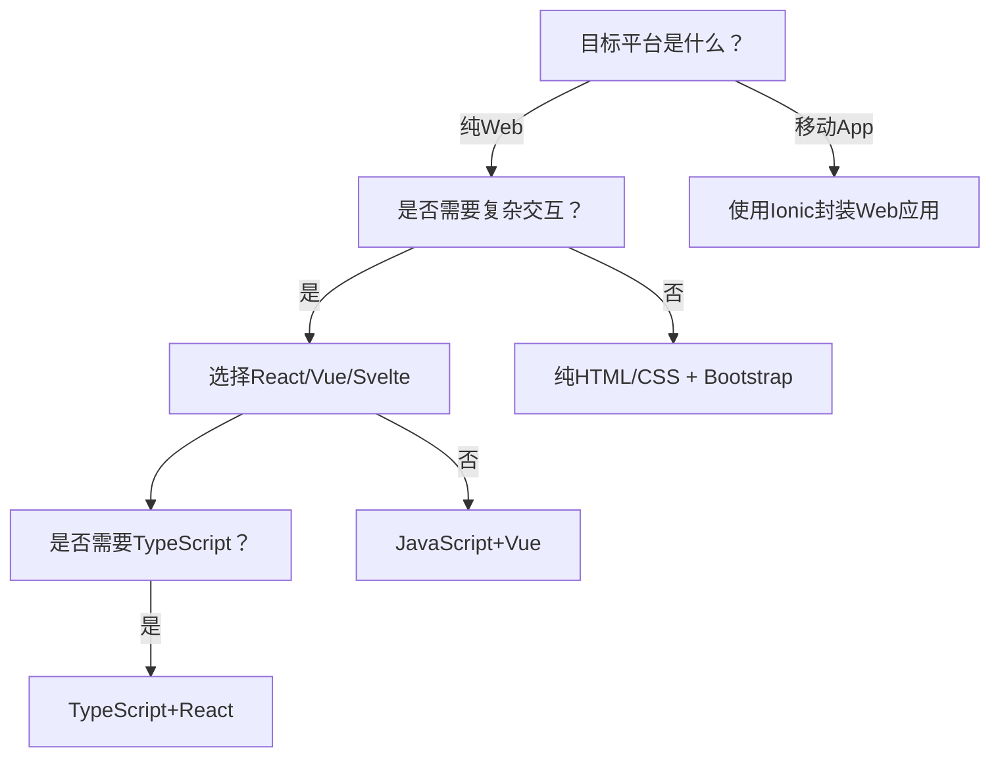
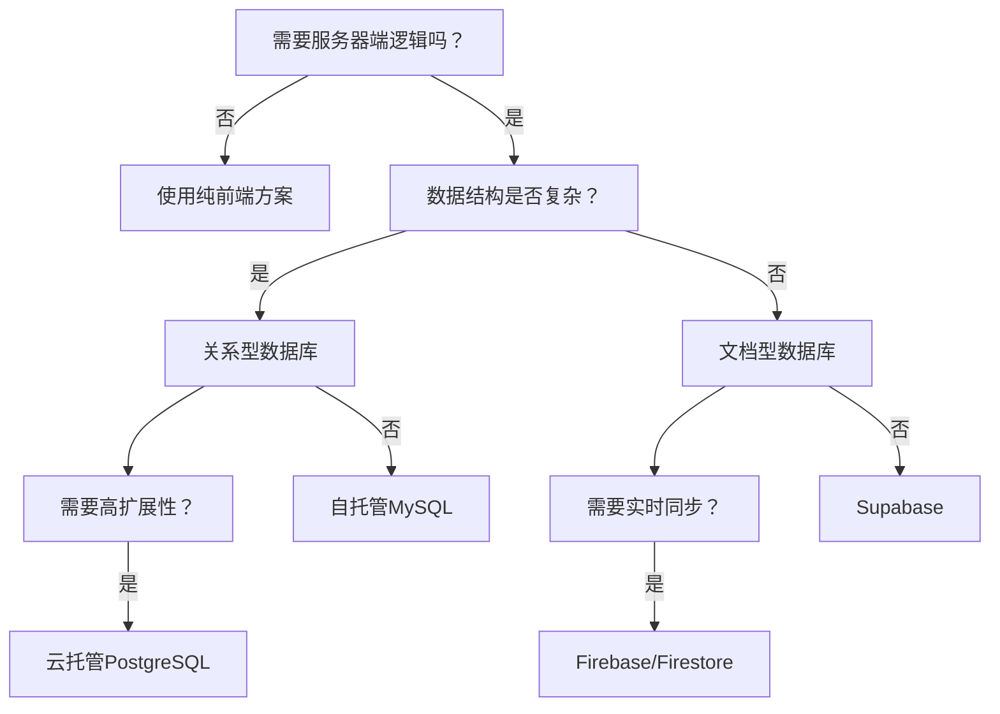
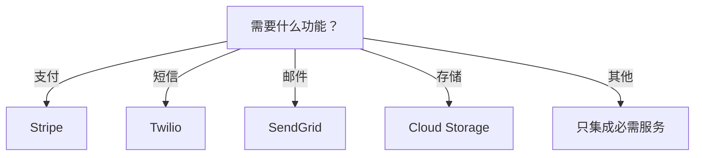

# 🌟 **Tech Stack Selection Guide: Build Smart, Not Overcomplicated**  
> 💡 **核心原则**：  
> **“90%的初创应用不需要复杂架构。真正的技术决策不是选择最热门工具，而是选择最能解决当前问题的最小可行方案。”**  
> *（来源：Startup Tech Stack调研，2024）*

---

## 🔍 一、技术栈的本质：三层架构模型

### 📦 三要素构成完整技术栈
| 层级 | 功能 | 典型组件 | 选择原则 |
|------|------|----------|----------|
| **前端层** | 用户界面交互 | HTML/CSS、JS框架、UI库 | 优先考虑开发效率和团队熟悉度 |
| **后端层** | 业务逻辑与数据处理 | 服务器运行时、数据库、API网关 | 优先考虑数据结构需求和扩展性 |
| **API层** | 第三方服务集成 | 支付、认证、消息、存储 | 只集成必需服务，避免过度依赖 |

> ✅ **关键认知**：  
> **“技术栈不是为了展示技术能力，而是为了解决实际问题。**  
> **用户只关心功能是否可用，不关心你用了什么技术。”**

---

## ✅ 二、前端层决策指南（从简单到复杂）

### 🧩 前端选择决策树


### ✅ 简单项目推荐（90%初创项目适用）
| 组件 | 推荐方案 | 优势 | 适用场景 |
|------|----------|------|----------|
| **UI框架** | **Petite Vue** | 无构建工具、script标签直接引入 | 简单页面、快速原型 |
| **CSS框架** | **Bootstrap** | 预设组件、快速上手 | 管理后台、基础页面 |
| **状态管理** | **无**（初期） | 避免过度设计 | 简单交互场景 |
| **部署** | **Netlify/Vercel** | 一键部署、免费层足够 | 静态站点、简单应用 |

> 💡 **实战案例**：  
> ```html
> <!DOCTYPE html>
> <html>
> <head>
>   <link href="https://cdn.jsdelivr.net/npm/bootstrap@5.3.0/dist/css/bootstrap.min.css" rel="stylesheet">
>   <script src="https://unpkg.com/petite-vue" defer></script>
> </head>
> <body>
>   <div x-data="{ count: 0 }">
>     <button @click="count++">+1</button>
>     <p>点击次数: {{ count }}</p>
>   </div>
> </body>
> </html>
> ```

### ⚠️ 常见错误
- ❌ 过早引入Webpack/Babel（增加构建复杂度）
- ❌ 选择过于复杂的UI框架（如Angular for simple app）
- ❌ 过度优化CSS（优先使用预设类而非自定义样式）

---

## ✅ 三、后端层决策指南（从简单到复杂）

### 🧩 后端选择决策树


### ✅ 简单项目推荐（90%初创项目适用）
| 组件 | 推荐方案 | 优势 | 适用场景 |
|------|----------|------|----------|
| **数据库** | **Firebase/Firestore** | 无需服务器、实时同步 | 简单数据存储、实时应用 |
| **服务器** | **Firebase Cloud Functions** | 无服务器、按需扩展 | 轻量级后端逻辑 |
| **认证** | **Firebase Auth** | 免费、集成简单 | 用户注册/登录 |
| **部署** | **Firebase Hosting** | 一键部署、自动SSL | 静态站点+后端整合 |

> 💡 **实战案例**：  
> ```javascript
> // Firebase Cloud Function示例
> exports.addMessage = functions.https.onCall((data, context) => {
>   return admin.firestore().collection('messages').add({
>     text: data.text,
>     timestamp: new Date()
>   });
> });
> ```

### ⚠️ 常见错误
- ❌ 过早引入Docker/Kubernetes（增加运维复杂度）
- ❌ 选择复杂数据库（如Neo4j for simple data）
- ❌ 自建认证系统（应使用Firebase Auth/Supabase Auth）

---

## ✅ 四、API层决策指南（只集成必需服务）

### 🧩 API选择决策树


### ✅ 简单项目推荐（避免过度集成）
| 功能 | 推荐方案 | 为什么选择 | 避免选择 |
|------|----------|------------|----------|
| **支付** | **Stripe** | 简单集成、全球支持 | 自建支付系统 |
| **短信** | **Twilio** | 无需自建基础设施 | 自建短信网关 |
| **邮件** | **SendGrid** | 免费层足够、可靠 | 自建邮件服务器 |
| **存储** | **Firebase Storage** | 与Firebase无缝集成 | AWS S3（初期复杂） |

> 💡 **关键原则**：  
> **“如果某个功能可以通过第三方服务实现，就不要自己实现。**  
> **除非你的业务核心就是这个功能。”**

---

## 🚀 五、从零开始构建技术栈的7步法

### ✅ 步骤1：从最简开始（HTML + Bootstrap）
```html
<!DOCTYPE html>
<html>
<head>
  <meta charset="UTF-8">
  <title>My App</title>
  <link href="https://cdn.jsdelivr.net/npm/bootstrap@5.3.0/dist/css/bootstrap.min.css" rel="stylesheet">
</head>
<body>
  <div class="container">
    <h1>Hello World</h1>
    <button class="btn btn-primary">Click Me</button>
  </div>
</body>
</html>
```
- **为什么**：90%的初创项目不需要复杂前端框架
- **何时升级**：当需要复杂交互时才添加Petite Vue/React

### ✅ 步骤2：添加简单数据存储
```javascript
// 使用Firebase Firestore
import { initializeApp } from "firebase/app";
import { getFirestore, collection, addDoc } from "firebase/firestore";

const app = initializeApp(firebaseConfig);
const db = getFirestore(app);

// 添加数据
const docRef = await addDoc(collection(db, "messages"), {
  text: "Hello from Firebase!",
  timestamp: new Date()
});
```
- **为什么**：无需管理服务器，自动扩展
- **何时升级**：当需要复杂查询或高吞吐量时

### ✅ 步骤3：添加认证功能
```javascript
// Firebase Auth示例
import { getAuth, signInWithEmailAndPassword } from "firebase/auth";

const auth = getAuth();
signInWithEmailAndPassword(auth, email, password)
  .then((userCredential) => {
    // 登录成功
  })
  .catch((error) => {
    // 处理错误
  });
```
- **为什么**：避免自建认证系统的安全风险
- **何时升级**：当需要自定义认证流程时

### ✅ 步骤4：添加服务器逻辑（仅当必要）
```javascript
// Firebase Cloud Functions
exports.sendWelcomeEmail = functions.auth.user().onCreate((user) => {
  return admin.firestore().collection('emails').add({
    to: user.email,
    subject: 'Welcome!',
    text: 'Thanks for joining!'
  });
});
```
- **为什么**：按需扩展，无需管理服务器
- **何时升级**：当需要复杂业务逻辑时

### ✅ 步骤5：添加必需的第三方服务
```javascript
// Stripe支付集成
import { loadStripe } from '@stripe/stripe-js';

const stripe = await loadStripe('pk_test_...');
const { error } = await stripe.redirectToCheckout({
  sessionId: sessionId
});
```
- **为什么**：专注核心业务，避免重复造轮子
- **何时升级**：当第三方服务无法满足需求时

### ✅ 步骤6：监控与优化（仅当必要）
- **工具**：Firebase Analytics、Sentry
- **何时升级**：当用户量超过1000+时才需要

### ✅ 步骤7：持续迭代
- **原则**：**“只在需要时添加复杂度”**
- **检查点**：每增加一个组件，问自己：
  > “这个组件是否解决了当前核心问题？”

---

## 🚨 六、90%初创项目的技术栈误区

### ❌ 误区1：过度设计技术栈
> “我需要Kubernetes、GraphQL、微服务才能启动”

**真相**：  
- 90%的初创项目不需要微服务架构
- 95%的初创项目不需要GraphQL
- 99%的初创项目不需要Kubernetes

### ❌ 误区2：选择技术栈只看流行度
> “因为React/Node.js最流行，所以我必须用”

**真相**：  
- **技术流行度 ≠ 适用性**  
- 选择技术栈应基于**当前需求**，而非**未来可能的需求**  
- 例如：简单博客用WordPress比React+Node.js更高效

### ❌ 误区3：过早优化性能
> “我需要Redis缓存、CDN加速才能启动”

**真相**：  
- 90%的性能问题来自代码逻辑，而非基础设施
- 优化应在**出现实际性能问题后**进行
- 优先优化**用户体验**而非**技术指标**

---

## 🌈 七、真实案例：从简单到复杂的演进

### 📌 案例：社交应用“Myspace”简化版

| 阶段 | 技术栈 | 为什么选择 | 价值 |
|------|--------|------------|------|
| **阶段1** | HTML + Bootstrap + Firebase | 7天内完成原型 | 低成本验证想法 |
| **阶段2** | 添加Petite Vue + Firebase Cloud Functions | 需要复杂交互 | 保持简单架构 |
| **阶段3** | 添加Stripe + Twilio | 需要付费功能 | 专注核心业务 |
| **阶段4** | 添加Supabase + Next.js | 需要更复杂查询 | 按需升级 |
| **阶段5** | 添加Kubernetes + GraphQL | 用户量超10万 | 仅当必要时升级 |

> ✅ **关键经验**：  
> **“技术栈演进应与业务增长同步，而非提前设计。”**  
> **“每一步升级都应有明确的业务需求驱动。”**

---

## 💡 八、行动清单：今天开始构建你的技术栈

| 天数 | 行动 | 工具 | 效果 |
|------|------|------|------|
| **Day 1** | 创建纯HTML页面 | Bootstrap | 快速验证UI概念 |
| **Day 2** | 添加Firebase认证 | Firebase Auth | 无需自建用户系统 |
| **Day 3** | 添加Firebase数据库 | Firestore | 无需管理服务器 |
| **Day 4** | 添加简单交互 | Petite Vue | 无需构建工具 |
| **Day 5** | 添加必需的第三方服务 | Stripe/Twilio | 专注核心业务 |
| **Day 6** | 部署到Firebase Hosting | Firebase Hosting | 一键部署，自动SSL |
| **Day 7** | 收集用户反馈 | Google Analytics | 按需升级 |

> ✅ **终极心法**：  
> **“最好的技术栈不是最复杂的技术栈，而是能解决当前问题的最小可行方案。”**  
> **“记住：用户不关心你用了什么技术，只关心功能是否可用。”**  

> 🌟 **立即行动**：  
> 1. 创建一个`index.html`文件  
> 2. 添加Bootstrap CSS  
> 3. 添加一个简单的按钮和点击计数器  
> 4. 部署到Netlify/Vercel  
> 5. **今天就完成第一个可运行的原型！**  

> 💬 **最后忠告**：  
> **“不要追求技术栈的完美，要追求问题的解决。**  
> **当你的应用开始有真实用户时，**  
> **你才真正知道需要什么技术。”**