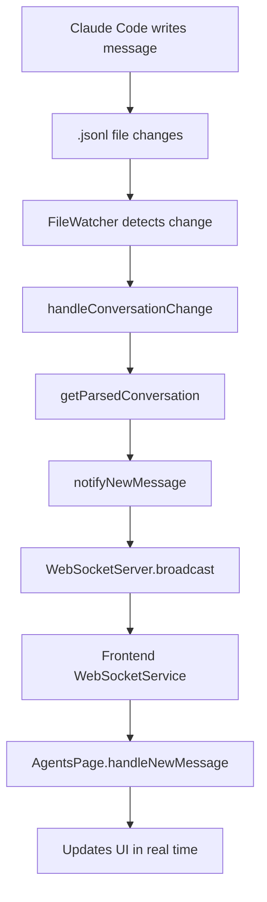

---
aliases:
date: 2025-09-09 12:38
tags:
source:
  - https://www.reddit.com/r/ClaudeAI/comments/1lzfl2d/what_stupid_or_not_things_did_you_build_with/
update:
rating:
---

## 编码标准原则

在AlterActionGenerator项目的编码标准中，“按照KISS、YAGNI和DRY原则编写代码”是核心开发准则，三者分别从“简化设计”“避免冗余功能”“减少重复代码”三个维度指导开发，确保代码简洁、可维护且贴合项目实际需求，具体解析如下：

1. **KISS原则（Keep It Simple, Stupid）**\
   核心是“保持代码简单直观”，避免过度复杂的设计或冗余逻辑。在项目中，表现为开发Alter Action的YAML配置时，需遵循“单一职责”——每个YAML仅定义一个明确的自动化功能（如代码解释、Git提交消息生成），不堆砌无关字段；同时，模板变量和条件逻辑（如``）需简洁，避免嵌套过深，确保其他开发者或AI代理能快速理解配置意图。

2. **YAGNI原则（You Aren't Gonna Need It）**\
   核心是“不开发当前用不到的功能”，避免提前设计冗余特性。结合项目“初始开发和模板收集”的阶段属性，意味着开发Alter Action时，只需实现当前 macOS 自动化场景必需的字段（如必填的`id`/`name`/`prompt`），无需提前添加未验证需求的功能（如暂未用到的“多模型切换高级配置”“复杂权限控制”），防止代码或配置臃肿，也降低后续维护成本。

3. **DRY原则（Don't Repeat Yourself）**\
   核心是“避免代码/配置重复”，通过复用提升效率。在项目中，体现为两方面：一是YAML模板的复用——对于同类Alter Action（如“代码解释”“代码修复”），可提取通用结构（如固定的`category: "code"`、相似的`prompt`系统模板）作为基础模板，减少重复编写；二是工具函数/文档的复用——如项目中“上下文变量”（`{{ textSelection }}`/`{{ selectedFiles }}`）的定义、编码标准说明等，统一维护在公共文档（如`project-structure.md`）中，避免在多个YAML或文档中重复描述。

```plain text
## 4.编码标准和人工智能指令
### 一般说明
- 你最重要的工作是管理你自己的环境。在计划更改之前，请务必阅读任何相关文件。
- 更新文档时，保持更新简洁准确，以防止臃肿。
- 按照 KISS、YAGNI 和 DRY 原则编写代码。
- 如有疑问，请遵循经过验证的最佳实践进行实施。
- 未经用户批准，不要提交 git。
- 不要运行任何服务器，而是告诉用户运行服务器进行测试。
- 始终首先考虑行业标准库/框架，而不是自定义实现。
 - 永远不要嘲笑任何东西。切勿使用占位符。永远不要省略代码。
 - 在相关的情况下应用 SOLID 原则。使用现代框架功能，而不是重新发明解决方案。
 - 对一个想法是好是坏要诚实。
 - 使副作用明确且最小。
 - 将数据库模式设计为对演进友好（避免重大更改）。
 ### 文件组织和模块化
 - 默认创建多个小型、重点文件，而不是大型单体文件
 - 每个文件都应具有单一的职责和明确的目的
 - 尽可能将文件保持在 350 行以下- 通过将实用程序、常量、类型或逻辑组件提取到单独的模块中来拆分较大的文件
 - 将关注点分离：实用程序、常量、类型、组件和业务逻辑到不同的文件中
 - 优先于继承 - 仅对真正的“is-a”关系使用继承，对“has-a”或行为混合使用优先组合
 - 遵循现有的项目结构和约定 - 将文件放在适当的目录中。创建新目录并在认为合适的情况下移动文件。
 - 使用定义明确的子目录来保持事物井井有条和可扩展性
 - 具有清晰的文件夹层次结构和一致的命名约定的结构项目
 - 正确导入/导出 - 设计可重用性和可维护性
```

---

## 图表



好的，这是用 Haiku 风格（5-7-5 音节）注释 `.jsonl` 文件在流程中的作用：

```
克劳德写消息，
文件记录并触发，
更新到界面。
```

# 单页速查手册（建议打印）

**用途**：适用于决策、解决问题与迭代优化的实用思维模型——每个框架耗时均≤5分钟，且最终能得出明确的下一步行动。

```
One-Page Cheatsheet (Print This)
- Second-Order: Ripple Check • Reversibility × Blast Radius • Incentive Map  
- Feedback Loops: Close-the-Loop • Before/After/Next • Mini Experiment Loop  
- First Principles: Assumption Peel & Test • Constraint Box • Zero‑to‑One Pass  
How to use: Pick the mental model that fits your situation, then run any one of its 3 frameworks. Each takes ≤5 minutes and ends with a clear next action.
```

---

# 📗 The 5-Minute Framework Starter Kit

When you’re learning at work, it’s easy to get stuck at the level of concepts. You understand the mental model, but you don’t know how to use it. That’s because:

- Mental models are the ‘what’. They explain how the world works at a high level.
- Frameworks are the ‘so what’. They break those big ideas into steps you can actually apply in real situations.

这两句话清晰区分了“心智模型（Mental models）”与“框架（Frameworks）”的核心差异，核心逻辑是“从认知到行动”的递进：

1. **心智模型：回答“是什么”，聚焦认知层面**

它是对世界规律、事物本质的高度概括性理解，比如“复利效应”（时间+持续投入带来指数增长）、“供需关系”（市场价格由供需平衡决定）。这些模型不直接给行动指令，而是帮人建立对“世界如何运作”的底层认知，相当于给大脑提供理解复杂问题的“简化地图”。

2. **框架：回答“那又怎样/该怎么做”，聚焦实践层面**

它将心智模型的抽象理念拆解为可落地的步骤或结构。比如，基于“供需关系”这个心智模型，衍生出“市场调研-需求分析-供给匹配-价格测试”的产品定价框架；基于“复利效应”，衍生出“目标拆解-定期投入-风险控制”的长期储蓄框架。框架的核心价值是把“知道规律”转化为“能做什么、怎么做”，搭建起认知到行动的桥梁。
简单说：心智模型帮你“看懂逻辑”，框架帮你“落地执行”。

If you find yourself nodding along with great ideas but struggling to make them useful in daily life and work, the missing link is frameworks. They turn theory into action in five minutes or less.

In the pages ahead, you’ll find three fundamental mental models—and three simple frameworks to start using each one in your daily workflow:

1. Second-Order Thinking – See beyond the obvious and anticipate ripple effects.
2. Feedback Loops – Make sure actions create lasting impact and improvement.
3. First Principles Thinking – Strip problems to the basics and rebuild smarter solutions.

Each comes with three actionable frameworks so you can stop getting stuck at the concept stage and start building a toolkit you can use immediately.

## 🧠 Mental Model #1: Second-Order Thinking

What it is: Looking beyond the immediate (first-order) effect to anticipate second- and third-order consequences.\
Use when: A decision seems obviously good/bad at first glance, or when incentives and behaviors may shift in response to your move.\
Common pitfall: Optimizing for a local win that triggers bigger downstream costs.

### 3 Actionable Frameworks (5 minutes each)

A) Ripple Check: Now → Next → Later

1. Now (first-order): Write the direct effect of the decision in one sentence.
2. Next (second-order): List 3 ripple effects on customers, colleagues, metrics, or incentives.
3. Later (third-order): Identify 1 unintended consequence and add a safeguard.

Decision rule: Proceed if benefits persist across Next and Later; otherwise, redesign or timebox.

B) Reversibility × Blast Radius Triage

1. Reversibility: Is this easily reversible? (Yes/No)
2. Blast radius: If wrong, who/what is impacted? How big is the impact? (small / medium / large)
3. Move:

- Reversible + Small: Act now; set a review in 1–2 weeks.
- Reversible + Large: Pilot with guardrails.
- Irreversible: Slow down; add approvals or a pre-mortem.

C) Incentive Map (Who moves, how, and why)

1. Actors: List the 3 actors most impacted (e.g., Sales, Ops, Users).
2. Response: For each, predict “How does this change their behavior?”
3. Adjust: Add one tweak to align incentives (e.g., KPI, policy, messaging).

## 🔁 Mental Model #2: Feedback Loops

What it is: Systems either reinforce themselves (make things grow) or balance themselves (keep things stable).\
Use when: You want to make sure your actions don’t vanish into the void but actually close the loop.\
Common pitfall: Finishing a project without checking if the result stuck—or if it created a side effect you didn’t intend.

### 3 Actionable Frameworks (5 minutes each)

A) Pre-Mortem Feedback

1. Goal: Before starting, write the outcome you want.
2. Imagine failure: Picture that the project flopped—list 3 reasons why.
3. Prevent: Choose one preventive action to reduce the biggest risk.

B) Before → After → Next Review → After → Next Review**

1. Before: What did we want to change?
2. After: What actually happened?
3. Next: Based on this, what’s one adjustment we should make?

C) Mini Experiment Loop (Plan → Do → Study → Adjust)

4. Plan: State the small change you want to try.

5. Do: Carry it out quickly (within a week or less).

6. Study: Did it work as expected?

7. Adjust: Keep it, tweak it, or drop it.

## 🧩 Mental Model #3: First Principles Thinking

What it is: Decomposing a problem to its fundamentals, then building up the solution from truths—not precedent.\
Use when: The team is stuck in “how we’ve always done it,” or constraints feel invented.\
Common pitfall: Swapping one assumption for another without testing either.

### 3 Actionable Frameworks (5 minutes each)

A) Assumption Peel & Test

1. State the problem: One sentence.
2. List 3 assumptions: What must be true for your current plan to work?
3. Test the riskiest: Define a micro-test you can run this week.

B) Constraint Box (Design inside the non‑negotiables)

1. Hard constraints: Physics, compliance, budget, timeline (name them).
2. Degrees of freedom: What can vary? (scope, sequence, channel, ownership)
3. Two designs: Draft 2 radically different approaches that respect the box; pick one to prototype.

C) Zero-to-One Pass (Remove, Automate, Standardize)

1. Remove: What step or hand‑off can be eliminated entirely?
2. Automate: What repetitive step can be scripted/tools-based?
3. Standardize: What decision can be replaced with a default or checklist?

---

## One-Page Cheatsheet (Print This)

- Second-Order: Ripple Check • Reversibility × Blast Radius • Incentive Map
- Feedback Loops: Close-the-Loop • Before/After/Next • Mini Experiment Loop
- First Principles: Assumption Peel & Test • Constraint Box • Zero‑to‑One Pass

How to use: Pick the mental model that fits your situation, then run any one of its 3 frameworks. Each takes ≤5 minutes and ends with a clear next action.

## 1. 二阶思维（避免意外后果）

核心是关注“第一步之外的影响”，防止短视决策。

- **连锁反应核查**：列出选择的1个直接影响→再列出2个间接“连锁反应”（示例：“涨价→直接影响：收入提升→连锁反应：10%客户流失、竞争对手跟风涨价”）。
- **可逆性×影响范围**：从两个维度为选择打分：
  - *可逆性*（1分=难以撤销，5分=易于逆转）
  - *影响范围*（1分=影响较小，5分=破坏性强）
  → 行动建议：优先选择“低可逆性+低影响范围”的方案。
- **激励地图**：明确选择会影响哪些对象→列出他们的潜在激励（示例：“推行远程办公政策→员工：留下的激励；管理者：追踪工作效率的激励”）。

## 2. 反馈循环（快速迭代）

将输入转化为行动，用于完善想法、项目或习惯。

- **闭环反馈**：提出1个具体的反馈问题（示例：“使用这个工具时，哪一点让你效率降低？”）→记录答案→确定1个需要落实的改进措施。
- **事前/事后/下一步**：
  - *事前*：当前状态如何（示例：“我写报告需要3小时”）？
  - *事后*：希望达成的小目标是什么（示例：“将时间缩短到2小时”）？
  - *下一步*：缩小差距的1个具体行动（示例：“为数据部分创建模板”）。
- **微型实验循环**：定义1个小型测试（示例：“用新邮件标题对50位订阅者进行测试”）→设定成功指标（示例：“打开率>20%”）→安排查看结果的时间。

## 3. 第一性原理（拆解复杂问题）

从核心事实（而非假设）出发，从头构建解决方案。

- **假设剥离与测试**：列出问题背后的3个假设（示例：“我们需要更多预算才能增长”）→选择1个假设进行验证（示例：“能否通过削减1项低价值开支，用现有预算实现增长？”）。
- **约束框架**：明确3个不可妥协的约束条件（示例：“必须2周内上线、预算500元、仅1名团队成员参与”）→仅在这些边界内构思解决方案（避免“完美但无法落地”的想法）。
- **从0到1梳理**：将问题简化到最本质的形式（示例：“与其‘开发一款应用’，不如先‘用谷歌表格解决1个用户痛点’”）→确定将“0”（想法）转化为“1”（最小可行行动）的第一步。

## 使用方法

1. 根据场景选择适配的思维模型（例如：用“反馈循环”完善项目，用“第一性原理”解决陷入僵局的问题）。
2. 选择该模型下的**任意1个**框架执行（无需全部完成）。
3. 最终明确下一步行动（示例：“明天测试新邮件标题”“今日下班前创建报告模板”）。

---

# 第一性原理三核心方法（精简版）

第一性原理的核心是拆解根本、重构方案，以下是三大实操方法的精简总结：

## 1. 假设剥离与验证

- **目标**：区分事实（可验证）与假设（未证实），剔除认知盲区。
- **做法**：\
  ① 剥：用“反转常识”“5个为什么”找隐藏假设（如“消费者要X材料”）；\
  ② 测：用低成本实验验证（如落地页测定价、短期试用测人力需求）。
- **结果**：获得可信事实，作为解决方案的基石。

## 2. 约束框定

- **目标**：明确不可变边界，避免资源浪费，聚焦创新。
- **做法**：\
  ① 列约束矩阵，区分“固定约束”（如3个月上线）与“灵活约束”（如开发预算）；\
  ② 接受固定约束（转化为创新锚点），突破灵活约束（如外包降本）。
- **结果**：划定清晰范围，让创新更精准。

## 3. 从零到一构建

- **目标**：摆脱路径依赖，基于本质重构方案（非修修补补）。
- **做法**：\
  ① 抓根本需求（如“会议低效”本质是“快速对齐信息”）；\
  ② 拆核心要素（如通勤的“工具/路线/成本”），结合事实与约束重组方案；\
  ③ 先推最小可行方案（MVP），再迭代优化。
- **结果**：形成颠覆式或高效的全新解决方案。

## 协同逻辑

假设验证提供“事实基石”，约束框定明确“创新边界”，从零到一则是二者结合的最终落地，构成完整的第一性原理实践闭环。

---

# 二阶思维与反馈循环：实操方法拆解

在第一性原理基础上，**二阶思维（Second-Order Thinking）** 聚焦决策的长期连锁影响，**反馈循环（Feedback Loops）** 则通过动态迭代优化方案。以下是两类思维的核心实操方法解析：

## 一、二阶思维：预判连锁反应，规避隐性风险

二阶思维拒绝只看“直接结果”（一阶影响），而是深入分析决策引发的**后续连锁反应（二阶/多阶影响）**，避免短期收益带来的长期隐患。核心方法包括“涟漪检查”“可逆性×影响范围”“激励地图”。

### 1. 涟漪检查（Ripple Check）：追踪决策的“蝴蝶效应”

- **核心目标**：像投石入湖一样，梳理决策从“直接影响”到“间接影响”的多圈层连锁反应，识别潜在隐性后果。
- **实操步骤**：\
  ① 明确核心决策（如“推出用户推荐返现活动”）；\
  ② 画“涟漪圈”：
  - 第一圈（直接影响）：用户为拿返现主动分享，短期新增用户数上升；
  - 第二圈（二阶影响）：大量低质量“羊毛党”用户涌入，平台客服压力增大、真实用户体验下降；
  - 第三圈（三阶影响）：长期真实用户流失，平台口碑受损，后续获客成本升高。
- **关键价值**：提前发现“短期利好、长期有害”的隐性风险，及时调整决策（如给返现设置“新用户需留存30天”的条件）。

### 2. 可逆性×影响范围（Reversibility × Blast Radius）：平衡风险与决策成本

- **核心目标**：通过“决策是否可逆”和“影响范围大小”，判断决策的风险等级，匹配对应的谨慎程度。
- **实操工具：四象限矩阵**

|                       | 影响范围大（Blast Radius: Large）         | 影响范围小（Blast Radius: Small）         |
| --------------------- | ---------------------------------- | ---------------------------------- |
| **可逆（Reversible）**    | 如“调整APP首页Banner位置”：影响广但可快速改回，可快速试错 | 如“优化客服话术”：影响小且可逆，直接落地测试            |
| **不可逆（Irreversible）** | 如“品牌更名”：影响广且改回成本极高，需反复调研、小范围验证后再推进 | 如“停用旧版用户数据系统”：影响小但不可逆，需确保新系统稳定后再切换 |

- **关键价值**：避免“小事过度谨慎、大事盲目决策”，优化决策效率与风险控制的平衡。

### 3. 激励地图（Incentive Map）：预判各方行为的“驱动力变化”

- **核心目标**：梳理决策对所有相关方（用户、员工、合作伙伴等）的“激励机制影响”，预判其行为变化（避免“好心办坏事”）。
- **实操步骤**：\
  ① 列出决策相关方（如“公司推出‘员工加班提成’制度”，相关方包括：一线员工、部门管理者、客户）；\
  ② 分析对各方的激励变化及行为预判：
  - 一线员工：激励从“按时完成工作”变为“多加班拿提成”→ 可能出现“故意拖延工作凑加班时长”的行为；
  - 部门管理者：需管控加班成本→ 可能收紧加班审批，反而降低团队灵活性；
  - 客户：员工为加班提成可能优先处理“易出业绩但非紧急”的需求→ 紧急客户需求响应变慢。
- **关键价值**：提前发现激励机制的“漏洞”，优化决策设计（如将“加班提成”改为“效率奖金”，激励员工高效完成工作而非堆砌时长）。

## 二、反馈循环：动态迭代，让方案持续优化

反馈循环是将“实践结果”转化为“改进依据”的闭环机制，核心是避免“一次性决策后不管不问”，通过持续收集、分析反馈，让方案适配真实需求。核心方法包括“闭环反馈”“事前/事后/下一步”“微型实验循环”。

### 1. 闭环反馈（Close-the-Loop）：让反馈“有去有回”

- **核心目标**：避免“只收集反馈，不落地改进”，确保每一条关键反馈都有“处理结果”，提升参与感与改进效率。
- **实操步骤**：\
  ① 明确反馈渠道（如用户问卷、员工访谈、客户投诉记录）；\
  ② 建立“反馈处理流程”：
  - 收集：分类记录反馈（如“用户反馈APP闪退”“员工反馈报销流程繁琐”）；
  - 分析：判断反馈优先级（如“APP闪退”是高频致命问题，优先处理）；
  - 行动：制定改进方案并执行（如修复闪退bug、简化报销步骤）；
  - 反馈：将处理结果告知反馈者（如给闪退用户发“问题已修复”通知，向员工同步报销流程优化时间）。
- **关键价值**：避免反馈“石沉大海”，既提升用户/员工的参与意愿，也确保改进方向贴合真实需求。

### 2. 事前/事后/下一步（Before/After/Next）：结构化复盘反馈

- **核心目标**：通过“对比决策前后的结果”，明确反馈的核心价值，为后续行动提供清晰依据（避免复盘流于形式）。
- **实操模板**：

| 维度             | 具体内容                                                 |
| -------------- | ---------------------------------------------------- |
| **事前（Before）** | 决策前的目标的：如“推出新功能，预计提升用户周活跃率10%”；当时的假设：“用户需要该功能解决XX痛点” |
| **事后（After）**  | 实际结果：如“功能上线后，用户周活跃率仅提升3%”；关键反馈：如“用户反馈功能操作复杂，用一次就弃用”  |
| **下一步（Next）**  | 改进行动：如“简化功能操作流程，重新上线测试”；新假设：“操作简化后，用户使用率会提升”         |

- **关键价值**：避免“只看结果不找原因”，通过“目标-结果-反馈”的对比，精准定位问题（如不是“功能没必要”，而是“操作太复杂”）。

### 3. 微型实验循环（Mini Experiment Loop）：用小成本快速验证反馈

- **核心目标**：针对反馈中的“不确定改进方向”，用最小成本的实验验证效果，避免大规模投入后发现错误。
- **实操步骤（循环）**：
  1. **提出假设**：基于反馈，提出改进假设（如“用户反馈注册流程长→假设‘去掉‘职业信息’填写项，注册转化率会提升’”）；
  2. **设计微型实验**：小范围测试（如仅对20%新用户展示“简化版注册流程”，其余用户用原版）；
  3. **收集数据**：对比两组用户的注册转化率（如简化版转化率35%，原版20%）；
  4. **判断迭代**：验证假设成立→ 全量推广简化版；假设不成立→ 重新分析反馈（如“用户觉得长，可能是‘手机号验证’步骤太繁琐”），进入下一轮实验。
- **关键价值**：用“小步快跑”的方式，以极低成本试错，确保每一次改进都有数据支撑，避免“凭感觉决策”。

## 两类思维的协同：从“预判”到“优化”的完整闭环

二阶思维与反馈循环相辅相成：

1. **二阶思维**帮你在决策前“预判风险与连锁影响”，减少无效试错；
2. **反馈循环**帮你在决策后“收集真实反馈，动态优化”，让方案持续适配需求。

例如：用“涟漪检查”预判“推荐返现活动”可能引来羊毛党（二阶思维）→ 用“微型实验”先小范围测试，收集“羊毛党占比”反馈（反馈循环）→ 再根据结果优化活动规则，形成完整的“预判-测试-优化”链路。

---
