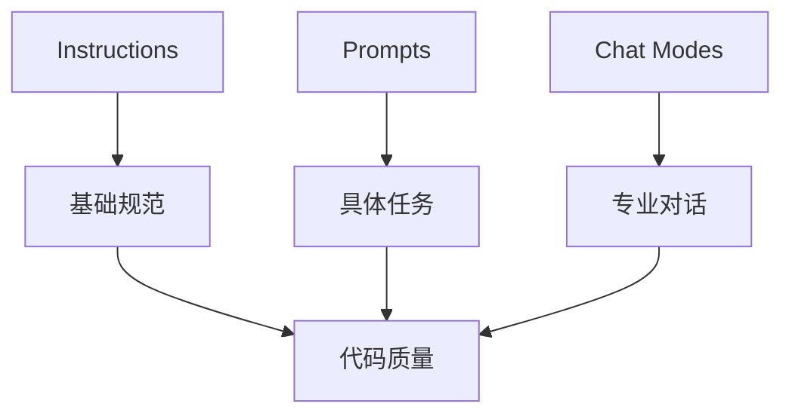

---
aliases:
  - Awesome Copilot项目笔记
date: 2025-11-02 16:02
tags:
source:
update:
rating:
related:
---

让我为你详细分析这个项目中的三个核心组件：prompts、instructions 和 chat modes。

## 1. 基本定义与用途

### Prompts (.prompt.md)

- 用途：特定任务的提示模板
- 特点：
  - 一次性使用
  - 任务导向
  - 可重用模板
- 示例：`create-readme.prompt.md`, `code-review.prompt.md`

### Instructions (.instructions.md)

- 用途：编码标准和最佳实践指南
- 特点：
  - 持续性指导
  - 规范化代码
  - 团队协作基础
- 示例：`reactjs.instructions.md`, `typescript-5-es2022.instructions.md`

### Chat Modes (.chatmode.md)

- 用途：AI角色和专业模式
- 特点：
  - 对话式交互
  - 专业领域专注
  - 上下文保持
- 示例：`debug.chatmode.md`, `planner.chatmode.md`

## 2. 相互关系



## 3. 主要区别

| 特性   | Prompts | Instructions | Chat Modes |
| ---- | ------- | ------------ | ---------- |
| 使用场景 | 单次任务    | 持续指导         | 对话交互       |
| 生命周期 | 临时      | 持久           | 会话期间       |
| 粒度   | 任务级     | 项目级          | 领域级        |
| 更新频率 | 按需      | 较少           | 中等         |

## 4. 实际应用示例

### 开发工作流中的协作：

1. **初始化阶段**
   - 使用 `instructions` 设置项目标准
   - 示例：`typescript.instructions.md` 定义代码规范

2. **开发阶段**
   - 使用 `prompts` 处理具体任务
   - 示例：`create-component.prompt.md` 生成组件代码

3. **问题解决阶段**
   - 使用 `chat modes` 进行专业对话
   - 示例：`debug.chatmode.md` 辅助调试

## 5. 最佳实践建议

1. **Instructions**
   - 保持通用性和可扩展性
   - 定期更新以反映最新标准
   - 与团队共享和讨论

2. **Prompts**
   - 专注于特定任务
   - 提供清晰的输入输出规范
   - 包含示例和边界情况

3. **Chat Modes**
   - 定义明确的专业领域
   - 保持对话的连贯性
   - 提供上下文切换机制

## 6. 项目中的组织结构

```
├── prompts/          # 任务特定模板
├── instructions/     # 编码标准指南
├── chatmodes/        # 专业对话模式
└── collections/      # 相关项目组合
```

这种结构允许：

- 模块化管理
- 灵活组合
- 易于维护
- 清晰的职责划分

## 7. 协作建议

1. **团队使用**
   - Instructions 作为团队标准
   - Prompts 用于任务自动化
   - Chat Modes 用于专业咨询

2. **个人使用**
   - 根据需求选择合适工具
   - 组合使用提高效率
   - 定期更新和优化

这种分层设计使得项目既能保持标准化，又能灵活适应不同场景的需求。
