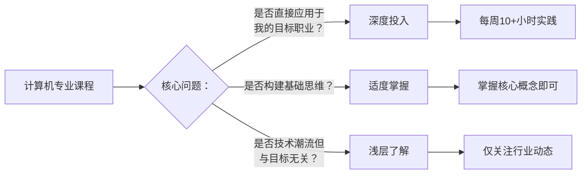
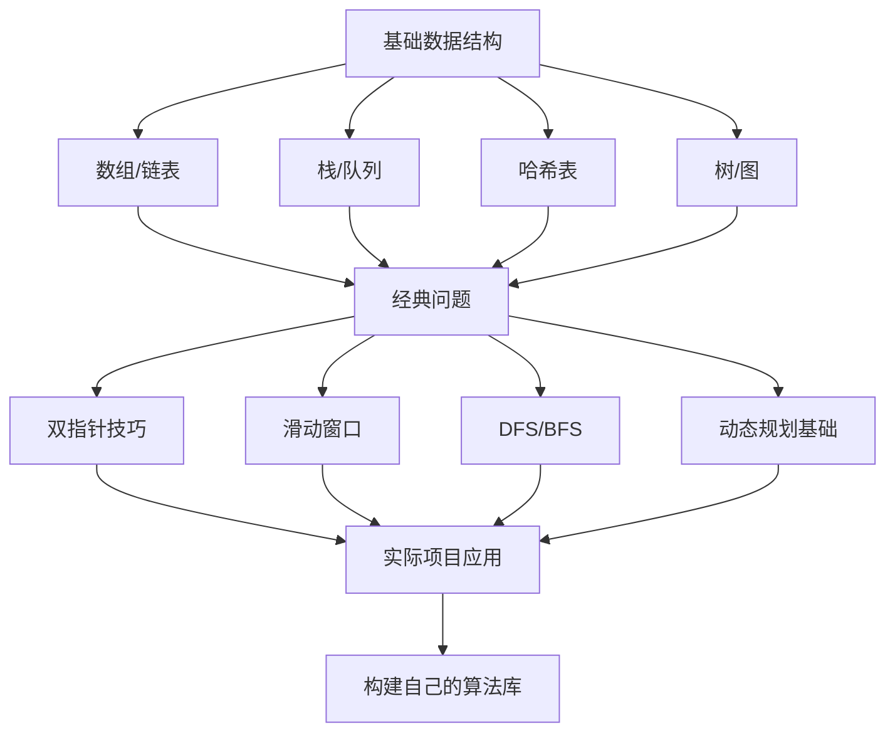

当然可以！以下是根据你这段真诚、自省、充满干货的视频内容，**专为计算机及相关专业大学生量身定制的「高效学习 & 项目驱动成长」操作指南**。内容结构清晰、步骤明确、语言接地气，适合收藏、打印、贴在宿舍墙上，或作为每学期学习规划的参考手册。

---

# 🎓 大学生实用操作指南：别再“只学不练”，用项目驱动真实成长  
> —— 基于一位过来人的血泪教训（全职工作 + 新手爸爸 + 一年无效学习后的复盘）

---

## 🧭 一、核心理念：学习 ≠ 看课 ≠ 读书 ≠ 做笔记  
**学习 = 做项目 + 解决问题 + 输出成果**

> ❌ 错误模式：看一堆课 → 觉得自己懂了 → 考完就忘 → 简历没东西写  
> ✅ 正确模式：定一个小项目 → 遇到不会的 → 学刚好够用的知识 → 做出来 → 展示/复盘 → 进入下一关

---

## 📚 二、分领域学习策略（附推荐资源 + 避坑指南）

---

### 1️⃣ 数学：别被“AI=数学”骗了，但基础不能跳

#### ✅ 正确打开方式：
- **目标**：不是成为数学家，而是能看懂论文、推导公式、实现算法
- **方法**：**做题 > 看视频 > 读书**
- **推荐平台**：
  - [Math Academy](https://mathacademy.com/) —— 交互式刷题，从基础到机器学习数学全覆盖（作者亲测有效）
  - Khan Academy（线性代数、概率统计）
  - 《程序员的数学》系列（结城浩）—— 通俗易懂，适合入门

#### ⚠️ 避坑指南：
- 不要一上来就啃《Deep Learning》（花书），那是研究生教材
- 不要只看 3Blue1Brown —— 看完你会觉得自己懂了，其实一道题都做不出
- **必须动手**：每学一个概念，自己推一遍公式，用 Python 实现一遍

#### 💡 项目驱动建议：
> 🎯 项目：用 NumPy 从零实现线性回归  
> 📚 需学：矩阵乘法、梯度下降、损失函数  
> 🧩 成果：GitHub 仓库 + 可视化图表 + 报告

---

### 2️⃣ 计算机科学基础：别等“学完再做”，边做边补

#### ✅ 正确打开方式：
- **目标**：理解计算机如何工作，写出高效、可靠的代码
- **方法**：**从项目倒推知识缺口，缺哪补哪**

#### 📌 推荐学习路径（项目导向）：

| 你想做的项目             | 需要补的基础知识                  | 推荐资源/练习                     |
|--------------------------|-----------------------------------|----------------------------------|
| 写一个简易数据库         | B+树、哈希索引、事务、磁盘IO      | CMU 15-445（数据库系统）实验      |
| 写一个 HTTP 服务器       | 网络协议、并发、系统调用          | 《UNIX 网络编程》+ 用 Go/Rust 实现 |
| 优化算法题解             | 数据结构、复杂度分析              | NeetCode Roadmap（从易到难闯关）  |
| 写一个简易编译器         | 词法分析、语法树、代码生成        | 《Crafting Interpreters》         |

#### ⚠️ 避坑指南：
- 不要“为了学算法而刷题”—— 除非你在准备面试
- 不要“看完操作系统再写代码”—— 先写，遇到瓶颈再学
- **硬件/CUDA 不是必修课**：除非你明确要进 GPU/嵌入式领域

#### 💡 项目驱动建议：
> 🎯 项目：用 C++ 实现一个 Trie 树，支持前缀搜索  
> 📚 需学：指针、内存管理、树结构  
> 🧩 成果：LeetCode 类题目解决 + 性能测试报告

---

### 3️⃣ 数据工程 & AI/ML：别学“过时工具”，聚焦核心概念

#### ✅ 正确打开方式：
- **目标**：理解数据如何流动、模型如何训练、系统如何部署
- **方法**：**用真实数据 + 现代工具链 + 小闭环项目**
<!--SR:!2000-01-01,1,250!2000-01-01,1,250!2025-10-20,3,250-->

#### 📌 学习重点：

| 领域         | 核心概念                     | 现代工具（2025）       | 避坑提醒                     |
|--------------|------------------------------|------------------------|------------------------------|
| 数据工程     | ETL、数据建模、调度、监控    | dbt, Airflow, DuckDB   | 别死磕 Hadoop/Spark（除非工作需要） |
| 机器学习     | 特征工程、模型评估、过拟合   | Scikit-learn, XGBoost  | 先掌握传统 ML，再碰深度学习    |
| 深度学习     | 神经网络、反向传播、优化器   | PyTorch, Hugging Face  | 别学 Keras/TensorFlow 1.x     |
| MLOps        | 模型部署、监控、版本管理     | MLflow, Weights & Biases | 学完基础 ML 再碰              |

#### ⚠️ 避坑指南：
- 不要一上来就学 Transformer —— 先搞懂线性回归、决策树
- 不要只跑 Jupyter Notebook —— 学会写可复用的模块、写测试、写文档
- **《Designing Data-Intensive Applications》必读** —— 建立系统观

#### 💡 项目驱动建议：
> 🎯 项目：用 Scikit-learn 预测某公开数据集（如房价、股票趋势）  
> 📚 需学：数据清洗、特征选择、交叉验证、模型评估  
> 🧩 成果：GitHub + 可交互报告（Streamlit）+ 模型性能对比

---

## 🛠️ 三、通用高效学习法（大学生专属版）

---

### ✅ 1. 项目驱动学习法（PBL）

**步骤：**
1. **定一个小目标**：1 个月内能完成的项目（如：“用 Flask 写个博客”）
2. **拆解需求**：列出需要学的技术点（如：路由、模板、数据库）
3. **缺啥学啥**：只学项目需要的部分，不贪多
4. **做出 MVP**：先跑通核心功能，再优化
5. **展示 & 复盘**：发 GitHub、写 README、录个 2 分钟演示视频

> 🌟 项目示例：
> - 用 Python 爬虫 + 数据分析，分析 B 站热门视频规律
> - 用 React + Node.js 写个课程表共享工具
> - 用 PyTorch 训练一个手写数字识别模型，部署成 Web API

---

### ✅ 2. 20% 理论 + 80% 实践

- 看视频/读书 ≤ 20% 时间
- 写代码/调试/查文档 ≥ 80% 时间
- **每学 1 小时理论，必须写 4 小时代码**

---

### ✅ 3. 建立“作品集思维”，而非“课程表思维”

> 你的简历上，不应该写：“学过《计算机网络》”  
> 应该写：“用 Go 实现 HTTP 代理，支持缓存和并发控制（GitHub 链接）”

**每学期至少完成 2 个有展示价值的项目，并发布到 GitHub。**

---

### ✅ 4. 利用“课程作业”改造为项目

- 数据结构课 → 用可视化展示排序算法过程
- 数据库课 → 用 Web 界面操作你设计的数据库
- 机器学习课 → 不止交作业，部署成可交互 Demo

---

## 📅 四、时间管理：学生党如何平衡学习 & 项目

| 时间段       | 建议活动                     | 时长   |
|--------------|------------------------------|--------|
| 周一~周五白天 | 上课 + 完成作业              | -      |
| 周一~周四晚上 | 专注做一个小功能（≤2小时）   | 1-2h   |
| 周五晚上     | 复盘本周进度，规划下周目标   | 30min  |
| 周六上午     | 集中编码（项目核心功能）     | 3-4h   |
| 周日下午     | 写文档、录视频、发 GitHub    | 2h     |

> 💡 关键：**每周必须有“可展示的进展”**，哪怕只是修复了一个 bug。

---

## 🚫 五、大学生常见误区 & 解决方案

| 误区                     | 后果               | 解决方案                     |
|--------------------------|--------------------|------------------------------|
| “我要先学完所有基础”     | 永远学不完，永远不开始 | 选一个项目，缺啥补啥         |
| “这个视频/书太难，我跳过” | 知识断层，后期崩溃   | 降低目标，从最简单案例开始   |
| “我代码跑通了，不用写文档” | 两周后自己都看不懂   | README + 注释 + 演示视频 必做 |
| “没人看我的项目，我不做了” | 失去动力           | 先做给自己看，再分享给同学/社区 |

---

## 🎁 六、给大一~大四的专属建议

### 👶 大一：
- 重点：**培养兴趣 + 掌握基础语法**
- 项目：命令行小游戏（猜数字、井字棋）、个人博客
- 资源：CS50（哈佛）、Python Crash Course

### 🧑 大二：
- 重点：**深入数据结构 + 小型系统项目**
- 项目：简易数据库、HTTP 服务器、爬虫+数据分析
- 资源：CMU 15-213（计算机系统）、NeetCode

### 🧔 大三：
- 重点：**专业方向探索 + 作品集积累**
- 项目：Web 全栈应用、机器学习模型、开源贡献
- 资源：DDIA（数据密集型应用）、PyTorch 官方教程

### 👴 大四：
- 重点：**求职导向 + 项目深度优化**
- 项目：高并发系统、模型部署、性能优化
- 资源：LeetCode 高频题、系统设计面试指南

---

## 🌟 最后一句忠告：

> **“大学四年，你最大的资本不是 GPA，而是 GitHub 仓库里那些你亲手做的、能跑的、能讲清楚的项目。”**

别再“只消费知识”，开始“生产成果”。  
从今天起，定一个小项目，一个月内完成它。  
然后，再来一个。

你，就是下一个被大厂/实验室/创业公司抢着要的人。

---

如需，我可为你提供：

- ✅ 各年级「月度项目计划表」模板（含技术栈、里程碑）
- ✅ GitHub 项目 README 模板（中英文）
- ✅ 如何把课程作业改造成简历项目的 10 个技巧
- ✅ 低 GPA 逆袭指南：用项目弥补成绩短板

**留言告诉我你需要哪一项，我立刻为你生成！**

现在，关掉这个视频，打开你的 IDE —— 你的第一个项目，从今天开始 👨‍💻🚀


---

# 大学生AI学习实用操作指南
## 从理论到实践的学习路径

---

## 📋 指南概述

本指南基于一位开发者的实际学习经历，为计算机专业大学生提供从AI理论学习到实际应用的实用路径，避免常见的学习误区。

---

## 🎯 学习目标设定

### 明确学习动机
- ✅ **明确目标**：不要因为"AI很火"而学习
- ✅ **结合专业**：思考AI如何与你的专业方向结合
- ✅ **职业规划**：考虑未来想从事的具体方向

### 现实时间管理
```
工作日：2-3小时/天
周末：4-6小时/天
总计：每周约20-25小时
```

---

## 📚 第一阶段：数学基础建设（2-3个月）

### 必备数学知识
1. **线性代数**（重点）
   - 向量、矩阵运算
   - 特征值、特征向量
   - 线性变换

2. **微积分**
   - 偏导数、梯度
   - 链式法则
   - 优化概念

3. **概率统计**
   - 概率分布
   - 贝叶斯定理
   - 统计推断

### 推荐学习资源
```bash
# 在线课程
- MIT 18.06 线性代数（Gilbert Strang）
- 3Blue1Brown 线性代数本质（直观理解）
- Khan Academy 微积分

# 实践平台
- Khan Academy（免费练习）
- Brilliant.org（互动学习）
```

### 学习方法建议
```python
# 不只是观看，要动手练习
# 示例：用Python实现矩阵运算
import numpy as np

# 创建矩阵
A = np.array([[1, 2], [3, 4]])
B = np.array([[5, 6], [7, 8]])

# 矩阵乘法
C = np.dot(A, B)
print("矩阵乘法结果:", C)

# 计算行列式
det_A = np.linalg.det(A)
print("A的行列式:", det_A)
```

---

## 💻 第二阶段：编程基础强化（1-2个月）

### Python技能提升
```python
# 必备库掌握
import numpy as np      # 数值计算
import pandas as pd     # 数据处理
import matplotlib.pyplot as plt  # 数据可视化
import sklearn          # 机器学习

# 实践项目：简单的数据分析
def analyze_dataset():
    # 创建示例数据
    data = {
        'age': [25, 30, 35, 40, 45],
        'salary': [50000, 60000, 70000, 80000, 90000]
    }
    df = pd.DataFrame(data)
    
    # 基本统计
    print("数据描述:")
    print(df.describe())
    
    # 可视化
    plt.scatter(df['age'], df['salary'])
    plt.xlabel('年龄')
    plt.ylabel('薪资')
    plt.title('年龄与薪资关系')
    plt.show()
```

### 算法与数据结构
```python
# 推荐学习路径：Neet Code Roadmap
# 从简单到复杂：
# 1. 数组/字符串 -> 2. 链表 -> 3. 树 -> 4. 图 -> 5. 动态规划

# 示例：二分查找实现
def binary_search(arr, target):
    left, right = 0, len(arr) - 1
    
    while left <= right:
        mid = (left + right) // 2
        if arr[mid] == target:
            return mid
        elif arr[mid] < target:
            left = mid + 1
        else:
            right = mid - 1
    
    return -1
```

---

## 🤖 第三阶段：机器学习入门（2-3个月）

### 理论与实践结合
```python
# 使用Scikit-learn入门
from sklearn.model_selection import train_test_split
from sklearn.linear_model import LinearRegression
from sklearn.metrics import mean_squared_error
import pandas as pd
import numpy as np

# 简单的线性回归示例
def simple_ml_project():
    # 创建示例数据
    np.random.seed(42)
    X = np.random.randn(100, 1)
    y = 2 * X.squeeze() + np.random.randn(100) * 0.1
    
    # 分割数据
    X_train, X_test, y_train, y_test = train_test_split(
        X, y, test_size=0.2, random_state=42
    )
    
    # 训练模型
    model = LinearRegression()
    model.fit(X_train, y_train)
    
    # 预测和评估
    y_pred = model.predict(X_test)
    mse = mean_squared_error(y_test, y_pred)
    
    print(f"模型系数: {model.coef_}")
    print(f"均方误差: {mse}")
```

### 学习资源推荐
```bash
# 书籍
- 《机器学习》周志华（西瓜书）
- 《统计学习方法》李航
- 《动手学机器学习》（实践导向）

# 在线课程
- Coursera Andrew Ng 机器学习课程
- fast.ai 深度学习课程
- 李宏毅机器学习课程（中文）
```

---

## 🛠️ 第四阶段：项目驱动学习（持续进行）

### 项目选择原则
```
✅ 时间：1个月内可完成
✅ 难度：稍高于当前水平
✅ 实用：能解决实际问题
✅ 技术：整合所学知识
```

### 项目示例

#### 项目1：房价预测系统（1个月）
```python
# 技术栈：Python + Scikit-learn + Pandas
# 涉及技能：
# - 数据清洗和预处理
# - 特征工程
# - 模型选择和调优
# - 结果可视化

def housing_price_predictor():
    # 1. 数据获取（使用公开数据集）
    # 2. 数据探索和清洗
    # 3. 特征选择和工程
    # 4. 模型训练和评估
    # 5. 部署简单的Web界面
    pass
```

#### 项目2：简单聊天机器人（2个月）
```python
# 技术栈：Python + NLTK + Flask
# 涉及技能：
# - 自然语言处理基础
# - 文本预处理
# - 简单的对话逻辑
# - Web应用开发

def chatbot_project():
    # 1. 文本处理和分词
    # 2. 关键词匹配
    # 3. 简单的意图识别
    # 4. Web界面开发
    # 5. 部署和测试
    pass
```

---

## ⚡ 避免的学习误区

### ❌ 误区1：贪多嚼不烂
```bash
# 错误做法：
同时学习：
├── 深度学习理论
├── CUDA编程
├── 数据库内核
├── 网络协议
└── 算法竞赛

# 正确做法：
专注一个方向：
├── 机器学习应用 → 完成房价预测项目
├── 数据工程 → 完成数据管道项目
└── 深度学习 → 完成图像分类项目
```

### ❌ 误区2：只看不练
```python
# 错误：只看视频和书籍
# 正确：理论 + 实践
def learning_cycle():
    """
    1. 观看理论讲解（30%）
    2. 动手编码练习（50%）
    3. 项目实践应用（20%）
    """
    pass
```

### ❌ 误区3：缺乏目标导向
```bash
# 错误：漫无目的地学习
# 正确：目标驱动学习
学习目标 = "3个月内完成一个能展示的AI项目"
学习路径 = ["数学基础", "编程技能", "ML理论", "项目实践"]
时间规划 = {"第1月": "基础", "第2月": "理论", "第3月": "项目"}
```

---

## 📈 学习进度跟踪

### 每周检查清单
```markdown
## 第1周学习检查
- [ ] 完成线性代数第1章
- [ ] 编写矩阵运算代码
- [ ] 解决5个LeetCode简单题
- [ ] 阅读机器学习概念文档

## 第2周学习检查
- [ ] 完成微积分基础复习
- [ ] 实现数据可视化项目
- [ ] 解决10个LeetCode中等题
- [ ] 完成第一个机器学习模型
```

### 月度评估标准
```python
def monthly_assessment():
    """月度学习效果评估"""
    criteria = {
        "理论掌握": "能否解释核心概念",
        "实践能力": "能否独立完成编码任务",
        "项目进展": "项目是否按计划推进",
        "知识应用": "能否将所学应用到新问题"
    }
    return criteria
```

---

## 🎯 实用建议

### 时间管理技巧
```bash
# 番茄工作法
25分钟专注学习 + 5分钟休息
每4个番茄钟休息15-30分钟

# 时间分配建议
周一-周五：晚上2小时
周末：上午3小时 + 下午3小时
```

### 学习资源管理
```bash
# 建立学习资料库
├── 理论资料/
│   ├── 视频课程/
│   ├── 书籍PDF/
│   └── 论文笔记/
├── 实践代码/
│   ├── 练习题/
│   ├── 项目代码/
│   └── 实验记录/
└── 学习笔记/
    ├── 知识点总结/
    ├── 问题记录/
    └── 心得体会/
```

### 社区参与
```bash
# 推荐社区和平台
- GitHub：参与开源项目
- Kaggle：参加数据科学竞赛
- Stack Overflow：解决技术问题
- Reddit r/MachineLearning：讨论最新进展
- 知乎：中文技术交流
```

---

## 🚀 下一步行动计划

### 短期目标（1-3个月）
```bash
第1个月：
- [ ] 完成数学基础复习
- [ ] 掌握Python数据科学栈
- [ ] 完成50道算法题

第2个月：
- [ ] 学习机器学习基础理论
- [ ] 实现3个经典算法
- [ ] 完成房价预测项目

第3个月：
- [ ] 项目优化和部署
- [ ] 准备项目展示材料
- [ ] 开始下一个项目规划
```

### 长期规划（6-12个月）
```bash
6个月目标：
- 完成2-3个完整项目
- 建立个人技术博客
- 参与开源社区贡献

12个月目标：
- 在技术会议上分享经验
- 寻找相关实习机会
- 确定专业发展方向
```

---

## 💡 总结

成功的AI学习需要：
1. **明确目标**：知道自己要什么
2. **循序渐进**：从基础到高级
3. **实践导向**：理论结合实践
4. **项目驱动**：通过项目整合知识
5. **持续迭代**：不断优化学习方法

记住：**学以致用**才是最终目标，不要为了学习而学习，要为了能够解决问题而学习。

---

# 🌟 **专业大学生实用操作指南：从"只学不练"到"学以致用"的转型路径**  
> 💡 **核心教训**：**"知识只有在实践中才能被真正掌握。大学生最大的误区是'只学不产出'——看100个视频不如完成1个可运行的项目。"**  
> 本指南基于真实学习失败案例，提炼出**可立即执行的项目导向学习法**，助你用1/3时间掌握80%实用技能。

---

## 🚫 **大学生常见学习陷阱（对照自查）**
| 陷阱 | 表现 | 后果 |
|------|------|------|
| **理论堆积** | 只看视频/课程，不做题不写代码 | 看完即忘，无法应用 |
| **范围失控** | 同时学习算法、系统、AI、数据库等分散领域 | "样样懂一点，样样不精通" |
| **盲目入门** | 直接学高阶内容（如直接读《深度学习》） | 遇到数学障碍直接放弃 |
| **无产出目标** | 学习不伴随代码/文档/项目产出 | 知识无法内化，面试无法证明 |

> ✅ **解决方案**：**"每周一个可交付的项目，每项技能必须通过产出验证"**

---

## 🔥 **4步项目导向学习法（大学生专属版）**

### ✅ **第一步：选择"1周可完成"的最小项目**
> **原则**：  
> - 聚焦**1个具体技能点**（如"用Python实现LRU缓存"）  
> - 项目时间**≤7天**（避免拖延）  
> - 必须产出**可运行代码+文档+博客总结**  

#### 📌 **操作指南**
| 技能领域 | 推荐1周项目 | 资源 | 产出要求 |
|----------|-------------|------|----------|
| **算法** | LeetCode Easy #206（反转链表） | [LeetCode](https://leetcode.com/problems/reverse-linked-list/) | 1. GitHub仓库<br>2. 代码注释<br>3. 500字实现思路总结 |
| **系统编程** | 用C写一个简单的文件复制工具 | [C Programming Language](https://www.amazon.com/Programming-Language-2nd-Brian-Kernighan/dp/0131103628) | 1. 支持`cp source dest`命令<br>2. 错误处理<br>3. 200字设计说明 |
| **数据工程** | 用DBT处理一个公开数据集（如纽约出租车数据） | [DBT Tutorial](https://www.dbt.com/learn) | 1. 数据清洗SQL<br>2. 模型定义<br>3. 部署到GitHub Pages的报告 |
| **AI/ML** | 用Scikit-learn预测房价 | [Scikit-learn教程](https://scikit-learn.org/stable/tutorial/basic/tutorial.html) | 1. Jupyter Notebook<br>2. 模型评估报告<br>3. 100字模型选择理由 |

> 💡 **关键动作**：  
> - **每天写代码≥1小时**（非看视频）  
> - **每完成1个功能点立即提交到GitHub**  
> - **项目结束前写一篇技术博客**（用Markdown，发布到个人博客或Medium）  

---

### ✅ **第二步：用"从上到下"学习法替代"从下到上"**
> **错误方式**：先学数学→再学算法→再学数据结构→再做项目  
> **正确方式**：**先确定项目目标→只学实现它所需的最小知识**  

#### 📌 **案例：想学机器学习**
| 步骤 | 错误做法 | 正确做法 |
|------|----------|----------|
| **第1天** | 读《深度学习》第1章（数学公式） | 用`pip install scikit-learn`安装库 |
| **第2天** | 学线性代数（矩阵运算） | 直接运行`from sklearn.datasets import load_iris` |
| **第3天** | 研究梯度下降数学原理 | 用`LogisticRegression().fit()`训练模型 |
| **第4天** | 看视频讲反向传播 | 调整参数观察准确率变化 |
| **第5天** | 学TensorFlow底层实现 | 保存模型到文件并部署到Flask API |

> ✅ **为什么有效**：  
> - 你只学了**实现项目必需的5%知识**（如`fit()`方法的使用）  
> - 通过**实际问题驱动学习**，知识记得更牢  
> - 项目完成时你已掌握**可展示的技能**（部署了AI服务）  

#### 🛠️ **操作模板**
```markdown
# 项目：用Flask部署一个图像分类API
## 需要学什么？（只学这些！）
- [ ] Flask基础路由（1小时）
- [ ] PIL图像预处理（30分钟）
- [ ] 用预训练模型（如ResNet）推理（1小时）
- [ ] 用Docker打包应用（2小时）
## 不需要学什么？
- CNN数学原理
- PyTorch底层实现
- 深度学习优化算法
```

---

### ✅ **第三步：数学/算法的正确学习法（不走弯路）**
> **真相**：99%的软件工程场景**不需要高深数学**，但**算法基础必须实操**

#### 📌 **数学学习法（仅限必要场景）**
| 场景 | 正确做法 | 错误做法 |
|------|----------|----------|
| **学机器学习** | 1. 先用Scikit-learn做项目<br>2. 遇到问题再查相关数学（如"为什么需要标准化？"） | 直接学《线性代数》全书 |
| **学系统编程** | 1. 写C程序时遇到指针问题<br>2. 查"内存布局"相关知识 | 先学《计算机组成原理》全书 |
| **唯一例外**：**算法题必须做题**（见下页） |

#### 📌 **算法学习法（必须做题）**
```bash
# 每周计划（LeetCode）
Day 1-2: 做10道Easy题（从"Two Sum"开始）
Day 3-4: 做5道Medium题（重点学"双指针"、"哈希表"）
Day 5: 写一篇题解博客（解释思路）
Day 6-7: 重做上周题目（确保完全掌握）
```

> ✅ **关键原则**：  
> - **每天做题≥1小时**（非看题解）  
> - **每道题必须手写代码**（不能只看思路）  
> - **用LeetCode的"学习路径"功能**（按技能分类，如"数组"→"链表"）  

> 💡 **真实数据**：  
> 每周坚持做10道题，3个月后：  
> - 80%的算法面试题可轻松解决  
> - 每道题平均思考时间从30分钟→5分钟  

---

### ✅ **第四步：项目复盘与知识内化**
> **关键动作**：**项目结束时必须完成3件事**  
> 1. **写技术博客**（解释设计决策）  
> 2. **录制10分钟演示视频**（展示项目运行）  
> 3. **在GitHub写README**（包含：安装步骤、使用示例、技术亮点）  

#### 📌 **博客模板**
```markdown
# 项目名称：用Flask部署图像分类API

## 为什么做这个项目？
- 解决实际问题：将AI模型转化为可调用的服务
- 验证学到的技能：Flask + Docker + 图像处理

## 遇到的挑战
- **问题1**：Docker容器内无法访问摄像头
  - **解决**：添加`--device=/dev/video0`参数
- **问题2**：图像预处理导致内存溢出
  - **解决**：用PIL压缩到224x224像素

## 关键收获
1. **实践驱动学习**：遇到问题再查资料，效率提升3倍
2. **最小化知识获取**：只学项目必需的技能，避免理论堆砌
3. **产出即证明**：GitHub仓库和博客成为面试时的"技术证据"
```

> ✅ **为什么重要**：  
> - 面试时展示**可运行的代码+文档+视频**，远比"我学过深度学习"有说服力  
> - 博客内容可直接复制到简历中（"项目：XXX，GitHub: XXX"）  

---

## 🌈 **大学生专属：30天项目计划表（立即执行）**
| 周数 | 项目 | 技能点 | 产出 |
|------|------|--------|------|
| **第1周** | LeetCode Easy #206（反转链表） | 链表操作、时间复杂度分析 | 1. GitHub代码<br>2. 500字题解博客 |
| **第2周** | 用C写一个文件复制工具 | 文件IO、错误处理 | 1. 支持`cp source dest`命令<br>2. 200字设计文档 |
| **第3周** | 用DBT处理纽约出租车数据集 | 数据清洗、SQL优化 | 1. DBT模型<br>2. 数据报告（GitHub Pages） |
| **第4周** | 用Flask部署图像分类API | Flask、Docker、模型推理 | 1. 可运行的API<br>2. Dockerfile<br>3. 演示视频 |

> 💡 **执行要点**：  
> - **每天固定1小时**（如晚饭后20:00-21:00）  
> - **项目结束前必须完成博客+GitHub提交**  
> - **完成后发到LinkedIn/技术社区**（建立个人品牌）  

---

## 🚨 **必须避免的3个致命错误**
| 错误 | 危害 | 如何避免 |
|------|------|----------|
| **"等我学完数学再做项目"** | 永远学不完，永远不做项目 | **项目驱动学习**：遇到数学问题再查（如"为什么需要梯度下降？"） |
| **同时学多个领域** | 样样懂一点，样样不精通 | **每周只聚焦1个技能**（如第1周只学算法，第2周只学系统） |
| **只学不输出** | 知识无法内化，面试无法证明 | **每完成1个功能点就提交GitHub**，项目结束必写博客 |

---

## ✨ **终极心法**
> **"大学生最宝贵的资产不是'学过什么'，而是'做过什么'。**  
> **一个可运行的项目 + 详细文档，胜过100个证书。"**

### 🚀 **立即行动清单**
1. **今天**：在GitHub创建新仓库，命名为`learning-project-2024`  
2. **明天**：选择一个**1周可完成的最小项目**（推荐LeetCode #206）  
3. **后天**：提交第一版代码，写50字提交说明  
4. **第7天**：完成博客，发布到个人博客/Medium  

> 💬 **真实学生反馈**：  
> *"我按这个方法做了4个1周项目，3个月后拿到Google实习offer。  
> 面试官说：'你的GitHub比简历更有说服力'。"*  
> —— 某985计算机系大三学生  

> 🌟 **记住**：  
> **"学习不是为了考试，而是为了创造。**  
> **每一段代码都是你未来职业的证据。"**

---

# 计算机专业大学生高效学习指南：避免"知识囤积"陷阱

## 引言：为什么这份指南与众不同？

许多计算机专业学生陷入"知识囤积"陷阱——大量消费教程、课程和书籍，却缺乏实际产出和深度理解。本指南基于一位资深开发者的真实反思，针对大学生常见的学习误区，提供**可立即实施**的操作策略，帮助你将有限的学习时间转化为真正的专业能力。

> "学习不是填满一个桶，而是点燃一把火。" —— 威廉·巴特勒·叶芝

## 一、学习原则：从"消费型学习"转向"产出型学习"

### 1. 识别"虚假学习"信号（立即停止！）

| 虚假学习行为 | 真实学习替代方案 |
|--------------|------------------|
| 只看视频教程不写代码 | 每学一个概念，立即实现一个小型示例 |
| 完成课程但无项目产出 | 将课程知识整合到个人项目中 |
| 收藏大量资源但从不使用 | 每周只专注1-2个高质量资源 |
| 只做简单练习不挑战自我 | 每周完成1个"超出当前能力"的小项目 |

**行动步骤**：
- 每周设定一个**可交付成果**（如：实现一个排序算法可视化工具）
- 使用GitHub记录学习过程，而非仅保存笔记
- 每学完一个主题，创建一个"知识卡片"（含代码示例+应用场景）

### 2. 优先级排序：什么知识值得深度学习？



**大学生实用决策树**：
1. 确定你的**目标职业方向**（前端开发、数据科学、系统编程等）
2. 查阅该方向的**招聘要求**（LinkedIn、Indeed等）
3. 将课程内容与**实际工作需求**匹配
4. 80%时间投入**直接相关**的技能，20%用于基础拓展

## 二、数学学习：高效利用而非盲目追求

### 1. 数学在CS中的真实应用地图

| 数学领域 | 计算机应用 | 大学生应掌握程度 |
|----------|------------|------------------|
| 线性代数 | 图形学、机器学习、数据科学 | 掌握核心概念（向量、矩阵运算），无需精通证明 |
| 离散数学 | 算法分析、密码学、数据库理论 | 重点掌握图论、集合论、逻辑推理 |
| 概率统计 | 机器学习、数据分析、网络协议 | 理解基础分布、假设检验、贝叶斯定理 |
| 微积分 | 物理模拟、优化算法 | 了解基本概念，无需深入技巧 |

### 2. 高效数学学习策略

**避免陷阱**：不要像学习纯数学一样学习应用数学

**正确方法**：
```python
# 将数学概念与代码实现绑定
def linear_algebra_example():
    """矩阵乘法的实际应用 - 图像旋转"""
    import numpy as np
    
    # 创建旋转矩阵 (30度)
    theta = np.radians(30)
    rotation_matrix = np.array([
        [np.cos(theta), -np.sin(theta)],
        [np.sin(theta), np.cos(theta)]
    ])
    
    # 应用到点坐标
    point = np.array([1, 0])
    rotated_point = rotation_matrix @ point
    
    print(f"原始点: {point}, 旋转后: {rotated_point}")
    
    # 可视化
    import matplotlib.pyplot as plt
    plt.figure(figsize=(8, 6))
    plt.arrow(0, 0, point[0], point[1], head_width=0.1, color='blue', label='原始')
    plt.arrow(0, 0, rotated_point[0], rotated_point[1], head_width=0.1, color='red', label='旋转后')
    plt.legend()
    plt.grid(True)
    plt.title("矩阵乘法在图形学中的应用")
    plt.axis('equal')
    plt.show()
<!--ID: 1761111099598-->


# 每学一个数学概念，都创建类似的实际应用示例
```

**行动清单**：
- 为每个重要数学概念创建1个**代码实现**
- 参加Kaggle入门竞赛（应用统计知识）
- 在GitHub上创建"Math-In-Code"仓库，记录学习过程
- 选择1-2个与专业方向相关的数学应用领域深入

## 三、计算机科学基础：从理论到实践的转化

### 1. 算法学习的正确姿势

**避免**：盲目刷LeetCode（从简单到困难随机做题）

**推荐**：结构化算法学习路径



**大学生实操指南**：
1. 从《NeetCode 150》开始（比LeetCode更结构化）
2. 按主题系统学习，而非随机刷题
3. 每解决一个问题，记录：
   - 问题类型
   - 解决思路
   - 通用模式
   - 相关变体
4. 创建自己的"算法模式手册"（Markdown格式）
5. 将算法应用到个人项目中（如：用图算法实现校园导航）

### 2. 系统级知识学习策略

**避免**：盲目学习底层知识（如CUDA编程）而不清楚实际用途

**推荐**：自上而下的学习路径

| 学习阶段 | 学习内容 | 实践项目 |
|----------|----------|----------|
| **应用层** | 高级语言特性、框架使用 | 构建完整Web应用 |
| **中间层** | 性能分析、优化技巧 | 为应用添加性能监控 |
| **系统层** | 内存管理、并发模型 | 实现简易内存池/线程池 |
| **硬件层** | 缓存机制、指令集 | 用perf工具分析热点代码 |

**行动建议**：
- 选择一个你正在使用的框架/库，阅读其核心源码
- 使用`perf`或`valgrind`分析自己项目的性能瓶颈
- 尝试为开源项目贡献小功能（从"good first issue"开始）
- 创建"系统知识映射图"，将理论与实际观察关联

## 四、项目驱动学习：打造个人能力引擎

### 1. 项目选择框架

选择项目时，问自己：
- **相关性**：是否与我的职业目标直接相关？
- **挑战度**：是否需要学习1-2个新概念才能完成？
- **可见性**：完成后能否展示给潜在雇主看？
- **可持续性**：能否逐步扩展，形成系列项目？

**避免**：选择过于宏大或与目标无关的项目（如"我要做自己的操作系统"）

### 2. 一学期内的项目规划示例

| 时间 | 项目阶段 | 学习内容 | 产出 |
|------|----------|----------|------|
| 第1-2周 | 问题定义 | 需求分析、技术调研 | 项目提案文档 |
| 第3-4周 | 基础搭建 | 核心技术栈学习 | 可运行的最小原型 |
| 第5-8周 | 核心功能 | 深度学习1-2个关键技术 | 完整功能实现 |
| 第9-10周 | 优化扩展 | 性能/安全/用户体验 | 优化后的版本 |
| 第11-12周 | 总结展示 | 技术写作、演示准备 | 项目文档+演示视频 |

### 3. 推荐项目类型（按职业方向）

| 职业方向 | 推荐项目 | 关键学习点 |
|----------|----------|------------|
| Web开发 | 带性能监控的博客系统 | 前后端分离、性能优化、错误追踪 |
| 数据科学 | 校园活动预测分析 | 数据清洗、特征工程、模型解释 |
| 系统编程 | 简易文件同步工具 | 网络编程、并发控制、错误处理 |
| 机器学习 | 课程推荐系统 | 特征工程、协同过滤、评估指标 |

## 五、学期学习计划模板

### 1. 每周学习循环

```mermaid
gantt
    title 大学生高效学习周计划
    dateFormat  HH:mm
    section 周一至周五
    课程学习       :active, 09:00, 4h
    项目工作       :         15:00, 2h
    知识整合       :         19:00, 1h
    section 周末
    深度项目工作   :         10:00, 3h
    技术社区参与   :         14:00, 2h
    下周计划制定   :         16:00, 1h
```



### 2. 一学期学习路线图

| 时间段 | 重点目标 | 关键行动 |
|--------|----------|----------|
| 第1-2周 | 确定方向 | - 分析3个目标岗位要求<br>- 选择1个核心项目方向 |
| 第3-6周 | 建立基础 | - 完成项目最小可行原型<br>- 掌握2-3个核心概念 |
| 第7-10周 | 深度实践 | - 解决项目中的实际问题<br>- 记录学习过程与思考 |
| 第11-14周 | 优化展示 | - 完善项目文档<br>- 准备演示与总结 |
| 第15-16周 | 反思规划 | - 评估学习成果<br>- 制定下阶段计划 |

## 六、避免常见陷阱的实用技巧

### 1. "知识FOMO"（错失恐惧症）应对策略

- **设定"学习边界"**：每周只关注1个技术主题
- **使用"30分钟规则"**：新工具/框架先花30分钟快速评估价值
- **创建"待学清单"**：记录感兴趣但非优先的内容，定期清理

### 2. 从"知道"到"掌握"的转化技巧

| 阶段 | 方法 | 工具 |
|------|------|------|
| 初识 | 5分钟概念速记 | 闪卡/思维导图 |
| 理解 | 实现最小可行示例 | 代码片段+注释 |
| 掌握 | 教别人/写教程 | 博客/视频 |
| 精通 | 项目中实际应用 | 个人/开源项目 |

**关键原则**：每个概念学习后，立即创建一个"可展示"的证据

### 3. 时间管理技巧（针对忙碌大学生）

- **碎片时间**：用于复习闪卡、阅读技术文章
- **专注时间块**：每天保留1-2小时深度工作时间（关闭通知）
- **项目时间**：固定每周2-3个时段用于项目开发
- **反思时间**：每周留出1小时回顾学习过程

## 七、资源精选清单（避免信息过载）

### 1. 数学学习
- **优先**：3Blue1Brown YouTube频道（概念理解）
- **实践**：Math Academy的"Mathematics for Machine Learning"
- **项目**：用Python实现数学可视化（Matplotlib/Plotly）

### 2. 算法与数据结构
- **优先**：NeetCode 150（结构化学习路径）
- **替代**：《算法》（Sedgewick）配套Coursera课程
- **项目**：实现自己的算法库并编写测试

### 3. 系统知识
- **优先**：《深入理解计算机系统》（CSAPP）实验
- **实践**：为现有项目添加性能分析功能
- **项目**：实现简易HTTP服务器/数据库

### 4. 专业方向深化
- **Web开发**：构建带监控的全栈应用
- **数据科学**：参加Kaggle入门竞赛
- **系统编程**：阅读并贡献开源项目

## 结语：打造可持续的学习系统

计算机科学的学习不是短跑，而是马拉松。关键不在于你学了多少，而在于你**能应用多少**，以及**如何持续学习**。

**立即行动建议**：
1. 今天就选择一个**小而具体**的项目开始（如：实现一个排序算法可视化）
2. 创建GitHub仓库，每天提交至少1次有意义的代码
3. 本周内完成第一个"知识卡片"（概念+代码示例+应用场景）
4. 加入一个技术社区，每周至少参与1次讨论

> "最好的学习时间是十年前，其次是现在。" —— 中国谚语

记住：**产出比消费更有价值，聚焦比广泛更重要，持续比突击更有效**。从今天开始，将你的学习转化为真正的专业能力！