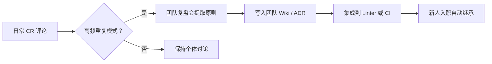

## 📌 接口层（Interface Layer）

> **TL;DR**  
> Code Review 不是纠错工具，而是**思维教练、写作训练场、主动学习引擎与文化孵化器**——它通过提问代替答案、结构化表达、逆向理解与共识沉淀，推动工程师从“实现者”跃迁为“设计者”。

> **标签**  
> `#CodeReview` `#工程成长` `#技术沟通` `#设计思维` `#团队文化` `#费曼学习法`

> **摘要**  
> 本文提炼 Code Review 的四大高阶价值：1）用提问引导思考而非直接给方案；2）强制结构化技术表达；3）通过 Review 他人实现深度学习；4）将个人偏好转化为团队技术共识。适用于希望提升 Review 质量与个人成长效率的工程师与技术负责人。

---

## 📜 契约层（Contract Layer）

### 🔒 稳定契约（Stable Contract）

- **教学原则恒定**：  
    “提问 > 给答案” 是培养自主思考的普适方法，适用于所有技术指导场景。
- **沟通本质不变**：  
    技术表达必须包含 **Context（背景）、Trade-off（权衡）、Cost（代价）** 三要素，这是清晰沟通的最小单元。
- **学习机制稳固**：  
    “输出倒逼输入” 是认知深化的核心路径——解释他人代码迫使知识显性化，符合费曼学习法原理。
- **文化形成逻辑一致**：  
    团队技术文化源于**重复模式的显性化**，而非权威指令。

### 🧪 弹性契约（Flexible Contract）

- **提问方式可调**：
    - 初级成员：用具体场景引导（如“如果状态增加到9个？”）
    - 资深成员：用抽象原则挑战（如“这个耦合是否违反了单一职责？”）
- **表达形式依赖工具**：
    - GitHub/GitLab 评论适合短句 + 链接
    - 设计文档适合完整段落 + 图表
    - 同步会议适合即时追问
- **共识沉淀节奏可变**：
    - 小团队：每周复盘 Review 模式
    - 大组织：通过 Linter / Style Guide 自动化执行已共识规则

### ⚠️ 废弃契约（Deprecated Contract）

> [!warning]  
> 早期实践常将 Code Review 视为“找 bug”或“风格警察”，导致防御性心理和低效争论。现代工程共识已转向：**Review 的目标是共同成长，而非评判对错**。旧模式保留以警示“裁判心态”的陷阱。

---

## 💻 实现层（Implementation Layer）

### ✅ 指导方式：从“给答案”到“提问题”

|场景|低效做法|高效做法|
|---|---|---|
|遇到巨型 if-else|“用策略模式重写。”|“如果未来要支持第9种状态，当前结构需要改几处？哪些地方容易漏？”|
|发现硬编码配置|“改成配置文件！”|“这个值在不同环境会变吗？如果明天要支持动态切换，现在怎么设计更灵活？”|

> **底层逻辑**：问题激发**系统思考**，答案只传递**局部知识**。

---

### ✅ 结构化表达模板（CR 评论标准格式）

```markdown
**背景（Context）**  
当前 PR 试图解决 [X 问题]，在 [Y 模块] 中引入了 [Z 方案]。

**权衡（Trade-off）**  
优点：[性能提升 / 逻辑简化 / 易测试]  
代价：[增加了模块耦合 / 引入新依赖 / 学习曲线陡峭]

**建议（Suggestion）**  
是否考虑 [替代方案 A]？它在 [某维度] 上可能更优，因为……
```

> **迁移价值**：此模板同样适用于 RFC、ADR（架构决策记录）和技术分享。


> [!NOTE]
> ### 1. RFC（Request for Comments，请求评论）
> RFC 是互联网领域的**技术标准与文档系列**，最初由美国国防部高级研究计划局（DARPA）发起，用于记录互联网协议设计、流程、方法等技术细节，供社区讨论和反馈。  
> - **核心作用**：定义互联网基础协议（如 TCP/IP、HTTP、DNS 等）的技术规范，是全球互联网技术统一的“基准文档”——例如 RFC 793 定义 TCP 协议，RFC 2616（后被 RFC 7230 等替代）定义早期 HTTP/1.1 协议。  
> - **特点**：并非所有 RFC 都是“强制标准”，部分仅为技术建议或信息记录，但被广泛认可的 RFC（如标注为“STD”的文档）会成为行业通用标准，且更新需通过新的 RFC 迭代。  
> 
> 
> ### 2. ADR（Architecture Decision Record，架构决策记录）
> ADR 是软件开发中记录**重要架构决策**的文档，用于明确“为何做出某架构选择”“考虑过哪些方案”“决策依据与影响”，方便团队协作和后续维护。  
> - **核心作用**：解决“架构决策无迹可寻”的问题——例如团队决定采用“微服务架构”而非“单体架构”、选择某数据库（如 PostgreSQL 而非 MySQL），通过 ADR 记录决策背景（如业务规模增长需求）、备选方案对比、风险与取舍，避免后续人员因“忘记原因”重复讨论或推翻合理决策。  
> - **典型结构**：通常包含“决策问题”“决策日期”“备选方案”“最终选择”“决策理由”“潜在影响”等模块，格式灵活，可根据团队需求调整。

---

### ✅ 主动学习：Review 他人的三大认知收益

1. **逆向建模能力**  
    → 快速解析陌生代码的意图与结构，构建作者心智模型。
2. **知识显性化训练**  
    → 将“我觉得这段不好”转化为“此处违反了开闭原则，因为新增类型需修改核心逻辑”。
3. **多元解法视野**  
    → 观察不同背景工程师如何权衡：前端重交互响应，后端重一致性，数据工程师重吞吐。

> **实践建议**：每周 Review 至少 2 个非本组 PR，刻意拓展认知边界。

---

### ✅ 文化共建：从评论到共识的转化流程



> **案例**：某团队发现多次争论“日志级别”，遂制定规则：
> 
> - ERROR：系统不可用
> - WARN：业务异常但可恢复
> - INFO：关键状态变更  
>     此后相关 CR 争议下降 80%。

---

## ✅ 三层价值对齐表

|层级|对工程师成长的支持|
|---|---|
|**接口层**|5秒内判断“这对我当前角色是否有用”|
|**契约层**|明确哪些是永恒原则（如提问优于给答案），哪些可因地制宜（如表达形式）|
|**实现层**|提供可直接套用的话术、模板与流程，降低实践门槛|

---

> **终极提醒**：  
> 最好的 Code Review，  
> 不是让代码变得完美，  
> 而是让**写代码的人**变得更强大。

此结构可复用于其他工程软技能主题（如技术面试、跨团队协作、故障复盘），只需替换三层内容即可快速构建高质量知识模块。