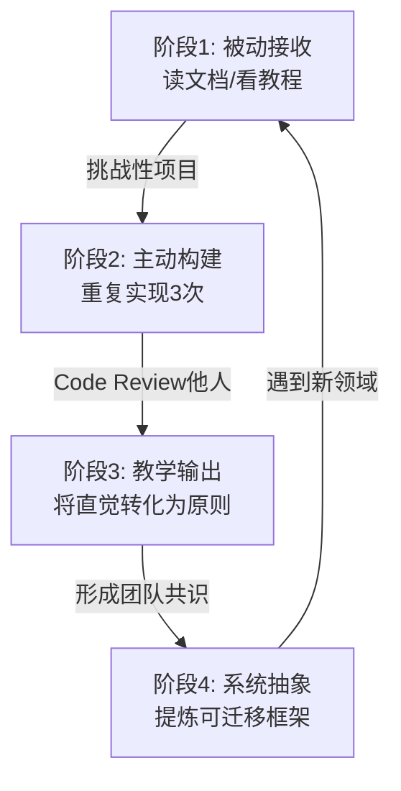

# 🎯 跨领域理论框架：从 Code Review 到挑战性项目的认知跃迁模型

基于两篇笔记的核心洞察，我提出一个统一的**"技术认知螺旋上升"理论框架**，它揭示了工程师从新手到专家的成长本质：

---

## 📐 框架一：技术能力的"三维坐标系"模型

### 核心理念
工程师的成长不是线性的，而是在**三个正交维度**上同时演化：

```
         ↑ 系统思维维度
         │  (架构设计/权衡能力)
         │
         │     ╱ 实践深度维度
         │    ╱  (挑战性项目)
         │   ╱
         │  ╱
         │ ╱
         │╱________→ 沟通表达维度
        O           (Code Review)
```

### 三维解析

#### 维度 1：实践深度（挑战性项目提供）
- **核心价值**：通过"重复实现大于一次完美"，将抽象概念转化为**肌肉记忆**
- **对应能力**：数据结构直觉、性能优化感知、底层原理理解
- **关键指标**：能否**徒手**设计出 Rope 数据结构？能否解释为什么 Gap Buffer 适合局部编辑？

#### 维度 2：沟通表达（Code Review 训练）
- **核心价值**：将隐性知识**显性化**，从"我觉得不好"升级为"违反开闭原则"
- **对应能力**：结构化表达、权衡分析、预判疑问
- **关键指标**：能否用 Context-Tradeoff-Cost 三段式清晰说明技术决策？

#### 维度 3：系统思维（两者共同培养）
- **核心价值**：从"实现者"跃迁为"设计者"，看到**不同方案的权衡空间**
- **对应能力**：架构设计、技术选型、长期演化
- **关键指标**：能否在 5 种数据结构中为特定场景选出最优解并论证？

### 🔑 关键洞察
**选中文本的转化**（"我觉得不好" → "违反开闭原则"）正是**维度 2 向维度 3 的跃迁**：
- 没有维度 1（挑战性项目）的支撑，你无法理解"开闭原则"在 Rope vs Array 选择中的具体含义
- 没有维度 2（Code Review）的训练，你无法将这种理解**精准地传递**给他人
- 没有维度 3（系统思维），你的知识只是散点，无法形成可复用的**决策框架**

---

## 🔄 框架二：知识内化的"四阶段螺旋"模型

### 理论基础
结合**费曼学习法**与**刻意练习**，提出工程师知识掌握的四个递进阶段：



### 四阶段详解

#### 阶段 1：被动接收（80% 工程师停留于此）
- **表现**：知道 Piece Table "支持高效撤销"，但说不清为什么
- **问题**：知识停留在"标签式记忆"，无法应用到新场景

#### 阶段 2：主动构建（挑战性项目的价值）
- **表现**：亲手实现过 3 种编辑器数据结构，踩过性能的坑
- **突破**：概念从"名词"变成"可操作的心智模型"
- **对应原则**："重复实现大于一次完美"

#### 阶段 3：教学输出（Code Review 的价值）
- **表现**：在 Review 中指出"此处用 Array 会导致 O(n) 插入"，并建议 Gap Buffer
- **突破**：将隐性的"感觉不对"转化为**显性的设计原则**
- **对应原则**："输出倒逼输入"

#### 阶段 4：系统抽象（专家层级）
- **表现**：提炼出"数据结构选择决策树"：
  ```
  局部编辑频繁？ → Gap Buffer
  全局搜索替换？ → Piece Table
  超大文件？     → Rope
  简单场景？     → Array
  ```
- **突破**：知识从"具体案例"升华为**可迁移的思维框架**

### 🔑 关键洞察
**选中文本**展示的正是**阶段 2 → 阶段 3 的跃迁**：
- 如果你没实现过违反开闭原则的糟糕设计（阶段 2），你无法深刻理解这个原则
- 如果你没在 Review 中被迫解释它（阶段 3），你无法将它内化为可随时调用的"武器"

---

## 🧬 框架三：技术文化的"基因遗传"模型

### 核心隐喻
将团队技术水平比作**生物种群的基因库**，Code Review 和挑战性项目是两种"基因传递"机制：

| 机制 | 挑战性项目 | Code Review |
|------|------------|-------------|
| **传递对象** | 个人 → 个人（自我进化） | 个人 → 团队（群体进化） |
| **传递内容** | 底层原理的直觉 | 设计原则的共识 |
| **传递方式** | 重复实践（有性繁殖） | 结构化表达（文化传承） |
| **失效风险** | 个人离职知识流失 | 原则未显性化导致争议 |
| **最佳实践** | 记录重构日志 | 提取 Review 模式形成 Wiki |

### 🔑 关键洞察
- **挑战性项目**是"基因突变"：个人通过深度实践获得独特的技术直觉
- **Code Review** 是"基因重组"：将个体的隐性知识编码为团队的显性共识
- **团队技术文化** = ∑(个人深度实践) × Code Review 质量

**选中文本**展示的转化，正是将**个人基因突变**（我觉得不好）编码为**团队共享基因**（开闭原则）的过程。

---

## 🎓 实践建议：如何在两个维度同时提升

### 组合策略 1：项目 + Review 的交叉验证
```
1. 实现文本编辑器（挑战性项目）
   ↓
2. Review 同事的编辑器代码
   → 发现：他用 Array，我用 Rope，为什么？
   ↓
3. 在 Review 评论中结构化表达
   "对于 10MB 文件，Array 的 O(n) 插入会导致卡顿..."
   ↓
4. 抽象为决策树并写入团队 Wiki
```

### 组合策略 2：用 Review 强化项目学习
- 每次重写项目前，先 Review 5 个开源实现
- 在 Review 中**刻意练习**用 Context-Tradeoff-Cost 分析他人设计
- 将 Review 中的优秀模式应用到自己的项目中

### 组合策略 3：用项目为 Review 提供"武器库"
- 维护一个"踩坑清单"：每次项目重构时记录"为什么之前的设计不行"
- 在 Review 中引用清单："我在实现 XX 时犯过类似错误..."
- 让 Review 评论从"主观感觉"升级为"案例佐证"

---

## 🎯 元框架：工程师成长的"复利效应"公式

最终，我提出一个量化模型：

```
技术能力增长率 = (挑战性项目深度 × Code Review 频率)^团队共识质量

其中：
- 挑战性项目深度 ∝ 重复实现次数 × 复杂度
- Code Review 频率 ∝ 主动 Review 他人的数量
- 团队共识质量 ∝ 显性化原则的数量 / 重复争议的频率
```

### 🔑 终极洞察
**选中文本的转化**（"感觉" → "原则"）是这个公式的**核心驱动力**：
- 没有挑战性项目，你的"感觉"缺乏根基（分子为 0）
- 没有 Code Review，你的"原则"无法共享（指数为 1）
- 没有团队共识，你的成长局限于个人（无法形成复利）

---

## 📊 对比表：传统学习 vs 螺旋上升

| 维度 | 传统路径 | 本框架路径 |
|------|----------|------------|
| **学习方式** | 线性积累（教程 → 项目 → 工作） | 螺旋上升（项目 ⇄ Review ⇄ 抽象） |
| **知识检验** | 能否实现功能 | 能否**说清为什么**这样实现 |
| **成长瓶颈** | 缺乏深度实践 | 缺乏显性化训练 |
| **团队价值** | 个人产出 | 个人产出 + 团队认知升级 |
| **可持续性** | 依赖个人经验 | 沉淀为团队文化 |

---

## 🌟 致用指南

如果你是**初级工程师**：
1. 选 1 个挑战性项目，重复实现 3 次（强化维度 1）
2. 每周主动 Review 2 个他人 PR（训练维度 2）
3. 每次 Review 强制用"[[Context-Tradeoff-Cost分析框架]]"模板

如果你是**资深工程师**：
1. 将项目踩坑经验整理为"反模式清单"（显性化维度 1）
2. 在 Review 中用提问代替答案（提升团队维度 3）
3. 每月提取 Review 高频模式，形成团队原则（构建维度 3）

如果你是**技术负责人**：
1. 鼓励团队做挑战性项目并分享重构日志
2. 将 Code Review 从"找 bug"重新定义为"知识编码"
3. 建立"原则 Wiki" + "Linter 规则"的双层文化传承机制

---

**终极问题**：为什么很多工程师做了 10 年还是"高级码农"？  
**答案**：他们只在**维度 1**上重复，缺少**维度 2**（表达训练）和**维度 3**（系统抽象）的刻意练习。

**选中文本**正是这个答案的微观证据：能否将"感觉"转化为"原则"，决定了你是停留在"实现者"还是进化为"设计者"。