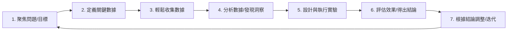

## 量化自我：用數據武裝自己，打造更聰明、更健康、更有效率的人生——AI 時代的個人優化指南

嘿，想深入了解自己、解決生活中的困擾，並持續變得更好嗎？「量化自我」（Quantified Self, QS）正是這樣一種強大的方法論，它教你如何運用數據來科學地探索自身。在 AI 時代的加持下，這條「數據驅動的自我優化之路」正變得前所未有的便捷與高效。

這篇文章不只告訴你「量化自我是什麼」，更重要的是，它將為你揭示：

*   量化自我**如何精準定位並解決你的個人難題**？
*   一套**簡單卻強大的思維框架**，指導你如何用數據思考和行動。
*   在海量數據和複雜工具面前，你**應該從哪裡開始，怎麼做**？
*   **AI 如何成為你的「超級助手」**，讓數據分析和決策變得輕鬆且深刻。

讓我們一起探索這段從數據到洞察，再到行動的旅程吧！

---

### 1. 為什麼要量化自我？解決你的具體問題！

我們常常憑感覺行事：「我最近好累」、「我好像不夠專注」、「我應該多運動」。但這些主觀判斷往往模糊不清，難以找到問題根源，更別說有效解決。

**量化自我的核心價值，就在於幫助你解決這些個人難題：**

*   **打破「我覺得」的模糊地帶：** 將「累」轉化為具體的「睡眠時長、心率變異性」，將「不夠專注」轉化為「實際專注工作時間、分心次數」。數據是客觀的鏡子。
*   **發現「我」獨特的模式：** 大量健康建議是基於群體平均，但你的身體、你的思維模式獨一無二。量化自我進行的是針對你個體的「N=1 實驗」，發現只屬於你的因果關係（或強相關）。
*   **從「知道」到「做到」的橋樑：** 你知道要早睡、要運動，但為什麼難以堅持？數據可以揭示阻礙你的真實原因，並通過反饋鼓勵你做出改變。
*   **實現基於數據的個性化優化：** 一旦發現問題或規律，你可以根據自己的數據設計個性化的解決方案，而不是盲目套用通用方法。

簡單來說，量化自我提供了一條**科學的、個性化的路徑**，幫助你從「困惑於問題」轉向「清晰地解決問題」。

---

### 2. 量化自我的行動框架：數據驅動的優化循環（怎麼思考，怎麼做）

量化自我不是雜亂無章地記錄數據，它是一套有邏輯的行動框架，一個持續優化的「迴圈」。掌握這個框架，你就掌握了量化自我的精髓：

**讓我們細化這個流程，看看如何將它應用到你的生活中：**

1.  **聚焦一個具體問題或目標 (Formulate Your Focus):** 從一個你真正想解決或改進的點出發。例如：
    *   **問題：** 我下午總是感到疲倦。
    *   **目標：** 我想提高下午的工作效率。
    *   *（提示：具體聚焦能讓你更容易開始並看到效果）*
2.  **定義需要追蹤的關鍵數據 (Define Key Metrics):** 為了回答你的問題或達成目標，你需要觀察哪些具體的指標？
    *   對「下午疲倦」的問題，可能是：睡眠時長與品質、午餐內容（是否含糖高？）、午間活動、下午特定時間段的精力主觀評分。
    *   *（提示：選擇能直接反映問題或目標的指標，不要一開始就追蹤太多。）*
3.  **選擇工具，輕鬆收集數據 (Collect Data Efficiently):** 選擇最適合、最方便你持續使用的工具來記錄這些數據。
    *   睡眠：智能手錶/手環、睡眠追蹤 App。
    *   飲食：拍照記錄、飲食記錄 App。
    *   精力/情緒：心情記錄 App、簡單筆記本。
    *   時間/效率：時間追蹤 App、日曆。
    *   *（提示：工具是手段，選擇讓你最容易堅持的方式最重要。）*
4.  **分析數據，尋找模式與洞察 (Analyze for Patterns & Insights):** 定期（比如每周）回顧你的數據。尋找趨勢、相關性，看看是否有模式出現。
    *   你是否發現精力最低點總是在午餐後特定時間？這與你的午餐內容或午休時間有關嗎？
    *   *（提示：這是最需要思考的環節，AI 在這裡能發揮巨大作用！）*
5.  **設計並執行一個小實驗 (Design & Run a Small Experiment):** 基於你的數據分析，設計一個有針對性的改變，並執行一段時間。
    *   實驗：連續一周，午餐後散步 15 分鐘，看看下午的精力評分是否有變化。
    *   *（提示：每次只改變一個變量，這樣更容易判斷是哪個因素起了作用。）*
6.  **評估實驗效果，得出結論 (Evaluate Results & Conclude):** 實驗期間繼續收集數據。結束後，對比實驗前後的數據，看看改變是否產生了預期效果。
    *   散步後，下午精力評分是否普遍提高了？
    *   *（提示：區分「相關」和「因果」，一個小實驗的結果可能還需要進一步驗證。）*
7.  **根據結論調整行動，持續迭代 (Adjust & Iterate):** 如果實驗有效，將這個改變納入你的習慣；如果無效，沒關係，這也是一種寶貴的知識！根據新的洞察或產生的新問題，開始下一個量化循環。
    *   *（提示：量化自我是一個持續學習和進步的過程，沒有終點。）*

---

### 3. AI 如何成為你的「超級助手」？讓量化更智能、更有效！

在上述行動框架的每一個環節，AI 都能極大地放大你的效率和洞察深度。AI 不只是讓工具更炫酷，它是在真正改變你與數據互動、從數據中獲取價值的方式：

*   **讓數據收集更「無感」：** 智能穿戴設備通過 AI 分析你的生理信號（心率、呼吸），自動判斷你的睡眠階段、壓力水平，你幾乎無需手動記錄。飲食 App 通過圖像識別快速記錄食物。
*   **在海量數據中「看見」模式：** 人類很難從幾十個甚至幾百個數據點中發現複雜的關聯。AI 的強項就在於處理海量、異構的數據，自動識別出那些你意想不到的微妙模式和多因素相關性。例如，AI 可能發現你的下午疲勞與昨晚的深睡不足、當天的空氣品質、甚至是前一天的社交活動都有複雜的關聯。
*   **提供個性化、前瞻性的洞察：** 基於你的歷史數據，AI 可以預測你今天的能量水平、可能的情緒狀態。它甚至可以識別潛在的健康風險信號，讓你提前干預。
*   **智能生成實驗假設與行動建議：** AI 不僅告訴你數據「是什麼」，還能基於數據「猜測」「為什麼」，甚至主動給你提出「可以嘗試什麼」的建議。它能根據你的具體情況，推薦個性化的作息調整、飲食方案或運動計劃。
*   **自動化繁瑣流程：** 數據清洗、圖表生成、趨勢報告——這些耗時的工作可以交給 AI，讓你把精力集中在最有價值的部分：思考、決策和行動。

可以說，AI 正在將量化自我從一個偏手動的數據「記錄與回顧」過程，升級為一個由 AI **智能輔助的「數據探索與優化決策」系統**。它讓普通人也能從複雜的個人數據中獲得專業級的洞察和行動指導。

---

### 4. 量化自我：不只數據，更是成長與價值呈現

通過上述數據驅動的優化循環，量化自我讓你：

*   **更清晰地認識自己：** 數據誠實地反映你的行為和狀態，幫助你發現盲點，也肯定你的努力。
*   **做出更明智的決策：** 你的每一個改變都基於個人數據，而非盲目跟風或主觀臆斷。
*   **積累關於「你」的最寶貴知識：** 你成為了自己健康、效率、情緒領域的專家。
*   **用數據證明你的價值：** 當你能在工作或生活中用數據展示「我通過什麼方法將某項指標提升了 X%」，你的說服力和個人影響力會顯著增強。例如，用時間追蹤數據展示如何優化流程，將報告完成時間縮短；用睡眠和精力數據展示如何調整習慣，提高了下午的工作效率。

這是一個通過理解和優化「小我」，來更好地面對生活中的「大我」挑戰的過程。數據賦予你的是實實在在的掌控感和持續成長的動力。

---

### 5. 準備好開始你的量化之旅了嗎？實用建議！

如果你被量化自我的潛力所吸引，想親自體驗一下，這裡有一些讓你輕鬆啟動的建議：

1.  **從一個「痛點」開始：** 回想一下，生活中最困擾你、最想改進的是什麼？是總覺得沒睡夠？是拖延症？是情緒波動大？就從這個最想解決的問題開始。
2.  **定義你的「成功指標」：** 針對這個痛點，你希望看到什麼樣的改變？用一個可衡量的指標來定義它。比如，如果痛點是「沒睡夠」，指標可以是「平均每晚睡眠時長達到 7.5 小時」或「醒來後精力評分（1-10 分）達到 8 分」。
3.  **選擇一個最簡單的追蹤方式：** 對於你定義的指標，找到一個最容易、最不讓你感到壓力的記錄方法。可能是手機 App，可能是表格，甚至只是一個簡單的筆記符號。堅持比完美更重要。
4.  **先收集基線數據（至少 1-2 周）：** 在你做出任何改變之前，先忠實地記錄一段時間的現狀。這能幫助你了解真實情況，也是未來評估效果的基礎。
5.  **每周末「約會」你的數據：** 花 15-30 分鐘看看這一周的數據。有沒有什麼發現？有沒有什麼規律？這個簡單的分析過程，是從數據到洞察的關鍵一步。
6.  **設計一個小小的「微實驗」：** 基於你的發現，設計一個只改變一個變量的小行動。例如，如果你發現週末晚睡會影響周一狀態，實驗可以是「這週末提前 1 小時睡覺」。
7.  **持續記錄與反饋：** 在實驗期間，繼續追蹤數據並記錄你的感受。實驗結束後，對比數據，看看這個微小改變是否奏效。
8.  **慶祝進步，接受「失敗」：** 量化自我是一個不斷嘗試的過程。即使實驗沒有達到預期效果，你也學到了關於自己的重要一課。每一次的發現和調整，都是向更好的自己邁進一步。

記住，量化自我不是為了追求數據的完美，而是為了**更好地理解自己，更科學地解決問題，最終實現更自由、更有效率的人生**。

---

在你的量化自我旅程中，最想用數據解決哪個問題？或者，你覺得在「收集數據」和「分析數據/採取行動」這兩個階段，哪個更具挑戰？在 AI 的幫助下，你最期待數據能告訴你關於自己的哪個秘密？歡迎分享你的想法！