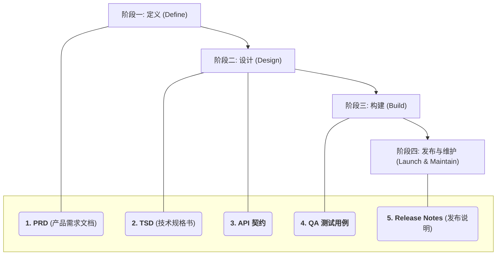

#### **1. 核心开发流程与文档的生命周期**

我们将整个开发流程分为四个阶段，每个阶段都对应 1-2 份**必须产出**的核心文档。

---

#### **2. 五份“最小必要”文档 (The Essential Five)**

这五份文档是任何商业软件项目不可或缺的基石。

##### **1. PRD (产品需求文档) - “我们要做什么？”**
*   **阶段**: 定义 (Define)
*   **核心内容**:
    *   **用户故事 (User Stories)**: “作为一名[用户角色]，我想要[完成某个功能]，以便[实现某个价值]。”
    *   **验收标准 (Acceptance Criteria)**: 清晰定义功能“完成”的标准。
    *   **核心业务流程图**: 可视化展示用户如何与系统交互。
    *   **非功能性需求**: 性能、安全、可用性等要求。
*   **价值**: **对齐团队目标**，确保所有人都在为同一个问题寻找解决方案。

##### **2. TSD (技术规格说明书) - “我们打算怎么做？”**
*   **阶段**: 设计 (Design)
*   **核心内容 (轻量级)**:
    *   **系统架构图**: 一张图说清楚前端、后端、数据库和服务之间的调用关系。
    *   **技术选型**: 简要说明为什么选择这个框架/库 (如：“选择 Next.js 因为需要 SEO 和服务端渲染”)。
    *   **数据模型 (ER 图)**: 核心表结构及其关系。
    *   **关键接口定义**: 核心 API 的路径、方法和主要参数。
*   **价值**: **统一技术实现**，是工程师之间最重要的沟通工具，避免返工和架构冲突。

##### **3. API 契约 (API Contract) - “前后端如何对话？”**
*   **阶段**: 设计 (Design)
*   **核心内容**:
    *   **工具**: **Swagger / OpenAPI** 规范。
    *   **请求/响应示例**: 每个接口都必须有清晰的 `request` 和 `response` JSON 示例。
    *   **错误码**: 定义统一的业务错误码（如 `1001` 代表“用户不存在”）。
    *   **认证**: 明确接口需要哪种认证方式 (如 `Bearer Token`)。
*   **价值**: **实现前后端并行开发**。一旦契约确定，前端可以基于 Mock Server 开发，后端可以独立实现接口，极大提升效率。

##### **4. QA 测试用例 (Test Cases) - “我们如何保证质量？”**
*   **阶段**: 构建 (Build)
*   **核心内容**:
    *   **功能测试**: 覆盖 PRD 中所有的**用户故事**和**验收标准**。
    *   **边界/异常测试**: 测试非法输入、空值、超长字符串等情况。
    *   **核心场景 E2E 测试**: 至少覆盖用户**注册、登录、核心功能、支付**等关键路径的自动化测试脚本。
*   **价值**: **量化产品质量**，是决定一个功能能否上线的“看门人”，也是防止未来重构破坏现有功能的“安全网”。

##### **5. Release Notes / Changelog (发布说明) - “我们更新了什么？”**
*   **阶段**: 发布与维护 (Launch & Maintain)
*   **核心内容**:
    *   **版本号**: 遵循**语义化版本 (Semantic Versioning)** (如 `v1.2.0`)。
    *   **内容**:
        *   `✨ New Features`: 新增了哪些功能。
        *   `🐛 Bug Fixes`: 修复了哪些 Bug。
        *   `⚠️ Breaking Changes`: 哪些是不兼容的变更，需要用户注意。
*   **价值**: **同步信息给所有相关方**（用户、运维、客服、其他开发团队），便于问题追溯和版本管理。

---

#### **3. “可以有，但非必须”的文档 (Good to Have, But Not Essential for Speed)**

以下文档在项目成熟或团队扩大后，价值会逐渐体现。初期可以从简或暂时省略：

*   **数据库设计文档**: 对于简单项目，TSD 中的 ER 图和数据模型已足够。
*   **部署与基础设施设计**: 对于使用 Vercel/Netlify 等 PaaS 平台的项目，大部分基础设施已被抽象，无需详细设计。
*   **代码架构与规范**: 初期可通过 `ESLint/Prettier` 等工具强制执行，无需长篇文档。
*   **设计系统**: 初期可直接使用成熟的 UI 库 (如 Ant Design, Material UI)，遵循其规范即可。

---

#### **4. 推荐的“最小化”工具链**

| 类别       | 工具推荐                | 为什么？                                           |
| :--------- | :---------------------- | :------------------------------------------------- |
| **文档协作** | **Notion** / 飞书/语雀 | 集成 PRD, TSD, 会议纪要，支持强大的数据库和模板。      |
| **项目管理** | **Jira / Linear / Trello** | 可视化任务，追踪进度，与代码仓库联动。             |
| **接口管理** | **Swagger (OpenAPI)**   | 行业标准，自动生成文档和客户端代码。               |
| **代码管理** | **GitHub / GitLab**     | 不仅是代码托管，更是 PR、CI/CD 和项目协作的中心。    |
| **CI/CD**  | **GitHub Actions**      | 与代码仓库无缝集成，社区生态丰富，免费额度充足。   |
| **监控**   | **Sentry** (错误) + **Vercel/Cloudflare** (分析) | 快速搭建可观测性，无需复杂的 Prometheus/Grafana 配置。 |

> **最终心法**: **文档的价值在于“被阅读和使用”，而不是“被编写和归档”。** 在每个阶段，只编写能**直接解决当前沟通和协作痛点**的文档。与其写一份没人看的 50 页 TSD，不如画一张所有人都看得懂的架构图，并附上一个清晰的 API 契约。