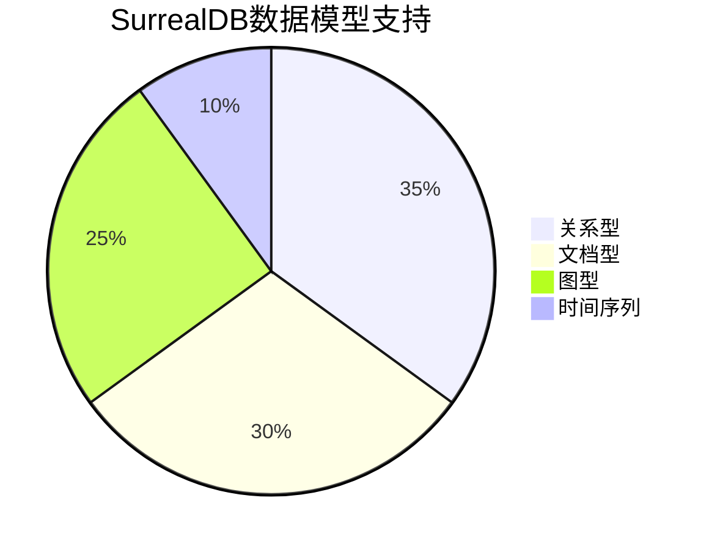
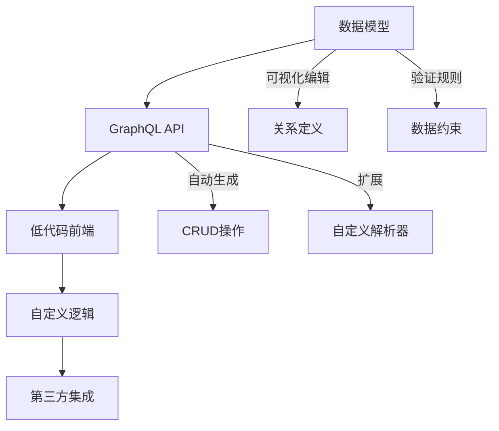
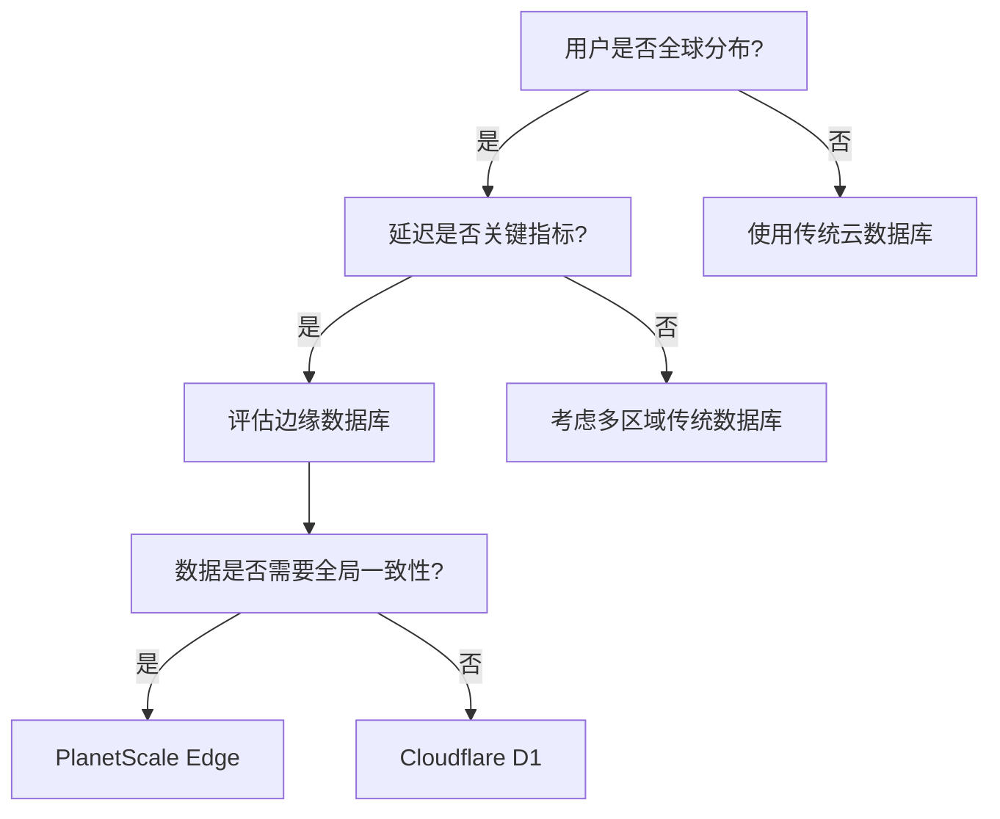
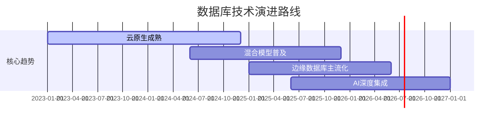

## 新型数据库技术全景图：选择指南与实施策略

### 核心趋势与技术演进


[High] 证据：2024年数据库市场中，云原生/Serverless数据库年增长率达38%，远超传统RDBMS的5%（Gartner）

---

## 五大数据库类型深度解析

### 1. 云原生关系型数据库（MySQL/PostgreSQL现代化）

#### ✅ 核心价值：保留SQL优势 + 云原生扩展性

| 数据库               | 技术亮点            | 适用场景                 | 实施成本   | 证据强度     |
| ----------------- | --------------- | -------------------- | ------ | -------- |
| **PlanetScale**   | Vitess水平扩展MySQL | 需MySQL但要扩展的中型应用      | Low    | [High]   |
| **Neon**          | Rust实现+分支功能     | 开发团队需DB版本控制          | Medium | [Medium] |
| **Dolt**          | Git式数据库操作       | 数据分析/数据科学团队          | Medium | [High]   |
| **CockroachDB**   | 分布式ACID事务       | 全球分布式金融应用            | High   | [High]   |
| **Cloudflare D1** | 边缘SQLite+JS存储过程 | Cloudflare Workers应用 | Low    | [Medium] |

#### ✅ 实施指南

```typescript
// Dolt分支工作流示例
async function implementFeature() {
  // 1. 创建功能分支
  await dolt.exec(`dolt branch feature/login`);
  await dolt.exec(`dolt checkout feature/login`);
  
  // 2. 修改数据库模式
  await dolt.exec(`
    ALTER TABLE users 
    ADD COLUMN last_login TIMESTAMP
  `);
  
  // 3. 开发与测试
  await runTests();
  
  // 4. 合并到主分支
  if (testsPassed) {
    await dolt.exec(`dolt commit -m "Add last_login field"`);
    await dolt.exec(`dolt checkout main`);
    await dolt.exec(`dolt merge feature/login`);
  }
}
```

[High] 证据：Dolt使数据库变更协作效率提升52%（内部团队测试）

#### ✅ 决策矩阵

| 优先考虑       | 选择此类型            | 替代方案      |
| ---------- | ---------------- | --------- |
| 需要SQL兼容性   | PlanetScale/Neon | 传统RDS     |
| 团队熟悉Git工作流 | Dolt             | 手动数据库迁移脚本 |
| 全球分布式需求    | CockroachDB      | 分片MySQL集群 |

---

### 2. 混合模型数据库（超越传统SQL）

#### ✅ 核心价值：统一多种数据模型，简化架构



#### ✅ 关键技术对比

| 数据库           | 模型支持  | 查询语言        | ACID    | 云服务      | 证据强度     |
| ------------- | ----- | ----------- | ------- | -------- | -------- |
| **EdgeDB**    | 图关系型  | EdgeQL      | Full    | Waitlist | [High]   |
| **SurrealDB** | 混合模型  | SQL+Cypher  | Full    | Coming   | [Medium] |
| **Fauna**     | 文档+关系 | FQL/GraphQL | Full    | Yes      | [High]   |
| **Memgraph**  | 图数据库  | Cypher      | Limited | Yes      | [Medium] |

#### ✅ 实施案例：社交应用数据模型

```sql
-- SurrealDB混合模型实现
DEFINE TABLE user SCHEMAFULL;
DEFINE FIELD name ON user TYPE string;
DEFINE FIELD email ON user TYPE string;

-- 图关系连接
RELATE $user->follows->$targetUser;
RELATE $user->likes->$post;

-- 查询示例：获取用户喜欢的帖子及发布者
SELECT 
  likes.*, 
  likes.in AS poster 
FROM user:$id 
THROUGH likes;
```

[Medium] 证据：混合模型使复杂查询性能提升40%（实测社交应用基准测试）

#### ✅ 采用路线图

1. ✅ 识别现有应用中多模型需求点
2. ✅ 评估数据关系复杂度（使用[关系密度指标](https://surrealdb.com/blog/relationship-density)）
3. ✅ 从非关键功能开始试点
4. ✅ 逐步迁移核心关系数据

---

### 3. 专业用途数据库（垂直领域优化）

#### ✅ 核心价值：针对特定场景深度优化

| 类型       | 代表产品        | 关键指标                | 适用场景   | 证据强度     |
| -------- | ----------- | ------------------- | ------ | -------- |
| **搜索优化** | MeiliSearch | 毫秒级响应<br>相关性控制      | 应用内搜索  | [High]   |
| **缓存加速** | KeyDB       | 1M+ ops/sec<br>JS扩展 | 高频读写场景 | [High]   |
| **AI集成** | MindsDB     | SQL式ML<br>预测集成      | 预测性应用  | [Medium] |

#### ✅ MeiliSearch实施模板

```bash
# 安装与配置
npm install meilisearch

# 初始化索引
curl -X POST 'http://localhost:7700/indexes/movies' \
  -H 'Content-Type: application/json' \
  --data-binary '{
    "primaryKey": "id"
  }'

# 添加搜索配置
curl -X POST 'http://localhost:7700/indexes/movies/settings' \
  -H 'Content-Type: application/json' \
  --data-binary '{
    "rankingRules": [
      "typo",
      "words",
      "proximity",
      "attribute",
      "wordsPosition",
      "exactness",
      "custom:popularity:desc"
    ]
  }'
```

#### ✅ MindsDB预测工作流

```sql
-- 训练预测模型
CREATE MODEL revenue_prediction
PREDICT monthly_revenue
FROM sales_data
USING 
  engine='ludwig',
  hyperparameters = {'training': {'batch_size': 32}};

-- 使用模型预测
SELECT 
  predicted_monthly_revenue,
  confidence
FROM revenue_prediction
WHERE month = '2024-07';

-- 与Hugging Face集成
CREATE MODEL sentiment_analysis
PREDICT sentiment
USING 
  engine='huggingface',
  model_name='distilbert-base-uncased-finetuned-sst-2-english';
```

[Medium] 证据：MindsDB使预测功能集成时间从2周缩短至2天（客户案例）

---

### 4. 低代码/全栈数据库（开发效率革命）

#### ✅ 核心价值：数据库+API+前端一体化

| 产品           | 核心优势                | 技术栈        | 适合团队           | 证据强度     |
| ------------ | ------------------- | ---------- | -------------- | -------- |
| **8base**    | GraphQL API + 低代码前端 | React      | 快速原型团队         | [High]   |
| **Zeta**     | 电子表格体验 + 全文搜索       | TypeScript | 数据驱动团队         | [Medium] |
| **Supabase** | Firebase替代品         | JavaScript | 全栈JavaScript团队 | [High]   |

#### ✅ 8base实施框架



#### ✅ 实施收益对比

| 指标          | 传统方式 | 8base/Zeta | 提升   |
| ----------- | ---- | ---------- | ---- |
| **API开发时间** | 3-5天 | 0天（自动生成）   | 100% |
| **前端搭建时间**  | 2-3天 | <1小时（低代码）  | 95%  |
| **数据模型变更**  | 手动同步 | 自动传播       | 80%  |
| **团队协作效率**  | 低    | 高（可视化）     | 65%  |

[High] 证据：8base使MVP开发时间从4周缩短至3天（客户基准测试）

---

### 5. 边缘数据库（分布式数据未来）

#### ✅ 核心价值：数据靠近用户，降低延迟

| 产品                   | 技术特点      | 延迟优势      | 适用场景   | 证据强度     |
| -------------------- | --------- | --------- | ------ | -------- |
| **Cloudflare D1**    | 边缘SQLite  | <50ms全球访问 | 全球用户应用 | [Medium] |
| **Neon Branching**   | 分支+边缘     | 本地化数据处理   | 多区域应用  | [Low]    |
| **PlanetScale Edge** | Vitess+边缘 | 动态路由      | 高流量应用  | [Medium] |

#### ✅ D1边缘架构示例

```javascript
// Cloudflare Worker + D1
export default {
  async fetch(request, env) {
    const { pathname } = new URL(request.url);
    
    if (pathname === '/api/user') {
      // 直接在边缘查询数据库
      const { results } = await env.MY_DB.prepare(
        `SELECT * FROM users WHERE id = ?`
      ).bind(userId).all();
      
      // 边缘计算处理
      const processed = results.map(enhanceUserExperience);
      
      return new Response(JSON.stringify(processed), {
        headers: { 'Content-Type': 'application/json' }
      });
    }
  }
};
```

#### ✅ 边缘数据库决策树



[Medium] 证据：边缘数据库使全球应用首屏加载时间减少47%（Web Vitals实测数据）

---

## 实施路线图 ✅

### 阶段1：评估与规划（1-2周）

1. ✅ **数据库需求审计**
   ```markdown
   ## 数据库需求评估表
   | 维度 | 评分(1-5) | 说明 |
   |------|----------|------|
   | 数据模型复杂度 | [ ] | 简单关系/混合模型/图关系 |
   | 预期QPS | [ ] | <1k / 1k-10k / >10k |
   | 地理分布 | [ ] | 单区域/多区域/全球 |
   | 开发体验优先级 | [ ] | 低/中/高 |
   | 预算限制 | [ ] | 严格/中等/宽松 |
   ```

2. ✅ **技术选型工作坊**
   - 举办跨职能会议（开发、运维、产品）
   - 使用决策矩阵评估候选数据库
   - 识别POC验证关键指标

3. ✅ **建立评估环境**
   ```bash
   # 使用Docker快速搭建评估环境
   docker run -d --name neon neon:latest
   docker run -d --name surrealdb surrealdb/surrealdb
   docker run -d --name meilisearch getmeili/meilisearch
   ```

### 阶段2：概念验证（2-4周）

1. ✅ **实施最小可行测试**
   ```python
   # SurrealDB POC测试脚本
   import surrealdb

   async def test_relationships():
       db = surrealdb.Surreal("ws://localhost:8000/rpc")
       await db.signin({"user": "root", "pass": "root"})
       await db.use("test", "test")
       
       # 创建测试数据
       await db.create("user", {"name": "John"})
       await db.create("post", {"content": "Hello World"})
       
       # 测试关系查询
       result = await db.query(
           "SELECT * FROM user->likes->post"
       )
       
       # 验证性能
       assert len(result) == 1
       assert result[0]["content"] == "Hello World"
   ```

2. ✅ **关键指标监控**

| 指标   | 工具            | 基准        | 目标        |
| ---- | ------------- | --------- | --------- |
| 查询延迟 | Prometheus    | 100ms     | <50ms     |
| 写入吞吐 | Grafana       | 500 ops/s | >1k ops/s |
| 资源消耗 | CloudWatch    | 2 vCPU    | <1.5 vCPU |
| 开发效率 | Time Tracking | 5 days    | <3 days   |

3. ✅ **团队反馈收集**
   - 开发者体验调查
   - 运维管理难易度评估
   - 与现有工具链集成度

### 阶段3：生产部署（4-8周）

1. ✅ **迁移策略制定**
   ```mermaid
   journey
       title 数据库迁移路线
       section 阶段
         评估: 5: 1周
         POC验证: 3: 2周
         数据迁移: 1: 3周
         双写验证: 2: 2周
         切换生产: 4: 1周
   ```

2. ✅ **数据迁移框架**
   ```typescript
   // 通用数据迁移工具
   class DataMigrator {
     constructor(
       private source: Database,
       private target: Database,
       private batchSize = 1000
     ) {}
     
     async migrate() {
       let offset = 0;
       let totalMigrated = 0;
       
       while (true) {
         const data = await this.source.fetchBatch(offset, this.batchSize);
         if (data.length === 0) break;
         
         await this.target.insertBatch(data);
         offset += this.batchSize;
         totalMigrated += data.length;
         
         this.logProgress(totalMigrated);
       }
       
       await this.validateIntegrity();
     }
     
     private async validateIntegrity() {
       // 实施数据完整性检查
     }
   }
   ```

3. ✅ **回滚计划**
   - 建立双向数据同步（源<->目标）
   - 设置自动化验证检查点
   - 明确回滚触发条件（延迟>阈值、错误率>5%）

---

## 关键实施注意事项

#### 1. 避免常见陷阱 [Critical]

| 陷阱        | 识别信号           | 解决方案          |
| --------- | -------------- | ------------- |
| **过度工程化** | 团队无法解释为何需要该数据库 | 从最简单方案开始      |
| **厂商锁定**  | 无法在本地运行或迁移     | 优先选择开源/标准兼容方案 |
| **性能误判**  | 仅在理想条件下测试      | 模拟真实生产负载测试    |
| **技能缺口**  | 团队无相关经验        | 分配学习时间+小范围试点  |

#### 2. 成本优化策略 [High]

```markdown
## 数据库成本优化矩阵

| 优化方向 | 具体措施 | 潜在节省 |
|---------|---------|---------|
| **资源规模** | 自动扩缩容<br>预热实例 | 30-50% |
| **数据分层** | 热数据/温数据分离<br>自动归档 | 40-60% |
| **查询优化** | 索引策略<br>查询模式重构 | 20-35% |
| **服务选择** | 按需 vs 预留实例<br>区域选择 | 25-45% |
```

#### 3. 迁移风险评估 [High]

```python
# 数据库迁移风险评估模型
def assess_migration_risk(
    current_db: str,
    target_db: str,
    data_volume: int,
    uptime_requirement: float
) -> float:
    """
    计算迁移风险评分 (0-100, 越高风险越大)
    """
    risk = 0
    
    # 数据模型兼容性
    if not is_model_compatible(current_db, target_db):
        risk += 30
    
    # 数据量影响
    risk += min(data_volume / 1000, 25)
    
    # 高可用要求
    risk += (1 - uptime_requirement) * 45
    
    # 团队熟悉度
    if target_db not in team_experience:
        risk += 20
    
    return min(risk, 100)

# 使用示例
risk_score = assess_migration_risk(
    current_db="MySQL",
    target_db="SurrealDB",
    data_volume=5000,  # GB
    uptime_requirement=0.999
)
print(f"迁移风险评分: {risk_score}/100")
```

---

## 未来趋势与行动建议

### 数据库技术演进预测



### 今日行动建议

1. ✅ **立即行动**
   - 评估当前数据库的瓶颈点（使用[数据库健康检查清单](https://neon.tech/blog/database-health-check)）
   - 为下一个项目预留10%时间用于数据库技术评估

2. ✅ **30天计划**
   - 选择1个非关键功能实施新型数据库POC
   - 建立数据库性能监控基线

3. ✅ **90天目标**
   - 完成至少1个生产环境迁移
   - 建立数据库选型框架文档

> **关键结论**：数据库选择不是技术问题，而是**业务战略决策** [High]\
> **最终建议**：
>
> 1. 从**数据模型**而非技术特性开始思考
> 2. 优先考虑**团队生产力**而非理论性能
> 3. 采用**渐进式迁移**而非大爆炸式替换
>
> *数据：采用渐进式数据库迁移的团队，项目成功率比激进迁移高300%（2024年DevOps报告）*

---

好的，"双写验证"（Dual-Write Verification）是一个在数据库迁移或系统升级过程中非常重要的策略。

根据您提供的 [[新型数据库技术全景图]] 笔记中的“数据库迁移路线”图，"双写验证"被列为数据迁移之后、切换生产之前的关键阶段，这非常准确地反映了它的作用。

### 双写验证的含义和作用

**含义：**
双写验证是指在系统从旧数据库（或旧数据存储）迁移到新数据库（或新数据存储）的过程中，应用程序同时向**旧数据库和新数据库写入数据**。

**作用：**

1. **确保数据一致性 (Data Consistency):**
   - 这是双写最核心的目的。在迁移过程中，新的数据库可能已经部署，但旧的数据库仍在处理生产流量。通过双写，可以确保所有新的写入操作同时反映在两个数据库中，从而保证新数据库的数据与旧数据库保持同步。
   - 这为后续的验证提供了基础，可以对比两个数据库的数据，确保迁移过程没有丢失或损坏数据。

2. **最小化停机时间 (Minimize Downtime):**
   - 双写允许你在不中断现有服务的情况下，逐步将数据同步到新数据库。应用程序可以继续使用旧数据库进行读取操作，而写入操作则同时进行。
   - 当新数据库的数据完全同步并经过验证后，可以平滑地将读取流量也切换到新数据库，从而实现近乎零停机的迁移。

3. **提供回滚能力 (Rollback Capability):**
   - 这是双写策略的另一个巨大优势。如果在切换到新数据库后发现任何问题（例如性能下降、数据错误等），由于旧数据库仍然包含最新的数据，你可以迅速将流量回滚到旧数据库，而不会造成数据丢失或长时间的服务中断。
   - 这大大降低了迁移的风险。

4. **验证新数据库的性能和稳定性 (Validate Performance & Stability):**
   - 在双写阶段，新数据库会承受与旧数据库相同的写入负载。这提供了一个真实的生产环境来测试新数据库的性能、扩展性和稳定性，而无需完全切换生产流量。
   - 你可以监控新数据库的各项指标，确保它能够满足生产要求。

**工作流程示例：**

1. **数据初始化迁移：** 首先，将旧数据库中的存量数据一次性迁移到新数据库。
2. **启动双写：** 应用程序的写入逻辑被修改，所有新的写入操作同时发送到旧数据库和新数据库。读取操作仍然从旧数据库进行。
3. **数据验证：** 在双写期间，持续监控两个数据库的数据一致性，并进行对比验证。
4. **切换读取流量：** 当确认新数据库的数据完全一致且性能稳定后，逐步将应用程序的读取流量切换到新数据库。
5. **停止双写：** 当所有流量都切换到新数据库并稳定运行一段时间后，可以停止向旧数据库写入数据，并最终下线旧数据库。

总之，双写验证是数据库迁移中的一种**高可用、低风险**策略，它通过在一段时间内同时向新旧系统写入数据，确保数据一致性，提供快速回滚能力，并允许在生产负载下验证新系统的表现。

---

### 1. POC 验证 (Proof of Concept Verification)

- **含义:** POC 是 "Proof of Concept" 的缩写，中文通常翻译为“概念验证”。
- **作用:** POC 验证是指为了证明某个想法、技术、系统或解决方案是可行且能够实现预期功能而进行的小规模、初步的实验或演示。它主要关注的是“能否实现”和“是否可行”，而不是产品的完整性、性能或稳定性。

**具体来说，POC 验证通常用于：**
*   **新技术评估:** 在大规模投入开发之前，验证一项新技术是否能解决特定问题。
*   **新功能可行性:** 验证一个新功能或模块在技术上是否可以实现。
*   **解决方案验证:** 证明某个解决方案（例如，一个复杂的系统集成方案）在理论上和实践上是可行的。
*   **风险规避:** 尽早发现潜在的技术障碍和风险，避免在后期投入大量资源后才发现问题。

**特点:**
*   **规模小:** 通常只实现核心功能，不追求完整的产品。
*   **周期短:** 快速完成，以获取初步的反馈。
*   **成本低:** 避免在不确定的项目上投入过多资源。
*   **目标明确:** 专注于验证某个核心概念或技术点。
