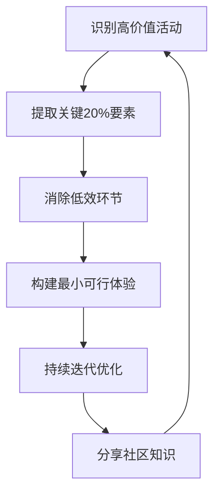

🧠 核心心法（开发者版）：

1. **80/20 法则**：20% 的关键操作，带来 80% 的核心体验。
2. **社区挖矿**：Reddit / Discord / 小众论坛 = 你的“开源情报库”。
3. **拒绝 SaaS 思维**：别为“省事”付溢价，自己组合“开源方案”更香。
4. **量化回报**：像优化代码一样，计算你的“兴趣 ROI”。
5. **动手即正义**：修车、磨豆、写书法 —— “编译通过”的成就感，才是真·快乐。

—

> “生活不是马拉松，是 Hackathon —— 用最短时间，做出最惊艳的 Demo。”  
> —— 一个不想被兴趣榨干的开发者


### 5.1 社区资源的80/20原则

- **80%的解决方案来自20%的社区资源**：聚焦高质量、高价值的社区资源
- **避免信息过载**：不要试图阅读所有文档，只关注关键部分
- **寻找"秘密见解"**：深入社区，找到那些不为人知但非常有价值的技巧

### 5.2 开发者社区资源获取策略

- **聚焦核心社区**：选择1-2个最相关的社区深入参与，而非分散在多个社区
- **寻找"专家"**：识别社区中的专家，学习他们的经验
- **利用问答平台**：Stack Overflow、Reddit等平台的精华问答
- **关注开源项目**：查看优秀开源项目的实现方式和最佳实践

### 5.3 开发者社区资源清单

|   |   |   |
|---|---|---|
|**论坛**|Stack Overflow、Reddit r/programming|问答质量高、问题覆盖广|
|**开源项目**|GitHub Trending、Awesome Lists|实际项目经验、最佳实践|
|**技术博客**|Dev.to、Medium技术专栏|实际案例、深度分析|
|**视频内容**|YouTube技术频道|可视化学习、实战演示|
|**社区活动**|Meetup、技术大会|与专家面对面交流、最新趋势|

> **关键洞察**：在社区中，80%的价值来自20%的内容。不要试图阅读所有内容，而是专注于那些被频繁引用、高赞的高质量内容。

## 6. 项目管理与优先级设置：聚焦高回报任务

### 6.1 项目管理的80/20原则

- **80%的项目价值来自20%的功能**：识别并优先开发核心功能
- **20%的时间决定80%的项目成功**：前期设计和架构决策对项目成功影响最大
- **避免"完美主义"陷阱**：完成比完美更重要，先发布MVP

### 6.2 高效项目管理实践

- **功能优先级矩阵**：使用MoSCoW方法（Must have, Should have, Could have, Won't have）对功能进行优先级排序
- **MVP定义**：明确最小可行产品的范围，确保核心功能完整
- **迭代开发**：将项目分解为小的迭代，每个迭代交付可工作的功能
- **持续反馈**：定期获取用户反馈，调整开发方向


---

# 80/20法则在兴趣爱好中的高效实践：开发者视角

> **核心理念**：识别关键20%的努力，获取80%的回报。避免过度投入低效环节，专注于高价值活动。

## 一、艺术创作：手写书法 Spencerian Script

### 问题与挑战
- 传统艺术学习存在高门槛：需要长期投入才能获得满意成果
- 大多数教程只教指尖控制，导致学习效率低下
- 开发者容易因"完美主义"而放弃创意活动

### 80/20解决方案
```markdown
- ✅ **核心技巧**：使用整个手臂而非指尖控制笔画
  - 保持手部固定，通过肩部/肘部运动创造流畅线条
  - 建立肌肉记忆，使书写过程进入"心流"状态
- ✅ **工具选择**：入门级书法工具即可（$20-30）
  - 钢笔尖 + 墨水 + 练习纸
  - 无需专业工作室环境
- ✅ **练习策略**：每天15分钟专注练习 > 每周一次长时间练习
```

### 开发者启示
- **类比重构代码**：专注于关键20%的架构设计，而非过度优化每个细节
- **实践建议**：
  - 将创意活动纳入每日"代码之外"的例行事项
  - 用GitHub提交频率思维对待创意练习（每日小步提交）
  - 将手写笔记作为需求分析的辅助工具，提升思维清晰度

## 二、食品饮料：高回报低成本体验

### 咖啡优化（家庭版）
```javascript
// 咖啡体验升级路径
const coffeeOptimization = {
  problem: "普通滴滤咖啡缺乏深度体验",
  80_20_solution: "家庭意式浓缩系统",
  key_components: [
    { item: "手持磨豆机", cost: "$50-100", impact: "80%" },
    { item: "Affordable Espresso Machine (e.g. Alin Nano)", cost: "$200-300", impact: "20%" }
  ],
  why_it_works: "专业级体验无需专业级价格，磨豆精度是关键80%"
};
```

### 披萨制作（家庭版）
```markdown
- 🍕 **核心洞察**：披萨石炉温度控制 > 食材复杂度
  - 空气温度 vs 石板温度的平衡
  - 木材燃料的精细控制技巧
- 🍕 **关键20%技巧**：
  1. 使用粗粒面粉(如Semolina)确保披萨顺利滑入
  2. 预热石板至理想温度(约350°C)
  3. 精确控制燃烧时间(3-5分钟)
- 🍕 **ROI计算**：$300披萨炉 ≈ 2次家庭外出用餐成本
```

### 开发者启示
- **类比技术选型**：识别关键依赖项，避免过度工程化
- **实践建议**：
  - 像优化构建流程一样优化日常体验
  - 使用"披萨石板温度"思维：找到系统的关键性能指标
  - 将烹饪视为"离线调试"时间，提升整体工作效率

## 三、旅行冒险：高性价比体验系统

### 豪华汽车体验
```mermaid
graph LR
    A[问题：豪华车维护成本高] --> B[80/20方案：自行维护]
    B --> C[购买老款豪华车(如Land Rover Discovery 3)]
    C --> D[日常使用：廉价电动车]
    D --> E[周末/假期：豪华越野体验]
    E --> F[维护技能：社区知识 + 实践]
```

### 野营系统构建
```markdown
- 🌲 **核心洞察**：真正的露营体验 ≠ 昂贵的房车
- 🌲 **80/20构建方案**：
  | 组件 | 传统方案 | 80/20替代方案 | 成本节省 |
  |------|----------|---------------|----------|
  | 载具 | $50k房车 | $5k越野车 + DIY改造 | 90% |
  | 睡眠 | 房车内部 | 车顶帐篷 + 车内平台 | 75% |
  | 卫生 | 房车设施 | Julka系统帐篷 | 95% |
- 🌲 **关键技巧**：利用车辆特性(如空气悬挂)创造独特优势
```

### 开发者启示
- **类比基础设施**：自托管关键服务 vs 全面依赖云服务
- **实践建议**：
  - 将"维护技能"视为技术债务管理能力
  - 用模块化思维构建个人系统（就像微服务架构）
  - 重视社区知识共享，如同开源社区协作

## 四、音乐体验：数字极简主义实践

### 高回报音乐系统
```javascript
// 从订阅服务到有意聆听
class MusicExperience {
  constructor() {
    this.currentSystem = 'CDs + Local Library + iPod';
    this.subscriptionCost = 0; // Cancelled streaming services
    this.intentionalityLevel = 'high';
  }
  
  getBenefits() {
    return [
      'Enhanced focus: No algorithmic distractions',
      'Deeper album appreciation: Sequential listening',
      'Cost reduction: ~$150/year savings',
      'Rediscovery: Physical media encourages revisiting'
    ];
  }
  
  optimizeExperience() {
    // Use AI for discovery, not consumption
    const albumRecommendation = chatGPT.prompt(
      'Based on [artist1, artist2], suggest 3 albums with similar style but different eras'
    );
    return this.purchasePhysicalMedia(albumRecommendation);
  }
}
```

### 开发者启示
- **类比工具选择**：专注核心工具链，避免工具疲劳
- **实践建议**：
  - 将"有意聆听"思维应用于技术学习：深度而非广度
  - 使用AI作为发现工具，而非决策工具
  - 建立个人知识库，如同维护音乐库

## 五、手表选择：实用主义奢侈品

### 价值最大化策略
```markdown
- ⌚ **核心洞察**：奢侈品回报曲线存在明显拐点
  - $100-200区间：功能/设计/品质最佳平衡点
  - $2000+区间：边际收益急剧下降
- ⌚ **Casio G-Shock案例分析**：
  | 特性 | $100型号 | $4000型号 | 实际使用价值 |
  |------|----------|-----------|--------------|
  | 核心设计 | ✓ | ✓ | 100% |
  | 太阳能充电 | ✓ | ✓ | 95% |
  | 蓝牙时间同步 | ✓ | ✓ | 90% |
  | 高端材料 | ✗ | ✓ | 10% |
  | 文化设计元素 | ✗ | ✓ | 5% |
- ⌚ **决策框架**：功能价值 > 收藏价值
```

### 开发者启示
- **类比技术投资**：识别真正影响生产力的工具
- **实践建议**：
  - 用"手表思维"评估开发工具：核心功能是否满足
  - 避免"高级功能陷阱"：90%的功能可能永远不用
  - 投资可带来实际生产力提升的工具

## 六、开发者行动清单

### 立即实施（本周内）
```bash
# 80/20实践启动脚本
1. 创建"高ROI活动"清单：列出3项可应用80/20法则的兴趣
2. 设定每日15分钟创意时间（如手写笔记）
3. 优化一项日常体验（如咖啡/音乐系统）
4. 加入一个相关社区（Discord/论坛）获取关键洞察
5. 记录ROI变化：使用简单的Markdown日志跟踪
```

### 长期思维转变
```markdown
- 🔁 **循环改进**：
  1. 识别当前活动的80%价值来源
  2. 消除20%低效环节
  3. 重新分配节省的时间到新高ROI活动
  4. 重复循环

- 📊 **评估指标**：
  - 时间/金钱投入 vs 体验满意度
  - 社区知识获取效率
  - 技能增长曲线斜率

- 🚫 **避免陷阱**：
  - 不要追求"完美系统"
  - 不要过度优化次要环节
  - 不要忽视社区智慧
```

## 七、总结：开发者的80/20思维框架



> **核心原则**：如同编写高效代码，生活系统也应遵循"最小可行原则"。识别并专注于产生最大价值的关键要素，避免过度工程化你的兴趣爱好。真正的回报来自于有意选择和持续优化，而非盲目投入。

**开发者行动**：将80/20法则应用到你的技术栈评估中——哪些工具真正提供了80%的价值？哪些可以安全移除以简化你的工作流程？