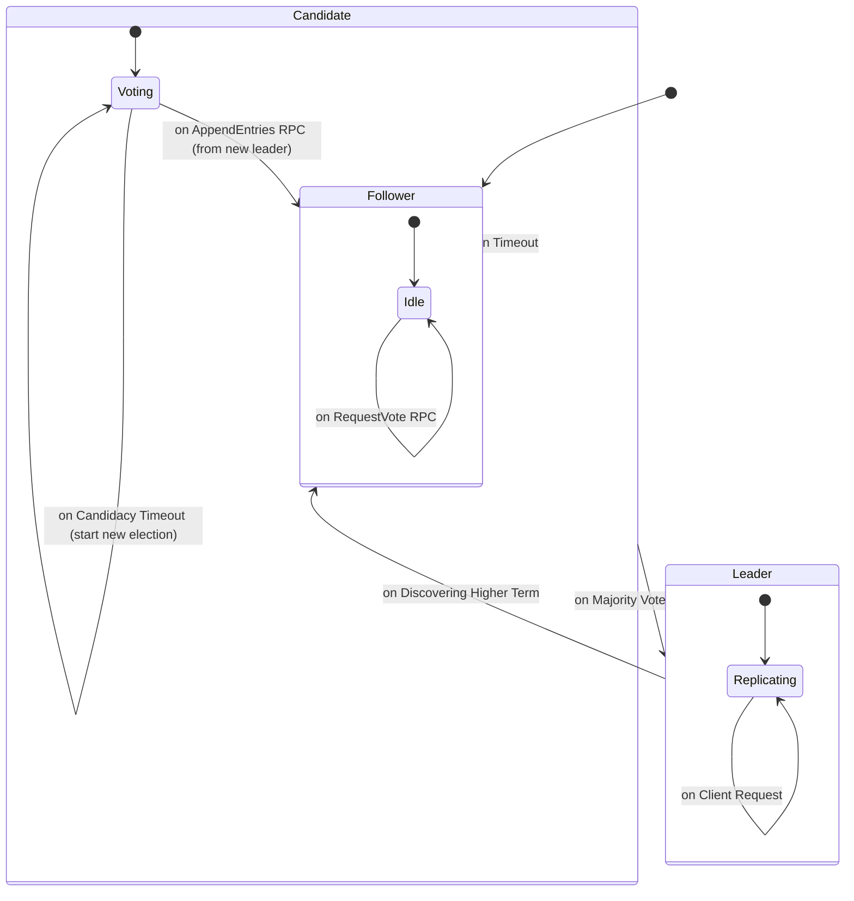

好的，我们来深入剖析**状态机模型 (State Machine Model)**，以及为什么这个看似基础的计算理论工具，是顶尖工程师用于解构复杂系统、实现深度知识内化的核心“解码器”。

简单地“知道”一个概念和真正“理解”一个系统，其差别就在于你是否能在脑中为其构建一个精确、可运行的状态机模型。

### 什么是状态机模型？

在计算机科学中，有限状态机（Finite State Machine, FSM）是一个数学计算模型。它是一个抽象的机器，在任何给定时间点，它只能处于有限个状态中的一个。它通过响应一系列的**事件（Events）**或**输入（Inputs）**，从一个**状态（State）**转换到另一个**状态（Transition）**。

一个形式化的状态机可以由一个五元组定义：$(\Sigma, S, s_0, \delta, F)$
*   $\Sigma$: 输入符号的有限集合 (Events/Inputs)。
*   $S$: 有限的状态集合 (States)。
*   $s_0$: 初始状态 (Initial State)。
*   $\delta$: 状态转移函数 (Transition Function)，其形式为 $\delta: S \times \Sigma \rightarrow S$。即 `(当前状态, 输入事件) -> 下一个状态`。
*   $F$: 最终状态的集合 (Final States)，虽然在很多系统（如服务器）中，系统是持续运行的，没有“最终”状态。

**为什么这个模型如此强大？**
因为它强迫你放弃模糊的、描述性的语言，转而使用精确的、逻辑完备的语言来定义一个系统。你必须明确地回答以下问题：
1.  系统总共有哪几个**确切的状态**？不多不少。
2.  是什么**外部事件**或**内部条件**（如计时器）会触发状态的改变？
3.  从每个状态出发，当某个特定事件发生时，系统会**精确地**转移到哪个新状态？
4.  在状态转移的瞬间，或者在某个状态持续期间，系统会执行哪些**确切的动作（Actions）**？

这种思考方式能瞬间将你的理解深度从“用户级”提升到“设计者级”。

---

### 应用案例：用状态机模型解构Raft共识协议

让我们回到之前的例子：学习Raft协议。如果你只是看论文或博客，你可能会记下：“有Leader, Follower, Candidate三种角色，Candidate会拉票，Leader会同步日志”。这是一种非常浅的、易忘的理解。

现在，我们用状态机模型来“编译”它。

#### 1. 识别状态 (States, $S$)
一个Raft服务器节点的核心状态只有三个，非常明确：
*   `Follower` (跟随者)
*   `Candidate` (候选人)
*   `Leader` (领导者)

#### 2. 识别事件 (Events, $\Sigma$)
触发状态转换的事件是什么？
*   **内部事件:**
    *   `Election Timeout`: 跟随者在一段时间内未收到领导者的心跳。
    *   `Candidacy Timeout`: 候选人在一段时间内未选举成功。
*   **外部事件 (RPCs):**
    *   收到 `RequestVote` RPC (来自其他候选人)。
    *   收到 `AppendEntries` RPC (来自领导者，可以是心跳或日志)。
    *   收到来自客户端的请求。

#### 3. 定义状态转移函数 (Transitions, $\delta$)
这是最核心的部分，它定义了系统的完整逻辑。

| 当前状态 (Current State) | 事件 (Event) | 条件 (Condition) | 下一状态 (Next State) |
| :--- | :--- | :--- | :--- |
| `Follower` | `Election Timeout` | - | `Candidate` |
| `Follower` | 收到 `AppendEntries` RPC | `term` 不小于当前 `term` | `Follower` (重置计时器) |
| `Follower` | 收到 `RequestVote` RPC | `term` 更高且满足投票条件 | `Follower` (投票并重置计时器) |
| `Candidate` | `Candidacy Timeout` | - | `Candidate` (开始新一轮选举) |
| `Candidate` | 收到 `AppendEntries` RPC | `term` 不小于当前 `term` | `Follower` |
| `Candidate` | 获得多数选票 | - | `Leader` |
| `Leader` | 发现更高 `term` 的节点 | (通过RPC响应) | `Follower` |

#### 4. 定义动作 (Actions)
在状态转换或处于某个状态时，节点会做什么？

*   **转换到 `Candidate` 时:**
    1.  `currentTerm++`
    2.  为自己投票 `voteFor = self`
    3.  重置选举计时器
    4.  向所有其他节点发送 `RequestVote` RPC
*   **处于 `Leader` 状态时:**
    1.  向所有Follower发送心跳 (`AppendEntries` RPC)
    2.  处理客户端请求
    3.  将日志复制到Follower

#### 可视化：状态机图

将上述逻辑可视化，可以得到一个清晰的状态机图。这比任何文字描述都更有力。

### 如何将此模型运用到个人发展中

1.  **学习新技术/框架:**
    *   **React组件生命周期:** `Mounting` -> `Updating` -> `Unmounting`。每个阶段有哪些方法（事件）被调用？调用顺序是怎样的？`setState` 如何触发从 `Mounting` 到 `Updating` 的转换？
    *   **TCP连接:** `CLOSED` -> `SYN_SENT` -> `ESTABLISHED` -> `FIN_WAIT_1` -> `FIN_WAIT_2` -> `TIME_WAIT` -> `CLOSED`。每个状态因何而起，因何而终？三次握手和四次挥手就是这个状态机的具体实现。

2.  **理解业务逻辑:**
    *   **电商订单系统:** `Pending Payment` -> `Paid` -> `Processing` -> `Shipped` -> `Delivered` / `Cancelled`。每个状态转换需要什么条件（支付成功、仓库发货）？会触发什么动作（通知仓库、发送邮件给用户）？

3.  **调试复杂Bug:**
    *   当一个系统出现问题时，顶尖工程师会问：“系统当前处于哪个**状态**？它收到了什么**事件**？根据设计，它本应转移到哪个状态，但实际却去了哪里？” 这种思维方式能快速定位问题是出在状态定义错误，还是状态转移逻辑有缺陷。

### 结论

**状态机模型不是一个需要“学习”的孤立知识点，它是一个根本性的“思维工具” (Mental Model)。**

它强迫你将一个动态、复杂的系统，解构成一组静态、离散的状态和一系列精确、无歧义的转换规则。当你能为任何一个你想深入理解的系统画出它的状态机图时，你才真正拥有了它。

下次当你面对一个新框架、一个复杂协议或一个棘手的Bug时，不要急于深入代码细节。先退一步，问自己：**这个系统的状态机是什么？** 这将是你通往深度理解的最短路径。