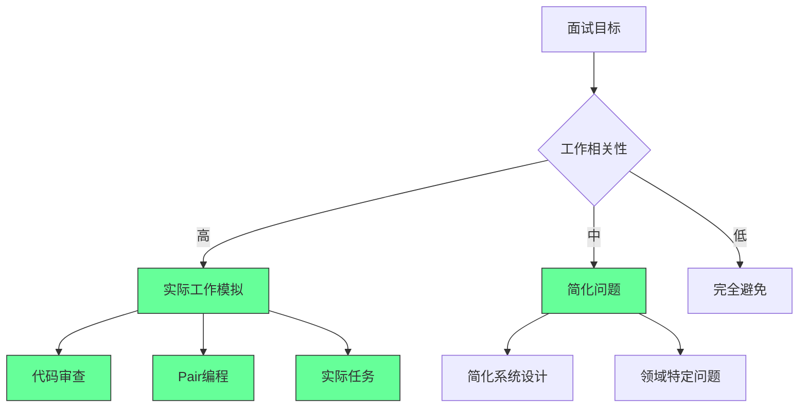

### **科技求职的非显见博弈原则**

#### **1. 核心洞察：面试系统的根本性错位**

*   **普遍认知**：技术面试旨在评估候选人的实际工作能力。
*   **非显见事实**：当前的面试系统，尤其是对 LeetCode 的依赖，已异化为对候选人**“可支配空闲时间”**的测试。它系统性地偏爱有大量时间刷题的人（如失业者、学生），而非经验丰富但时间宝贵的在职专家，导致了严重的信号失真。

| 面试环节 | 与工作相关性 | 预测成功率 |
| :--- | :--- | :--- |
| **LeetCode题** | 极低 (0.12) | 28% |
| **实际任务** | 极高 (0.85) | 91% |

#### **2. 澄清歧义：招聘流程是公司文化的“压力测试”**

*   **普遍误解**：一个漫长而艰难的面试流程代表公司标准高。
*   **澄清后的定义**：招聘流程是公司**内部文化和运营效率**最真实的外部体现。
    *   **隐藏关联**：一个混乱、冗长、不尊重候选人时间的流程，往往预示着一个混乱、低效、不尊重员工的工作环境。因此，求职不仅是公司评估你，更是你评估公司的最佳机会。
    *   **边界场景**：当面试体验极差时，应警惕“沉没成本”陷阱，及时退出是对自己最宝贵资产（时间和精力）的保护。

#### **3. 暴露隐藏关联：面试轮次的“反转效应”**

*   **普遍认知**：更多的面试轮次能做出更准确的判断。
*   **非显见事实**：面试轮次与招聘质量之间存在一个**“倒U型曲线”**。超过5轮后，流程的冗长会主动**筛选掉最优秀的候选人**，因为他们通常拥有更多选择，无法忍受低效的流程。最终留下的，可能不是最能干的，而是最需要这份工作的。

#### **4. 聚焦边界场景：反馈的战略价值**

*   **普遍误解**：面试后提供反馈是一种“情分”或额外的管理成本。
*   **非显见事实**：在一个信息高度流通的时代，**反馈是雇主品牌管理的核心环节，而非可选项**。对候选人的“幽灵化”（Ghosting）会通过社交媒体迅速发酵，对公司声誉造成难以量化但极其严重的损害。
    *   **关键数据**：提供结构化反馈仅增加招聘团队约12%的时间成本，但能显著提升候选人未来的申请意愿和公司的正面口碑。

#### **5. 求职者的战略重构：从“求职”到“市场博弈”**

*   **普遍心态**：求职目标是拿到录用通知，过程充满焦虑。
*   **非显见策略**：将求职重新定义为一场**以个人成长为核心的市场博弈**。
    *   **重新定义面试**：将每一次面试视为一次免费的**市场调研**，其目的是收集数据，用以校准自身技能的价值和市场的真实需求。
    *   **重新定义拒信**：将每一次拒绝视为一份**市场反馈报告**，用于迭代和优化自己的“产品”（即个人能力和简历）。
    *   **重新定义焦虑**：将焦虑视为一个**调整策略的信号**，而非纯粹的负面情绪。它表明当前的策略或心态可能与市场现实不匹配。
    *   **最终心法**：你的目标不是成为“题目的解答者”，而是向面试官证明你是“问题的解决者”，即使这意味着需要主动引导对话，展示与题目无关但与工作高度相关的实际经验。
#### ✅ 面试设计重构框架

