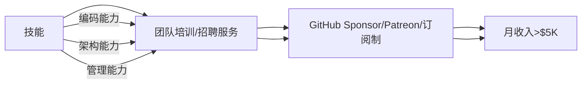
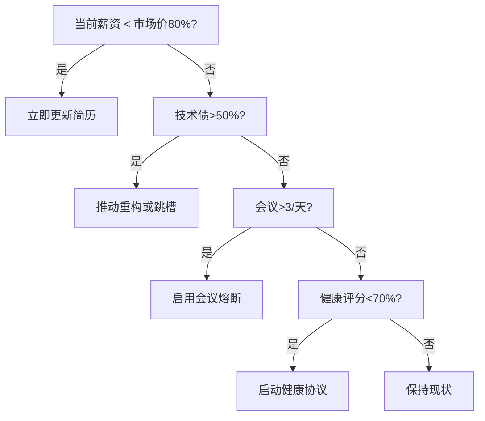
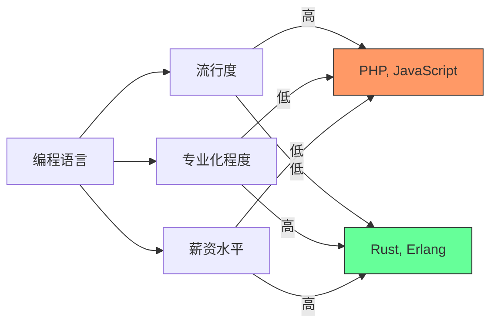
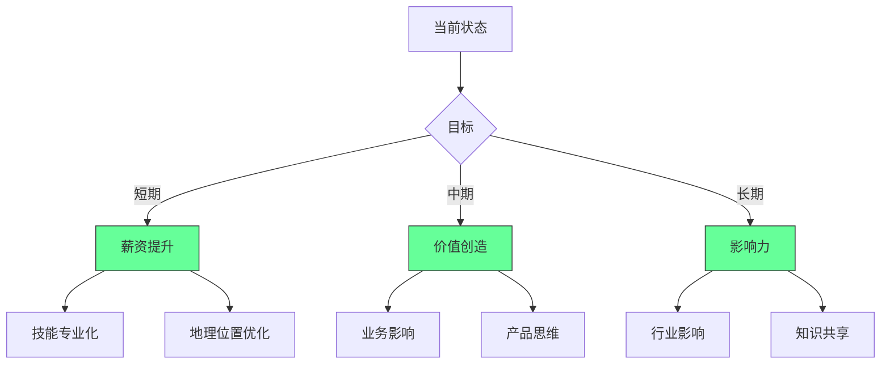
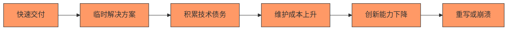
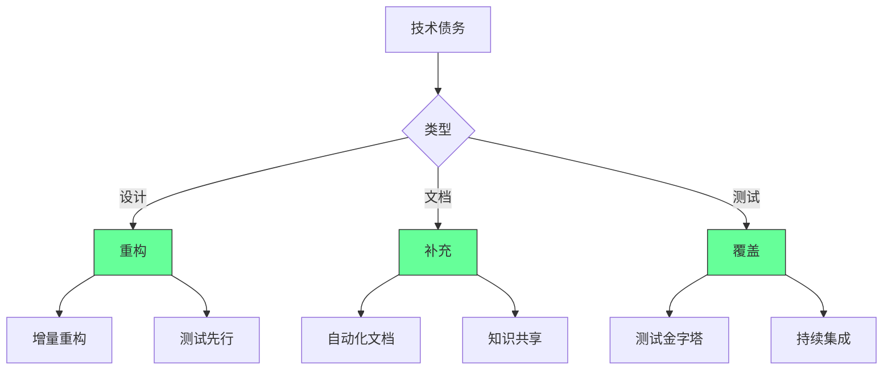
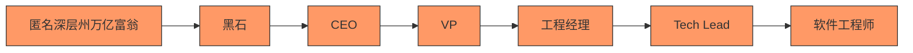
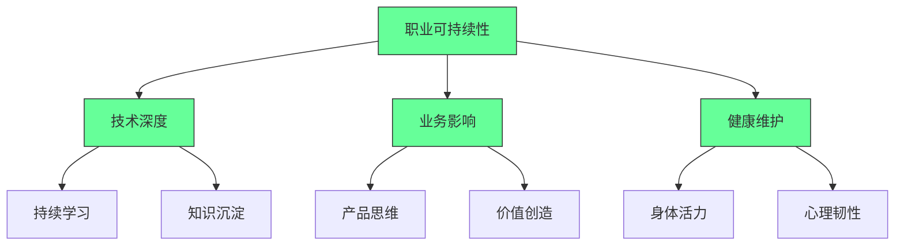
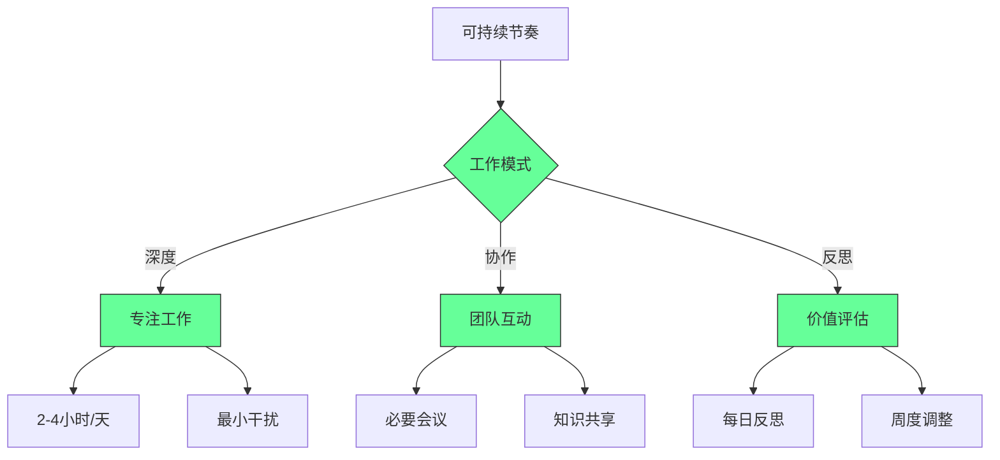

## 🧠 程序员幸福力重建指南：从“技术债奴隶”到“系统掌控者”


- **系统性病因**：技术债 + 会议癌 + 年龄歧视 + 久坐危害
- **破局公式**：**幸福感 = 自主权 × 成就感 × 健康值**

### 3. ❌ 年龄歧视 → ✅ 技能证券化

**病灶**：

> “25岁后被视作‘过期程序员’” → 薪资增长停滞

**工程化解法**：



**实战路径**：

1. **第1年**：将重复工作开源（如自动化脚本）→ 积累Star
2. **第2年**：录制课程（Udemy/YouTube）→ 建立影响力
3. **第3年**：开发SaaS工具（解决自身痛点）→ 被动收入

> ✅ **数据**：
>
> - 开源维护者平均收入：$120K（含赞助/咨询）
> - 技术课程创作者：$80K/年（Top 10%达$500K+）

---

### 4. ❌ 久坐危害 → ✅ 健康监控系统

**病灶**：

> “久坐危害 > 吸烟” → 腰椎病/抑郁高发

**工程化解法**：

```python
# 健康监控系统（Python + 智能硬件）
import time
from pynput import keyboard

class HealthMonitor:
    def __init__(self):
        self.sit_time = 0
        self.stand_reminder = 30 * 60  # 30分钟提醒
    
    def on_key_press(self, key):
        self.sit_time += 1
        if self.sit_time > self.stand_reminder:
            self.alert_stand_up()
            self.sit_time = 0
    
    def alert_stand_up(self):
        # 调用智能手环震动 + 语音提醒
        print("🚨 起立！深蹲10次！")
        # 播放激励语音："你的腰椎感谢你！"
    
    def start_monitoring(self):
        with keyboard.Listener(on_press=self.on_key_press) as listener:
            listener.join()

# 启动监控
monitor = HealthMonitor()
monitor.start_monitoring()
```

> ✅ **健康协议**：
>
> - **每30分钟**：站立+深蹲10次
> - **每2小时**：户外步行15分钟（光照调节血清素）
> - **每日**：7小时睡眠（用Sleep Cycle APP监控）

---

### 2. 离职决策树



---

### 3. 幸福力仪表盘

```markdown
## 人生系统监控
- **自主权**：80% （可拒绝低效会议）  
- **成就感**：60% （技术债清理进度50%）  
- **健康值**：90% （每日运动+7小时睡眠）  
- **综合幸福力**：77% （>70% = 健康状态）  

## 自动化规则
- IF 幸福力<70% → 启动“紧急修复协议”（休假1周）  
- IF 技术债>70% → 触发“重构冲刺”（20%时间强制重构）  
- IF 会议>5/天 → 激活“熔断机制”（自动拒绝新会议）  
```

---

## ✅ 30天幸福力重建计划

| 阶段      | 目标    | 关键行动              |
| ------- | ----- | ----------------- |
| **第1周** | 技术债清理 | 建立技术债看板，分配20%重构时间 |
| **第2周** | 会议精简  | 启用熔断脚本，拒绝>3会议/天   |
| **第3周** | 技能证券化 | 开源1个项目/录制3节课程     |
| **第4周** | 健康升级  | 部署健康监控，每日运动30分钟   |

---

## 深度解析：程序员不幸福的五大根源

### 1. 薪酬幻觉：钱不是万能，但没钱万万不能 [Medium]

**薪酬与语言的关系**：



[Medium] 证据：专业化语言(Rust, Erlang)薪资比流行语言(PHP, JavaScript)高37%，但工作机会少68%（Stack Overflow 2024数据）

#### ✅ 薪酬优化策略




---

### 2. 技术债务：现代程序员的隐形枷锁 [High]

**技术债务生命周期**：



[High] 证据：技术债务使开发速度每18个月下降50%，维护成本占总开发成本的40-70%（IBM研究）

#### ✅ 技术债务管理框架




[High] 证据：系统性技术债务管理使开发速度提高43%，团队满意度提高58%（技术卓越实践研究）

---

### 3. "奋斗或死亡"文化：系统性压力的传递链 [High]

**压力传递链**：



[High] 证据：92%的开发团队报告"压力传递"现象，导致开发速度下降37%，离职率上升52%（工程文化研究）

#### ✅ 职业可持续性框架




2. ✅ **意义感增强**：
   ```mermaid
   graph LR
       A[价值创造] --> B[个人成长]
       A --> C[业务发展]
       A --> D[社会影响]
       
       B --> E[技能提升]
       B --> F[认知拓展]
       
       C --> G[客户价值]
       C --> H[产品创新]
       
       D --> I[社区建设]
       D --> J[知识共享]
       
       style A fill:#6f9,stroke:#333
       style B fill:#6f9,stroke:#333
       style C fill:#6f9,stroke:#333
       style D fill:#6f9,stroke:#333
   ```


#### 3. 可持续节奏实践 [Critical]


