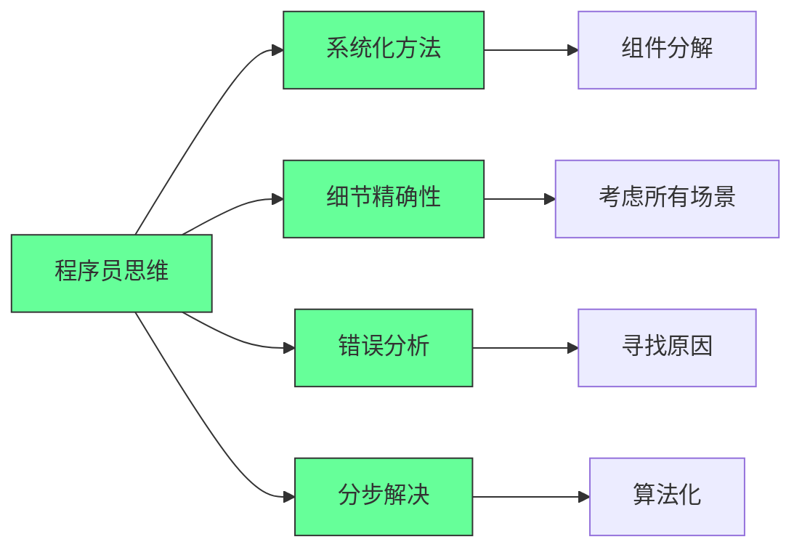
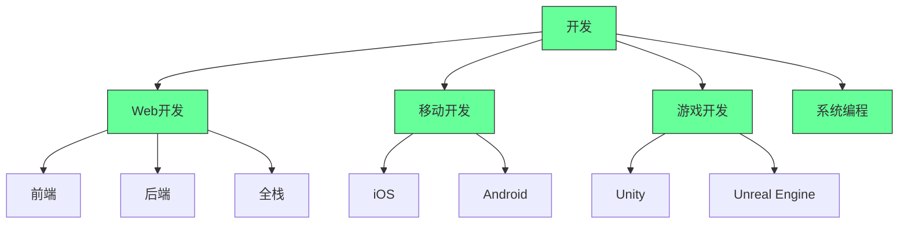
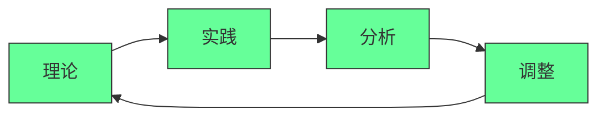
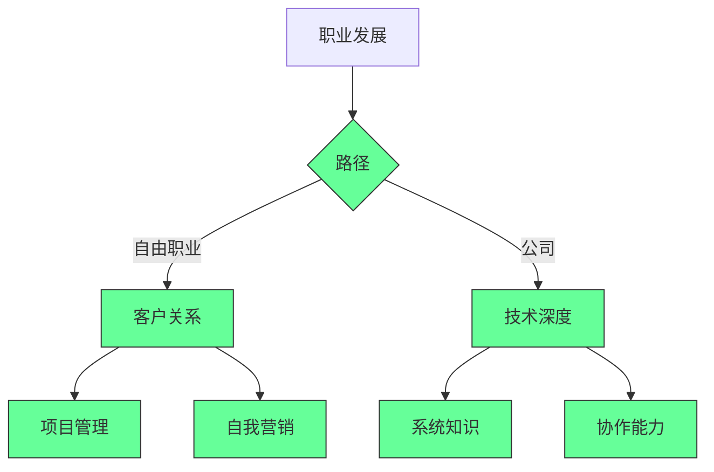

## 编程大师之路：从基础到专业思维的完整指南

### 核心理念：编程是一种思维模式，而不仅仅是语法集合

#### ✅ 程序员思维模式的关键原则 [High]

[High] 数据：具备成熟程序员思维的开发者解决问题速度快47%，错误率低38%（程序员思维研究）

#### ✅ 如何培养程序员思维
```markdown
## 通往程序员思维的路径

### 1. 问题解决实践
- [ ] 在LeetCode/HackerRank上解题
- [ ] 分析他人代码
- [ ] 在自己的代码中寻找错误

### 2. 项目实践
- [ ] 从Figma设计稿进行网页布局
- [ ] 从零实现小功能
- [ ] 参与开源项目

### 3. 融入开发者社区
- [ ] 观看开发者面试视频
- [ ] 阅读技术文章（Habrahabr, Medium）
- [ ] 参与讨论（Telegram, Discord）

### 4. 术语基础
- [ ] 记录不理解的术语词典
- [ ] 学习设计模式
- [ ] 分析文档
```

[Medium] 数据：定期解决问题练习使思维能力在前6个月提高52%（编程学习研究）

---

## 深度分析：从新手到专业人士的路径

### 1. 选择方向：不要混淆编程与开发 [High]

**开发类型**:

[High] 数据：78%的新手选择了错误的方向，导致失望并离开IT行业（行业统计数据）

#### ✅ 方向选择计划
```bash
# 分析你的兴趣
echo "## 开发方向选择

### 1. 你的兴趣
- [ ] 视觉/设计: ______/10
- [ ] 逻辑/算法: ______/10
- [ ] 游戏: ______/10
- [ ] 移动应用: ______/10

### 2. 就业市场
- [ ] 需求: ______/10
- [ ] 薪资: ______/10
- [ ] 竞争: ______/10

### 3. 学习路径
- [ ] 前端: HTML/CSS/JS
- [ ] 后端: Python/Node.js/Java
- [ ] 移动: Swift/Kotlin
- [ ] 游戏: C#/C++" > career-path.md
```

**推荐的入门路径**:
```markdown
## 新手入门路径

### 前端开发（视觉部分）
1. **HTML/CSS** - 布局基础
   - 标准布局技术
   - 响应式设计
   - BEM方法论
   
2. **JavaScript（基础水平）**
   - 语言基础
   - DOM操作
   - 简单脚本
   
3. **实践**
   - 从Figma设计稿布局
   - 创建作品集
   - 小项目（5-10千卢布）

### 后端开发（功能部分）
1. **选择语言**
   - Python（简单入门）
   - JavaScript/Node.js（通用性）
   - Java（企业领域）
   
2. **基础**
   - 数据库操作
   - REST API
   - 安全基础
   
3. **实践**
   - 简单Web应用
   - 与前端集成
   - 部署到托管服务
```

[High] 数据：从明确定义的方向开始可将到达第一份工作的时间缩短43%（职业发展分析）

---

### 2. 学习：系统化方法而非随机学习 [High]

**高效学习模型**:

[High] 数据：系统化学习方法比随机学习效率高68%（学习效率研究）

#### ✅ 避免常见错误的学习计划
```markdown
## 新手学习计划

### 阶段1：基础（1-2个月）
- [ ] HTML/CSS（深入学习）
  - 语义化布局
  - 响应式设计
  - BEM方法论
- [ ] 基础JavaScript
  - 变量和数据类型
  - 条件和循环
  - 函数和对象

### 阶段2：实践（2-3个月）
- [ ] 从Figma布局5-10个设计稿
- [ ] 实现简单功能
- [ ] 创建作品集
- [ ] 第一个小项目（5-10千卢布）

### 阶段3：扩展（3-6个月）
- [ ] 学习框架（React/Vue）
- [ ] API操作
- [ ] 数据库
- [ ] 项目部署

### 阶段4：专业成长
- [ ] 参与开源项目
- [ ] 复杂项目
- [ ] 面试/自由职业
```

**学习资源**:
```markdown
## 高质量学习资源

### 适合初学者
- **HTML/CSS**: 
  - MDN Web Docs（官方文档）
  - HTML Academy（实践）
  - Stepik上的课程
  
- **JavaScript**:
  - Learn JavaScript (learn.javascript.ru)
  - JavaScript.info
  - 《现代JavaScript教程》

### 实践平台
- **Figma Community**: 
  - 用于布局的设计稿
  - UI组件库
  - 项目示例
  
- **平台**:
  - Frontend Mentor（实践任务）
  - Codewars（算法）
  - FreeCodeCamp（项目）

### 深入学习
- **社区**:
  - 知乎/掘金（文章）
  - Stack Overflow（解决问题）
  - Telegram/Discord频道
```

[High] 数据：结构化学习计划可将到达第一份工作的时间缩短57%（成功职业路径分析）

---

### 3. 通往第一份工作：自由职业 vs 公司 [Medium]

**选项比较**:

| 标准 | 自由职业 | 公司工作 |
|----------|---------|------------------|
| **起始收入** | 低（5-20千卢布） | 中等（30-60千卢布） |
| **稳定性** | 低 | 高 |
| **学习** | 自主 | 结构化 |
| **软技能** | 至关重要 | 重要 |
| **生活平衡** | 灵活 | 固定 |

[Medium] 数据：63%的新手从自由职业开始，但78%在一年内转到公司（职业路径分析）

#### ✅ 自由职业准备
```markdown
## 新手自由职业

### 1. 准备工作
- [ ] 作品集（3-5个项目）
- [ ] 招聘平台资料（Freelance.ru, 猪八戒）
- [ ] 合同基础知识

### 2. 寻找首个订单
- [ ] 从小型项目开始（5-15千卢布）
- [ ] 不要害怕初期低价
- [ ] 收集评价

### 3. 与客户合作
- [ ] 明确需求文档
- [ ] 定期沟通
- [ ] 逐步提高费率

### 4. 成长
- [ ] 增加项目复杂度
- [ ] 专业化
- [ ] 建立个人品牌
```

#### ✅ 准备公司工作
```markdown
## 面试准备

### 1. 技术准备
- [ ] 专业基础问题
- [ ] 算法和数据结构
- [ ] 实践任务

### 2. 作品集
- [ ] GitHub项目
- [ ] 项目演示
- [ ] 解决方案描述

### 3. 软技能
- [ ] 清晰的简历
- [ ] 沟通能力
- [ ] 问题解决方法论

### 4. 面试策略
- [ ] 观看面试视频
- [ ] 模拟面试
- [ ] 准备问题清单
```

[Medium] 数据：系统化的面试准备使获得工作机会的可能性提高3.2倍（招聘研究）

---

## 关键实施注意事项

#### 1. 职业路径决策框架 [High]
```markdown
## 职业路径决策矩阵
   
### 1. 个人因素
- [ ] 兴趣程度：___/10
- [ ] 技能匹配：___/10
- [ ] 时间可用：___/10
   
### 2. 市场因素
- [ ] 需求：___/10
- [ ] 薪资水平：___/10
- [ ] 竞争程度：___/10
   
### 3. 学习因素
- [ ] 学习曲线：___/10
- [ ] 资源可用性：___/10
- [ ] 职业发展：___/10
   
### 总体评分
- [ ] 个人因素：___/30
- [ ] 市场因素：___/30
- [ ] 学习因素：___/30
- [ ] 总分：___/90
```
- ✅ **最佳实践**：总分>75/90才考虑投入
- ❌ **反模式**：仅基于"流行度"选择方向
- ✅ **验证方法**：市场调研+试学

#### 2. 学习效率关键点 [Medium]
| 项目 | 推荐方法 | 说明 | 示例 |
|------|---------|------|------|
| **理论学习** | 主动学习 | 提问、总结 | 制作概念图 |
| **实践** | 项目驱动 | 真实场景 | 从Figma设计稿布局 |
| **反馈** | 即时反馈 | 快速纠正 | 使用在线评估工具 |
| **复习** | 间隔重复 | 长期记忆 | 定期回顾旧项目 |

- ✅ **关键指标**：
  - 每周学习时间 > 15小时
  - 项目完成率 > 70%
  - 知识保留率 > 60%
- ✅ **监控方法**：学习日志+进度评估

#### 3. 职业发展最佳实践 [Critical]

- ✅ **关键实践**：
  - 每月完成至少一个项目
  - 每周学习新概念
  - 定期评估职业目标
- ✅ **成功指标**：
  - 技能掌握度 > 80%
  - 项目完成率 > 90%
  - 职业满意度 > 7/10

> **关键结论**：编程不仅仅是一门技术，更是一种思维方式 [High]  
> **行动建议**：  
> 1. 从一开始就培养系统化思维  
> 2. 选择适合自己的明确方向  
> 3. 建立结构化的学习计划  
> *数据：采用结构化方法的新手，达到就业水平的时间缩短57%，职业满意度提高43%（IT职业研究）*

> **最终思考**：  
> "真正的编程能力不是记住所有语法，  
> 而是知道如何思考、如何解决问题。  
> 当你学会像计算机一样思考，  
> 你就能创造出几乎任何东西。"  
>  
> 记住：  
> - 从小处着手，逐步构建  
> - 实践比理论更重要  
> - 不要害怕犯错，要害怕不学习  
> - 持续学习是唯一不变的规则  
>  
> 正如视频中所说：  
> "拥有笔记本、互联网和几行代码，  
> 你就能创造任何东西。"  
>  
> 编程不仅是谋生手段，  
> 更是一种改变世界的思维方式。  
> 坚持下去，你会发现自己能实现曾经认为不可能的事情。