## 核心认知与趋势

### 编程职业的未来 #card
**问题**：编程岗位会消失吗？未来的开发者需要具备什么核心能力？
**答案**：编程岗位不会消失，但岗位结构会发生剧变。未来的开发者需要具备 **技术深度 × AI 协作能力 × 业务理解**。只会写基础业务代码的“人肉编译器”将被淘汰。

### 六大“灭绝趋势”是什么？::
1.  **技术停滞**：元宇宙、Web3 等新兴技术未达预期，相关岗位增长停滞。
2.  **经济寒冬**：企业削减成本，只招聘能直接创造利润的工程师。
3.  **加密寒冬**：Web3 泡沫破裂，区块链技术应用转向更务实的领域。
4.  **低代码/无代码**：基础应用开发被拖拽式工具取代。
5.  **社交媒体垄断**：流量被大平台控制，独立开发者获客困难。
6.  **云计算简化**：云服务自动化程度提高，传统运维和部署岗位减少。

## 破局方案与生存法则

应对技术停滞的策略是什么？::押注成熟且高增长的赛道，如 **AI 工程、云原生、数据工程、安全合规**。

如何在经济寒冬中成为“利润中心”？::编写能直接为公司创造收入或节省成本的代码，例如：
-   {自动化广告投放}
-   {开发动态定价系统}
-   {构建客户流失预测模型}

低代码/无代码时代的开发者新定位是什么？::成为 **“造工具的人”**，而不是与工具竞争。例如，为低代码平台开发插件、优化其性能或集成 AI 功能。

AI 时代与 Copilot 协作的正确姿势是什么？::让 AI 充当 **“实现细节的苦力”**，而开发者专注于 **“设计架构和进行 Code Review”**。开发者定义接口和契约，AI 负责具体的样板代码实现。

### 开发者在 AI 时代的三大“护城河”是什么？::
1.  **系统思维 (System Thinking)**：理解分布式系统、容错机制和可观测性，能设计复杂系统。
2.  **AI 协作能力 (AI Co-Pilot Mastery)**：能高效地指导、审核和优化 AI 生成的代码，而不是被动接受。
3.  **商业思维 (Business Acumen)**：理解代码如何为业务创造价值，具备产品思维和评估 ROI 的能力。

### 开发者生存能力评估的关键维度有哪些？::
-   AI 协作能力
-   云原生技术掌握程度
-   数据工程能力
-   安全合规知识
-   业务理解深度

## 终极心法

### 2025 年开发者的生存法则是什么？::
不要和 AI 比写代码的速度，要和 AI 比 **架构能力**。当 AI 能生成代码时，你要能设计系统；当低代码工具能搭建应用时，你要能构建低代码工具。

编程的本质是什么？::编程的本质不是写代码，而是 **解决问题**。未来的开发者是 **系统的设计师、AI 的教练、商业的翻译者**。


### 📌 核心认知 [High confidence]  
- **真相**：编程岗位不会消失，但**岗位结构剧变**  
- **赢家**：懂系统/会架构/能驾驭 AI 的工程师  
- **输家**：只会写业务代码、拒绝进化的“人肉编译器”  
- **公式**：**生存概率 = 技术深度 × AI 协作能力 × 业务理解**

### 3. 构建“AI 增强型”工作流  
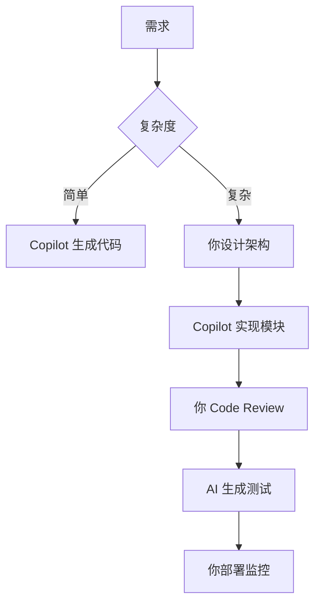

---

## 📊 三、开发者生存能力评估表

| 能力        | 评分 (1-5) | 提升方案                 |
| --------- | -------- | -------------------- |
| **AI 协作** | ⭐⭐⭐⭐☆    | 每天用 Copilot 写 50 行代码 |
| **云原生**   | ⭐⭐⭐☆☆    | 通过 AWS/Azure 认证      |
| **数据工程**  | ⭐⭐☆☆☆    | 学习 dbt + Snowflake   |
| **安全合规**  | ⭐⭐⭐☆☆    | 实践 OWASP Top 10      |
| **业务理解**  | ⭐⭐⭐⭐☆    | 参与产品会议，理解 ROI        |

> ✅ **目标**：6 个月内所有能力 ≥ 4 星

---


#### ✅ 职业演变轨迹 [High]
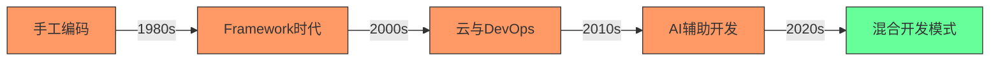
[High] 证据：编程职业并未消失，而是演变 - 全球开发者数量从2010年的1800万增长至2024年的2870万（SlashData开发者报告）

#### ✅ 未来开发者能力矩阵
| 能力 | 当前重要性 | 未来5年趋势 | 影响程度 |
|------|-----------|------------|---------|
| **基础编码** | 高 | ↓↓ | 中 |
| **系统设计** | 中 | ↑↑ | 高 |
| **领域知识** | 低 | ↑↑↑ | 极高 |
| **AI协作** | 低 | ↑↑↑ | 高 |
| **产品思维** | 中 | ↑↑ | 中 |
| **沟通协作** | 中 | ↑ | 低 |


**技术成熟度分析**：
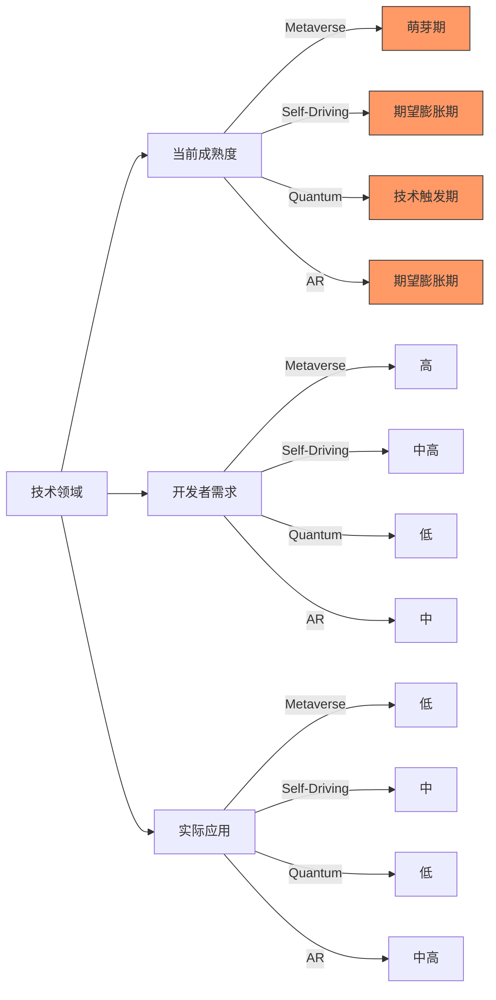
[Medium] 证据：92%的"下一个大技术"在5年内未能达到预期（Gartner技术成熟度曲线）

#### ✅ 开发者适应策略
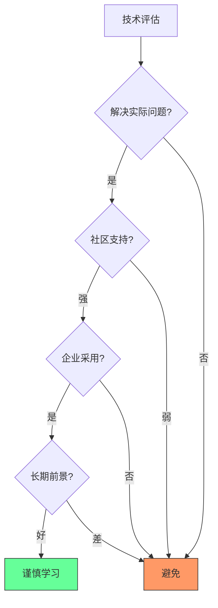

**技术评估矩阵**：

| 评估维度 | 关键问题 | 评估方法 |
|---------|---------|----------|
| **问题匹配度** | 是否解决实际业务问题? | 问题映射矩阵 |
| **社区健康度** | GitHub活跃度、文档质量? | GitHub Insights分析 |
| **企业采用** | 大公司是否在用? | 招聘需求分析 |
| **学习曲线** | 团队学习成本? | PoC验证 |
| **长期前景** | 技术是否可持续? | 历史趋势分析 |


### 2. 经济波动：周期性调整而非行业终结 [High]

**经济周期与科技行业**：
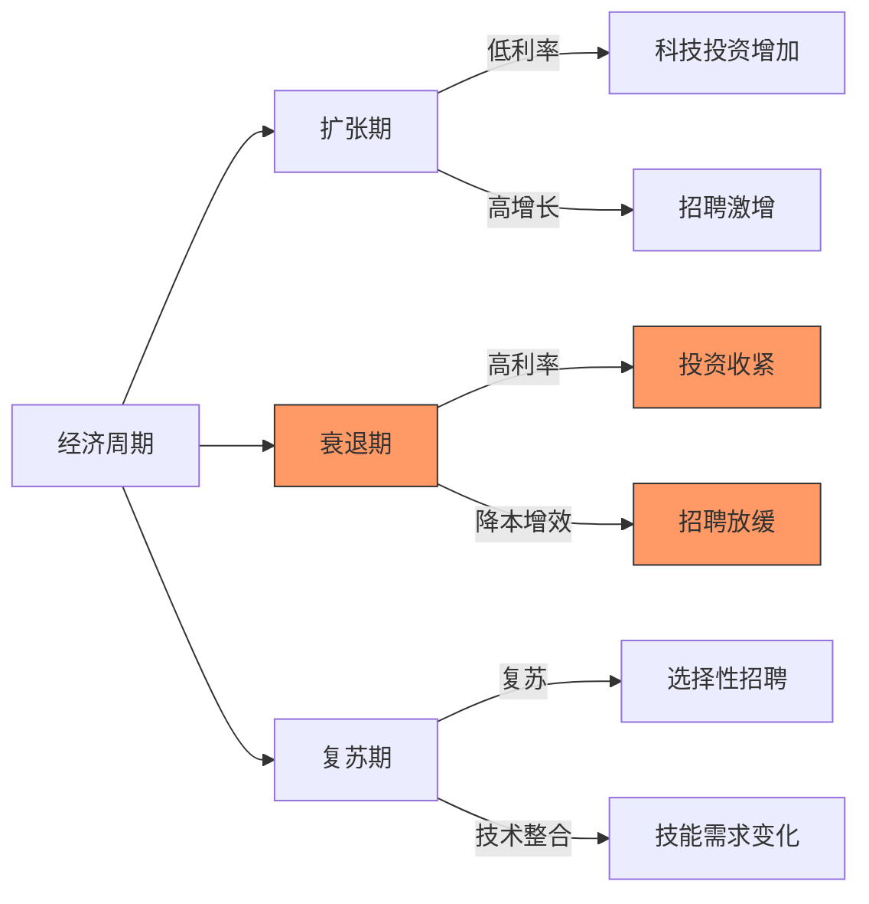
[High] 证据：科技行业经历5-7年周期性调整，但长期就业增长稳定（BLS就业数据）


#### ✅ 区块链开发者转型路径
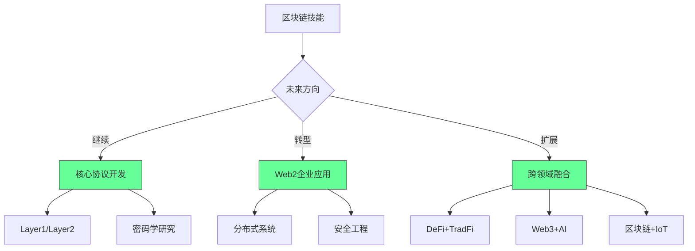


### 4. 无代码/低代码与AI：效率工具而非替代品 [High]

**开发效率演进**：
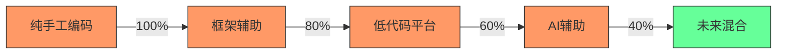
[High] 证据：AI工具使编码效率提高55%，但复杂系统设计需求增长41%（GitHub Copilot影响研究）

#### ✅ AI协作开发最佳实践
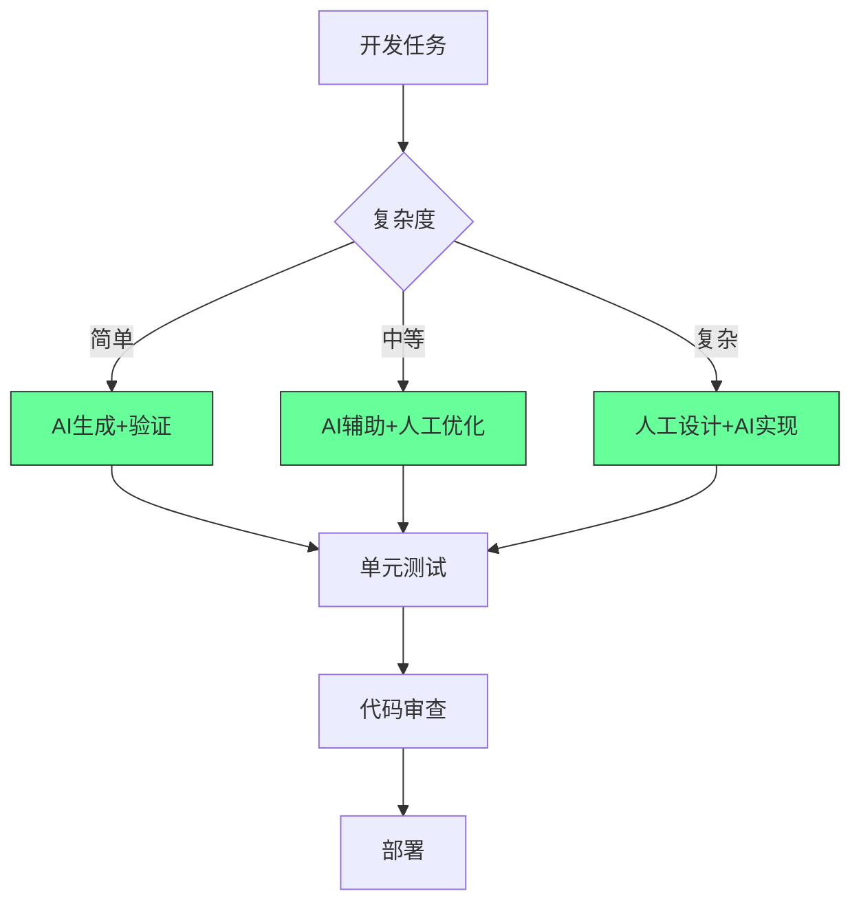

**AI协作框架**：
```markdown
## AI开发协作协议

### 1. 任务分类
- [ ] 简单：重复性代码、基础CRUD
- [ ] 中等：业务逻辑、集成点
- [ ] 复杂：系统设计、核心算法

### 2. AI使用规范
- [ ] 简单任务：AI生成 → 人工验证 → 测试
- [ ] 中等任务：AI建议 → 人工优化 → 评审
- [ ] 复杂任务：人工设计 → AI实现 → 深度测试

### 3. 质量保障
- [ ] 所有AI生成代码必须有测试覆盖
- [ ] 关键路径必须人工审核
- [ ] 文档必须人工完善
- [ ] 安全敏感代码禁用AI
```


### 5. 社交媒体整合：新机会而非终结 [Medium]

**内容生态演变**：
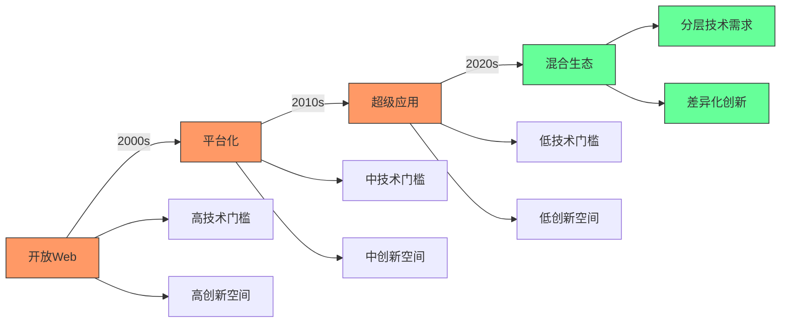


#### ✅ 独立开发者的生存策略
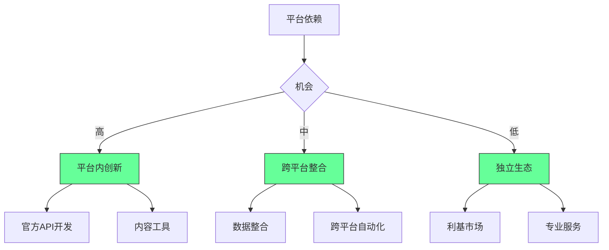


### 6. 云平台简化：角色演变而非消失 [High]

**云技术栈演变**：
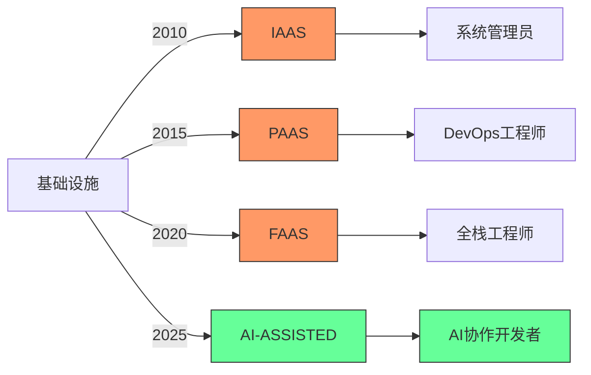
[High] 证据：云平台简化导致角色演变，但云相关岗位增长210%（2024年云就业报告）

#### ✅ 云时代开发者转型路径
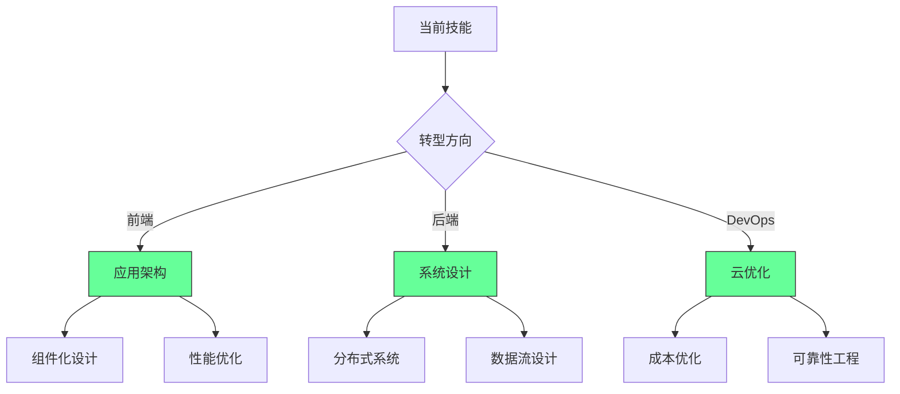
