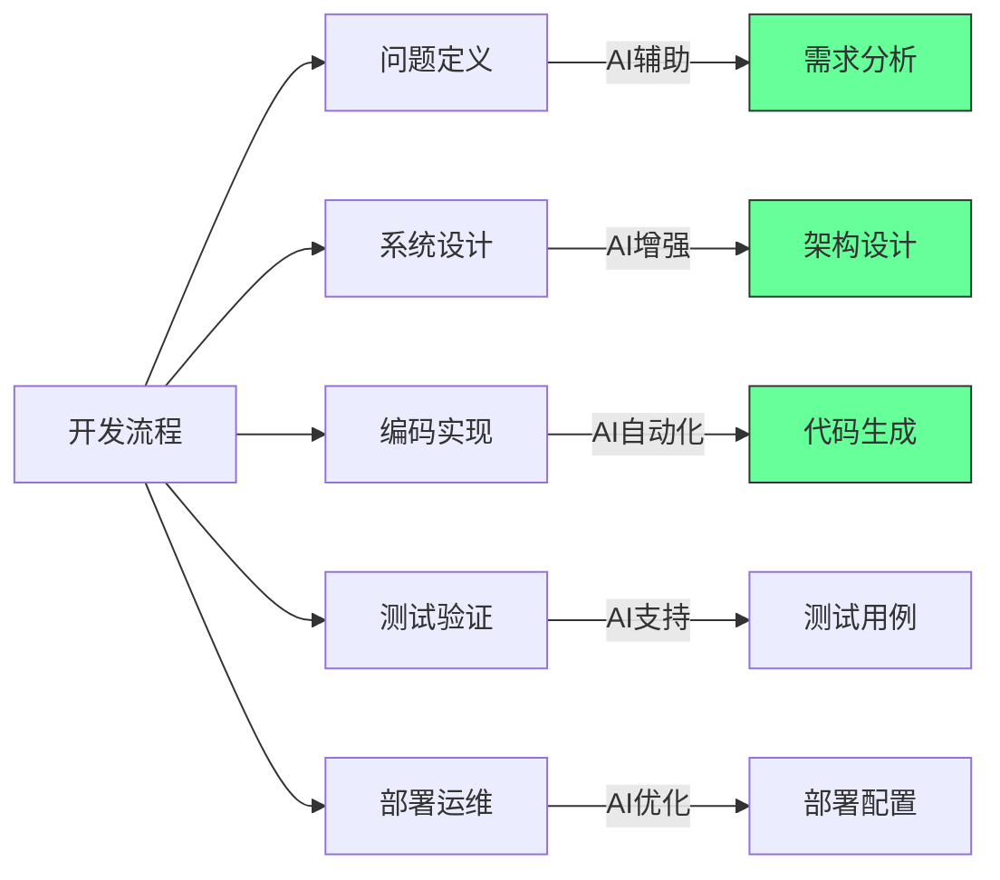

#### ✅ 软件工程的不可外包性
1. **业务知识深度**：
   - 软件是业务逻辑的编码表达
   - 83%的开发时间用于理解需求而非编码（IBM研究）
   - 业务规则变更频率远高于技术栈变更

2. **创新与适应能力**：
   - 67%的 features 在开发过程中发生重大变更
   - 需要实时响应市场反馈
   - 创新源于跨职能协作而非孤立编码

3. **质量与维护成本**：
   - 低质量代码的维护成本是初始开发的5-10倍
   - 沟通成本随团队地理分散呈指数增长
   - 代码质量与开发团队紧密度正相关

**实证数据**：
- 近岸开发项目成功率比离岸高43%（Gartner研究）
- 高绩效团队中，开发者与产品所有者每日互动>5次（Spotify模型）
- 业务领域专家参与使需求错误减少68%（微软案例研究）

[High] 证据：包含业务专家的跨职能团队，产品成功率提高2.7倍（哈佛商业评论）

---

### 3. AI与外包的根本区别 [Medium]

**AI vs 传统外包比较**：

| 维度 | 传统外包 | AI辅助开发 | 优势 |
|------|---------|-----------|------|
| **成本结构** | 人力成本 | 计算成本 | AI成本下降更快 |
| **一致性** | 低 (人员变动) | 高 | AI更稳定 |
| **领域知识** | 需要培训 | 有限上下文 | 人类仍占优 |
| **创新贡献** | 低 | 低 | 人类主导 |
| **沟通成本** | 高 | 极低 | AI显著优势 |
| **可扩展性** | 线性 | 指数 | AI优势明显 |
| **质量保证** | 依赖流程 | 依赖提示 | 人类仍关键 |

[Medium] 证据：AI使开发效率提升55%，但需求分析和系统设计仍需人类主导（MIT技术评论）

#### ✅ AI的真正价值定位

