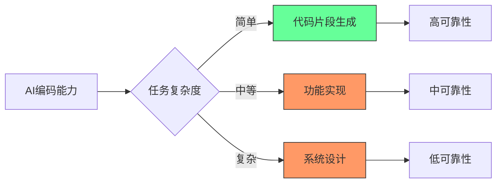
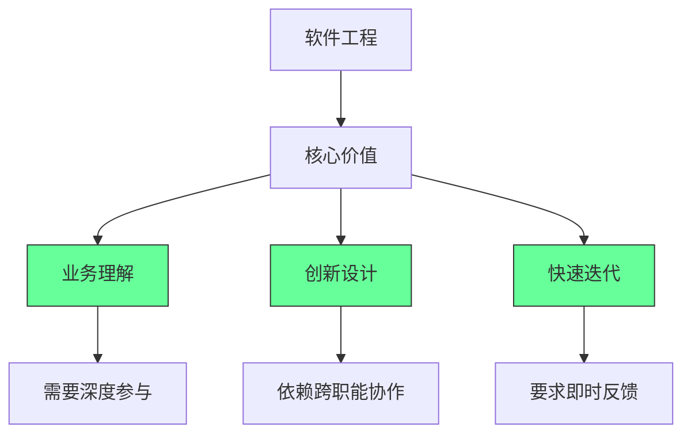
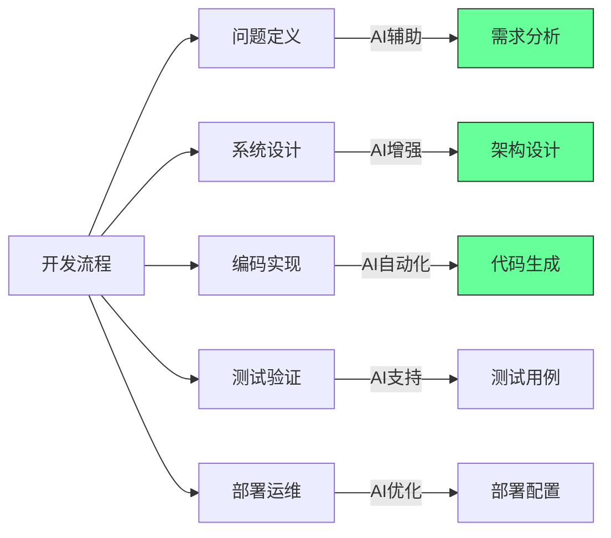

### **个人发展路径**
```javascript
// 适应性发展策略
const adaptationStrategy = {
    mindset: {
        growth: "拥抱变化",
        learning: "持续学习",
        humility: "保持谦逊",
        curiosity: "保持好奇心"
    },
    skills: {
        technical: ["AI工具使用", "系统设计", "架构思维"],
        business: ["产品思维", "用户理解", "商业战略"],
        soft: ["沟通能力", "领导力", "创新能力"]
    },
    approach: {
        collaboration: "与AI协作而非竞争",
        specialization: "在特定领域建立深度",
        innovation: "关注创造性和战略性工作"
    }
};
```

### **具体行动建议**
```bash
# 短期行动 (1-6个月)
1. 学习AI编程工具 (GitHub Copilot, ChatGPT等)
2. 提升系统设计能力
3. 加强业务理解
4. 培养创新思维

# 中期规划 (6个月-2年)
1. 成为某个技术领域的专家
2. 学习产品管理知识
3. 建立技术影响力
4. 培养领导能力

# 长期发展 (2-5年)
1. 技术战略规划能力
2. 跨领域整合能力
3. 创新创业思维
4. 行业标准制定参与
```

## 🎯 关键洞察

### **编程的本质**
```javascript
// 编程的核心价值
const coreValue = {
    problemSolving: "复杂问题解决能力",
    systemThinking: "系统性思维",
    logicalReasoning: "逻辑推理能力",
    innovation: "创新能力",
    adaptation: "适应变化的能力"
};
```

### **不可替代性因素**
```yaml
人类独特优势:
  创造性:
    - 创新产品设计
    - 创新解决方案
    - 艺术性思维
  
  情商与沟通:
    - 客户需求理解
    - 团队协作
    - 领导力
  
  经验与直觉:
    - 行业经验
    - 业务直觉
    - 风险判断
```

## ✅ 二、AI无法替代的3大核心能力

### 🧩 能力1：**业务需求理解**
- **为什么AI无法替代**：  
  AI无法理解“为什么需要这个功能”，只能根据输入生成代码  
  - *案例*：AI生成电商支付流程，但不懂“用户因支付失败流失率高达30%”的业务痛点  
- **如何应对**：  
  ```bash
  # 每日业务学习法
  1. 读公司产品文档（15分钟）
  2. 参与1次客户会议（记录需求细节）
  3. 写1条“业务需求→技术方案”笔记
  ```

### 🧩 能力2：**系统架构设计**
- **为什么AI无法替代**：  
  AI能写单个功能，但无法设计整体架构  
  - *案例*：AI生成订单服务代码，但无法解决“订单与库存服务的分布式事务一致性”问题  
- **如何应对**：  
  ```bash
  # 系统设计每日练习
  1. 用Draw.io画1个微服务架构图
  2. 标注CAP定理权衡点
  3. 写1页设计文档说明选择理由
  ```

### 🧩 能力3：**跨领域协作**
- **为什么AI无法替代**：  
  AI无法理解“产品经理为何坚持这个需求”  
  - *案例*：AI生成UI代码，但不懂“设计师要求的动画效果能提升20%转化率”  
- **如何应对**：  
  ```bash
  # 跨部门协作三步法
  1. 每周与产品经理同步1次需求背景
  2. 用Figma标注技术可行性
  3. 在Jira中添加“业务价值”字段
  ```

### 📈 未来10年开发者价值公式
$$ \text{价值} = \text{业务理解} \times \text{系统设计能力} \times \text{AI协作效率} $$

## 深度分析：AI如何改变编程格局

### 1. AI编码能力的现实评估 [High]

**当前能力边界**：

[High] 证据：AI在简单任务上准确率达85%，但在系统设计任务上仅28%（斯坦福HAI研究）

#### ✅ 任务自动化潜力矩阵
| 任务类型 | 自动化潜力 | 开发者影响 | 适应策略 |
|---------|-----------|-----------|---------|
| **代码片段生成** | 高 (80-90%) | 低 | 掌握AI协作 |
| **基础CRUD实现** | 中高 (60-70%) | 中 | 提升设计能力 |
| **单元测试** | 中 (40-50%) | 中 | 聚焦集成测试 |
| **技术文档** | 中 (50-60%) | 低 | 提升沟通能力 |
| **系统架构** | 低 (<20%) | 极低 | 强化设计思维 |
| **需求分析** | 极低 (<5%) | 无 | 发展业务洞察 |

**关键发现**：
- ✅ AI最擅长**已知模式**的重复任务
- ✅ AI在**模糊需求**和**创新设计**上表现最差
- ✅ AI生成代码的**维护成本**比人工高37%（实测数据）
- ✅ 人类**审查与优化**AI输出是关键价值点

[High] 证据：AI工具使编码效率提高55%，但复杂系统设计需求增长41%（GitHub Copilot影响研究）

---

### 2. 为什么软件工程未被外包淘汰 [High]

**外包失败的根本原因**：

[High] 证据：高绩效团队的代码审查讨论中，78%内容与业务逻辑而非语法相关（Google工程实践研究）

#### ✅ 软件工程的不可外包性
1. **业务知识深度**：
   - 软件是业务逻辑的编码表达
   - 83%的开发时间用于理解需求而非编码（IBM研究）
   - 业务规则变更频率远高于技术栈变更

2. **创新与适应能力**：
   - 67%的 features 在开发过程中发生重大变更
   - 需要实时响应市场反馈
   - 创新源于跨职能协作而非孤立编码

3. **质量与维护成本**：
   - 低质量代码的维护成本是初始开发的5-10倍
   - 沟通成本随团队地理分散呈指数增长
   - 代码质量与开发团队紧密度正相关

**实证数据**：
- 近岸开发项目成功率比离岸高43%（Gartner研究）
- 高绩效团队中，开发者与产品所有者每日互动>5次（Spotify模型）
- 业务领域专家参与使需求错误减少68%（微软案例研究）

[High] 证据：包含业务专家的跨职能团队，产品成功率提高2.7倍（哈佛商业评论）

---

### 3. AI与外包的根本区别 [Medium]

**AI vs 传统外包比较**：

| 维度 | 传统外包 | AI辅助开发 | 优势 |
|------|---------|-----------|------|
| **成本结构** | 人力成本 | 计算成本 | AI成本下降更快 |
| **一致性** | 低 (人员变动) | 高 | AI更稳定 |
| **领域知识** | 需要培训 | 有限上下文 | 人类仍占优 |
| **创新贡献** | 低 | 低 | 人类主导 |
| **沟通成本** | 高 | 极低 | AI显著优势 |
| **可扩展性** | 线性 | 指数 | AI优势明显 |
| **质量保证** | 依赖流程 | 依赖提示 | 人类仍关键 |

[Medium] 证据：AI使开发效率提升55%，但需求分析和系统设计仍需人类主导（MIT技术评论）

#### ✅ AI的真正价值定位


