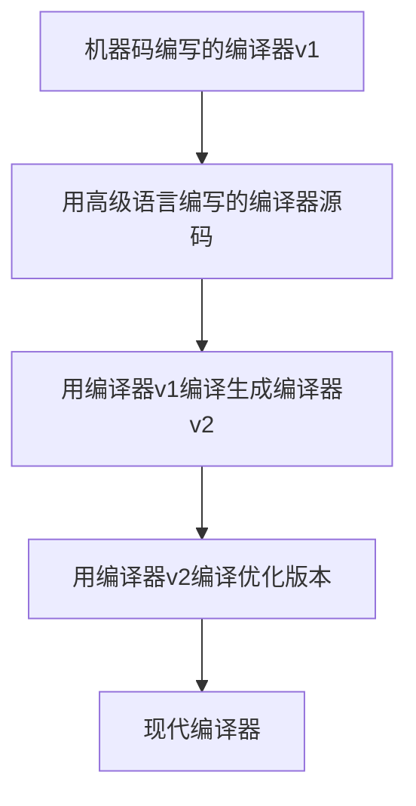

# 编译器工作原理解析

## 🎯 核心概念

### **程序的两种形态**
1. **源代码 (Source Code)**: 人类可读的代码
2. **机器码 (Machine Code)**: 计算机可执行的二进制指令

## 🏗️ 编译过程详解

### **编译器的四大步骤**


#### **1. 词法分析 (Tokenization)**
```python
# 源代码
int x = 3;

# 词法分析结果
[TOKEN_TYPE: int, VALUE: "int"]
[TOKEN_TYPE: IDENTIFIER, VALUE: "x"] 
[TOKEN_TYPE: ASSIGN, VALUE: "="]
[TOKEN_TYPE: NUMBER, VALUE: "3"]
[TOKEN_TYPE: SEMICOLON, VALUE: ";"]
```

#### **2. 语法分析 (Parsing)**
构建**解析树 (Parse Tree)**，确定代码结构：

```
Program
├── Declaration
│   ├── Type: int
│   ├── Identifier: x
│   └── Assignment
│       └── Value: 3
```

#### **3. 语义分析 (Semantic Analysis)**
记录上下文信息：
- 变量名和类型
- 函数定义
- 作用域信息

#### **4. 代码生成 (Code Generation)**
将高级语言转换为机器指令。

## 🖥️ 计算机底层原理

### **处理器能做什么？**
```assembly
; 处理器的基本能力
1. 读写内存
2. 执行数学运算
3. 条件跳转
4. 逻辑运算
```

### **机器码示例**
```binary
; 变量赋值 x = 3 的机器码
10110000 00000011  ; MOV AX, 3
10001001 00000110  ; MOV [x], AX
```

### **汇编代码表示**
```assembly
; 更易读的汇编形式
mov eax, 3      ; 将3移动到寄存器eax
mov [x], eax    ; 将eax的值存储到变量x的位置
```

## 🎯 高级特性如何实现？

### **条件语句 (If Statement)**
```c
// 源代码
if (x > 0) {
    x = x + 1;
}
```

```assembly
; 汇编实现
cmp dword [x], 0    ; 比较x和0
jle skip            ; 如果x<=0，跳过
add dword [x], 1    ; x = x + 1
skip:
```

### **循环语句 (While Loop)**
```c
// 源代码
while (x > 0) {
    x = x - 1;
}
```

```assembly
; 汇编实现
loop_start:
    cmp dword [x], 0    ; 比较x和0
    jle loop_end        ; 如果x<=0，结束循环
    sub dword [x], 1    ; x = x - 1
    jmp loop_start      ; 跳转到循环开始
loop_end:
```

### **函数调用**
```c
// 源代码
int add(int a, int b) {
    return a + b;
}
```

```assembly
; 汇编实现
add_function:
    push ebp            ; 保存基址指针
    mov ebp, esp        ; 设置新的基址指针
    mov eax, [ebp+8]    ; 获取参数a
    add eax, [ebp+12]   ; 加上参数b
    pop ebp             ; 恢复基址指针
    ret                 ; 返回结果
```

## 🌍 跨平台兼容性问题

### **平台相关性挑战**
```yaml
不同平台的差异:
  处理器架构:
    - x86
    - ARM
    - RISC-V
  操作系统:
    - Windows
    - Linux
    - macOS
  指令集:
    - 不同的机器指令
```

### **解决方案**

#### **1. 本地编译**
```bash
# 为不同平台分别编译
gcc -o program_linux program.c    # Linux
gcc -o program_windows program.c  # Windows  
gcc -o program_mac program.c      # macOS
```

#### **2. 字节码方案 (如Java)**
```java
// Java源代码
public class Hello {
    public static void main(String[] args) {
        System.out.println("Hello World");
    }
}

// 编译为字节码
javac Hello.java  # 生成 Hello.class

// 跨平台运行
java Hello        # JVM转换为具体平台机器码
```

#### **3. 解释执行**
```python
# Python脚本直接解释执行
python script.py  # 运行时转换为机器码
```

## ⚡ 编译器的编译

### **自举 (Bootstrapping)**


### **历史演进**
1. **早期**: 手写机器码
2. **发展**: 汇编语言 → 高级语言编译器
3. **现代**: 自举编译器生态系统

## 🛠️ 现代开发工具链

### **完整的构建过程**
```bash
# 预处理 → 编译 → 汇编 → 链接
gcc -E source.c -o preprocessed.i    # 预处理
gcc -S preprocessed.i -o assembly.s  # 编译为汇编
gcc -c assembly.s -o object.o        # 汇编为目标文件
gcc object.o -o executable           # 链接生成可执行文件
```

### **现代IDE的隐藏复杂性**
```python
# 点击"运行"按钮背后的实际过程
1. 保存文件
2. 预处理源代码
3. 编译为中间代码
4. 优化代码
5. 生成目标代码
6. 链接库文件
7. 生成可执行文件
8. 启动调试器
9. 运行程序
```

## 💡 关键要点总结

### **编译器的核心价值**
- **抽象层**: 将人类思维转换为机器指令
- **效率提升**: 自动化繁琐的机器码编写
- **错误检查**: 在编译时发现语法和逻辑错误
- **优化**: 生成高效的机器码

### **现代开发的优势**
```yaml
相比早期编程的优势:
  开发效率:
    - 高级语言抽象
    - IDE智能提示
    - 自动补全
  跨平台:
    - 虚拟机技术
    - 容器化部署
    - 云原生支持
  工具生态:
    - 版本控制系统
    - 自动化构建
    - 持续集成
```

编译器是计算机科学中最重要的发明之一，它让程序员能够用接近自然语言的方式编写程序，然后自动转换为计算机能够执行的精确指令。这种自动化不仅提高了开发效率，也为现代软件工程的复杂性提供了基础支撑。