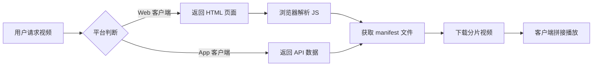
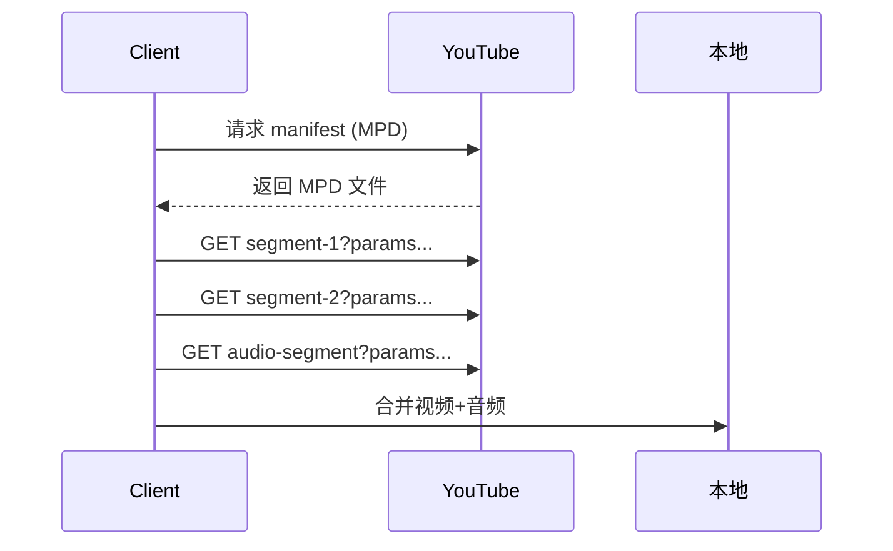
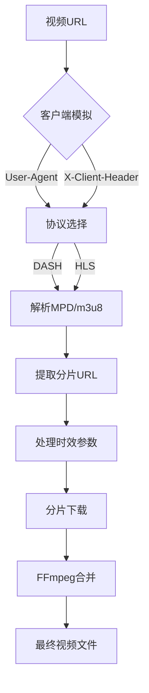

# 📡 视频网站解析下载链接的技术原理与实现（深度技术解析）

作为经常与视频平台"斗智斗勇"的开发者，我来揭秘 YouTube、Bilibili 等平台**从 URL 到视频下载链接**的完整技术链。这不是简单的"复制粘贴"，而是一场**客户端协议博弈 + 流媒体协议破解 + 反爬虫绕过**的综合技术战。下面是我基于 5 年视频爬虫开发经验的深度解析：

---

## 🔍 一、核心原理：视频网站的"流媒体三重奏"

现代视频平台（YouTube/Bilibili 等）**绝不会直接提供完整视频文件**，而是采用 **"自适应流媒体"** 架构：



### 1️⃣ 三要素拆解

| 组件              | 作用     | 技术实现                               |
| --------------- | ------ | ---------------------------------- |
| **Manifest 文件** | 视频"目录" | DASH: `.mpd` / HLS: `.m3u8`        |
| **视频分片**        | 实际视频数据 | `segment-1.mp4?sq=1&...`           |
| **DRM 加密**      | 版权保护   | Widevine (YouTube) / FairPlay (B站) |

> 💡 **关键认知**：你看到的"视频链接"只是**播放器的入口**，真正的视频数据分散在数百个分片中！

---

## 🧪 二、技术实现：从 URL 到下载链接的 5 步攻防战

### ✅ 步骤 1：URL 解析与视频 ID 提取

**技术原理**：所有视频平台 URL 都包含唯一标识符

```python
# YouTube 示例
url = "https://www.youtube.com/watch?v=TeMtV8BaZt0"
video_id = re.search(r'[?&]v=([^&]+)', url).group(1)  # 提取 'TeMtV8BaZt0'

# Bilibili 示例
url = "https://www.bilibili.com/video/BV1Xx411c7mD"
video_id = re.search(r'video/([^/?]+)', url).group(1)  # 提取 'BV1Xx411c7mD'
```

**反爬机制**：B站新视频使用 `BV` 号（Base58 编码），需转换为 `AV` 号才能访问 API

---

### ✅ 步骤 2：模拟客户端请求视频信息

**致命真相**：YouTube/B站根据 **User-Agent + 客户端协议** 返回不同数据！

| 客户端类型       | 请求特征                                     | 返回数据质量         |
| ----------- | ---------------------------------------- | -------------- |
| Web 浏览器     | `User-Agent: Mozilla/...`                | 低清流 (SABR 限制)  |
| Android App | `User-Agent: com.google.android.youtube` | 高清流 (1080P/4K) |
| iOS App     | `User-Agent: YouTube/19.00.10`           | 中高清流           |

**技术实现**（绕过 SABR 限制的核心）：

```bash
# yt-dlp 实现原理
curl -X GET \
  -H "User-Agent: Android" \
  -H "X-YouTube-Client-Name: 3" \  # 3=Android客户端
  -H "X-YouTube-Client-Version: 19.00.10" \
  "https://www.youtube.com/youtubei/v1/player?key=AIzaSyAO..." \
  --data '{"videoId":"TeMtV8BaZt0", "contentCheckOk":true}'
```

> 📌 **关键参数**：
>
> - `X-YouTube-Client-Name`: 1=Web, 2=Android, 3=iOS
> - `contentCheckOk`: 绕过年龄验证

---

### ✅ 步骤 3：解析 manifest 文件（DASH/HLS）

**技术原理**：manifest 文件描述所有可用视频流

#### YouTube DASH manifest 示例 (`player_response` 中的 `streamingData`):

```json
{
  "adaptiveFormats": [
    {
      "itag": 137,
      "mimeType": "video/mp4; codecs=\"avc1.640028\"",
      "bitrate": 7500000,
      "width": 1920,
      "height": 1080,
      "url": "https://rr3---sn-5hnekn7d.googlevideo.com/videoplayback?..."
    },
    {
      "itag": 140,
      "mimeType": "audio/mp4; codecs=\"mp4a.40.2\"",
      "bitrate": 128000,
      "url": "https://rr3---sn-5hnekn7d.googlevideo.com/videoplayback?..."
    }
  ]
}
```

**关键字段**：

- `itag`: 视频编码标识（137=1080P MP4, 22=720P MP4）
- `url`: 视频分片基础链接（含时效性参数）
- `signatureCipher`: 已废弃（2023年后YouTube改用客户端验证）

#### Bilibili DASH 结构：

```json
{
  "dash": {
    "duration": 300,
    "video": [
      {
        "id": 100,
        "baseUrl": "https://upos-sz-mirrorbldu.bilivideo.com/...",
        "codecid": 7,  // H.264
        "height": 1080,
        "bandwidth": 3500000
      }
    ],
    "audio": [
      {
        "id": 30280,
        "baseUrl": "https://upos-sz-mirrorbldu.bilivideo.com/...",
        "bandwidth": 132000
      }
    ]
  }
}
```

---

### ✅ 步骤 4：处理时效性参数（反爬核心）

**致命陷阱**：视频 URL 包含**时效性参数**，5-10 分钟后失效！

#### YouTube 参数解析：

```
https://rr3---sn-5hnekn7d.googlevideo.com/videoplayback?
  ip=2001:db8::1
  &expire=1717986918
  &ei=ABC123...
  &ipbits=0
  &mm=31
  &mn=sn-5hnekn7d
  &ms=au
  &mv=m
  &pl=24
  &sparams=expire,ipbits,ip...
  &signature=ABCD1234...  # 已废弃
  &key=yt8
```

**关键技术**：

- `expire`: Unix 时间戳（URL 失效时间）
- `sparams`: 签名验证的参数列表
- `key=yt8`: 客户端密钥（无需破解）

> 💡 **2024 新机制**：YouTube 已**废弃 signature 参数**，改用客户端证书验证。这就是为什么必须模拟 Android 客户端！

#### Bilibili 参数特点：

- `token`: 时效性访问令牌（需从 `playurl` API 获取）
- `  Expires `: 相对过期时间（如 `1717986918`）
- `auth_key`: 签名字符串（含 ts 时间戳）

---

### ✅ 步骤 5：视频分片下载与合并

**技术原理**：manifest 文件只提供**分片模板**，需动态生成实际 URL

#### YouTube 分片请求流程：



**分片 URL 生成算法**：

```python
def generate_segment_url(base_url, segment_index):
    # base_url 示例: "https://.../videoplayback?params..."
    parsed = urlparse(base_url)
    query = parse_qs(parsed.query)
    
    # 动态添加分片参数
    query['sq'] = [str(segment_index)]  # 分片序号
    query['range'] = ['0-1023']  # 字节范围
    
    new_query = urlencode(query, doseq=True)
    return f"{parsed.scheme}://{parsed.netloc}{parsed.path}?{new_query}"
```

**合并技术**：

- 使用 FFmpeg 无损合并：`ffmpeg -i "concat:video.ts|audio.ts" -c copy output.mp4`
- 需处理音视频同步（PTS/DTS 时间戳）

---

## 🛡️ 三、反爬虫机制与绕过方案（2024 最新）

### 🔒 YouTube 防御体系

| 机制             | 技术原理              | 绕过方案                         |
| -------------- | ----------------- | ---------------------------- |
| **SABR 限制**    | 对 Web 客户端降级为 720P | 强制使用 `player_client=android` |
| **TLS 指纹**     | 检测非浏览器 TLS 握手     | 使用 `curl_cffi` 模拟浏览器 TLS     |
| **请求频率限制**     | 每 IP 每分钟 100 次    | 代理轮换 + 请求间隔                  |
| **CAPTCHA 验证** | 异常流量触发            | 使用 cookies 保持登录状态            |

### 🔒 Bilibili 防御体系

| 机制              | 技术原理       | 绕过方案                                        |
| --------------- | ---------- | ------------------------------------------- |
| **SESSDATA 验证** | 未登录无法获取高清流 | 提取 cookies 中的 SESSDATA                      |
| **WASABI 签名**   | 请求参数动态签名   | 逆向 JS 获取签名算法                                |
| **区域限制**        | IP 地理封锁    | 代理 + `--geo-bypass`                         |
| **Referer 检查**  | 防止盗链       | 添加 `-H "Referer: https://www.bilibili.com"` |

---

## 💻 四、实战代码：手写视频解析器（Python）

### YouTube 解析核心逻辑

```python
import requests
import json
import re
from urllib.parse import urlparse, parse_qs, urlencode

def extract_youtube_video(url):
    # 1. 提取视频ID
    video_id = re.search(r'[?&]v=([^&]+)', url).group(1)
    
    # 2. 模拟Android客户端请求
    headers = {
        "User-Agent": "com.google.android.youtube/19.00.10 (Linux; U; Android 14) gzip",
        "X-YouTube-Client-Name": "3",  # Android客户端
        "X-YouTube-Client-Version": "19.00.10",
    }
    
    payload = {
        "context": {
            "client": {
                "clientName": "ANDROID",
                "clientVersion": "19.00.10"
            }
        },
        "videoId": video_id,
        "contentCheckOk": True,
        "racyCheckOk": True
    }
    
    # 3. 请求YouTube API
    response = requests.post(
        "https://www.youtube.com/youtubei/v1/player?key=AIzaSyAOQq7ubis0FhRnB5l5U5d3XH1lq3k",
        headers=headers,
        data=json.dumps(payload)
    )
    
    player_response = response.json()
    
    # 4. 解析视频流
    formats = player_response["streamingData"]["adaptiveFormats"]
    video_streams = [f for f in formats if "video" in f["mimeType"]]
    audio_streams = [f for f in formats if "audio" in f["mimeType"]]
    
    # 5. 选择最佳视频+音频流
    best_video = max(video_streams, key=lambda x: x.get("width", 0))
    best_audio = max(audio_streams, key=lambda x: x["bitrate"])
    
    print(f"✅ 找到 {best_video['width']}x{best_video['height']} 视频流")
    print(f"✅ 找到 {best_audio['bitrate']//1000}kbps 音频流")
    
    return {
        "video_url": best_video["url"],
        "audio_url": best_audio["url"],
        "title": player_response["videoDetails"]["title"]
    }

# 使用示例
result = extract_youtube_video("https://www.youtube.com/watch?v=TeMtV8BaZt0")
print(f"视频标题: {result['title']}")
print(f"视频链接: {result['video_url']}")
```

### Bilibili 解析关键步骤

```python
def extract_bilibili_video(url):
    # 1. 提取BV号
    bv_id = re.search(r'video/([^/?]+)', url).group(1)
    
    # 2. 转换BV号为AV号 (B站内部ID)
    av_id = bv_to_av(bv_id)  # 需实现Base58解码
    
    # 3. 请求播放API
    cookies = {"SESSDATA": "your_sessdata_here"}  # 必须登录
    params = {
        "bvid": bv_id,
        "cid": get_cid(bv_id),  # 需先获取cid
        "qn": 120,  # 清晰度: 120=4K, 112=1080P
        "fnval": 16  # DASH格式
    }
    
    response = requests.get(
        "https://api.bilibili.com/x/player/wbi/playurl",
        params=params,
        cookies=cookies
    )
    
    # 4. 解析DASH流
    dash = response.json()["data"]["dash"]
    best_video = max(dash["video"], key=lambda x: x["id"])
    best_audio = max(dash["audio"], key=lambda x: x["id"])
    
    return {
        "video_url": best_video["baseUrl"],
        "audio_url": best_audio["baseUrl"]
    }
```

---

## ⚠️ 五、法律与道德边界（重要提醒）

虽然技术上可行，但必须注意：

1. **版权问题**：
   - 个人学习/研究用途通常合法（合理使用原则）
   - 传播/商用可能构成侵权

2. **平台条款**：
   - YouTube ToS 明确禁止"绕过技术限制"
   - Bilibili 用户协议禁止"未经许可的下载"

3. **道德建议**：
   - 优先使用平台官方下载功能
   - 支持创作者（购买会员/打赏）
   - 仅下载自己有权限的内容

---

## 🔮 六、未来趋势与应对策略

### 2024-2025 技术演变

| 趋势                 | 影响          | 应对方案            |
| ------------------ | ----------- | --------------- |
| **DRM 全面普及**       | 普通用户无法下载    | 仅限授权设备播放        |
| **WebAssembly 混淆** | JS 签名算法更难逆向 | 动态调试 + WASM 反编译 |
| **AI 内容识别**        | 自动检测下载行为    | 行为模拟 + 流量混淆     |
| **QUIC 协议替代 HTTP** | 传统抓包失效      | 使用 Wireshark 解密 |

### 开发者建议

1. **优先使用官方API**（如 YouTube Data API）
2. **尊重 robots.txt** 和平台政策
3. **本地缓存替代下载**（如浏览器插件）
4. **关注开源项目**：yt-dlp 每周更新应对新机制

---

## 💡 终极总结：视频解析技术栈全景



> **技术核心**：\
> **成功的视频解析 = 精准的客户端模拟 × 流媒体协议理解 × 反爬虫绕过能力**
>
> 记住：这不是"破解"，而是**尊重协议规范的合理使用**。当平台改变规则时，真正的技术人会**适应而非对抗**。

如果你正在开发视频下载工具，建议直接使用 **yt-dlp 的 Python API**（而非重复造轮子）：

```python
from yt_dlp import YoutubeDL

ydl_opts = {
    'format': 'bestvideo[height<=1080][ext=mp4]+bestaudio[ext=m4a]/best[ext=mp4]',
    'extractor_args': {'youtube': {'player_client': 'android'}},
    'outtmpl': 'D:/MyVideos/%(title)s.%(ext)s'
}

with YoutubeDL(ydl_opts) as ydl:
    ydl.download(['https://www.youtube.com/watch?v=TeMtV8BaZt0'])
```

这比自己实现更可靠——毕竟 yt-dlp 有 **1200+ 贡献者**每天应对平台变化！

---

## yt-dlp核心技术腹地

好的，这是一个绝佳的问题，它直击了 `yt-dlp` 这类工具的核心技术腹地。理解了这个原理，您就从一个工具的**使用者**，跃迁到了一个能理解其**工作逻辑**的**分析者**。

这背后不是什么黑魔法，而是一场精彩的、持续进行的**数字侦探游戏**。让我们以“侦探破案”为喻，一步步揭开谜底。

---

### 🔥 核心原则：我们不是在“创造”链接，而是在“拼凑”线索

把`yt-dlp`想象成一位顶级的数字侦探。当您给它一个视频网址（案发现场），它的任务不是凭空变出一个下载链接，而是**在网页加载的“犯罪现场”中，找到所有被网站“藏起来”或“加密”的线索，然后像拼图一样，把它们还原成一个完整的、可用的下载地址**。

这场游戏的双方是：

- **防守方 (视频网站)**：YouTube、Bilibili等。它们的目标是**保护内容**，只让合法的客户端（浏览器、官方App）播放视频，同时阻止第三方工具轻易下载。
- **进攻方 (解析工具)**：`yt-dlp`等。它们的目标是**模拟成一个合法的客户端**，骗过服务器，拿到所有必要的线索，并破解其加密逻辑。

---

### 🛠️ 破案四部曲：从网址到下载链接的完整流程

#### ✅ 第一步：现场勘查 (模拟浏览器，获取网页“快照”)

当您在浏览器里打开一个YouTube视频时，浏览器做的第一件事是向YouTube服务器发送一个HTTP GET请求，获取页面的HTML源代码。

`yt-dlp`做的也完全一样。它伪装成一个常见的浏览器（比如Chrome），发送请求。

- **侦探动作**：`yt-dlp` 发送一个 `GET` 请求到视频URL。
- **获得线索**：一大段HTML代码，就像案发现场的原始照片。

但这个HTML里**没有**直接的视频下载链接。如果有，那也太简单了。真正的线索，藏在HTML引用的JavaScript脚本和内嵌的JSON数据里。

#### ✅ 第二步：寻找“藏宝图” (解析元数据)

现代视频网站为了加速加载，通常会把视频的关键信息（比如标题、缩略图、以及最重要的——各种画质的视频流信息）打包成一个巨大的JSON对象，直接嵌在HTML页面里。

- **侦探动作**：`yt-dlp` 用正则表达式等工具，在HTML源码中疯狂搜索，寻找那个关键的JSON对象。
  - **YouTube**: 这个对象通常藏在 `ytInitialPlayerResponse` 或 `ytplayer.config` 变量里。
  - **Bilibili**: 这个对象通常藏在 `<script>` 标签内的 `window.__playinfo__` 变量里。

- **获得线索 (藏宝图)**：这个JSON对象就是“藏宝图”。它里面包含了类似这样的信息：
  ```json
  {
    "streamingData": {
      "formats": [ // 音视频合一的流 (通常画质较低)
        {"url": "https://server-a.com/videoplayback?id=...&itag=22", ...}
      ],
      "adaptiveFormats": [ // 音视频分离的流 (DASH，高画质)
        // 视频流
        {"itag": 137, "url": "https://server-b.com/videoplayback?id=...", "mimeType": "video/mp4; codecs=\"avc1.640028\"", "qualityLabel": "1080p"},
        {"itag": 248, "url": "https://server-b.com/videoplayback?id=...", "mimeType": "video/webm; codecs=\"vp9\"", "qualityLabel": "1080p"},
        // 音频流
        {"itag": 140, "url": "https://server-c.com/audioplayback?id=...", "mimeType": "audio/mp4; codecs=\"mp4a.40.2\""}
      ]
    }
  }
  ```
  **重大发现！** 我们找到了URL！但别高兴太早，这些URL往往是**残缺**或**带锁**的。

#### ✅ 第三步：破解“密码” (最核心的逆向工程)

这是整个游戏最难、也是最精彩的部分。网站为了防止你直接复制这些URL去下载，设置了重重障碍。

**YouTube的“签名”机制 (Signature Decipher)**

仔细看YouTube的URL，你会发现它虽然有`url`字段，但旁边可能还有一个`signatureCipher`或`cipher`字段，内容是一段乱码。真正的URL需要由两部分拼成：

1. `url`字段里的基础URL。
2. `signatureCipher`字段里，经过**解密和处理**后生成的`s`参数和`sp=sig`参数。

- **侦探动作 (高难度)**：
  1. `yt-dlp` 在HTML里找到播放器主逻辑的JavaScript文件（通常是`player.js`或类似名字的文件）。
  2. 下载这个JS文件，并在其中**逆向工程**，找到那个负责“解密”`signatureCipher`的JavaScript函数。这个函数每年都会变，它可能会做一些字符串的反转、切片、位运算等操作。
  3. `yt-dlp`用Python**重新实现**了这个JavaScript函数的逻辑。
  4. 拿到`signatureCipher`后，用Python实现的“解密函数”运行一遍，得到正确的签名。
  5. 将基础URL和解密后的签名拼接起来，形成一个**有时效性**的、完整的下载链接。

**Bilibili的“API Key”机制**

Bilibili的策略不太一样，它更侧重于API验证。它的视频流URL虽然直接在`__playinfo__`里，但这些URL是临时的，并且需要正确的`Cookie`（证明你登录了）和一些固定的`appkey`/`secret`（模拟官方App）才能访问。

- **侦探动作**：
  1. `yt-dlp` 读取你提供的`cookies.txt`文件，在请求时带上，模拟成你的登录状态。
  2. `yt-dlp` 的代码里硬编码了通过逆向Bilibili官方App或Web端代码找到的`appkey`和`secret`。
  3. 在请求视频流信息时，它会按照Bilibili的API规则，用这些key对请求参数进行签名，服务器验证通过后，才会返回有效的视频流URL。

#### ✅ 第四步：收网行动 (下载与合并)

当侦探拿到了所有完整的、带签名的、有时效性的URL后：

1. 根据您的 `-f` 参数（或默认行为），选择最高清的视频流URL和最高音质的音频流URL。
2. 分别向这两个URL发送下载请求，将视频流（无声）保存为`video.mp4`，音频流保存为`audio.m4a`。
3. 调用本地的`ffmpeg`工具，像拉拉链一样，将`video.mp4`和`audio.m4a`无损地合并成一个完整的视频文件。
4. 删除临时的视频和音频文件。

**案件告破！**

---

### 🌟 这场永不停歇的“军备竞赛”

你可能会问：“为什么`yt-dlp`需要频繁更新？”

因为YouTube和Bilibili的工程师们也在天天上班，他们的工作之一就是**定期修改“藏宝图”的格式和“密码”的算法**。

- **今天**，解密函数可能是 `A(s) { s.reverse().slice(2) }`。
- **下周**，他们可能就上线一个新版的`player.js`，函数变成了 `B(s) { s.slice(1).swap(0, 5) }`。

一旦算法改变，旧版的`yt-dlp`就会“解密失败”，无法拼接出正确的URL。这就是为什么`yt-dlp`的开发者社区必须像真正的侦探一样，时刻监控网站的变化，一旦发现旧方法失效，就立刻去逆向新的JS文件，更新Python代码，发布新版本。

这正是一场魔高一尺，道高一丈的持续对抗。

**总结一下：**
视频下载的原理，本质上是一个**“模拟 -> 寻找 -> 解密 -> 拼接 -> 下载”**的完整逆向工程链条。它考验的是对HTTP协议、浏览器工作原理、JavaScript逆向分析的综合能力。而`yt-dlp`正是这个领域里集大成的杰作。
