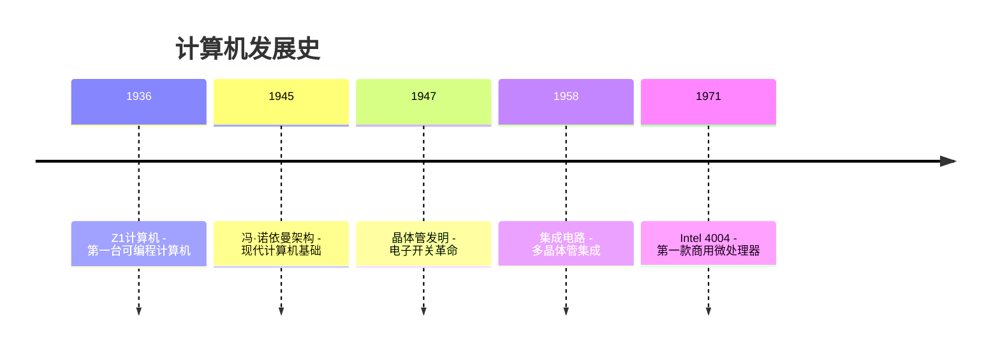
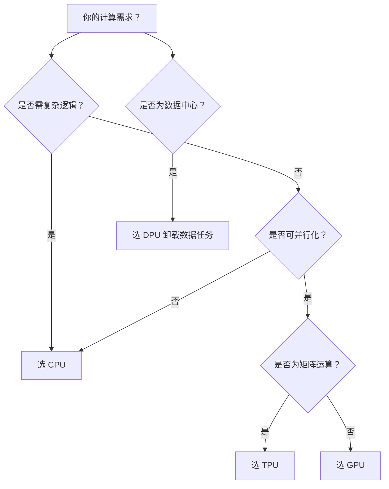

# 计算机处理器大揭秘：CPU、GPU、TPU、DPU全解析

## 🎯 核心概念

计算机需要处理器(PU)来执行计算任务，主要有四种类型：
- **CPU**: 中央处理器（大脑）
- **GPU**: 图形处理器（并行计算）
- **TPU**: 张量处理器（AI专用）
- **DPU**: 数据处理器（数据中心专用）

## 🏗️ 历史演进

### **计算机发展里程碑**


### **性能对比**
| 处理器 | 年份 | 位数 | 晶体管数 | 主频 | 特点 |
|--------|------|------|----------|------|------|
| Z1 | 1936 | 机械 | 20,000+ | 1 Hz | 机械计算 |
| Intel 4004 | 1971 | 4-bit | 2,300 | 740 KHz | 首款微处理器 |
| 现代CPU | 2024 | 64-bit | 数十亿 | GHz级 | 多核并行 |

## 🧠 CPU - 中央处理器

### **核心特性**
```yaml
架构特点:
  冯·诺依曼架构:
    - 数据和指令存储在同一内存空间
    - 顺序执行指令
    - 处理复杂逻辑和分支

性能优化:
  多级缓存:
    - L1缓存: 最快但最小
    - L2缓存: 中等速度和大小
    - L3缓存: 最大但较慢

多核技术:
  - 2-24核心常见
  - 支持多线程并行
  - 适合复杂逻辑处理
```

### **适用场景**
```python
# CPU擅长的任务
- 操作系统运行
- 复杂逻辑判断
- 顺序计算任务
- 分支预测密集型应用

# 示例：导航软件
def calculate_shortest_route(graph, start, end):
    # 大量条件判断
    if traffic_condition == "heavy":
        # 复杂分支逻辑
        if time_of_day in [7, 8, 9]:
            # 更多条件判断
            return alternative_route()
    return standard_route()
```

### **架构类型**
```yaml
主流架构:
  x86_64:
    - 应用: 桌面电脑
    - 特点: 复杂指令集，高性能
    
  ARM:
    - 应用: 移动设备、Apple Silicon
    - 特点: 简化指令集，功耗低
```

## 🎮 GPU - 图形处理器

### **核心特性**
```yaml
架构特点:
  大量简单核心:
    - CPU: 16核心
    - GPU: 10,000+核心
  并行计算优化:
    - 擅长线性代数运算
    - 浮点数计算密集
    - 矩阵运算加速

性能对比:
  单核心速度:
    - CPU核心 > GPU核心
  并行能力:
    - GPU >> CPU
```

### **适用场景**
```python
# GPU擅长的任务
- 图形渲染
- 深度学习训练
- 科学计算
- 加密货币挖矿

# 矩阵乘法示例
import numpy as np

# CPU方式 - 顺序计算
def cpu_matrix_multiply(A, B):
    return np.dot(A, B)  # 单线程或少量并行

# GPU方式 - 大规模并行
def gpu_matrix_multiply(A, B):
    # 数千个核心同时计算
    # 每个核心处理矩阵的一个元素
    return parallel_dot_product(A, B)
```

### **局限性**
```python
# GPU不适合的任务
def complex_branching_task():
    if condition1:
        if condition2:
            if condition3:
                # 复杂嵌套逻辑
                return result1
            else:
                return result2
        else:
            # GPU处理这种逻辑效率低
            return result3
    else:
        return result4
```

## 🤖 TPU - 张量处理器

### **核心特性**
```yaml
专门设计:
  目标: 深度学习张量运算
  开发者: Google (2016年)
  集成: TensorFlow软件栈

技术优势:
  乘积累加器:
    - 专用硬件执行矩阵运算
    - 无需访问寄存器或共享内存
    - 极高的运算效率

成本效益:
  训练时间:
    - CPU: 数周/数月
    - TPU: 显著缩短
  经济效益:
    - 节省数百万美元训练成本
```

### **应用场景**
```python
# TPU优化的神经网络训练
class NeuralNetwork:
    def train_on_tpu(self, dataset):
        # 矩阵乘法密集型操作
        for batch in dataset:
            # 前向传播 - 大量矩阵运算
            output = self.forward_pass(batch)
            
            # 反向传播 - 更多矩阵运算
            gradients = self.backward_pass(output)
            
            # 参数更新 - 并行化处理
            self.update_parameters(gradients)
```

## 🌐 DPU - 数据处理器

### **核心特性**
```yaml
设计目标:
  数据中心优化:
    - 网络数据包处理
    - 存储压缩加密
    - 安全功能卸载

架构特点:
  基于ARM:
    - 熟悉的指令集
    - 低功耗设计
  专用功能:
    - 网络路由
    - 数据压缩
    - 安全加密

价值主张:
  CPU卸载:
    - 让CPU专注通用计算
    - 提高整体系统效率
```

### **数据中心应用**
```yaml
DPU处理任务:
  网络功能:
    - 数据包解析和转发
    - 负载均衡
    - 防火墙规则执行
  
  存储功能:
    - 数据压缩
    - 加密解密
    - 数据去重
    
  安全功能:
    - SSL/TLS卸载
    - 入侵检测
    - 数据加密
```

## 🔮 未来技术 - QPU 量子处理器

### **量子计算原理**
```python
# 经典比特 vs 量子比特
class ClassicalBit:
    def __init__(self):
        self.value = 0 or 1  # 确定状态

class QuantumBit:
    def __init__(self):
        self.state = superposition(0, 1)  # 叠加状态
        # 可以同时表示0和1
    
    def entangle(self, other_qubit):
        # 量子纠缠 - 状态相关
        pass
```

### **潜在影响**
```yaml
革命性应用:
  密码学破解:
    - RSA加密威胁
    - Shor算法指数级加速
    
  科学计算:
    - 分子模拟
    - 优化问题
    - 机器学习加速

现实挑战:
  技术门槛:
    - 极低温环境(-273°C)
    - 量子退相干
    - 错误率高
```

## 📊 处理器选择指南

### **使用场景对比**
| 处理器 | 优势        | 劣势    | 适用场景      |
| --- | --------- | ----- | --------- |
| CPU | 通用性强，复杂逻辑 | 并行能力弱 | 操作系统，复杂应用 |
| GPU | 并行计算强     | 单核性能弱 | 图形渲染，AI训练 |
| TPU | AI计算优化    | 专用性强  | 深度学习推理训练  |
| DPU | 数据处理专用    | 应用场景窄 | 数据中心网络存储  |

### **选择建议**
```python
def choose_processor(task_type):
    if task_type == "general_computing":
        return "CPU"
    elif task_type == "parallel_computation":
        return "GPU" 
    elif task_type == "ai_training":
        return "TPU"
    elif task_type == "data_center":
        return "DPU"
    else:
        return "CPU"  # 默认选择
```

## 💡 关键要点总结

### **技术发展趋势**
1. **专业化分工**: 从通用CPU到专用处理器
2. **并行化**: 多核、众核架构普及
3. **异构计算**: 不同处理器协同工作
4. **能效优化**: 功耗成为关键指标

### **未来发展**
```yaml
技术方向:
  摩尔定律延续:
    - 3nm工艺
    - 新材料应用
    
  架构创新:
    - Chiplet设计
    - 光学计算
    - 量子计算商业化
    
  应用拓展:
    - 边缘计算
    - 自动驾驶
    - AR/VR渲染
```

处理器技术的发展反映了人类对计算能力不断增长的需求，从最初的机械计算到现代的异构计算架构，每一步都在推动着科技进步和社会发展。

---

## 🧠 计算机硬件架构终极指南：从沙子到量子比特的完整旅程  
> *“计算机不是魔法，是物理、数学与工程的完美结晶 —— 理解它，你就掌握了数字世界的‘炼金术’。”*  
> —— 开发者必备的硬件认知手册

---

### 📌 核心认知 [High confidence]  
- **计算本质**：**硅 → 电 → 二进制 → 指令** 的物理实现  
- **四大处理器**：CPU（通用）、GPU（并行）、TPU（张量）、DPU（数据）  
- **量子计算**：QPU 利用叠加态/纠缠态，威胁现有加密体系  
- **历史脉络**：机械计算 → 电子管 → 晶体管 → 集成电路 → 量子比特

> ✅ **Action**：用 `lscpu` + `nvidia-smi` 查看你的 CPU/GPU 规格，理解“为什么游戏卡顿/AI 训练慢”。

---

## 🏗️ 一、计算机硬件进化史

---

### 1. 机械时代（1936）→ **Z1 计算机**  
```markdown
- **创造者**：Konrad Zuse（在母亲地下室建造）  
- **核心**：20,000+ 金属滑片 → 表示二进制  
- **性能**：1 Hz（1 指令/秒）  
- **命运**：1943 年柏林轰炸中被毁
```

---

### 2. 电子时代（1945）→ **冯·诺依曼架构**  
```markdown
- **革命性设计**：程序与数据共享内存 → 现代计算机基石  
- **五大部件**：  
  1. 运算器  
  2. 控制器  
  3. 存储器  
  4. 输入设备  
  5. 输出设备
```

---

### 3. 晶体管时代（1947）→ **半导体革命**  
```markdown
- **晶体管**：用硅替代真空管 → 体积缩小 1000 倍，功耗降低 99%  
- **关键突破**：  
  - 1958 年：集成电路（IC）→ 多晶体管集成到单芯片  
  - 1971 年：Intel 4004 → 首款商用微处理器（2300 晶体管，740 kHz）
```

---

## 🧩 二、四大处理器深度解析

---

### 1. 🧠 CPU：通用计算之王  
**核心能力**：  
- 顺序执行 + 复杂分支（if/else/循环）  
- 多级缓存（L1/L2/L3）→ 减少内存访问延迟  
- 多核并行（现代 CPU 4-128 核）  

**架构对比**：  
| 架构 | 代表芯片 | 适用场景 |  
|------|----------|----------|  
| **x86-64** | Intel i9, AMD Ryzen | 桌面/服务器（高性能） |  
| **ARM** | Apple M2, AWS Graviton | 移动/云（低功耗） |  

**实战命令**：  
```bash
# 查看 CPU 信息
lscpu
# 输出：架构、核心数、频率、缓存大小
```

---

### 2. 🎮 GPU：并行计算怪兽  
**核心能力**：  
- 数千小核心（RTX 4090：16,384 核）→ 同时处理海量简单计算  
- 专精：矩阵运算、图形渲染、深度学习  

**与 CPU 对比**：  
| 维度 | CPU | GPU |  
|------|-----|-----|  
| **核心数** | 4-128 | 1,000-16,000 |  
| **单核性能** | ⚡⚡⚡ 强 | ⚡ 弱 |  
| **适用场景** | 通用逻辑 | 并行计算 |  

**实战命令**：  
```bash
# 查看 GPU 信息（NVIDIA）
nvidia-smi
# 输出：显存使用、温度、功耗
```

---

### 3. 🤖 TPU：AI 专用加速器  
**核心能力**：  
- 谷歌定制芯片 → 专为 TensorFlow 优化  
- **乘加单元（MAC）**：直接硬件实现矩阵乘法 → 比 GPU 快 15-30 倍  
- 适用：神经网络训练/推理  

**性能对比**：  
```markdown
- **训练 ResNet-50**：  
  - GPU（V100）：1.5 小时  
  - TPU v4：18 分钟（节省 80% 时间）
```

---

### 4. 📊 DPU：数据中心搬运工  
**核心能力**：  
- 卸载 CPU 的**数据搬运任务**（网络/存储/安全）  
- 基于 ARM 架构 → 低功耗高吞吐  
- 适用：云服务商（AWS Nitro、Azure DPU）  

**工作流**：  


---

## ⚛️ 三、量子计算：未来的颠覆者

---

### 1. QPU 核心原理  
```markdown
- **量子比特（Qubit）**：  
  - 可同时为 |0⟩ 和 |1⟩（叠加态）  
  - 与另一 Qubit 纠缠 → 瞬时关联（无视距离）  
- **量子门**：操作 Qubit 的逻辑单元（类似经典逻辑门）
```

---

### 2. 颠覆性应用  
```markdown
- **破解 RSA 加密**：  
  - 经典计算机：需 10 亿年  
  - 量子计算机（Shor 算法）：几分钟  
- **药物研发**：模拟分子量子态 → 加速新药发现  
- **金融建模**：优化万亿级投资组合
```

---

### 3. 现状与挑战  
```markdown
- **当前瓶颈**：  
  - 量子退相干（环境干扰导致状态崩溃）  
  - 错误率高（需量子纠错码）  
- **实用化时间表**：  
  - 2025：1000-Qubit 原型机（IBM Condor）  
  - 2030+：百万级 Qubit → 商业应用
```

---

## 🛠️ 四、开发者硬件优化实战

---

### 1. CPU 优化：减少分支预测失败  
```c
// 反模式：随机分支 → CPU 流水线停滞
for (int i = 0; i < n; i++) {
    if (rand() % 2) {  // 50% 概率分支
        result += data[i];
    }
}

// 正解：数据预排序 → 提升分支预测准确率
std::sort(data.begin(), data.end());  // 同类数据聚集
```

---

### 2. GPU 优化：最大化并行度  
```python
# PyTorch：避免 CPU-GPU 数据拷贝
device = torch.device("cuda")
tensor = torch.randn(10000, 10000).to(device)  # 直接创建在 GPU
result = tensor @ tensor.T  # 矩阵乘法在 GPU 执行
```

---

### 3. TPU 优化：使用 TensorFlow XLA  
```python
# 启用 XLA 编译 → 自动优化计算图
@tf.function(jit_compile=True)
def train_step(images, labels):
    with tf.GradientTape() as tape:
        predictions = model(images)
        loss = loss_fn(labels, predictions)
    gradients = tape.gradient(loss, model.trainable_variables)
    optimizer.apply_gradients(zip(gradients, model.trainable_variables))
```

---

### 4. DPU 优化：卸载网络处理  
```c
// 使用 DPDK（数据平面开发套件）绕过内核
#include <rte_eal.h>
#include <rte_ethdev.h>

// 直接从网卡接收数据包 → 减少 CPU 中断
rte_eth_rx_burst(port_id, queue_id, pkts, MAX_PKT_BURST);
```

---

## 📊 五、处理器选型决策树



---

## ✅ 30 分钟硬件认知升级计划

| 时间 | 任务 | 命令/操作 |
|------|------|-----------|
| **0-5m** | 查看 CPU 信息 | `lscpu` |
| **5-10m** | 查看 GPU 信息 | `nvidia-smi` |
| **10-15m** | 体验并行计算 | Python `multiprocessing` 库 |
| **15-20m** | 编写 GPU 代码 | PyTorch 矩阵乘法 `.to('cuda')` |
| **20-25m** | 学习量子计算 | IBM Quantum Lab（免费在线） |
| **25-30m** | 优化代码分支 | 用 `perf stat` 分析分支预测失败率 |

---

## 💡 终极心法

> **“不要只写代码，要理解代码在哪个硬件上奔跑。**  
> 当你写 `for` 循环时，脑中浮现 CPU 流水线；  
> 当你调 `.cuda()` 时，眼前是 GPU 的万核矩阵 ——  
> 你已从程序员蜕变为计算机炼金术士。”

---

如需，我可为你提供：

- ✅ **CPU/GPU 性能调优手册**（含 perf/VTune 工具）  
- ✅ **TPU 编程指南**（TensorFlow XLA 实战）  
- ✅ **DPU 开发入门**（DPDK + eBPF 教程）  
- ✅ **量子计算模拟器**（Qiskit 实验代码）

**留言告诉我你需要哪一项，我立刻为你生成！**