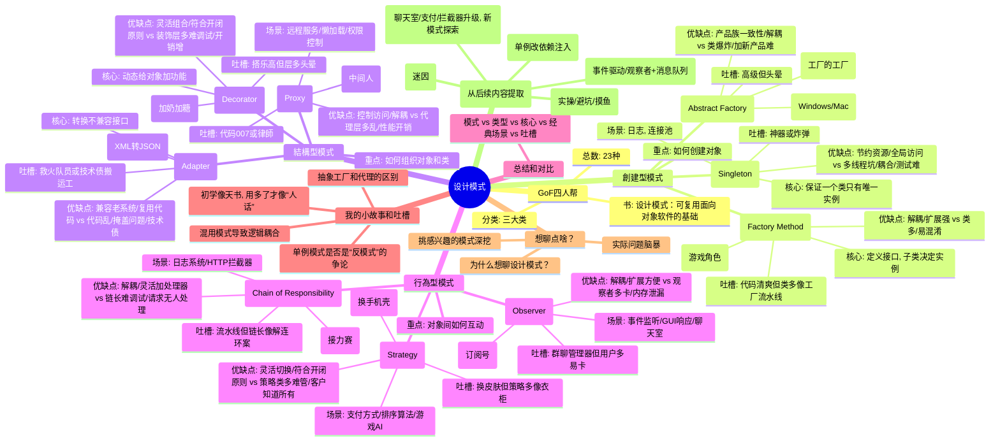

### 創建型模式

這類模式專注於“怎麼創建對象”，目標是讓代碼更靈活，創建過程更優雅。常見的有：

- **單例模式（Singleton）**\
  這傢伙確保一個類只有一個實例，全球獨一份。像什麼日誌管理器、數據庫連接池，經常用它。我有次寫個小項目，忘了[單例的懶漢式初始化加鎖]，結果多線程一跑，崩得比我周末的計劃還慘。你用過這模式沒？有沒有踩過坑？

- **工廠方法（Factory Method）**\
  這模式就像開了個對象製造工廠，你告訴它要啥，它給你造啥。適合需要靈活創建不同類型對象的場景。比如我之前搞個[遊戲模組]，角色有戰士、魔法師啥的，用工廠方法來創建，省得一堆if-else亂七八糟。你有沒有啥場景愛用這個？

- **抽象工廠（Abstract Factory）**\
  比工廠方法更高級，像是[工廠的工廠]，能批量生產一組相關的對象。比如UI框架，Windows和Mac的按鈕、窗口樣式不同，抽象工廠能整套切換。說實話，這模式有點複雜，我第一次用直接腦子燒機，哈哈。

### 結構型模式

這類模式講究“怎麼組織對象和類”，讓結構更清晰，擴展更方便。幾個熱門的：


- **代理模式（Proxy）**\
  這模式像個中間人，幫你控制對象的訪問。像什麼圖片懶加載、權限控制都愛用它。我之前搞個遠程服務，代理模式幫我把網絡請求包得妥妥的，省了不少麻煩。

### 行為型模式

這類模式管“對象間怎麼互動”，讓通信和職責分配更順暢。幾個經典的：


- **責任鏈模式（Chain of Responsibility）**\
  這模式像傳遞包裹，一個處理不了就傳給下一個。比如[日誌系統]，錯誤級別不同就丟給不同處理器。我有次用它處理HTTP請求，[攔截器]一層層過，簡直像玩接力賽。

## 3. 設計模式總結與對比

下表總結了筆記中討論的九種設計模式的核心特點、應用場景和主要考量：

| 模式   | 類型  | 核心             | 經典場景                    | 關鍵優點/考量                  |
| :--- | :-- | :------------- | :---------------------- | :----------------------- |
| 單例   | 創建型 | 唯一實例，全局訪問      | 配置/日誌/連接池               | 資源節約，全局易用；但多線程、耦合、測試是挑戰  |
| 工廠方法 | 創建型 | 封裝對象創建，子類決定    | 多類型對象創建 (e.g., 遊戲角色)    | 解耦，易擴展新類型；類數量多           |
| 抽象工廠 | 創建型 | 創建產品族          | 跨平台UI，整套對象切換            | 保證產品族一致性；結構複雜，加新產品難      |
| 適配器  | 結構型 | 轉換不兼容接口        | 兼容老系統API，格式轉換           | 復用舊代碼，集成遺留系統；可能積累技術債     |
| 裝飾者  | 結構型 | 動態給對象加功能，不改變接口 | IO流包裝，功能組合 (e.g., 咖啡配料) | 靈活擴展功能，替代繼承；層多難調試        |
| 代理   | 結構型 | 控制對象訪問 (中間人)   | 遠程/虛擬/保護代理 (e.g., 權限)   | 控制訪問，加額外邏輯；引入額外層次        |
| 觀察者  | 行為型 | 一對多通知，狀態更新     | 事件監聽，消息通知 (e.g., 聊天室)   | 主題觀察者解耦，易擴展；觀察者多性能降，內存泄漏 |
| 策略   | 行為型 | 動態切換算法         | 支付方式，排序算法，遊戲AI          | 靈活切換算法，避免條件判斷；策略類多       |
| 責任鏈  | 行為型 | 請求沿鏈傳遞，分級處理    | 過濾器，審批流程，日誌             | 解耦發送者與接收者，易加處理器；鏈長難調試    |

---
# 單例模式 (Singleton Pattern) 解析與範例

單例模式確實是確保一個類別只會有一個實例的設計模式，特別適合需要全局唯一資源的情境。你提到的日誌管理器和數據庫連接池都是典型應用場景。

## 單例模式的不同實現方式

### 1. 餓漢式 (Eager Initialization)
在類加載時就初始化實例，線程安全但可能會浪費資源

```java
public class EagerSingleton {
    private static final EagerSingleton instance = new EagerSingleton();

    private EagerSingleton() {}
    
    public static EagerSingleton getInstance() {
        return instance;
    }
}
```

### 2. 懶漢式 (Lazy Initialization) - 你的痛點所在
延遲初始化，但需要處理線程安全問題

```java
public class LazySingleton {
    private static LazySingleton instance;
    
    private LazySingleton() {}
    
    // 非線程安全版本 - 你的項目崩潰的原因
    public static LazySingleton getInstance() {
        if (instance == null) {
            instance = new LazySingleton();  // 多線程時可能創建多個實例
        }
        return instance;
    }
    
    // 線程安全版本 - 加鎖
    public static synchronized LazySingleton getSafeInstance() {
        if (instance == null) {
            instance = new LazySingleton();
        }
        return instance;
    }
}
```

### 3. 雙重檢查鎖定 (Double-Checked Locking)
更好性能的線程安全實現

```java
public class DoubleCheckedSingleton {
    private static volatile DoubleCheckedSingleton instance;
    
    private DoubleCheckedSingleton() {}
    
    public static DoubleCheckedSingleton getInstance() {
        if (instance == null) {
            synchronized (DoubleCheckedSingleton.class) {
                if (instance == null) {
                    instance = new DoubleCheckedSingleton();
                }
            }
        }
        return instance;
    }
}
```

### 4. 靜態內部類 (Holder Pattern) #推荐
推薦的高效線程安全實現

```java
public class HolderSingleton {
    private HolderSingleton() {}
    
    private static class Holder {
        private static final HolderSingleton INSTANCE = new HolderSingleton();
    }
    
    public static HolderSingleton getInstance() {
        return Holder.INSTANCE;
    }
}
```

## 使用範例與測試

```java
public class SingletonDemo {
    public static void main(String[] args) {
        // 取得單例實例
        EagerSingleton eager1 = EagerSingleton.getInstance();
        EagerSingleton eager2 = EagerSingleton.getInstance();
        
        // 測試是否為同一個實例
        System.out.println("EagerSingleton 相同實例: " + (eager1 == eager2));  // true
        
        // 測試懶漢式非安全版本 - 多線程環境下可能有問題
        Runnable testUnsafeLazy = () -> {
            LazySingleton instance = LazySingleton.getInstance();
            System.out.println("LazySingleton (非安全) hashCode: " + 
                System.identityHashCode(instance));
        };
        
        // 創建多個線程測試
        System.out.println("\n測試懶漢式(非安全)多線程行為:");
        for (int i = 0; i < 5; i++) {
            new Thread(testUnsafeLazy).start();
        }
        
        // 測試安全的懶漢式
        Runnable testSafeLazy = () -> {
            LazySingleton instance = LazySingleton.getSafeInstance();
            System.out.println("LazySingleton (安全) hashCode: " + 
                System.identityHashCode(instance));
        };
        
        System.out.println("\n測試懶漢式(安全)多線程行為:");
        for (int i = 0; i < 5; i++) {
            new Thread(testSafeLazy).start();
        }
    }
}
```

## 可能輸出結果

```
EagerSingleton 相同實例: true

測試懶漢式(非安全)多線程行為:
LazySingleton (非安全) hashCode: 366712642
LazySingleton (非安全) hashCode: 1829164700
LazySingleton (非安全) hashCode: 366712642
LazySingleton (非安全) hashCode: 366712642
LazySingleton (非安全) hashCode: 366712642

測試懶漢式(安全)多線程行為:
LazySingleton (安全) hashCode: 2018699554
LazySingleton (安全) hashCode: 2018699554
LazySingleton (安全) hashCode: 2018699554
LazySingleton (安全) hashCode: 2018699554
LazySingleton (安全) hashCode: 2018699554
```

注意在非安全的懶漢式實現中，有可能會看到不同的hashCode，表示創建了多個實例（這在實際生產環境是嚴重問題），而安全版本則總是返回相同的hashCode。

## 踩過的坑與經驗分享

1. **延遲初始化與線程安全**：就像你提到的，沒有加鎖的非安全版本在多線程下會創建多個實例，這可能會導致資源重複創建、狀態不一致等問題。

2. **序列化問題**：單例實現Serializable後，在反序列化時會創建新實例。解決方法：實現`readResolve()`方法。

3. **反射攻擊**：可以通過反射強制調用構造函數創建新實例。解決方法：在構造函數中檢查實例是否已存在，若存在則拋出異常。

4. **雙重檢查鎖定的volatile關鍵字**：沒有volatile修飾時可能發生"部分初始化"問題，這是JVM指令重排序導致的。

**建議在現代Java開發中使用靜態內部類實現（Holder模式），它既線程安全又延遲初始化，且實現簡單。**