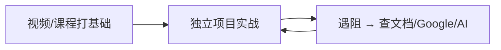

📘 **《重学编程：从零构建高效开发者路径 —— 技术白皮书（2025 实践版）》**  
*作者：一位曾浪费4年、最终逆袭的开发者 | 适用对象：初学者、转行者、效率瓶颈者*

---

## 📌 核心命题

> “8年学编程，前4年毫无产出” —— 多数人卡在“学而不建、广而不精、无目标驱动、无反馈闭环”的陷阱中。  
> 本白皮书提供一套**可执行、可复制、防踩坑**的现代开发者成长路径，融合项目驱动、AI 辅助、习惯工程与社区杠杆。

---

## 🧭 一、战略层：明确方向，拒绝“技术流浪”

### ❌ 早期致命错误：
- 跳跃式学习：HTML → Android → Unity → Swift → Java → …
- 无目标驱动：“想学编程” ≠ “想用编程解决什么问题”
- 无深度沉淀：每门语言浅尝辄止，无法独立构建完整项目

### ✅ 重构策略：
#### 1. 选择一个“垂直赛道”，深度扎根 6–12 个月
| 兴趣方向       | 推荐技术栈              | 代表项目目标                     |
|----------------|-------------------------|----------------------------------|
| Web 开发       | React + Next.js + Node  | 个人博客 / SaaS 工具 / 电商后台  |
| 移动开发       | React Native / Swift    | 健身追踪器 / 本地生活助手        |
| 游戏开发       | Unity (C#) / Unreal (C++) | 2D平台跳跃 / 第一人称解谜        |
| 数据/AI        | Python + Pandas + Scikit| 数据看板 / 自动化报告 / 小模型   |

> 📌 **原则**：不追求“最佳技术”，追求“你愿意每天打开编辑器的技术”。

#### 2. 用“终局思维”倒推学习路径
- 问自己：“我想做出______，它需要哪些技术？”
- 示例：
  - “我想做健身追踪 App” → 学 React Native + AsyncStorage + Charting Lib
  - “我想做恐怖游戏” → 学 Unreal + 蓝图系统 + 音效触发器 + AI 巡逻

---

## 🛠️ 二、战术层：高效学习法 × 项目驱动引擎

### ✅ 学习方法论：三段式闭环


#### 推荐资源（经实战验证）：
- **《The Complete Web Developer: Zero to Mastery》**（ZTM）
  - ✅ 优势：从“互联网如何工作”讲起 → 10+ 实战项目 → 面试/简历/求职支持
  - ✅ 社区：50万+ Discord 学员 + TA 答疑 + 打卡伙伴系统
- **YouTube 频道**：Web Dev Simplified, Traversy Media, Fireship
- **交互式平台**：Frontend Mentor（UI 实战）、LeetCode（算法）、Scrimba（边看边练）

### ✅ 项目驱动引擎：从“无想法”到“持续输出”

#### 1. 建立“创意数据库”（Idea Bank）
- 工具：Notion / Google Docs / 纸质笔记本
- 规则：每天记录 1–3 个想法，无论多“蠢”
  > “狗屎想法 × 100 = 1 个金矿想法” —— 创意是体积游戏

#### 2. 无想法时 → 构建“个人模板/脚手架”
- 游戏开发：先做“第一人称移动+物品拾取+NPC对话”系统包
- Web 开发：先做“Next.js + Auth + Stripe + Dashboard”通用模板
- 移动开发：先做“相机调用+本地存储+推送通知”基础模块

> 📌 模板即资产：未来项目可复用，加速 MVP 开发

#### 3. 项目管理：可视化进度，避免“无效努力感”
- 工具：Linear / Trello / GitHub Projects
- 方法：
  - 拆解任务到“5分钟可完成”的粒度（Quick Win）
  - 每日记录“今日完成” → 积累成就感
  - 每周 Review → 调整方向，不恋战

---

## 🤖 三、AI 协作层：增强而非依赖

### ❌ 新手误用 AI 的典型场景：
- 让 Cursor/Claude 写整段逻辑 → 看不懂 → 调试崩溃
- 误以为“AI 输出 = 正确代码” → 直接提交 → 生产事故
- 丧失“从0构建”的能力 → 遇到新问题完全无从下手

### ✅ AI 正确打开方式（分阶段）

| 阶段          | AI 使用策略                          | 工具推荐              |
|---------------|--------------------------------------|-----------------------|
| **初学阶段**  | 仅用于“提问解释”                     | ChatGPT / Claude 网页版 |
|               | 例：“useState 是什么？怎么用？”      |                       |
| **进阶阶段**  | 用于“代码补全 + 错误解释”            | Cursor / Zed          |
|               | 例：“这个报错什么意思？怎么修？”     |                       |
| **熟练阶段**  | 用于“生成模板 + 写测试 + 重构建议”   | Claude Code / Warp    |
|               | 例：“为这个函数写 Jest 测试”         |                       |

### ⚠️ 黄金法则：
> “AI 是副驾驶，不是方向盘。你必须知道车要去哪，以及何时该踩刹车。”

---

## 🧘 四、习惯工程：从“间歇性努力”到“无零日”

### ❌ 早期模式：
- 每周编码 2 小时 → 下次打开时已忘记上下文 → 重新学习 → 挫败放弃

### ✅ 重构习惯：
#### 1. **No Zero Days（无零日）**
- 每天至少写 5 分钟代码
- 目的：保持“手感”和“项目上下文记忆”
- 工具：GitHub Commit 可视化 / Notion 打卡表

#### 2. **Quick Win 启动法**
- 每次编码前，先完成一个 5 分钟任务：
  - 修复一个小 bug
  - 优化一行 CSS
  - 写一个测试用例
- 作用：快速进入心流，避免“面对大任务的瘫痪感”

#### 3. **环境绑定法**
- 固定时间 + 固定地点 + 固定仪式（如：早8点书房 + 咖啡 + 打开 Zed）
- 让编码成为“条件反射”，而非“意志力消耗”

---

## 👥 五、社区杠杆：从孤军奋战到群体加速

### ❌ 早期状态：
- 自学 → 遇阻 → 无人讨论 → 放弃

### ✅ 重构策略：
#### 1. 加入“学习型社区”
- **ZTM Discord**（50万+开发者）：按技术栈分频道，TA 实时答疑
- **Reddit**：r/learnprogramming, r/webdev
- **本地 Meetup / 黑客松**：面对面交流，建立 accountability

#### 2. 寻找“学习搭档”（Accountability Buddy）
- 每周同步进度
- 互相 Code Review
- 失败惩罚机制（如：输的人请喝奶茶）

#### 3. 输出倒逼输入
- 写技术博客（哪怕只有 100 字）
- 录 1 分钟项目进展视频发 Twitter
- 在 GitHub 写 README 解释你的设计决策

> 📌 “教是最好的学” —— 当你能向别人解释清楚，才算真正掌握。

---

## 📈 六、成果度量：从“感觉没进步”到“数据化成长”

| 指标                | 度量方式                     | 目标                     |
|---------------------|------------------------------|--------------------------|
| 代码产出            | GitHub Commit / PR 数量      | 每周 ≥ 3 次提交          |
| 项目完成度          | Linear/Trello 任务完成率     | 每周完成 80% 计划任务    |
| 技术深度            | 独立实现功能占比             | 从 30% → 80%             |
| 问题解决速度        | Google/AI 查询 → 解决耗时    | 从 2小时 → 20分钟        |
| 社区参与度          | Discord 提问/回答次数        | 每周 ≥ 2 次互动          |

---

## 🚀 七、30天启动计划（新手友好版）

| 周数 | 目标                          | 关键动作                                  | 成功标志                     |
|------|-------------------------------|-------------------------------------------|------------------------------|
| 第1周 | 选定赛道 + 搭建环境           | 安装 VS Code/Zed + 选1门课（如ZTM）       | 跑通第一个“Hello World”项目  |
| 第2周 | 完成1个微型项目               | 仿写一个登陆页 / 待办清单                 | 项目可运行 + 部署到 Vercel   |
| 第3周 | 加入社区 + 找学习搭档         | 加入 ZTM Discord + 发1个自我介绍帖        | 收到 ≥ 3 条回复              |
| 第4周 | 引入AI辅助 + 建立Idea Bank    | 用AI解释1个概念 + 记录5个项目想法         | Idea Bank 有 ≥ 10 个条目     |

---

## 💡 终极心法

> **编程不是“学”出来的，是“建”出来的。**  
> 你不需要成为“全栈大神”，你只需要成为“能交付价值的人”。  
> 你不需要“每天8小时”，你只需要“每天5分钟，持续365天”。  
> 你不需要“独自硬扛”，你只需要“找到同路人，一起向前”。

---

## 📎 附录：工具包清单

| 类别       | 工具推荐                          | 用途说明                     |
|------------|-----------------------------------|------------------------------|
| IDE        | Zed / Cursor / VS Code            | 智能补全 + AI 集成           |
| 学习平台   | Zero To Mastery / Udemy / Scrimba | 结构化课程 + 项目实战        |
| 项目管理   | Linear / Trello / GitHub Projects | 任务拆解 + 进度追踪          |
| 社区       | ZTM Discord / Reddit / Twitter    | 提问 + 分享 + 找搭档         |
| AI 辅助    | Claude 3 / ChatGPT / Warp         | 解释概念 + 生成代码片段      |
| 部署       | Vercel / Netlify / Railway        | 一键部署前端/全栈项目        |
| 创意管理   | Notion / Google Keep              | 建立 Idea Bank               |

---

> ✍️ **作者结语**：  
> 我曾是那个“学了4年却做不出东西”的人。  
> 今天，我靠这套方法构建了 SaaS 产品、拿到高薪 Offer、并帮助数千人走出迷茫。  
> 你不需要比我聪明，你只需要比我坚持。  
> **现在，关掉视频，打开编辑器，写第一行代码。**  
> 365天后，你会感谢今天的自己。

---

📘 **本白皮书可打印、可分享、可贴在墙上。**  
**更新频率：每年迭代一次，适配技术演进。**  
**最新版获取：关注作者社交媒体 / GitHub 仓库。**

---

## 🚀 面向开发者的高效学习指南：从0到1的实战路径（2025版）  
> *“你不是在学编程，而是在构建解决问题的能力。技术栈会变，但核心思维永不过时。”*  

---

### 🔥 **核心原则（必须牢记）**  
| 原则 | 为什么重要 | 行动指南 |
|------|------------|----------|
| **专注一个领域** | 跳来跳去=永远在入门 | 选择1个赛道（Web/游戏/移动），**承诺6个月不换技术栈** |
| **项目驱动学习** | 课程≠能力，实践才是真学 | 每学一个概念，**当天用1小时构建小功能** |
| **每日持续（No Zero Days）** | 断更7天=重学基础 | 每天至少写5分钟代码（哪怕只改1个CSS样式） |
| **AI是辅助，不是替代** | 依赖AI=技能退化 | 新手：用AI查概念；进阶：用AI加速但100%审核代码 |

---

### 🌱 **一、从零开始的正确姿势（避免90%新手的错误）**  
#### ✅ **Step 1：选准你的技术赛道**  
- **错误做法**：  
  > “我想学编程，先学Python再学Java，再学Swift……”  
- **正确做法**：  
  1. **列出3个你真正想构建的项目**（例如：  
     - “健身追踪App” → 选 **React Native + Firebase**  
     - “FPS游戏原型” → 选 **Unity + C#**  
     - “个人博客网站” → 选 **Next.js + TypeScript**）  
  2. **选最想做的那个，死磕6个月**  
  3. **立即删除其他技术栈的安装包**（物理隔绝诱惑）  

> 💡 **关键洞察**：  
> - Web开发：**React + Node.js**（市场最大，学习资源最丰富）  
> - 游戏开发：**Unity + C#**（比Unreal更易上手）  
> - 移动开发：**React Native**（跨平台，一次学习双端）  

#### ✅ **Step 2：用“项目-课程”循环学习**  
- **错误做法**：  
  > “先看完100小时教程再动手” → 结果：看完就忘，毫无产出  
- **正确做法**：  
  | 阶段 | 操作 | 工具推荐 |  
  |------|------|----------|  
  | **基础阶段** | 每学完1个概念（如“React Hooks”），**立即构建1个最小功能**（如“计数器”） | [Zero to Mastery Web Dev Course](https://zerotomastery.io)（项目驱动，含10+实战项目） |  
  | **进阶阶段** | 用官方文档+Stack Overflow解决具体问题，**不看完整教程** | MDN Web Docs、React官方文档 |  
  | **实战阶段** | 用1个月时间构建**1个完整项目**（如“带用户登录的博客系统”） | GitHub + VS Code + Postman |  

> ✨ **案例**：  
> - 学“API调用” → 当天用Fetch API从[JSONPlaceholder](https://jsonplaceholder.typicode.com)获取数据并渲染到页面  
> - 学“数据库” → 用MongoDB存用户数据，写1个注册/登录接口  

---

### 🧩 **二、项目驱动学习法（解决“没想法”和“卡住”）**  
#### ✅ **Step 1：建立“想法库”（每天10分钟）**  
- **操作步骤**：  
  1. 用Notion/Google Sheet创建表格，列3列：  
     | 想法描述 | 技术栈 | 优先级 |  
     |----------|---------|--------|  
     | “自动追踪健身数据的App” | React Native + Firebase | 高 |  
     | “用AI生成游戏关卡的工具” | Unity + ML.NET | 中 |  
  2. **每天写1-3个新想法**（包括“垃圾点子”，如“用Python自动点外卖”）  
  3. 每周选1个最可行的，进入开发阶段  

> 📌 **为什么有效**：  
> - 避免“灵感枯竭”，**量变产生质变**（100个想法中必有1个能落地）  
> - 垃圾点子也能练手（比如“点外卖脚本”能练爬虫+自动化）  

#### ✅ **Step 2：从“模板项目”开始（无压力起步）**  
- **操作步骤**：  
  1. 如果没具体项目，先构建**技术栈的基础模板**：  
     - Web开发 → 构建“带用户认证的React模板”（登录/注册/主页）  
     - 游戏开发 → 构建“FPS基础控制器”（移动/射击/视角）  
  2. **持续迭代这个模板**（每月加1个新功能）：  
     - 第1月：添加AI聊天机器人  
     - 第2月：集成支付功能  
     - 第3月：部署到云平台  
  3. **保留代码库**，未来直接复用  

> 💡 **真实案例**：  
> - 开发者用Unreal Engine 6个月构建“游戏系统模板”（NPC对话/物品拾取/开车），后来做恐怖游戏时直接复用，节省80%时间  

#### ✅ **Step 3：每日“5分钟小胜利”（解决拖延）**  
- **操作步骤**：  
  1. 每次打开编辑器前，问自己：  
     > “**今天5分钟内能完成的最小任务是什么？**”  
  2. 选择1个：  
     - 修复1个CSS bug  
     - 重写1个冗余函数  
     - 添加1个单元测试  
  3. **完成后立刻标记完成**（用Trello/Notion看板）  

> 🌟 **效果**：  
> - 5分钟=建立习惯，避免“今天太忙明天再学”的恶性循环  
> - 30天后你会拥有：  
>   - 30个微小成果（累计15+小时代码）  
>   - 1个正在迭代的项目  

---

### 🤖 **三、AI辅助开发的正确姿势（新手vs进阶）**  
#### ⚠️ **新手阶段（0-6个月）：AI只能当“解释器”**  
| 错误做法 | 正确做法 |  
|----------|----------|  
| 让AI写代码（如“用AI生成React组件”） | 用AI**解释概念**（如“用简单例子解释React Hooks原理”） |  
| 直接复制AI生成的代码 | 把AI生成的代码**手动输入**，边写边理解 |  
| 用AI调试错误 | 先自己读错误日志，再用AI**验证理解**（如“这个错误是X导致的吗？”） |  

> 💡 **实操示例**：  
> - 你卡在“React状态更新不生效” →  
>   1. 自己查文档，确认是否用`useState`正确  
>   2. 问AI：*“为什么我的`setState`不触发重新渲染？可能原因是什么？”*  
>   3. 根据AI反馈，**手动修改代码**（而非复制粘贴）  

#### ⚙️ **进阶阶段（6个月+）：AI当“加速器”，但必须100%审核**  
| 场景 | 操作步骤 |  
|------|----------|  
| **写代码** | 1. 用Cursor/Zed的AI补全代码 → **2. 手动修改关键逻辑**（如错误处理、边界case）<br>3. **强制提示词**：“请挑战我的方案，指出3个潜在风险” |  
| **写测试** | 1. 让AI生成基础测试 → **2. 人工补充边界case**（如“输入超长字符串”“网络超时”） |  
| **调试** | 1. 复制错误日志 → 粘贴到AI → 问：“**为什么这个错误会发生？请分3步解释**”<br>2. **自己动手修复**，而非直接运行AI代码 |  
| **基础设施** | ❌ **永远禁止**让AI生成Docker/K8s/Terraform文件！<br>✅ 用AI生成示例 → **人工审核+安全扫描**（`docker scan`、`kube-linter`） |  

> 🔒 **高危红线**：  
> - **绝不允许AI直接操作生产环境**（如`docker stop $(docker ps -q)`）  
> - 所有AI生成的代码，**必须通过CodeQL/Snyk扫描**再提交  

---

### 🤝 **四、习惯养成：No Zero Days 实战指南**  
#### ✅ **Step 1：设置“每日代码闹钟”**  
- 操作步骤：  
  1. 用手机设置**固定时间提醒**（如每天7:00 AM）  
  2. 提醒内容：*“打开编辑器，写5分钟代码”*  
  3. **即使没灵感，也做1件事**：  
     - 重写1个冗余函数  
     - 修复1个已知的小bug  
     - 写1个单元测试  
     - 在GitHub提交1个空提交（`git commit --allow-empty`）  

#### ✅ **Step 2：用“项目看板”可视化进展**  
- 操作步骤：  
  1. 用Trello/Notion创建看板，列3列：  
     | 待办 | 进行中 | 已完成 |  
     |------|--------|--------|  
     | 修复登录页CSS | 🚧 用户认证API | ✅ 导航栏重构 |  
  2. **每天更新看板**（哪怕只移动1个小任务）  
  3. 每周回顾：**“本周完成了什么？下周优先做什么？”**  

> 📈 **效果**：  
> - 2周后你会看到：**“我居然完成了这么多！”**（对抗“没进展”的挫败感）  
> - 3个月后：**1个完整项目 + 100+ GitHub提交记录**  

#### ✅ **Step 3：加入“ accountability buddy”**  
- 操作步骤：  
  1. 在Discord/Reddit找到1个学习伙伴（如ZTM的50万学生社区）  
  2. 每周同步：  
     - “本周我完成了X”  
     - “下周我计划做Y”  
  3. **公开承诺**：在Twitter发“本周目标”，吸引监督  

> 💬 **真实反馈**：  
> > *“加入ZTM Discord后，每天有人问‘你今天写代码了吗？’，突然就坚持下来了”*  

---

### 🚨 **五、新手必避的3大坑（血泪教训）**  
| 坑 | 为什么致命 | 如何避免 |  
|----|------------|----------|  
| **“学语言不学项目”** | 理论懂，但无法解决实际问题 | 每学1个概念，立即构建1个可运行的最小功能 |  
| **“依赖AI写代码”** | 技能退化，面试被问基础题答不上 | 新手阶段：AI只用于查概念，代码100%手写 |  
| **“三天打鱼两天晒网”** | 记忆断层，每次都要重学基础 | 用“No Zero Days”：每天5分钟，持续30天 |  

> 💡 **终极心法**：  
> - **“你不是在学编程，而是在构建解决问题的能力”**  
> - 技术栈会变（React → 新框架），但**“拆解问题-动手实现-调试修复”的思维永不过时**  

---

### 🌟 **7天启动计划（立即行动）**  
| 天数 | 任务 | 工具 |  
|------|------|------|  
| **Day 1** | 选1个赛道，安装基础工具（VS Code + Node.js） | [Zero to Mastery Web Dev Course](https://zerotomastery.io) |  
| **Day 2** | 构建1个“计数器”App（用React Hooks） | React官方文档 |  
| **Day 3** | 用AI解释“为什么需要状态管理？” → 手动写代码实现 | ChatGPT + VS Code |  
| **Day 4** | 建立“想法库”，写3个项目点子 | Notion/Google Sheet |  
| **Day 5** | 修复1个已知的小bug（如按钮颜色不对） | GitHub + Stack Overflow |  
| **Day 6** | 在GitHub提交1个空提交（`git commit --allow-empty`） | Terminal |  
| **Day 7** | 在Twitter发：“今天完成了X，明天计划做Y” | Twitter |  

> ✅ **完成7天后**：  
> - 你已建立**每日代码习惯**  
> - 有1个可运行的项目 + 想法库  
> - 明确知道“下一步该做什么”  

---

### 📌 **最后忠告**  
> **“AI不会取代程序员，但会用AI的程序员会取代不用AI的程序员”**  
> —— 但前提是：  
> - 你有**扎实的基础能力**（能手写代码、调试问题）  
> - 你把AI当**工具**，而非**思考者**  
> - 你始终**为最终结果负责**（AI生成的代码，你必须能解释每一行）  

**现在，立刻做这件事**：  
1. 打开电脑 → 安装VS Code  
2. 打开终端 → 输入 `git init`  
3. 创建一个新文件 `hello.js` → 写 `console.log("Day 1 done!")`  
4. 提交到GitHub（哪怕只有1行代码）  

> 🌱 **开始的那一刻，你就已经领先90%的初学者**。  

**完整资源包**：  
- [Zero to Mastery Web Dev Course（项目驱动）](https://zerotomastery.io)  
- [Notion项目管理模板](https://www.notion.so/templates/project-management)  
- [AI安全使用指南（GitHub仓库）](https://github.com/ai-coding-safety)  

> 🔗 **关注我**：@YourDevHandle（Twitter/Instagram）  
> 🎯 **你的下一个问题是什么？评论区告诉我，我会帮你拆解！**

---

# 从零到专业：现代开发者高效学习路径指南

## 引言：重新定义编程学习

作为一名拥有8年编程经验的开发者，我回顾了自己的学习历程，发现前4年因方法不当而效率低下。本指南基于我如果重来会采取的策略，为现代编程学习者提供一条高效、可持续的成长路径。无论你是完全的初学者，还是希望优化学习方法的中级开发者，这份指南将帮助你避免常见陷阱，快速建立实用技能。

> **关键认知转变**：编程学习不是"学会所有语言"，而是"掌握解决问题的思维和一套高效工具"

## 第一部分：避免新手常见陷阱

### 1. 技术栈过载陷阱

**问题表现**：
- 在HTML/CSS、Android开发、Unity、Swift、Java等之间频繁切换
- 学习多个框架但无法完成一个完整项目
- 对基础概念理解零散，无法构建系统性知识

**解决方案**：
- **单一技术栈深度优先**：选择一个领域（如Web开发）并坚持至少6-12个月
- **明确退出机制**：设定"如果3个月内无法构建简单应用，就换技术栈"的规则
- **技术栈选择矩阵**：
  ```
  | 兴趣方向      | 推荐技术栈          | 入门项目示例               |
  |---------------|-------------------|--------------------------|
  | 网页/应用开发  | React + Node.js   | 个人博客/任务管理应用       |
  | 游戏开发       | Unity + C#        | 2D平台跳跃游戏             |
  | 移动应用       | React Native      | 健身追踪器                |
  | 数据科学       | Python + Pandas   | 个人消费分析工具           |
  ```

### 2. 目标模糊陷阱

**问题表现**：
- "想学编程"但无具体应用场景
- 课程学到一半就失去动力
- 无法将学习内容与实际需求联系起来

**解决方案**：
- **目标反向设计法**：
  1. 想象你6个月后想构建的应用（如健身追踪App）
  2. 拆解所需技术栈（React Native、Firebase等）
  3. 从最基础的"显示'Hello World'"开始，逐步构建完整功能
- **兴趣驱动学习**：将学习内容与个人爱好结合（如喜欢游戏→学习Unity；喜欢摄影→构建图片处理工具）

## 第二部分：高效学习路径规划

### 1. 基础构建阶段（1-3个月）

**核心原则**：理解而非记忆，实践而非理论

**推荐学习路径**：
1. **互联网工作原理基础**（1-2周）
   - HTTP/HTTPS、DNS、客户端-服务器模型
   - 为什么需要这些知识：避免"为什么我的API调用失败"类问题

2. **选择一门语言并深入**（4-8周）
   - Web开发：JavaScript（优先选择）
   - 移动开发：Swift或Kotlin
   - 游戏开发：C#
   - 数据科学：Python

3. **学习资源选择标准**：
   - 项目驱动型课程 > 理论讲解型课程
   - 包含10+个实际项目 > 单一示例项目
   - 有活跃社区支持 > 孤立学习体验

> **资源推荐**：Zero to Mastery的"Complete Web Developer"课程（示例）
> - 优势：从互联网基础开始，10+真实项目，活跃Discord社区（50万+成员）
> - 适用场景：零基础到就业准备的完整路径

### 2. 项目驱动学习阶段（3-6个月）

**核心原则**：学习的唯一目的是构建东西

#### 项目构思系统

**创意数据库构建法**：
1. 创建集中式想法库（Notion/Google Docs）
2. 每日记录至少1个想法，无论多"愚蠢"
3. 每周回顾，筛选3个可行性最高的项目

**项目选择优先级**：
```
高优先级项目 = (个人兴趣 × 5) + (技术学习价值 × 3) + (完成可能性 × 2)
```

#### 从模板到应用：渐进式项目策略

**不要从"完整应用"开始**，而是：
1. **构建技术模板**：如游戏开发中的"第一人称控制器模板"
2. **添加单一功能**：如"物品拾取系统"
3. **迭代扩展**：逐步添加对话系统、战斗机制等
4. **最终整合**：将所有模块组合成完整应用

> **案例**：作者通过构建Unreal Engine游戏系统模板（非完整游戏），掌握了游戏开发核心概念，为未来项目奠定基础

### 3. 一致性与进度管理

**核心原则**：持续小进步 > 偶尔大突破

#### 零日法则（No Zero Days）

- **承诺**：每天至少编码5分钟
- **执行技巧**：
  - 早晨第一件事：完成5分钟编码
  - 使用"5分钟挑战"：今天只修复一个小bug
  - 设置视觉提示：将开发环境常开在次要显示器

#### 快速胜利策略

每次编码会话开始时：
1. 识别一个可在5-15分钟内完成的小任务
2. 优先完成该任务（如修复一个UI错位）
3. 获得即时成就感，推动继续工作

#### 进度可视化

- 使用Trello/Jira创建简单看板：
  ```
  To Do → In Progress → Done (庆祝!)
  ```
- 每完成一个任务，写下"我学会了______"
- 每周回顾学习日志，关注进步而非不足

## 第三部分：AI时代的编程学习策略

### AI的正确使用姿势

**新手使用准则**：
- **辅助，非替代**：用AI解释概念，而非生成完整代码
- **理解优先**：要求AI"解释为什么这样实现"而非直接给答案
- **逐步放手**：随着技能提升，减少AI依赖

**具体使用场景**：
| 场景 | 推荐做法 | 风险提示 |
|------|---------|---------|
| 概念理解 | "用简单比喻解释闭包是什么" | 避免接受过于简化的解释 |
| 调试帮助 | 提供错误信息，问"可能的原因是什么" | 不要盲目应用建议 |
| 代码审查 | "这段代码有什么潜在问题？" | 验证每条建议 |
| 项目规划 | "实现X功能需要哪些步骤？" | 保持自己主导设计 |

### 推荐AI工具与使用策略

**初学者友好工具**：
- **Cursor**：代码解释功能优于代码生成
- **GitHub Copilot**：开启"解释建议"模式
- **Claude**：用于概念澄清和学习路径规划

**使用纪律**：
1. 先尝试自己解决问题（30分钟）
2. 使用AI时明确标注"AI辅助"注释
3. 每天结束时，手写总结学到的关键点
4. 每周回顾，删除所有AI生成但不理解的代码

> **警告**：如果你无法解释AI生成的代码，说明你还没有真正掌握它。这种"黑箱学习"会导致技能断层。

## 第四部分：加速成长的支撑系统

### 1. 社区与责任机制

**有效参与策略**：
- 加入有结构化学习路径的社区（如ZTM Discord）
- 寻找"学习伙伴"，每周互相审查代码
- 在GitHub上公开项目，邀请反馈
- 参加本地Meetup或线上编程马拉松

**避免无效参与**：
- 不要只在Stack Overflow提问，也要尝试回答简单问题
- 不要只关注"热门技术"，关注解决实际问题的讨论

### 2. 学习-构建-分享循环

建立可持续的学习循环：
```
学习概念 → 构建小功能 → 写博客/录视频解释 → 获得反馈 → 修正理解
```

**实践建议**：
- 每学会一个新概念，录制60秒解释视频
- 在GitHub README中记录学习过程而非仅展示结果
- 每周在社区分享一个"我今天学到的"小贴士

### 3. 从学习到职业发展的桥梁

**关键转变**：
- 从"我能构建什么"到"我能解决什么问题"
- 从个人项目到协作项目
- 从功能实现到用户体验优化

**行动步骤**：
1. 将个人项目重构为可协作形式（添加清晰的CONTRIBUTING.md）
2. 为开源项目提交文档改进（最简单的入门方式）
3. 构建解决自己痛点的工具（如作者的Creator Kiwi链接追踪器）

## 第五部分：实用工具与资源清单

### 1. 学习平台选择指南

| 需求 | 推荐平台 | 优势 | 适合阶段 |
|------|---------|------|---------|
| 系统性学习 | Zero to Mastery | 项目驱动，职业路径明确 | 初学者-中级 |
| 快速概念查询 | freeCodeCamp | 免费，社区支持 | 所有阶段 |
| 面试准备 | LeetCode + ZTM面试课程 | 实战问题，策略指导 | 求职阶段 |
| 深度技术理解 | Official Docs + MDN | 权威，最新 | 中级+ |

### 2. 项目管理工具

- **轻量级**：GitHub Projects（与代码库集成）
- **视觉化**：Notion开发模板（含进度追踪）
- **极简主义**：README-driven开发（在README中先规划）

### 3. 技能巩固工具

- **Anki**：创建编程概念闪卡
- **Codecademy**：短期技能强化
- **Exercism**：获得资深开发者反馈

## 结语：构建可持续的开发者身份

编程不是一项"学会就完成"的技能，而是持续成长的身份认同。成功的开发者不是那些知道最多语法的人，而是那些建立了可持续学习习惯、能持续解决问题的人。

**立即行动步骤**：
1. 今天：在Notion/文档中创建"创意数据库"
2. 明天：选择一个技术栈，开始第一个"5分钟项目"
3. 本周：加入一个开发者社区，介绍自己和目标

> "不要问'我应该学什么'，而要问'我想构建什么'。答案会引导你找到正确的技术路径。"

记住：你不是在"学习编程"，而是在成为能够用技术解决问题的创造者。从今天开始的小步骤，将在6个月后带来令人惊讶的转变。

---

📘 **《从零到发布：构建商业级应用的20条实战法则 —— 开发者技术白皮书（2025 实践版）》**  
*作者：7年开发者，4年无效学习，1年专注突破，成功发布首个SaaS产品*  
*适用对象：独立开发者、转行工程师、MVP构建者、效率焦虑者*

---

## 🎯 核心理念

> **“想法无价值，执行即王道。”**  
> 你不需要“独一无二的创意”，你只需要“解决真实问题的能力”。  
> 你不需要“精通所有语言”，你只需要“精通一套技术栈并持续交付”。  
> 你不需要“完美产品”，你只需要“最小可用版本 + 用户反馈 + 快速迭代”。

---

## 📜 20条实战法则（结构化分类 + 可执行策略）

---

### 🧭 一、心智模型重构（Mindset Shift）

#### 1. 想法不重要，执行才重要  
> “你的创意一文不值，除非你把它做出来。”  
> ✅ 策略：  
> - 优先复刻已有产品（证明市场需求）  
> - 例：做“Notion + AI”工具？先做“Notion Clone”  
> - 价值 = 解决问题 × 执行力，而非“创意新颖度”

#### 2. 立刻开始，拒绝等待  
> “拖延是开发者最大的敌人。”  
> ✅ 策略：  
> - 看完本文 → 立刻打开编辑器写1行代码  
> - 设定“5分钟启动规则”：每天先写5分钟，惯性会带你继续

#### 3. 无零日（No Zero Days）  
> “每天30分钟 > 每周5小时”  
> ✅ 策略：  
> - GitHub Commit 可视化打卡  
> - 使用“Quick Win”启动法：每次先完成一个小任务（如修1个bug）

#### 4. 明确目标，聚焦赛道  
> “游戏开发 ≠ Web开发 ≠ 移动端 ≠ 数据工程”  
> ✅ 策略：  
> | 目标               | 技术栈推荐          | 学习资源                  |
> |--------------------|---------------------|---------------------------|
> | SaaS产品           | Next.js + Go/Node   | ZTM / Fireship            |
> | 游戏               | Unity (C#) / Unreal | Unreal官方教程 + 项目实战 |
> | 移动App            | React Native / Swift| Udemy + App Store案例     |
> | 自由职业           | WordPress + JS      | Fiverr需求分析 + 模板开发 |

#### 5. 语言/框架不重要，深度才重要  
> “Go vs TypeScript？Next.js vs Svelte？别纠结，选一个，干到底。”  
> ✅ 策略：  
> - 选择依据：社区活跃度 + 个人喜好 + 项目需求  
> - 一旦选定，6个月内不切换  
> - 深度掌握1套技术栈 → 未来学习新栈速度提升10倍

---

### 🛠️ 二、学习与开发方法论

#### 6. 谨慎使用教程（Tutorial Hell 解药）  
> “教程是拐杖，项目是跑道。”  
> ✅ 策略：  
> - 用教程学“语法/模式”，不用它“构建项目”  
> - 学完一个概念 → 立刻在自己的项目中应用  
> - 遇阻时：Google > AI > 专项视频（非全流程教程）

#### 7. 初期避免AI（防“AI Hell”）  
> “AI是高手的加速器，新手的毒药。”  
> ✅ 策略：  
> - 新手阶段：仅用AI“提问解释”（如：“Go的goroutine是什么？”）  
> - 禁用“AI写整段代码”功能 → 强迫自己手写  
> - 进阶后：用AI“生成测试/重构建议”，但必须Review

#### 8. 项目驱动学习（Project-Based Learning）  
> “在实战中学习，效率提升300%。”  
> ✅ 策略：  
> - 选一个“6周可完成”的微型项目（如：待办清单+用户登录）  
> - 拆解为每日任务 → 用Linear/Trello管理  
> - 每完成一个模块 → 部署到Vercel/Netlify → 获得正反馈

#### 9. 聚焦解决问题（Problem-First Approach）  
> “最好的项目创意 = 你亲身经历的痛点。”  
> ✅ 策略：  
> - 建立“Idea Bank”：记录每日遇到的“不爽点”  
>   - 例：“每次发YouTube视频都要手动统计链接点击 → 做自动追踪工具”  
> - 用Notion管理：痛点描述 + 解决方案草图 + 技术可行性

#### 10. 构建可复用模块（Building Blocks）  
> “今天的轮子，是明天的火箭。”  
> ✅ 策略：  
> - 开发时问自己：“这段代码能否用在下一个项目？”  
> - 重点模块化：  
>   - 认证系统（Auth）  
>   - 支付集成（Stripe）  
>   - 日志/监控（Logging）  
>   - UI组件库（Button/Table/Modal）  
> - 最终目标：拥有自己的“全栈模板仓库”

---

### 🚀 三、产品构建与发布

#### 11. 建立项目管理流程  
> “没有流程的开发 = 混乱的泥潭。”  
> ✅ 工具推荐：  
> - **Linear**：适合敏捷开发（作者亲测）  
> - **Trello**：看板式管理，新手友好  
> - **GitHub Projects**：与代码仓库无缝集成  
> ✅ 方法：  
> - 每周规划3个“Must Do”任务  
> - 每日记录“Done List” → 积累成就感

#### 12. 严防范围蔓延（Scope Creep）  
> “MVP = 最小可行产品，不是最大完美产品。”  
> ✅ 策略：  
> - 用“MoSCoW法则”定义需求：  
>   - Must have（核心功能）  
>   - Should have（重要但非必需）  
>   - Could have（锦上添花）  
>   - Won't have（本次不做）  
> - MVP标准：用户能用它解决1个核心问题

#### 13. 必须发布（Ship It!）  
> “未发布的代码 = 不存在的代码。”  
> ✅ 策略：  
> - 设定“发布截止日”（哪怕只是私有Beta）  
> - 发布渠道：  
>   - Web应用：Vercel + 自定义域名  
>   - 游戏：itch.io  
>   - 移动App：TestFlight（iOS）/ Firebase（Android）  
> - 发布后：收集10个用户反馈 → 迭代V2

#### 14. 设定截止日期（Deadline Driven）  
> “没有截止日的项目 = 永远不会完成的项目。”  
> ✅ 策略：  
> - 公开承诺：在Twitter/朋友圈宣布“X月X日上线”  
> - 使用“时间盒”（Time Boxing）：  
>   - “本周只开发登录功能，无论是否完美”  
>   - “下周只做支付集成，其他需求全部冻结”

#### 15. 学会止损（Know When to Pivot）  
> “沉没成本不是继续的理由。”  
> ✅ 策略：  
> - 每周问自己：“这个功能是否值得我再花1周时间？”  
> - 如果答案是否 → 暂存代码，转向高价值任务  
> - 例：作者放弃“着陆页生成器”，转做“1日可完成的小功能”

#### 16. 摒弃完美主义（Perfectionism is the Enemy）  
> “粗糙的发布 > 完美的幻影。”  
> ✅ 策略：  
> - UI原则：能用 > 好看  
> - 代码原则：可运行 > 优雅  
> - 发布后：用用户反馈驱动优化，而非自我想象

#### 17. 强制使用版本控制（Git Workflow）  
> “不用Git的个人项目 = 定时炸弹。”  
> ✅ 最小可行流程：  
> ```bash
> git checkout -b feature/login  # 新功能分支
> git add . && git commit -m "feat: add login page"  # 小步提交
> git push origin feature/login  # 推送备份
> # 合并前：git checkout main && git merge feature/login
> ```
> ✅ 工具：GitHub Desktop（新手友好） / VS Code Git插件

---

### 📣 四、增长与可持续性

#### 18. 营销优先（Marketing is Part of Development）  
> “酒香也怕巷子深，代码再好也要吆喝。”  
> ✅ 低成本策略：  
> - **内容营销**：写技术博客（用项目案例吸引用户）  
> - **社交证明**：在Twitter/LinkedIn分享开发日志  
> - **冷启动**：给10个潜在用户发个性化邮件（附免费试用码）  
> - **社区曝光**：在Product Hunt / Hacker News发布

#### 19. 记录进展（Progress Tracking）  
> “看不见的进步 = 不存在的进步。”  
> ✅ 方法：  
> - 每日“Done List”：用Notion记录完成事项  
> - 每周“成果展示”：截图/录屏发社交媒体  
> - 每月“复盘报告”：用户数/收入/技术债清单

#### 20. 长期主义（Play the Long Game）  
> “慢就是快，深就是广。”  
> ✅ 策略：  
> - 拒绝“3天用AI做出百万美元应用”的诱惑  
> - 专注“理解技术本质”而非“堆砌功能”  
> - 目标：1年后，你能用同一套技术栈，3倍速度交付新项目

---

## 🗓️ 30天执行计划（从0到发布）

| 周数 | 目标                  | 关键动作                                                                 | 交付物                     |
|------|-----------------------|--------------------------------------------------------------------------|----------------------------|
| 第1周 | 选定技术栈 + 搭建环境 | 安装Next.js + Go，创建GitHub仓库，配置Vercel部署                          | 可访问的“Hello World”页面  |
| 第2周 | 开发核心功能          | 用Linear拆解MVP任务，每天完成1个小模块（如用户注册/登录）                 | 基础功能可运行             |
| 第3周 | 集成关键模块          | 添加认证（Auth）、数据库（PostgreSQL）、支付（Stripe测试模式）            | 用户可完成核心操作         |
| 第4周 | 发布 + 收集反馈       | 部署到生产环境，邀请10个朋友测试，收集反馈，修复关键Bug                   | 私有Beta版本 + 用户反馈报告 |

---

## 🧰 工具包推荐

| 类别       | 工具                | 用途说明                          |
|------------|---------------------|-----------------------------------|
| **开发**   | Next.js + Go        | 全栈技术栈（作者亲选）            |
| **IDE**    | VS Code / Zed       | 轻量级 + AI辅助（谨慎使用）       |
| **部署**   | Vercel + Railway    | 一键部署前端/后端                 |
| **项目管理**| Linear              | 任务拆解 + 优先级管理             |
| **版本控制**| GitHub              | 代码托管 + CI/CD                  |
| **营销**   | Twitter + Notion    | 内容分发 + 用户反馈收集           |
| **学习**   | Zero To Mastery     | 结构化课程 + 社区支持             |

---

## 💡 作者结语

> 我浪费了4年，因为：  
> - 追求完美创意 → 结果0产出  
> - 跳跃学习语言 → 结果0深度  
> - 依赖教程/AI → 结果0理解  
>  
> 但过去1年，我只做了3件事：  
> 1. **选定技术栈**（Next.js + Go）  
> 2. **每天编码**（哪怕5分钟）  
> 3. **发布不完美产品**（Creator Kiwi Beta）  
>  
> 结果：我有了第一个SaaS产品，用户反馈，和持续迭代的信心。  
>  
> **现在，轮到你了。**  
> 关掉这篇文档，打开编辑器，写第一行代码。  
> 365天后，你会站在完全不同的高度。

---

> 📌 **本白皮书开源更新**  
> GitHub仓库：github.com/yourname/dev-playbook-2025  
> 欢迎提交PR，共同迭代这份“防坑指南”。

--- 

✅ **打印版建议**：贴在显示器旁，每日对照执行。  
✅ **团队版建议**：作为新人入职指南，减少无效探索。  
✅ **个人版建议**：每完成一条，在编号上打钩✅，积累成就感。


---

# 🚀 20条开发者实战指南：从0到1构建商业产品（2025版）  
> *“想法不值钱，执行才是王道。发布比完美更重要，长期主义胜过速成神话。”*  

---

## 🔥 **核心哲学（必须刻进DNA）**
| 原则 | 为什么重要 | 行动指南 |
|------|------------|----------|
| **执行＞想法** | 99%的“完美想法”从未落地 | 今天就用30分钟实现**最小可行功能**（哪怕只有1个按钮） |
| **发布＞完美** | 未发布的代码=0价值 | MVP必须能在7天内上线（哪怕丑陋） |
| **长期主义＞速成** | AI/教程速成=技能空心化 | 每天花1小时手写代码，拒绝“魔法代码” |

---

## 🌱 **启动阶段：从0到MVP（1-2周）**
### ✅ **关键行动清单**
| 步骤 | 具体操作 | 工具推荐 |
|------|----------|----------|
| **1. 验证需求** | 用Google Forms向10个潜在用户提问：<br>“你最近在______时遇到的最大痛点是什么？” | [Typeform](https://typeform.com)（免费版） |
| **2. 定义MVP** | 用Notion列出：**仅保留1个核心功能**（例如：链接追踪→只统计点击量，不包含CRM） | [Notion模板](https://www.notion.so/templates/project-management) |
| **3. 设置死亡日期** | 在日历上标记“发布日”，倒推时间：<br>“必须在X月X日前上线” | Google Calendar（设置3次提醒） |
| **4. 构建基础框架** | 用脚手架快速搭建：<br>```bash<br>npx create-next-app@latest myapp<br>```<br>**立即删除所有非核心功能** | Next.js（Web）/ Unity（游戏） |

> 💡 **真实案例**：  
> - 建立“链接追踪工具”时，**只保留点击统计功能**（不包含用户注册、数据分析等）  
> - 7天后上线：`https://mylinktracker.com`（纯静态页面+1个API端点）  

---

## 💻 **开发阶段：代码实战（3-8周）**
### ✅ **代码实践黄金法则**
#### ✅ **每日代码（No Zero Days）**
- **操作**：  
  1. 每天打开编辑器 → **写1行代码**（哪怕只是`console.log('Day 1!')`）  
  2. 提交到Git：`git commit -m "daily progress"`  
- **为什么有效**：  
  > *“断更3天=重学基础”* → 持续提交=保持思维连续性  

#### ✅ **模块化开发（创建可复用的构建块）**
- **操作**：  
  1. 把通用功能拆成独立模块（例如）：  
     ```bash
     src/
       ├── auth/       # JWT生成/验证
       ├── billing/    # Stripe集成
       └── tracking/   # 链接点击统计（核心功能）
     ```
  2. 每个模块写1个README.md，说明：  
     - 如何引入  
     - 依赖项  
     - 测试用例  
- **效果**：  
  > 未来项目直接复用`auth/`模块，节省2-3周开发时间  

#### ✅ **AI使用红绿灯（新手必看！）**
| 场景 | 绿灯（可以） | 黄灯（谨慎） | 红灯（禁止） |
|------|------------|------------|------------|
| **新手阶段** | 查概念解释（如“React Hooks原理”） | 生成测试用例 | 写业务逻辑代码 |
| **进阶阶段** | 优化代码性能（如“如何减少这个API的响应时间”） | 修复简单bug | 修改Docker/K8s配置 |
| **生产环境** | 生成文档注释 | 生成单元测试 | 生成数据库迁移脚本 |

> 🔒 **关键原则**：  
> - **永远手动输入AI生成的代码**（不复制粘贴）  
> - 每次用AI前问：“**我是否能解释这行代码为什么这样写？**”  

---

## 🚀 **发布阶段：从0到1上线（1-2周）**
### ✅ **发布前必做清单**
| 任务 | 操作 | 工具 |
|------|------|------|
| **1. 自动化部署** | 用Vercel/Netlify一键部署：<br>```bash<br>vercel --prod<br>``` | [Vercel](https://vercel.com) |
| **2. 基础监控** | 添加Sentry错误跟踪：<br>```js<br>import * as Sentry from '@sentry/nextjs';<br>Sentry.init({ dsn: 'YOUR_DSN' });<br>``` | [Sentry](https://sentry.io) |
| **3. 营销准备** | 创建Twitter账号 → 发第一条推文：<br>“我刚发布了[产品名]，解决______问题。欢迎试用！” | Twitter |
| **4. 用户反馈** | 在页面添加反馈按钮：<br>```html<br><button onclick="window.open('https://forms.gle/...')">反馈</button><br>``` | Google Forms |

### ✅ **发布后行动**
- **每天检查**：  
  - 服务器日志（是否有500错误？）  
  - 用户反馈表单（新问题？）  
- **每周记录**：  
  ```markdown
  ## 2025-04-01 周报
  - 新增用户：12人  
  - 核心功能使用率：85%  
  - 最大问题：支付流程卡顿 → 已安排修复  
  ```

---

## 🧠 **长期发展：持续进阶（3个月+）**
### ✅ **避免致命陷阱**
| 陷阱 | 识别信号 | 解决方案 |
|------|----------|----------|
| **范围蔓延** | 每周新增3+功能点 | 用Notion标记功能优先级：<br>✅ MVP | ⏳ 后续迭代 | ❌ 永远不做 |
| **完美主义** | 花3天调整1个按钮颜色 | 设定“丑陋但可用”标准：<br>“这个功能必须在48小时内上线” |
| **技术债务** | 代码注释“TODO: 重构” | 每次提交前问：<br>“这段代码是否能在3个月内重写？” |
| **营销忽视** | 0用户访问 | 每周花1小时：<br>- 在Reddit发1篇技术分享<br>- 回复5个用户评论 |

### ✅ **7天启动计划（立即行动）**
| 天数 | 任务 | 关键动作 |
|------|------|----------|
| **Day 1** | 注册GitHub | 创建仓库 → 提交`README.md`（描述你的MVP） |
| **Day 2** | 搭建基础框架 | `npx create-next-app@latest myapp` → 删除所有非核心文件 |
| **Day 3** | 实现核心功能 | 用1个API端点完成MVP最简功能（如链接点击统计） |
| **Day 4** | 部署上线 | `vercel --prod` → 获得公开访问地址 |
| **Day 5** | 收集反馈 | 在页面添加“反馈按钮” → 邀请3个朋友试用 |
| **Day 6** | 营销启动 | Twitter发推：“我刚发布了[产品名]，解决[问题]” |
| **Day 7** | 记录进展 | 写周报：“今天上线了！用户：0 → 但已收到3个反馈” |

---

## 🌟 **终极心法（刻进骨髓）**
> **“你不是在学编程，而是在构建解决问题的能力”**  
> - 技术栈会变（React → 新框架）  
> - 但**“发现痛点→最小化解决→快速验证→持续迭代”** 的思维永不过时  

> **“AI不会取代程序员，但会用AI的程序员会取代不用AI的程序员”**  
> —— **前提是**：  
> - 你有扎实基础（能手写代码、调试问题）  
> - 你把AI当**工具**（而非思考者）  
> - 你始终**为最终结果负责**  

---

## 📌 **行动指南（现在立刻做）**
1. **打开终端** → 输入：  
   ```bash
   mkdir my-first-mvp && cd my-first-mvp
   echo "console.log('Day 1 done!')" > index.js
   git init && git add . && git commit -m "first commit"
   ```
2. **在Twitter发**：  
   > “今天我发布了我的第一个MVP！虽然只有1个功能，但这是开始。#coding #startup”  
3. **设置明天闹钟**：  
   > “10:00 AM 打开编辑器，修复1个bug”  

> 🌱 **开始的那一刻，你就已经领先90%的初学者**。  
> **真正的开发者不是从“会编程”开始，而是从“敢发布”开始**。  

> 🔗 **完整资源包**：  
> - [MVP验证模板（Notion）](https://www.notion.so/templates/validate-idea)  
> - [AI安全使用指南（GitHub仓库）](https://github.com/ai-coding-safety)  
> - [20条开发者实战指南PDF版](https://github.com/your-repo/20-rules-for-builders)  

> 💬 **你的下一个问题是什么？评论区告诉我，我会帮你拆解！**

---

# 从学习到发布：开发者高效成长与产品构建实战指南

## 引言：七年教训浓缩为二十条黄金法则

作为一名拥有7-8年编程经验的开发者，我经历了从"学了四年几乎毫无进展"到"一个月前成功发布首个商业SaaS产品"的蜕变。这段旅程中的试错与顿悟，让我提炼出20条实用建议，帮助你避免我曾陷入的陷阱，加速从学习者到产品构建者的转变。

> **关键认知**：编程不是终点，而是解决问题的工具。真正的价值不在于你知道多少语法，而在于你能构建什么来解决实际问题。

## 第一部分：思维模式转变

### 1. 你的想法不重要，执行才是关键

**问题本质**：新手常陷入"寻找完美创意"的陷阱，认为只有革命性想法才值得构建。

**实战策略**：
- **验证优先**：构建已存在但经过验证的解决方案，证明市场需求
- **执行框架**：
  1. 识别一个你亲身经历的问题
  2. 研究现有解决方案的不足
  3. 构建简化版MVP（最小可行产品）
  4. 获取真实用户反馈

**案例**：作者的Creator Kiwi（链接跟踪工具）并非创新概念，而是针对YouTube创作者痛点的优化执行。

> "你的想法本身是毫无价值的。执行才是区分成功与失败的关键。"

### 2. 立即开始：打破拖延循环

**常见陷阱**：等待"完美时机"、"完全准备好"或"学到足够多"

**行动方案**：
- **5分钟启动法**：承诺每天只编码5分钟（通常会自然延续）
- **环境预设**：保持开发环境常开，减少启动摩擦
- **微项目策略**：从"显示'Hello World'"开始，逐步增加复杂度

**实证数据**：研究显示，持续小行动比偶尔大突破更有效。每天30分钟编码，4周后技能提升超过间歇性8小时马拉松式学习。

### 3. 没有零日：构建编码习惯

**核心原则**：持续性 > 强度

**实施技巧**：
- **早晨优先**：将编码作为一天中的第一项任务
- **进度可视化**：使用GitHub贡献图或习惯追踪应用
- **小胜利积累**：每天完成一个微小但有意义的任务（如修复一个UI错位）

**心理机制**：习惯形成需要一致性而非完美性。即使只编码5分钟，也能维持神经通路的活跃度，防止"重学"成本。

### 4. 明确目标：导航你的学习路径

**目标设定框架**：
```
目标 = (兴趣 × 5) + (市场需求 × 3) + (可行性 × 2)
```

**目标类型对照表**：
| 目标类型 | 推荐技术栈 | 项目示例 | 学习资源 |
|---------|-----------|---------|---------|
| SaaS产品 | Next.js + Go | 链接跟踪工具 | Zero to Mastery |
| 游戏开发 | Unity + C# | 2D平台游戏 | Unity Learn |
| 移动应用 | React Native | 健身追踪器 | React Native Docs |
| 数据分析 | Python + Pandas | 个人消费分析 | Real Python |

**关键提醒**：目标应具体到"我想构建X解决Y问题"，而非模糊的"我想学习编程"。

## 第二部分：高效学习策略

### 5. 语言不重要：选择与坚持

**技术栈选择策略**：
- **前端**：React/Next.js（最广泛支持，丰富资源）
- **后端**：Go（性能与简洁）或 TypeScript（全栈一致性）
- **数据库**：PostgreSQL（通用）或 Supabase（快速启动）

**实施建议**：
1. 选择与你目标匹配的技术栈
2. 深入学习6-12个月，建立坚实基础
3. 之后学习新语言将事半功倍

> "你的语言选择不重要，重要的是选择一种并真正掌握它。"

### 6. 少用教程：逃离教程地狱

**教程使用指南**：
- **初级阶段**：使用教程建立基础概念（20%时间）
- **中级阶段**：仅针对具体问题搜索教程（10%时间）
- **高级阶段**：直接查阅官方文档（5%时间）

**高效学习循环**：
```
概念学习 → 小规模实践 → 遇到问题 → 搜索特定解决方案 → 整合知识
```

**实操方法**：
- 完成教程后立即删除代码，自己重写
- 为每个概念创建"教学卡片"（向假想学生解释）
- 建立"问题-解决方案"日志，而非复制粘贴代码

### 7. 谨慎使用AI：避免技能退化

**AI使用三阶段法则**：
| 阶段 | AI使用策略 | 工具建议 |
|------|-----------|---------|
| 初学者 | 仅用于概念解释 | Claude, ChatGPT |
| 中级 | 用于特定问题解决 | Cursor (Ask模式) |
| 高级 | 代码生成与优化 | GitHub Copilot |

**关键警告**：
- **避免"AI地狱"**：过度依赖AI导致无法理解自己的代码库
- **验证原则**：绝不提交你不理解的AI生成代码
- **渐进式采用**：先掌握概念，再让AI加速实现

> "当你不了解代码时，AI生成的'解决方案'只会制造更多问题。"

### 8. 项目驱动学习：最有效的成长路径

**项目选择矩阵**：
```
高价值项目 = (个人痛点 × 5) + (学习价值 × 3) + (完成可能性 × 2)
```

**项目构建流程**：
1. 从解决自己问题的小工具开始
2. 构建可重用组件库（第10条）
3. 逐步扩展为完整应用
4. 发布并获取真实反馈

**案例**：作者先构建了包含认证和计费的Next.js/Go模板，再基于此快速开发Creator Kiwi。

### 9. 专注解决问题：编程的本质

**问题发现方法**：
- **痛点日记**：记录日常遇到的技术/生活问题
- **用户访谈**：与潜在用户交谈，了解真实痛点
- **竞品分析**：研究现有解决方案的负面评论

**问题-解决方案框架**：
```
[问题] 当我[特定场景]时，[具体痛点]导致[负面结果]
[解决方案] 我的工具将[具体功能]，使[积极结果]
```

**实践提示**：从"我想构建X"转向"我想解决Y问题"，技术选择自然浮现。

## 第三部分：产品构建实战

### 10. 创建构建模块：可重用代码哲学

**构建模块设计原则**：
- **单一职责**：每个模块只做一件事
- **清晰接口**：定义明确的输入/输出
- **独立测试**：可脱离主项目运行测试
- **文档齐全**：解释"为什么"而不仅是"如何"

**实施策略**：
- 从UI组件开始（按钮、表单等）
- 逐步扩展到业务逻辑（认证、计费等）
- 构建私有npm包或GitHub模板仓库

**案例**：作者的Next.js/Go模板包含认证和计费，使新项目启动时间减少70%。

### 11. 项目管理流程：专业开发者的标志

**轻量级项目管理框架**：
- **工具选择**：Linear（专业）或 Notion（灵活）
- **任务分类**：
  - Bugs（必须修复）
  - Features（核心功能）
  - Improvements（优化）
  - Research（探索性）
- **优先级系统**：ICE评分（Impact × Confidence ÷ Effort）

**实施步骤**：
1. 定义MVP功能清单
2. 拆解为1-2天可完成的任务
3. 每日规划3项最高优先级任务
4. 每周回顾进度与调整

### 12. 避免范围蔓延：MVP思维

**MVP定义公式**：
```
MVP = (核心功能 × 最小复杂度) + (基本用户体验 × 必要程度)
```

**范围控制技巧**：
- **功能冻结**：确定MVP后，拒绝新增功能
- **"Later"列表**：记录好想法但推迟实现
- **功能拆分**：将大功能拆解为可独立发布的子功能

**实证案例**：作者本可在1.5个月而非3个月完成MVP，因添加了社交媒体管理和CRM功能。

### 13. 真正发布：完成的艺术

**发布准备清单**：
- [ ] 基础功能可用
- [ ] 有至少3个真实用户测试
- [ ] 有简单的错误跟踪
- [ ] 有基础文档/帮助

**发布策略**：
- **微型发布**：先发布单一功能
- **私人测试**：邀请10个目标用户
- **公开测试**：使用Beta标签收集反馈

**心理技巧**：将"完成"定义为"可解决实际问题"，而非"完美"。

### 14. 设定截止日期：创造紧迫感

**有效截止日期特征**：
- **具体日期**："2025年6月15日"而非"下周"
- **公开承诺**：告诉朋友或在社交媒体宣布
- **仪式感**：完成时有庆祝机制

**实施技巧**：
- 从短期截止日期开始（1-2周）
- 逐步增加复杂度
- 奖励自己完成每个里程碑

**案例**：作者通过"下周发布Beta"的自我承诺，成功按时完成。

### 15. 识别放弃时机：战略撤退

**放弃决策框架**：
```
放弃 = (时间成本 × 2) > (潜在价值 × 信心系数)
```

**实施策略**：
- **两周规则**：卡在一个问题超过两周，考虑替代方案
- **快速验证**：用最小实验测试假设
- **知识转移**：即使放弃，也提取可重用组件

**关键心态**：放弃不完美功能≠放弃整个项目，而是优化资源分配。

### 16. 拒绝完美主义：完成胜于完美

**80/20应用法则**：
- 20%的功能满足80%的用户需求
- 优先完成核心功能，而非打磨边缘情况

**实施技巧**：
- **功能分级**：
  - 必须有（MUST）
  - 应该有（SHOULD）
  - 可能有（COULD）
  - 不会有（WON'T）
- **渐进式完善**：先让功能工作，再优化

**案例**：作者因追求UI完美而延迟验证市场需求，错失早期反馈机会。

## 第四部分：专业开发实践

### 17. 版本控制：专业开发的基础

**个人项目Git工作流**：
```
main → (发布稳定版本)
└─ develop → (集成测试)
   └─ feature/xxx → (功能开发)
```

**关键实践**：
- 每日至少一次提交，描述清晰
- 使用.gitignore防止敏感信息泄露
- 为每个功能创建单独分支
- 提交前运行基本测试

**高级技巧**：
- 使用`git blame`理解代码历史
- 配置pre-commit钩子自动格式化
- 定期rebase保持提交历史清晰

### 18. 营销优先：构建者常忽视的关键

**开发者营销框架**：
```
内容 → 社区 → 反馈 → 产品迭代
```

**实施策略**：
- **内容创建**：记录开发过程（博客/视频）
- **社区参与**：在相关社区提供价值
- **早期用户**：从个人网络寻找测试者
- **反馈循环**：将用户反馈直接纳入开发

**实用技巧**：
- 在GitHub README中包含清晰价值主张
- 为早期用户提供专属功能
- 记录用户成功故事

### 19. 进度追踪：保持动力的秘诀

**进度记录系统**：
- **每日日志**：记录完成事项与学习点
- **成就墙**：可视化里程碑
- **周度回顾**：评估进展与调整

**实施模板**：
```
[日期] 
✅ 完成：[具体功能/修复]
💡 学到：[关键知识点]
❓ 问题：[未解决问题]
🎯 明日目标：[1-3项]
```

**心理技巧**：关注"进步百分比"而非"剩余工作量"。

### 20. 长期思维：可持续成长之道

**技能发展曲线**：
```
短期痛苦 → 平台期 → 指数增长 → 可持续产出
```

**长期策略**：
- **深度优先**：掌握核心概念而非追逐趋势
- **间隔重复**：定期回顾基础概念
- **教学相长**：通过解释巩固理解
- **技术雷达**：每年评估1-2个新技术

**关键提醒**：真正的生产力提升来自对基础的深刻理解，而非工具的频繁更换。

## 行动指南：从今天开始

### 第一周行动计划

| 天数 | 任务 | 预期成果 |
|------|------|---------|
| 1 | 创建"创意数据库"（Notion/文档） | 5+项目想法 |
| 2 | 选择技术栈并设置开发环境 | 可运行的"Hello World" |
| 3 | 构建第一个可重用组件 | 可导入的UI/功能模块 |
| 4 | 设定30天项目目标 | 清晰的MVP定义 |
| 5 | 创建第一个Git仓库 | 版本控制工作流 |
| 6 | 发布第一个微功能 | 可分享的URL |
| 7 | 周度回顾与调整 | 优化下周计划 |

### 持续成长框架

1. **每日**：编码至少30分钟，记录进度
2. **每周**：完成1-2个功能点，获取用户反馈
3. **每月**：发布新版本，评估目标进展
4. **每季**：学习1个新概念，优化技术栈

## 结语：编程是终身旅程

七年的试错教会我：成功不在于你开始时有多聪明，而在于你坚持了多久，以及从错误中学到了多少。真正的开发者不是那些知道最多语法的人，而是那些持续构建、持续学习、持续解决实际问题的人。

> "不要问'我应该学什么'，而要问'我想解决什么问题'。答案会指引你找到正确的技术路径。"

**立即行动**：
1. 打开你的代码编辑器
2. 创建一个新文件
3. 写下第一行代码

你的旅程，从这一刻开始。

---

